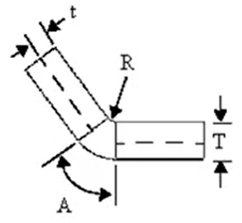

# 标准与专利
## 标准
[56个！【行业标准】全文公开网址大全](https://zhuanlan.zhihu.com/p/499511118)
[国家标准全文公开](https://openstd.samr.gov.cn/bzgk/gb/gbMainQuery)

## 专利
[佰腾专利检索系统 – 专利检索，还是佰腾的好！](http://so.baiten.cn/)
[联系方式_南京苏高专利商标事务所](http://www.njsugao.com/column.asp?id=247)
[国内有哪些知名的专利查询网站？](https://www.zhihu.com/question/483684367/answer/2204077967)

# 工业设计
被破解版商业软件惯坏的我现在觉得开源软件没一个好用的，虽然现在正在逐步转向开源软件社区，但是还是觉得这些开源软件的操作习惯都很反人类：  
KiCAD — Altium Designer  
Blender — 3DMax/Maya  
freecad — Solidworks/AutoCAD  
Inkscape — Adobe Illustrator（Inkscape还行就是自动吸附和AI完全不能比）  
GIMP — Photoshop

从0-1设计爆款产品，水下推进器，分享产品定义过程中各个环节的难点及决策工具。
https://www.bilibili.com/video/BV1hh4y1T72X/
看了很多产品经理课程、视频、书籍，依然一头雾水？
https://www.bilibili.com/video/BV1wz4y1y7sg/
[做设计就是灵感捕捉，管你三七二十一，先把东西堆上去再说！](https://www.bilibili.com/video/BV1kv4y127v6/)
差价一百倍，航天工程为什么要选最贵的元器件？太空航天器电子工程师的专访揭秘
https://www.bilibili.com/video/BV1FL411R7Wy/
走进飞机的大脑，感受飞机内部的“两室一厅”。
https://www.bilibili.com/video/BV1SV4y1X7Vi/

## 工业设计思想
    - **【形式美法则合集】设计美学的底层逻辑（持续更新中......）**
        - [P1【片段剪辑】快速预告](https://www.bilibili.com/video/BV1xP4y1W7Jd?p=1)[01:45](https://www.bilibili.com/video/BV1xP4y1W7Jd?p=1)
        - [P2【开栏序言】单纯想告诉大家的一些事](https://www.bilibili.com/video/BV1xP4y1W7Jd?p=2)[03:39](https://www.bilibili.com/video/BV1xP4y1W7Jd?p=2)
        - [P3【主次与虚实】1.独立形主次思维模型 上](https://www.bilibili.com/video/BV1xP4y1W7Jd?p=3)[19:44](https://www.bilibili.com/video/BV1xP4y1W7Jd?p=3)
        - [P4【主次与虚实】2.独立形主次思维模型 下](https://www.bilibili.com/video/BV1xP4y1W7Jd?p=4)[18:56](https://www.bilibili.com/video/BV1xP4y1W7Jd?p=4)
        - [P5【主次与虚实】3.结合空间、环境对形态主次关系的运用](https://www.bilibili.com/video/BV1xP4y1W7Jd?p=5)[26:50](https://www.bilibili.com/video/BV1xP4y1W7Jd?p=5)
        - [P6【主次与虚实】4.梳理虚实在物质及空间环境中的关系](https://www.bilibili.com/video/BV1xP4y1W7Jd?p=6)[11:04](https://www.bilibili.com/video/BV1xP4y1W7Jd?p=6)
        - [P7【主次与虚实】5.界面设计中虚实的表达方式](https://www.bilibili.com/video/BV1xP4y1W7Jd?p=7)[11:31](https://www.bilibili.com/video/BV1xP4y1W7Jd?p=7)
        - [P8【主次与虚实】6.顶部界面的虚与实逻辑](https://www.bilibili.com/video/BV1xP4y1W7Jd?p=8)[12:12](https://www.bilibili.com/video/BV1xP4y1W7Jd?p=8)
        - [P9【主次与虚实】7.垂直界面的虚实逻辑](https://www.bilibili.com/video/BV1xP4y1W7Jd?p=9)[21:43](https://www.bilibili.com/video/BV1xP4y1W7Jd?p=9)
        - [P10【主次与虚实】8.不同界面在空间中的组合关系](https://www.bilibili.com/video/BV1xP4y1W7Jd?p=10)[19:38](https://www.bilibili.com/video/BV1xP4y1W7Jd?p=10)
        - [P11【主次与虚实】9.界面设计中虚实占比及虚实形态的思考](https://www.bilibili.com/video/BV1xP4y1W7Jd?p=11)[26:26](https://www.bilibili.com/video/BV1xP4y1W7Jd?p=11)
        - [P12【主次与虚实】10.总结，对于没看前面课程的人，这节视频就是加密视频](https://www.bilibili.com/video/BV1xP4y1W7Jd?p=12)[14:55](https://www.bilibili.com/video/BV1xP4y1W7Jd?p=12)
        - [P13【对称与均衡】1.视觉重力感受的底层逻辑](https://www.bilibili.com/video/BV1xP4y1W7Jd?p=13)[18:07](https://www.bilibili.com/video/BV1xP4y1W7Jd?p=13)
        - [P14【对称与均衡】2.点、线、面、体在空间中的均衡影响以及思维模型](https://www.bilibili.com/video/BV1xP4y1W7Jd?p=14)[37:12](https://www.bilibili.com/video/BV1xP4y1W7Jd?p=14)
        - [P15【对称与均衡】3.视域对于空间平衡设计的影响](https://www.bilibili.com/video/BV1xP4y1W7Jd?p=15)[14:57](https://www.bilibili.com/video/BV1xP4y1W7Jd?p=15)
        - [P16【对称与均衡】4.平面与空间均衡的深入思考](https://www.bilibili.com/video/BV1xP4y1W7Jd?p=16)[12:32](https://www.bilibili.com/video/BV1xP4y1W7Jd?p=16)
        - [P17【对称与均衡】5.空间立面调节平衡的方式方法](https://www.bilibili.com/video/BV1xP4y1W7Jd?p=17)[14:44](https://www.bilibili.com/video/BV1xP4y1W7Jd?p=17)
        - [P18【对称与均衡】6.平衡中心强调法](https://www.bilibili.com/video/BV1xP4y1W7Jd?p=18)[13:00](https://www.bilibili.com/video/BV1xP4y1W7Jd?p=18)
        - [P19【对称与均衡】7.视觉重力协调法](https://www.bilibili.com/video/BV1xP4y1W7Jd?p=19)[10:04](https://www.bilibili.com/video/BV1xP4y1W7Jd?p=19)
        - [P20【对比与统一】1.用一个建筑讲清楚形态对比的四种用法](https://www.bilibili.com/video/BV1xP4y1W7Jd?p=20)[10:10](https://www.bilibili.com/video/BV1xP4y1W7Jd?p=20)
        - [P21【对比与统一】2.以视知觉转译机制角度学习形式对比](https://www.bilibili.com/video/BV1xP4y1W7Jd?p=21)[17:09](https://www.bilibili.com/video/BV1xP4y1W7Jd?p=21)
        - [P22【对比与统一】3.用三种对比的呈现方式梳理设计美学的对比运用逻辑](https://www.bilibili.com/video/BV1xP4y1W7Jd?p=22)[07:55](https://www.bilibili.com/video/BV1xP4y1W7Jd?p=22)
        - [P23【对比与统一】4.用形式美法则的统一给设计加个BUFF](https://www.bilibili.com/video/BV1xP4y1W7Jd?p=23)[13:20](https://www.bilibili.com/video/BV1xP4y1W7Jd?p=23)
        - [P24【节奏与韵律】1.凝固的音乐为什么让人上头？](https://www.bilibili.com/video/BV1xP4y1W7Jd?p=24)[10:11](https://www.bilibili.com/video/BV1xP4y1W7Jd?p=24)
        - [P25【节奏与韵律】2.拆解理解设计中节奏感的运用逻辑](https://www.bilibili.com/video/BV1xP4y1W7Jd?p=25)[10:56](https://www.bilibili.com/video/BV1xP4y1W7Jd?p=25)
        - [P26【节奏与韵律】3.韵律美在设计中的运用逻辑](https://www.bilibili.com/video/BV1xP4y1W7Jd?p=26)[20:23](https://www.bilibili.com/video/BV1xP4y1W7Jd?p=26)
        - [P27【节奏与韵律】4.视觉与听觉语言中的韵律互通逻辑](https://www.bilibili.com/video/BV1xP4y1W7Jd?p=27)[11:31](https://www.bilibili.com/video/BV1xP4y1W7Jd?p=27)
        - [P28【节奏与韵律】5.音乐与色彩构成要素的通感](https://www.bilibili.com/video/BV1xP4y1W7Jd?p=28)[08:13](https://www.bilibili.com/video/BV1xP4y1W7Jd?p=28)

  

- 逆向工具
    
    [**完整扫描过程（详细教程）- MobileScan 手机3D扫描仪 工业设计 原型设计 自制娃娃 3D建模 学生党福音 使用超简单**](https://www.bilibili.com/medialist/play/watchlater/BV1pf4y1u7b6)
    

  

[明明就是个画线而已…… 怎么就变成了这个样子？！](https://www.bilibili.com/video/BV12W411q7M3)

[我愿称之为——无敌](https://www.bilibili.com/video/BV1Gq4y177z7)（环氧树脂胶制作琥珀般沙盘）

[**拜托三连了！这绝对是全B站最用心（没有之一）的AN公开课程，耗时千余小时开发！**](https://www.bilibili.com/medialist/play/watchlater/BV1Yf4y1J77P)

[**卡扣——盒子和盖子的合体姿势之五**](https://www.bilibili.com/medialist/play/watchlater/BV1Ag411w7GD)

[**你所见的公共标识是如何被设计出来的?【dinlab宇宙电台】Vol.023**](https://www.bilibili.com/medialist/play/watchlater/BV1bU4y177eN)

  

[【一分钟快速了解】强大的Adobe全家桶软件都是做什么用的，你知道吗？PS PR AI AE DW ID AN XD LR AU SP..._哔哩哔哩 (゜-゜)つロ 干杯~-bilibili](https://www.bilibili.com/video/av49022108/?spm_id_from=333.788.videocard.0)

[优设导航 - 学设计从这里开始！](http://hao.uisdc.com/)

[魔泊云](https://www.mopaas.com/)

[人人都是产品经理 | 产品经理、产品爱好者学习交流平台](http://www.woshipm.com/)

[2022年了，是用CAD or REVIT？](https://www.bilibili.com/video/BV1uY4y1k7L2)

[【产品结构设计】产品结构设计知识与基础结构设计实例-](https://www.bilibili.com/video/BV13K4y1s7cT)

[【产品结构设计】基础结构设计入门](https://www.bilibili.com/video/BV1jy4y1Y7mi)

[产品设计常犯的结构错误](https://www.bilibili.com/video/BV1xq4y1i7bf)

[摄影师搞定99%透明产品的拍摄套路，首次公开！](https://www.bilibili.com/video/BV1hY4y1p7Ni)

[c4d插件与非插件实现边缘破碎的双教程！](https://www.bilibili.com/video/BV1pY4y1t76C)

[我看看还有谁用ps做涂鸦渐变字还在用画笔一点点涂！](https://www.bilibili.com/video/BV1va411C76S)

[敬伟PS教程全集](https://www.bilibili.com/video/BV1YW411e7n5)

[【设计前沿04】交互设计国内外最新设计前沿资讯分享｜持续更新、](https://www.bilibili.com/video/BV1qu411B79p)

[PS-教程-抠羽毛系列](https://www.bilibili.com/video/BV1sL4y1u72f)[Niryo One 6自由度3D打印机械臂](https://www.bilibili.com/video/BV1sx411o7pt)

[【Photoshop 教程】史上最容易听懂的PS入门基础教程（答疑在最后](https://www.bilibili.com/video/BV1Xs411q7DW)

[【PS教程】终于有一套全面的PS教程啦！从零开始学PS！！](https://www.bilibili.com/video/BV187411Z7bx)

[99%设计师必备的做字体神器](https://www.bilibili.com/video/BV1zZ4y1R7f8)

> [!info] 【提高审美】导演私用的10个APP&网站！建议收藏_哔哩哔哩_bilibili  
> 审美网站直达链接：01 https://film-grab.com02 https://shotdeck.com03 Daily Art04 Pinterest 05 i Museum 06 VART07 https://color.adobe.com08 https://coolors.co09 http://zhongguose.com10 https://nipponcolors.com11, 视频播放量 129013、弹幕量 1207、点赞数 15738、投硬币枚数 13939、收藏人数 30203、转发人数 1570, 视频作者 小鹿Lawrence, 作者简介 独立导演 / 摄影师 / 配音演员 wb:小鹿Lawrence Ins: lawrence_lue ，相关视频：【干货向】分分钟Get的调色+穿搭教程！，2023审美提升- 孤独治愈高级感配色 || Andoni Beristain 、 tinycactus，2023全年让你效率加倍，自律不摆烂！【2023年度计划模板分享】，【干货向】三个小技巧，帮你选到完美配乐!，审美积累 | 治愈风景 | 摄影师Kosuke Okude，影视飓风帮王冰冰做"视频装修"，历时41天 我终于搞定了ta！，满江红真「的是」喜剧！你们为什么不笑啊？！！【不要笑挑战】，【中文字幕】国外Youtube上爆火的Blender学习速成教程，千万级播放收藏，满足你对Blender动画的所有渴望，10分钟学会的3个提升B格的转场【干货向】  
> [https://www.bilibili.com/video/BV1cG4y1X7AC/?spm_id_from=333.999.0.0](https://www.bilibili.com/video/BV1cG4y1X7AC/?spm_id_from=333.999.0.0)  

> [!info] [编剧汪海林]煤老板就是比浙江财团好_哔哩哔哩_bilibili  
> 剪自官方视频，侵删 看编剧汪海林如何吐槽国内的电视剧市场, 视频播放量 691017、弹幕量 1154、点赞数 17360、投硬币枚数 1085、收藏人数 5877、转发人数 3680, 视频作者 Akademia, 作者简介 哲学，综艺节目旧档挖掘，相关视频：汪海林：导演所加了1500块，女演员的质量，立马就提上去了，现在资本的审美VS以前煤老板的审美，山西煤老板 到底有多土豪？，汪海林：甲方要求，为了流量偶像，已经不写两行以上台词了，煤老板说的都对，央视某著名主持人提问:"为什么年轻人都不愿进工厂，搞不懂这群年轻人！"，"你TM的又不是开窑子！什么都往演艺圈里塞！！"，中国的煤老板富有到何种程度，现在的编剧都是在搞笑吗？连清朝人都知道虎门销烟而不是"烧烟"！，哪个老板的秘书是男的？  
> [https://www.bilibili.com/video/BV1vs411g753/?spm_id_from=333.999.0.0](https://www.bilibili.com/video/BV1vs411g753/?spm_id_from=333.999.0.0)  

> [!info] 厨子与驴的傻雕发明,无所不能天才创意,这脑洞无敌了_哔哩哔哩_bilibili  
> 厨子与驴的傻雕发明,无所不能天才创意,这脑洞无敌了, 视频播放量 528188、弹幕量 447、点赞数 21219、投硬币枚数 1275、收藏人数 17504、转发人数 2852, 视频作者 搞笑得管理员, 作者简介 爱搞笑，爱生活！，相关视频：千万网红"厨子与驴"，最有才的民间发明夫妻！，厨子与驴的沙雕发明，夫妻俩都是发明天才，沙雕发明：摩托床，厨子与驴："野蛮"情侣，美食博主蜕变为十足沙雕搞笑CP，发明：撕咬辅助，厨子与驴搞笑名场面，为了让大爷吃水果，我付出了多大的努力...，这是魔术吗？不这是花手魔法，厨子与驴，各科老师的特殊技能  
> [https://www.bilibili.com/video/BV1VA411D7Ea/?spm_id_from=333.999.0.0](https://www.bilibili.com/video/BV1VA411D7Ea/?spm_id_from=333.999.0.0)  

> [!info] 产品结构设计工程师未来职业规划和建议,结构工程师未来发展规划_哔哩哔哩_bilibili  
> 产品结构设计工程师未来职业规划和建议,结构工程师未来发展规划, 视频播放量 2540、弹幕量 1、点赞数 48、投硬币枚数 18、收藏人数 98、转发人数 3, 视频作者 金三维教程, 作者简介 ...  
> [https://www.bilibili.com/video/BV1sP4y1e7Ve/?spm_id_from=333.999.0.0](https://www.bilibili.com/video/BV1sP4y1e7Ve/?spm_id_from=333.999.0.0)  

> [!info] 如何在麻省理工学院做手工_哔哩哔哩_bilibili  
> 如何在麻省理工学院做手工, 视频播放量 148615、弹幕量 167、点赞数 9697、投硬币枚数 216、收藏人数 1508、转发人数 388, 视频作者 试作间, 作者简介 一个麻省理工博士生，前硅谷无人驾驶工程师的试作间，相关视频：拍个大佬卷死你们！中国中车超级智慧工厂（下），机械臂设计（sw并安装），"一人得道，全班满分"__- 俄亥俄州立大学的有机化学教授Christopher ...  
> [https://www.bilibili.com/video/BV1nA411Q79L/?spm_id_from=333.999.0.0](https://www.bilibili.com/video/BV1nA411Q79L/?spm_id_from=333.999.0.0)  

[设计软件通-用心做最好的教程！](http://www.sjrjt.com/)

[【一分钟快速了解】强大的Adobe全家桶软件都是做什么用的，你知道吗？PS PR AI AE DW ID AN XD LR AU SP..._哔哩哔哩 (゜-゜)つロ 干杯~-bilibili](https://www.bilibili.com/video/av49022108/?spm_id_from=333.788.videocard.0)

[SOOGIF - GIF搜索_GIF动图搜索平台_GIF动图素材库_野表情发源地_GIF动图在线制作工具](http://www.soogif.com/)

# 机械工艺及制造
#### 

## 车

## 铣

## 钣金

#### solidworks基础操作

基体法兰/薄片

边线法兰/斜接法兰

展开/展平/折叠

#### K因子

$$
K_{因子}=\frac{t}{T}
$$

其中T是材料厚度，t是材料中性层厚度。在材料拉伸时，中性层会在0.5的基础上偏移，普通材料K因子一般取0.3-0.35，每种材料的K因子和材料的延展性相关，实操时一般通过实验获得。

带 K-因子的折弯系数使用以下计算公式:

$$
BA=П(R + KT)A/180
$$

其中:
BA=折弯系数
R-内侧折弯半径
K=K-因子，即为t/T
T=材料厚度
t-内表面到中性面的距离
A-折弯角度(经过折弯材料的角度)

## 3D打印

## 其他

#### 3D打印机

##### 开源3D打印机

[[3D Print·One]分享一台可以自己DIY的基于Vzbot的CoreXY架构超高速3D打印机，项目全开源，感谢Voron-Vzbot-Blv](https://www.bilibili.com/medialist/play/watchlater/BV1XY4y1Y7Mw)
[【开源】1400元做一台独立3Z的高速3D打印机！](https://www.bilibili.com/video/BV15u4y1U7Kx/)
[只需2000+，高速+大尺寸，DIY 3D打印机新方案—GuguBOT咕咕机，开源发布](https://www.bilibili.com/video/BV19c41177Xv/)
[fititall Cube300 - 斐傲三维 立方三百 ｜一台开源、2500元DIY，自带全封箱、八线轨、空气净化、固定热床、300成型体积、移动龙门结构。](https://www.bilibili.com/video/BV1xo4y1x7xM/)

##### 耗材重复使用

[使用耗材打印了一盘耗材，实现了耗材自由，终于可以左脚踩右脚上天了](https://www.bilibili.com/video/BV1MV4y1P7u1/)

##### 其他

[计算轴向光刻技术（CAL）3D打印的进展与相关风险](https://www.bilibili.com/video/BV18u411n716/)
[陶泥3D打印机C15预发布](https://www.bilibili.com/video/BV1mh4y1R7i4/)
[光固化打印机已经卷成这样了吗？！phrozen mini 8K S 开箱测评！](https://www.bilibili.com/video/BV1Tz4y1q7DJ/)
[一根铁氟龙就能搞定的耗材连接！贫民窟级的低成本！](https://www.bilibili.com/video/BV1wB4y1m7ph/)
[光栅低成本永久解决3D打印机堵头打废](https://www.bilibili.com/video/BV1Vo4y1z7Mp/)
[开源！3D打印版小型谐波减速器](https://www.bilibili.com/video/BV1bv4y1X76C/?spm_id_from=333.999.0.0&vd_source=8628b70b8921792574747e076af0f11a)  
[教你用微动开关进行3D打印拍摄](https://www.bilibili.com/video/BV19M4y1m7aL/)
[这已经不属于3d打印范畴了](https://www.bilibili.com/video/BV1C84y1q7Hc/)
[200多台机器24小时运行，探访工业级3D打印工厂](https://www.bilibili.com/video/BV1Wj411S7Ha/)
[【ALOP开源】成本10块钱不到！Typec口adxl345通用加](https://www.bilibili.com/video/BV12B4y1y73k)
[3D打印机的开发板性价比竟然这么高？— BIGTREETECH Pi V1.2](https://www.bilibili.com/video/BV1cg4y1L79N/)

[一名优秀机械工程师的成长之路](https://zhuanlan.zhihu.com/p/626946118)
[我又做了个戒指盒，告诉我，你看上的是戒指还是盒子？](https://www.bilibili.com/video/BV1cV4y1x7jd/)
[【科工】精锐大讲堂（31）：加速度和精度的关系](https://www.bilibili.com/video/BV1ce4y1P7Cu/)
[走进顶级实验室 看高铁对撞实测！](https://www.bilibili.com/video/BV1jN411179P/)
[正儿八经第三视角带大家云看一下工厂，看看目前国内的小工厂到底长什么样子，是不是你心目中做键盘的工厂](https://www.bilibili.com/video/BV1nM4y1771d/)
[辅料看板管理，不断料#MES系统#智能三色灯#辅料#不断料#数字化工厂](https://www.bilibili.com/video/BV1Um4y1i7Py/)
[科伯舒特线束工厂](https://www.bilibili.com/video/BV1cN411C7Z2/)
[4分钟看懂精益十大工具](https://www.bilibili.com/video/BV1o54y1M77u/)
[一盘西红柿炒蛋，教你学做过程乌龟图](https://www.bilibili.com/video/BV1Yh4y1n7ie/)
[想看徕芬生产线？安排！](https://www.bilibili.com/video/BV14s4y1d7bY/)

铝合金外壳——如何做到IP68防水
https://www.bilibili.com/video/BV1os4y1U732/
[给各位带来一期沉淀式的加工眼镜全过程](https://www.bilibili.com/video/BV1z8411L7Ka/)
[沃懂了！FDM设备打印各类模型问题处理](http://mp.weixin.qq.com/s?__biz=MjM5NzIwNDA5Ng==&mid=2658478291&idx=2&sn=cdf4bb8465ddf4126a0526fd012c47fb&chksm=bd5c113c8a2b982aabf063f59e1cec25ac761533f9e53a9c7138c2ba9056f45c00bc74cae0c9&mpshare=1&scene=24&srcid=0906cmQEsngV3rX4lftiGvQz&sharer_sharetime=1599381259710&sharer_shareid=dbea55232efe8afc21236db57661f38e#rd)  
[6分钟让你把立创面板打印看的透透的](https://www.bilibili.com/video/BV1SW4y1M7wZ/?spm_id_from=333.999.0.0)  
加工中心插销通孔键槽 数控插刀#插床插刀#键槽加工#键槽拉刀#插床
https://www.bilibili.com/video/BV1Tf4y167Ng/
看木工如何制作一张桌子，整个过程极其舒适！
https://www.bilibili.com/video/BV1k84y1P7bC/
400万的模具，设计周期一个月，设计费38000，大家觉得怎么样？
https://www.bilibili.com/video/BV1is4y1Y7ay/
[【工艺】小米九号平衡车，主要零部件的加工工艺分析。](https://www.bilibili.com/video/BV1Td4y1z76Z/)

[蓝天CAD论坛-我们不再是孤独的探索者！](http://www.cncad.net/)
XULOG16 一台机械革命游戏笔记本是怎么诞生的
https://www.bilibili.com/video/BV1Up4y137SJ/

#### 结构

[全角度观察自动扶梯的机械构造，了解自动扶梯阶梯变化的奥妙！](https://www.bilibili.com/video/BV1Vq4y1c7kv)
[工厂流水线，新3D技术制作机器人，全制作流程_哔哩哔哩_bilibili](https://www.bilibili.com/video/BV1TY411E77H/?vd_source=8628b70b8921792574747e076af0f11a)
[3D打印小技巧，voron 0.1logo打印](https://www.bilibili.com/video/BV1M3411M7NC)
[这可能是做包装盒最好的方法了？(一) Blender纸盒建模包装设计_哔哩哔哩_bilibili](https://www.bilibili.com/video/BV13L411P7sM/?vd_source=8628b70b8921792574747e076af0f11a)

# 机械零件
免费零件库：

[免费的 3D 模型、2D 图纸和 CAD 文件 - TraceParts](https://www.traceparts.cn/zh)

[Recent models | 3D CAD Model Collection | GrabCAD Community Library](https://grabcad.com/library)

[PARTcommunity 2D/3D Models](https://ptc.partcommunity.com/3d-cad-models/)

Solidworks插件库-大国工匠

[全国装备制造业数字供应链平台 (global-dsc.cn)](https://www.global-dsc.cn/dggj)

[AS-i总线技术将食品饮料加工的阀阵布线化繁为简，大大提高运行效](https://www.bilibili.com/video/BV1Q3411E7Go)
[走进摩托车线束生产工厂](https://www.bilibili.com/video/BV15D4y147yM/?spm_id_from=333.999.0.0)  

# LOGO

  
#### 乐高科技搭建指南
- 概念
    - 基本概念
        
        速度：线速度和角速度，乐高电机从小于20转到1000转每分钟。
        
        扭矩：单位N*厘米。最弱的乐高点击0.5N*cm，最强16.7N*cm。
        
        动力：这里的动力更多指机械动力，更多是扭矩和转速的乘积，得到机械功率，单位是瓦。大多数乐高马达都是9V。
        
        摩擦：要注意齿轮之间的摩擦，旋转轴和销孔的摩擦、轮子和接触面的摩擦等。
        
        牵引：这里实际上是指抓地力，即最大静摩擦力，在不同花纹的胎面上体现较为明显。
        
        滚动阻力：牵引力和滚动阻力相冲突，良好的牵引力几乎总是以牺牲额外的滚动阻力为代价。
        
        后坐力：其实就是反弹，反弹会在输入和输出之间造成运动延迟，主要是有材质刚性决定的。
        
        效率：是指传动系统的传递效率，乐高系统的效率通常比较低，因为结构简单，没法减小摩擦力和提高精度，唯一提高效率的办法是减小摩擦力。
        
    - 车辆概念
        
        传动轴：传递动力，包含万向节。
        
        传动系统：包括电机、变速箱、传动轴、车轴和最终驱动器等
        
        传动系统后端：传动轴、车轴和最终驱动器
        
        转向锁：限制最大转向角度，太大的转向角可能会推头。
        
        转弯半径：受最大转向角、轴距和转向轴数量影响。零转弯半径的差速转弯。
        
        驱动方式：前驱、后驱、4X4、四轮驱动和全轮驱动
        
        重量分配：合理分配重量，前面更重会有更好的转向牵引力，后面更重会有更好的加速，一半一半是比较理想的。
        
        重心：中心更低，更具中。
        
        离地间隙：高通过性强，低更加稳定。
        
    - 基本单位和部件
        
        - 乐高模型或砖块（bricks）用的是乐高单位作为基本单位，FLU，简写为L。并非英寸或厘米作为单位，1L=8mm
        - 1x1的砖是8mm宽8mm长9.6mm高，一个乐高板（plates）是1/3个乐高砖的高度，长宽还是8mm
        
        ### 砖
        
        普通转中间是没有孔的，而科技砖中间是有孔的。
        
        大多数技术砖也有销孔，1×2砖有一个洞，1×4砖有三个洞，以此类推。技术部件上的孔对乐高科技建筑系统至关重要，因为它们允许你用大头针连接部件或通过车轴穿过它们。尽管大多数工艺砖中的孔位于螺钉之间，但您会发现1×1和1×2工艺砖的变体，它们的孔与螺钉对齐——例如，请参见图2-4。当螺柱与孔对齐时，孔和螺柱的数量相等。这种安排对于具有密集的针和轴的紧凑建筑是有用的，这些部件也可以用于对齐一半的部件。孔有圆孔还有X型孔。
        
        ### 销钉
        
        销对于构建技术系统至关重要，因为它们将砖块和梁保持在一起，用于连接和旋转。销区分为摩擦销和旋转销。
        
        常用的销分为：销、X销、3L长销、1.5L销、凸销。
        
        特殊销分为：凸销加长、3L中孔销、3L易拉销、球头销、球头X销
        
        ### 梁、非凸梁
        
        非凸梁：高7mm宽8mm，长度可以到15L。砖要考虑凸起的方向，而梁不用。有孔砖的和量之间的空隙可以填充两层板来填充，（填充后是三个孔的距离）
        
        梁有各种形状
        
        ### 半梁
        
        半梁有各种形状。1L销用来固定半梁时允许有0.5L的滑动。
        
        ### 两层板搭建的技巧
        
    - 梁还是砖
        
        ### 乐高的发展
        
        刚开始是完全以砖的结构在发展的，在砖发展的很成熟的时候，梁出现了，梁的出现基本上完全淘汰了砖。现在砖基本上是在结构上以一些小细节的形式出现。现在乐高的电动马达、启动开关、转盘和执行器等都是专门为适应梁而设计的。但是砖不应该被完全放弃，许多爱好者并没有遵守乐高公司对于梁很高的期望，砖有时候也可以发挥很好的作用。
        
        ### 砖的建造
        
        科技转由于结构原因比普通砖有更好的承受沿长度方向的扭矩。
        
        可以用梁在砖的侧面垂直加强砖凸起连接的不可靠，这时候砖经常和板进行组合，以适应孔位（转角处允许添加铰链）。
        
        ### 梁的建造
        
        大多数梁的连接器只有孔和X孔，但是有些梁上集成了销。
        
        巧用L型支架建造刚性梁的连接.
        
        梁作为底盘，而砖作为镶嵌的车身。
        
        梁和砖之间的连接通常采用1L销或者凸起销；以及砖的凸起和梁的孔互相连接。
        
    - 轴、轴套和关节
        
        ### 轴
        
        轴根据锁穿过孔的形状既可以固定也可以旋转。车轴的两个基本应用是传动和结构加固：传动要求车轴可旋转可固定，
        
        标准轴长度：2L、3L、4L、5L、6L、7L、8L、9L、10L、12L、16L、32L。2L是红色、3L、5L、7L、9L、16L是灰色，其它是黑色。
        
        特殊轴：4L和10L的螺纹轴（较为稀有）、凸轴、止轴、5.5L轴（中间加了分隔）
        
        柔性轴（软轴）：很容易i弯曲而不会造成损坏。不可以插入X孔，末端可以插入轴连接器；可以用来代替减震器稳定悬挂式悬架，常被用来当作装饰元素，弯曲成各种拱门、挡泥板、挡风玻璃边缘、保险杠、引擎罩和其他弯曲元素。长度有：7L、11L、12L、14L、16L、19L。
        
        ### 轴套
        
        轴套是放在车轴上的小元素，起限位、保持特定间距、绕皮带等作用。常见尺寸有0.5L轴套、1L轴套和3L轴套，其中3L轴套另一边是2L的摩擦销。
        
        0.5L轴套的变形：侧齿轴套、侧齿半孔轴套、侧齿切割孔，16个小齿。
        
        0.5L侧齿轴套：可以个另一个0.5L侧齿轴套、齿轴连接器或带有小齿的16齿大齿轮组成离合器。两个侧齿半轴可以进行最小的90度动力传递。大负载中比较常用。两个0.5L轴套比一个1L轴套更好，更不容易沿轴滑动。
        
        0.5L侧齿半孔轴套：比正常的侧齿轴套孔更大，更容易让孩子们让轴套脱离轴，但是锁紧轴的压力不够，重量相差不大，所以设计师一般不喜欢这个零件。
        
        0.5L轴套的变形：13年以后才有的，孔没有了X型，比上一个孔更大，在不是加压力之前可以沿着车轴移动。
        
        1L轴套：一篇有四个小缺口，这个小缺口特别适合放在4个凸起的中间。
        
        1L轴套变形的3L轴套：可以用作插销
        
        ### 万向节
        
        有3L长的，也有4L长的，具体的搭建需要参考《乐高科技搭指南.pdf》
        
- 机械部分
    - 齿轮和传动的基本知识
        
        ### 主动件、从动件和传动轮（中间齿轮）
        
        介绍了什么事主动齿轮、从动齿轮和中间传动齿轮，中间传动齿轮不会影响减速比。
        
        ### 齿轮传动比
        
        介绍了传动比的概念和怎么计算传动比。
        
        ### 齿轮传动的效率
        
        齿轮传动有功率损耗，减小功率损耗的方法有：齿轮数量最少原则，齿数最少原则；
        
        ### 齿轮的间隙
        
        齿轮的齿之间的间隙会造成传动旷量大，动力传递不及时等问题，乐高元件中气动装置的间隙事最小的，线性执行器的间隙也比较小。涡轮和锥齿轮的间隙比较小，推荐使用。（这里所说的锥齿轮和机械上的锥齿轮不同，机械上的锥齿轮只能90度传递动力，而乐高的锥齿轮可以垂直也可以平行传递）
        
        ### 控制旋转方向
        
        齿轮的旋转方向和主动轮以及传动齿轮的个数有关。
        
        ### 齿轮清单
        
        1个蜗杆、5个新型锥齿轮（可以以平行和垂直两种方式传递动力）、9个旧齿轮（直齿轮）锥齿轮更适用于安装在梁上，并且无法安装在链上。
        
        齿轮的命名：8齿齿轮和24齿齿轮可以简写为g8t、g24t
        
        - 蜗杆：蜗杆只能用作主动轮，这取决于涡轮蜗杆传动的单向性。因此它对于类似举重机这样的需要保持的机构特别有用，比如：起重机、叉车、铁路护栏、吊车、绞车以及任何一旦电机停止就需要保持稳定的机构都是有用的。蜗杆只有一个齿，有大扭矩低转速的特点。要注意蜗杆的限位。蜗杆可以驱动齿条。
        - 8齿齿轮：8齿齿轮不知何高扭矩，很脆弱。
        - 单面12齿锥齿轮：只能垂直作用。
        - 双面12齿锥齿轮：比单面锥齿轮结实，最适合和双面20齿锥齿轮配合使用。
        - 单面14齿锥齿轮：
        - 16齿正齿轮：可以和链配合。
        - 16齿正齿轮带小齿：可以和0.5L侧齿轴套进行配合
        - 单面20齿锥齿轮：
        - 单面20齿锥齿轮带销孔：
        - 双面20齿锥齿轮：
        - 24齿正齿轮：
        - 24齿正齿轮半孔：
        - 24齿带冠齿轮：
        - 36齿锥齿轮：
        - 40齿正齿轮：
        - 差速器：
            - 老式的28齿形差速器齿轮：和14齿单锥面、12齿单锥面配合
            - 16/24齿差速器：24齿可以以和链进行配合驱动，可以使用差速锁，14齿和12齿
            - 新型28齿差速器齿轮：和5*7的梁进行配合，差速器内部适用12齿齿轮，差速器本身用20齿双面齿轮驱动。
        - 转盘：
            - 科技砖转盘：4L的高度，内圈和外圈分上下两部分组成，外圈56个齿，内圈24个齿，通透，外圈通常和8齿齿轮或蜗杆驱动，可垂直或水平使用
            - 梁转盘：3L的高度，内圈和外圈分上下两部分组成，外圈56个齿，内圈24个齿，不通透，外圈通常和8齿齿轮或蜗杆驱动，可垂直或水平使用
            - 小转盘：内圈和外圈分上下两部分，内圈上没齿，外圈28个齿，用单面或双面12齿锥齿轮驱动
        - 旋转车轮：暂时不清楚其用途
        - 推力轴承齿轮：整个齿轮有3L高，齿轮只在4481冰雹火机器人套装中出现，由此得名，也几乎绝版。中间有沟槽，两个放一起，可以填满41个乐高球。
        - 过时的齿轮：早期齿轮系统中的，体积大，间隙大，但是很结实，现在也已经绝版了。
    - 链与皮带传动
        
        ### 链传动：齿轮充当链轮
        
        - 最小链单元模块、轨道链单元模块
        - 常用的和链条配合的齿轮有：16齿正齿轮、16齿正齿轮带小齿、24齿正齿轮、24齿正齿轮半孔、40齿正齿轮。8齿正齿轮太小了，一般不能驱动链，但是可以用于张紧轮。超过20个链时，一般需要张紧轮。
        
        ### 带传动：通过滑轮运动、配合橡皮筋或线，噪音小，可任意角度传递
        
        - 用于带传动的滑轮通常有四个零件，其他零件虽然也可以配合进行带传动，但是因为没有凹槽，因此不可靠。比如轮毂
        - 四个零件是：0.5L轴套、1L微电机轴套、0.5L楔形带轮、0.5L大滑轮
        - 带传动的滑动比是不可靠的，一是因为带有弹性、二是带和滑轮之间会相互滑动。相互滑动这种特性可以起到缓冲的作用。
        - 乐高有自己的O型带，高质量硅胶制成。有5种尺寸，带在规则圆形时，直径分别为2L、3L、4L、5L、7L
        
        ### 绳和滑轮传动：把圆周运动转换为线性运动
        
        - 零件：卷轴（reel）、定滑轮、动滑轮
        - 简单滑轮系统：一个动滑轮+一个静滑轮的组合，负载减小一般，行程扩大两倍。行程扩大几倍，负载就减小几倍。
        - 差速滑轮系统：复杂滑轮系统
        - 动力滑轮系统：更复杂的滑轮系统
    - 杠杆和连杆：主要是杠杆和连杆系统的知识，没有新的零件，讲述连杆系统搭建思路
        
        ### 杠杆：
        
        ### 杠杆的种类
        
        ### 杠杆的连接
        
          
        
    - 常用的机械方案
        
        更强的差分结构：可以不利用差速器零件，而制造出一种差分结构。
        
        差速器锁：差速锁只需要锁住
        
        棘轮和棘齿：利用齿轮和销组成棘轮。
        
        线性离合器：一种利用摩擦销组成的线性离合器。
        
        偏心机制（曲柄滑块）：用于将旋转运动转换为往复运动
        
        凸轮机构（往复机构）
        
        奥尔德姆联轴器
        
        施密特联轴器
        
        步进电机
        
        日内瓦机制
        
        反向灯
        
        双轴转盘变速器
        
        坚固的万向节
        
    - 乐高气动系统
    - 气动装置
    - 坚固的结构
- 电机
    - 电机
    - 动力
- 高级机械
    - 轮式转向系统
    - 轮式悬挂系统
    - 履带车辆和悬挂装置
    - 传动装置
    - 动力分配
- 模型
    - 选择模型
    - 缩放模型
    - 建模过程

[[乐高科技搭建指南]]

- [乐高虚拟搭建初级课程-studi2.0软件学习视频](https://www.bilibili.com/video/BV17b4y127EK)
    - [P11.1 什么是虚拟搭建](https://www.bilibili.com/video/BV17b4y127EK?p=1)[00:44](https://www.bilibili.com/video/BV17b4y127EK?p=1)
    - [P21.2 软件下载及安装](https://www.bilibili.com/video/BV17b4y127EK?p=2)[04:23](https://www.bilibili.com/video/BV17b4y127EK?p=2)
    - [P31.3 文件的新建、保存及导入](https://www.bilibili.com/video/BV17b4y127EK?p=3)[03:18](https://www.bilibili.com/video/BV17b4y127EK?p=3)
    - [P42.1 操作区介绍（视角及自由操作）](https://www.bilibili.com/video/BV17b4y127EK?p=4)[02:43](https://www.bilibili.com/video/BV17b4y127EK?p=4)
    - [P52.2 区域功能介绍](https://www.bilibili.com/video/BV17b4y127EK?p=5)[02:37](https://www.bilibili.com/video/BV17b4y127EK?p=5)
    - [P62.3 studio2.0的基本功能](https://www.bilibili.com/video/BV17b4y127EK?p=6)[04:01](https://www.bilibili.com/video/BV17b4y127EK?p=6)
    - [P73.1 零件库介绍及拓展](https://www.bilibili.com/video/BV17b4y127EK?p=7)[06:29](https://www.bilibili.com/video/BV17b4y127EK?p=7)
    - [P83.2 零件的选择及方向控制](https://www.bilibili.com/video/BV17b4y127EK?p=8)[07:06](https://www.bilibili.com/video/BV17b4y127EK?p=8)
    - [P93.3 零件的颜色](https://www.bilibili.com/video/BV17b4y127EK?p=9)[03:56](https://www.bilibili.com/video/BV17b4y127EK?p=9)
    - [P104.1 选择工具与复制工具](https://www.bilibili.com/video/BV17b4y127EK?p=10)[10:34](https://www.bilibili.com/video/BV17b4y127EK?p=10)
    - [P114.2 旋转、吸附、网格](https://www.bilibili.com/video/BV17b4y127EK?p=11)[09:24](https://www.bilibili.com/video/BV17b4y127EK?p=11)
    - [P124.3 隐藏工具、碰撞检测以及稳定性](https://www.bilibili.com/video/BV17b4y127EK?p=12)[09:55](https://www.bilibili.com/video/BV17b4y127EK?p=12)
    - 乐高套内零件搭建
    - 乐高新建库
    - 乐高添加官方库
- [乐高虚拟搭建软件studio2.0全干货无废话教程](https://www.bilibili.com/video/BV1o64y1D76f)
    
    [乐高虚拟搭建软件studio2.0全干货无废话教程 从入门到起](https://www.bilibili.com/video/BV1Mt4y1z7vh)飞
    
    [乐高虚拟搭建软件studio2.0全干货无废话教程 搭建与零件](https://www.bilibili.com/video/BV1gy4y1J7WF?spm_id_from=333.999.0.0)(有各种小技巧)
    
    [乐高虚拟搭建软件studio2.0全干货无废话教程 渲染详解](https://www.bilibili.com/video/BV1BU4y1H7gy)
    
    [乐高虚拟搭建软件studio2.0全干货无废话教程 说明书详解](https://www.bilibili.com/video/BV1o64y1D76f)
    
      
    
- Studio 2.0库的制作步骤如下：
    
    1. 使用solidworks或其他软件根据传感器实物或二维图绘制三维图，要简化，保留外观即可，删除其他三维图中的元素；按零件（非装配图）依次导出stp中间格式的文件
    2. 将第一步中的stp文件转换为obj文件，建议使用CAD Exchanger软件完成转换
    3. 在PartDesigner软件中将第2步中的obj文件倒入，并添加孔特征、轴孔特征、凸台特征等特征，然后导出到studio中，依次处理所有的obj文件；
    4. 在studio软件中把一个物体的所有零件装配起来，装配过程涉及到干涉时可关闭警告，微调时可以修改坐标数字，然后保存成.io的产品文件；
    5. 将studio库文件保存位置的三个相关文件夹中的文件复制出来和第4部的产品文件统一打包成库文件即可，然后就可以发布了。
    
    studio 2.0教程：  
    乐高虚拟搭建初级课程-studi2.0软件学习视频：[https://www.bilibili.com/video/BV17b4y127EK](https://www.bilibili.com/video/BV17b4y127EK)  
    乐高虚拟搭建软件studio2.0全干货无废话教程：[https://www.bilibili.com/video/BV1o64y1D76f](https://www.bilibili.com/video/BV1o64y1D76f)  
    PartDesigner软件教程：  
    第一期介绍导入：LDraw零件https://tieba.baidu.com/p/6440716668  
    第二期介绍导入自制零件与连接性设置问题：[https://tieba.baidu.com/p/6445212581](https://tieba.baidu.com/p/6445212581)  
    第三期介绍导入贴纸：[https://tieba.baidu.com/p/6450005917](https://tieba.baidu.com/p/6450005917)  
    PartDesigner制作v8电机建模过程：[https://www.bilibili.com/video/av96311855/](https://www.bilibili.com/video/av96311855/)
    

[对Studio文件导出的几种三维文件进行转换，并尝试不同的渲染方案](https://www.bilibili.com/video/av95044146/)

凹凸塞克LDD乐高软件教程[https://www.bilibili.com/video/BV1EE41117PW/?spm_id_from=333.788.recommend_more_video.5](https://www.bilibili.com/video/BV1EE41117PW/?spm_id_from=333.788.recommend_more_video.5)

乐高不买散件，只卖套件；散件只有乐高杯，但是种类比较少。

国产高仿乐高砖品牌：森宝 或 双鹰 或 乐博（貌似评价不太好）

乐高散件1688店铺（有散件分类介绍）：

[https://goldwin.1688.com/page/offerlist.htm?spm=a2615.2177701.autotrace-topNav.4.64ff7a9dKRofwS](https://goldwin.1688.com/page/offerlist.htm?spm=a2615.2177701.autotrace-topNav.4.64ff7a9dKRofwS)

[https://yuetiangroup.1688.com/page/offerlist_134620433_137327760.htm?spm=a2615.7691456.autotrace-categorySmall.4.67b823d6Uy2KWa&sortType=wangpu_score](https://yuetiangroup.1688.com/page/offerlist_134620433_137327760.htm?spm=a2615.7691456.autotrace-categorySmall.4.67b823d6Uy2KWa&sortType=wangpu_score)

[https://shop1444005035964.1688.com/page/offerlist_85404635.htm?spm=a2615.2177701.0.0.7e0051f0vxCZmL](https://shop1444005035964.1688.com/page/offerlist_85404635.htm?spm=a2615.2177701.0.0.7e0051f0vxCZmL)

[https://dxtoys.1688.com/page/offerlist_138710911.htm?spm=a2615.2177701.0.0.76963eb1Hc4Vco](https://dxtoys.1688.com/page/offerlist_138710911.htm?spm=a2615.2177701.0.0.76963eb1Hc4Vco)

乐高网站大全：[https://blog.csdn.net/LAOYU1993/article/details/86589421?ops_request_misc=&request_id=&biz_id=102&utm_term=乐高清单&utm_medium=distribute.pc_search_result.none-task-blog-2~all~sobaiduweb~default-3-86589421.first_rank_v2_pc_rank_v29&spm=1018.2226.3001.4187](https://blog.csdn.net/LAOYU1993/article/details/86589421?ops_request_misc=&request_id=&biz_id=102&utm_term=%E4%B9%90%E9%AB%98%E6%B8%85%E5%8D%95&utm_medium=distribute.pc_search_result.none-task-blog-2~all~sobaiduweb~default-3-86589421.first_rank_v2_pc_rank_v29&spm=1018.2226.3001.4187)