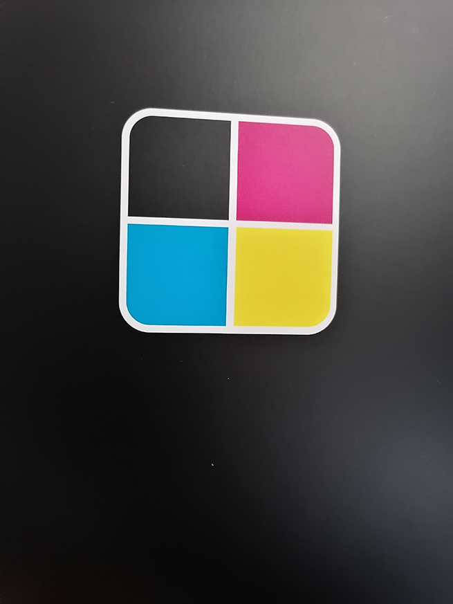
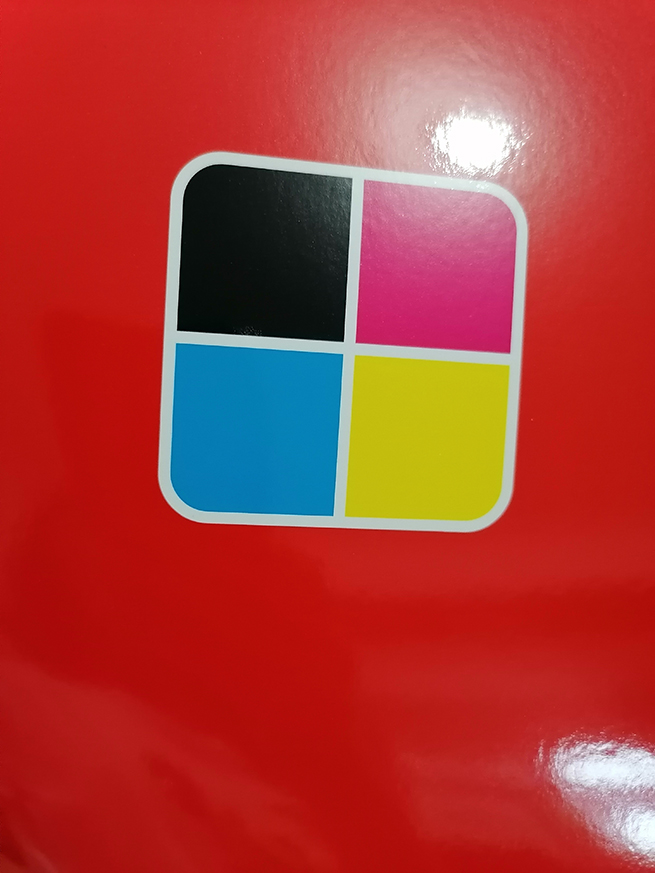
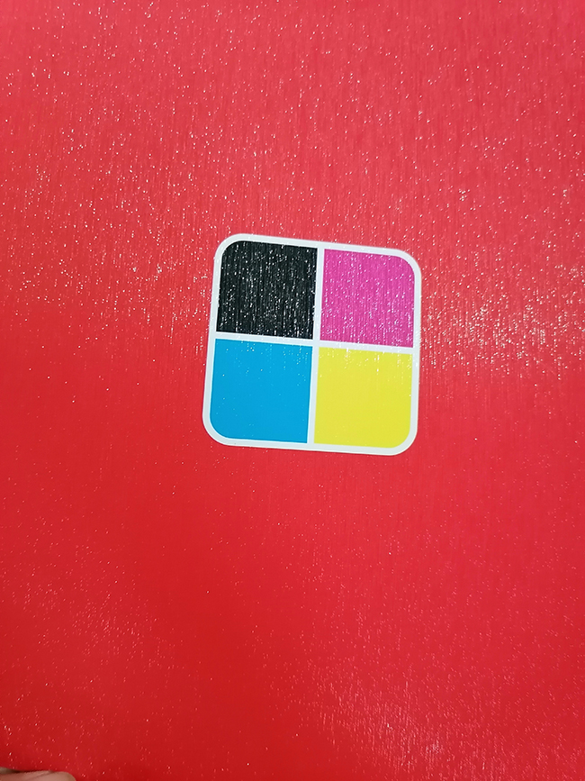
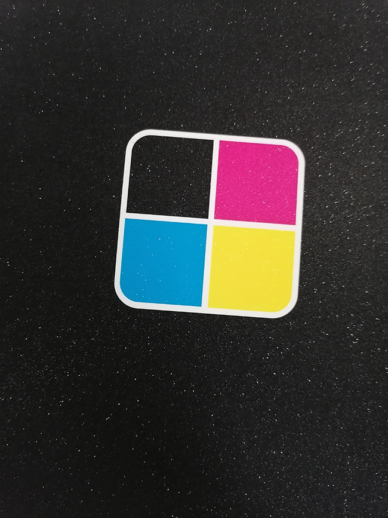

印刷覆膜中膜的种类有哪些？
覆膜工艺中膜的种类有很多，大致有以下几种：
普通哑膜、可降解哑膜、防刮花哑膜、可降解防刮花哑膜、水性防刮花哑膜、半光哑防刮花膜

下图是覆亚膜效果

普通光膜、可降解光膜、防刮花光膜、可降解防刮花光膜

下图是覆光膜效果

触感膜、长绒触感膜、短融触感膜、防刮花触感膜、防手印触感膜、可降解触感膜

下图是拉丝膜效果

闪光膜、拉丝模、磨砂膜

下图是闪光莫效果

