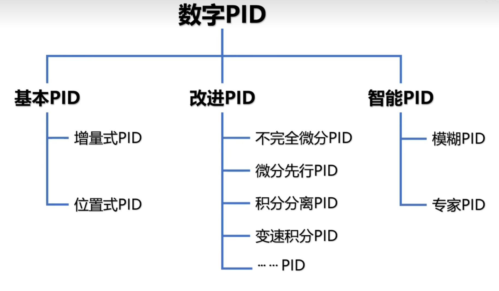
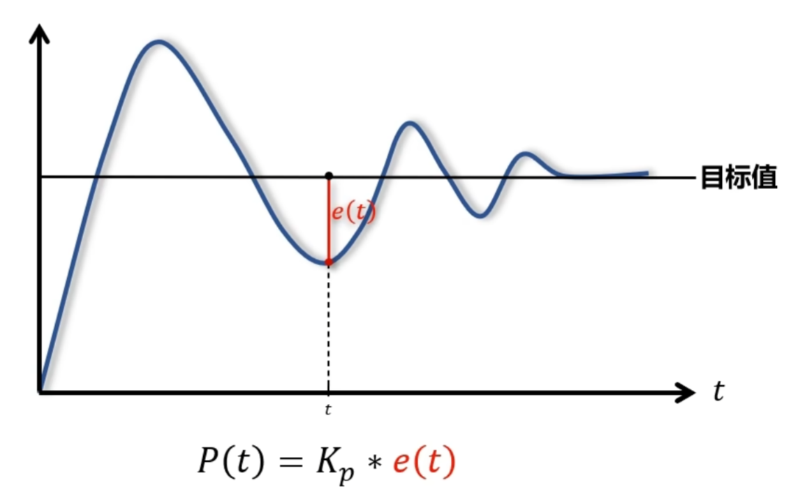
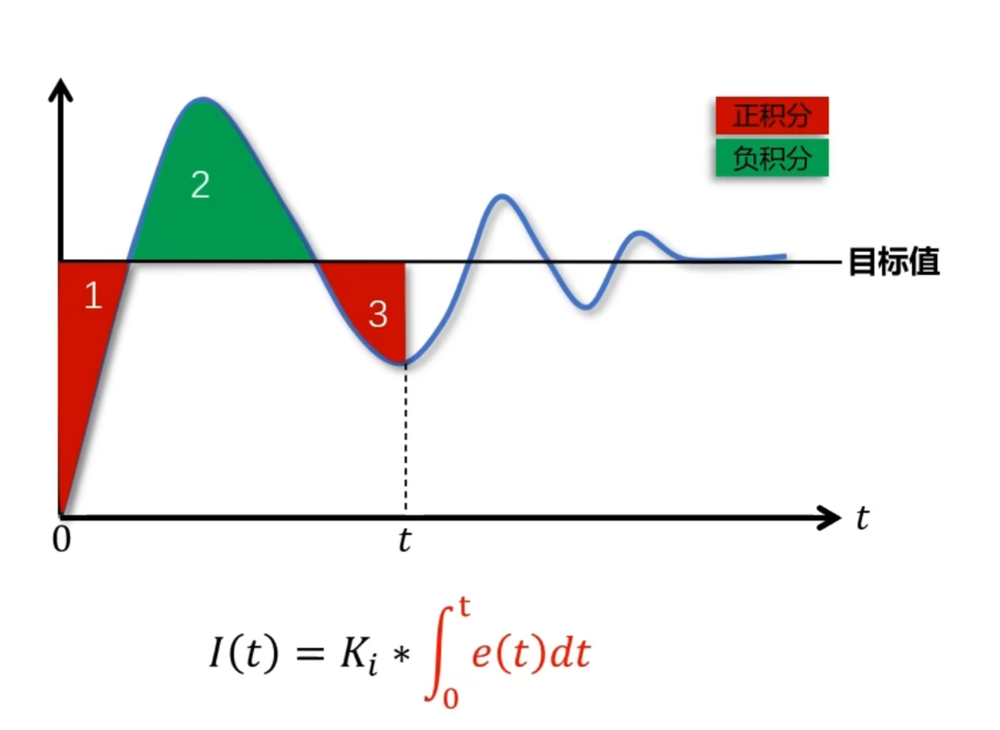
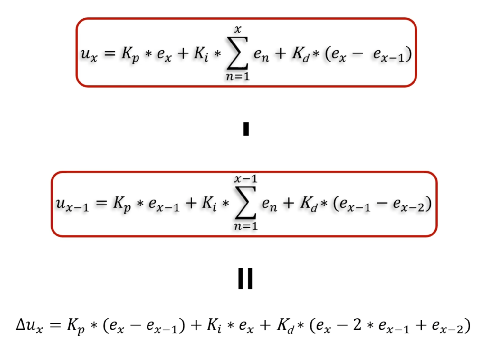

## 简介
本文内容包括 数据结构 和 算法，主要介绍面向嵌入式的常用控制算法、滤波算法。例程以C语言为主。


# 数据结构
[数据结构如何一天速成？](https://www.zhihu.com/question/309285407/answer/1361122057)
[有没有什么数据结构c语言版初学者比较推荐的网课或者书啊，感觉严蔚敏老师的书有些看不懂！？](https://www.zhihu.com/question/294218064/answer/1923551509)
#### 【C语言描述】《数据结构和算法》
- [P1数据结构和算法绪论](https://www.bilibili.com/video/BV1jW411K7yg?p=1)[12:49](https://www.bilibili.com/video/BV1jW411K7yg?p=1)
- [P2谈谈算法](https://www.bilibili.com/video/BV1jW411K7yg?p=2)[20:04](https://www.bilibili.com/video/BV1jW411K7yg?p=2)
- [P3时间复杂度和空间复杂度1](https://www.bilibili.com/video/BV1jW411K7yg?p=3)[23:56](https://www.bilibili.com/video/BV1jW411K7yg?p=3)
- [P4时间复杂度和空间复杂度2](https://www.bilibili.com/video/BV1jW411K7yg?p=4)[17:44](https://www.bilibili.com/video/BV1jW411K7yg?p=4)
- [P5时间复杂度和空间复杂度3](https://www.bilibili.com/video/BV1jW411K7yg?p=5)[17:08](https://www.bilibili.com/video/BV1jW411K7yg?p=5)
- [P6线性表1](https://www.bilibili.com/video/BV1jW411K7yg?p=6)[17:00](https://www.bilibili.com/video/BV1jW411K7yg?p=6)
- [P7线性表2](https://www.bilibili.com/video/BV1jW411K7yg?p=7)[16:42](https://www.bilibili.com/video/BV1jW411K7yg?p=7)
- [P8线性表3](https://www.bilibili.com/video/BV1jW411K7yg?p=8)[18:22](https://www.bilibili.com/video/BV1jW411K7yg?p=8)
- [P9线性表4](https://www.bilibili.com/video/BV1jW411K7yg?p=9)[16:03](https://www.bilibili.com/video/BV1jW411K7yg?p=9)
- [P10线性表5](https://www.bilibili.com/video/BV1jW411K7yg?p=10)[14:58](https://www.bilibili.com/video/BV1jW411K7yg?p=10)
- [P11线性表6](https://www.bilibili.com/video/BV1jW411K7yg?p=11)[14:57](https://www.bilibili.com/video/BV1jW411K7yg?p=11)
- [P12线性表7](https://www.bilibili.com/video/BV1jW411K7yg?p=12)[18:33](https://www.bilibili.com/video/BV1jW411K7yg?p=12)
- [P13线性表8](https://www.bilibili.com/video/BV1jW411K7yg?p=13)[14:00](https://www.bilibili.com/video/BV1jW411K7yg?p=13)
- [P14线性表9](https://www.bilibili.com/video/BV1jW411K7yg?p=14)[11:21](https://www.bilibili.com/video/BV1jW411K7yg?p=14)
- [P15线性表10](https://www.bilibili.com/video/BV1jW411K7yg?p=15)[11:44](https://www.bilibili.com/video/BV1jW411K7yg?p=15)
- [P16线性表11](https://www.bilibili.com/video/BV1jW411K7yg?p=16)[18:32](https://www.bilibili.com/video/BV1jW411K7yg?p=16)
- [P17线性表12](https://www.bilibili.com/video/BV1jW411K7yg?p=17)[23:47](https://www.bilibili.com/video/BV1jW411K7yg?p=17)
- [P18线性表13](https://www.bilibili.com/video/BV1jW411K7yg?p=18)[14:51](https://www.bilibili.com/video/BV1jW411K7yg?p=18)
- [P19线性表14](https://www.bilibili.com/video/BV1jW411K7yg?p=19)[22:02](https://www.bilibili.com/video/BV1jW411K7yg?p=19)
- [P20线性表15](https://www.bilibili.com/video/BV1jW411K7yg?p=20)[18:06](https://www.bilibili.com/video/BV1jW411K7yg?p=20)
- [P21线性表16](https://www.bilibili.com/video/BV1jW411K7yg?p=21)[11:35](https://www.bilibili.com/video/BV1jW411K7yg?p=21)
- [P22线性表17](https://www.bilibili.com/video/BV1jW411K7yg?p=22)[37:28](https://www.bilibili.com/video/BV1jW411K7yg?p=22)
- [P23栈和队列1](https://www.bilibili.com/video/BV1jW411K7yg?p=23)[18:10](https://www.bilibili.com/video/BV1jW411K7yg?p=23)
- [P24栈和队列2](https://www.bilibili.com/video/BV1jW411K7yg?p=24)[14:08](https://www.bilibili.com/video/BV1jW411K7yg?p=24)
- [P25栈和队列3](https://www.bilibili.com/video/BV1jW411K7yg?p=25)[30:31](https://www.bilibili.com/video/BV1jW411K7yg?p=25)
- [P26栈和队列4](https://www.bilibili.com/video/BV1jW411K7yg?p=26)[09:00](https://www.bilibili.com/video/BV1jW411K7yg?p=26)
- [P27栈和队列5](https://www.bilibili.com/video/BV1jW411K7yg?p=27)[29:41](https://www.bilibili.com/video/BV1jW411K7yg?p=27)
- [P28栈和队列6（上）](https://www.bilibili.com/video/BV1jW411K7yg?p=28)[11:46](https://www.bilibili.com/video/BV1jW411K7yg?p=28)
- [P29栈和队列6（下）](https://www.bilibili.com/video/BV1jW411K7yg?p=29)[16:06](https://www.bilibili.com/video/BV1jW411K7yg?p=29)
- [P30栈和队列7](https://www.bilibili.com/video/BV1jW411K7yg?p=30)[10:56](https://www.bilibili.com/video/BV1jW411K7yg?p=30)
- [P31栈和队列8](https://www.bilibili.com/video/BV1jW411K7yg?p=31)[14:36](https://www.bilibili.com/video/BV1jW411K7yg?p=31)
- [P32递归和分治思想1](https://www.bilibili.com/video/BV1jW411K7yg?p=32)[16:38](https://www.bilibili.com/video/BV1jW411K7yg?p=32)
- [P33递归和分治思想2](https://www.bilibili.com/video/BV1jW411K7yg?p=33)[17:43](https://www.bilibili.com/video/BV1jW411K7yg?p=33)
- [P34递归和分治思想3](https://www.bilibili.com/video/BV1jW411K7yg?p=34)[23:46](https://www.bilibili.com/video/BV1jW411K7yg?p=34)
- [P35递归和分治思想4](https://www.bilibili.com/video/BV1jW411K7yg?p=35)[33:30](https://www.bilibili.com/video/BV1jW411K7yg?p=35)
- [P36字符串](https://www.bilibili.com/video/BV1jW411K7yg?p=36)[12:59](https://www.bilibili.com/video/BV1jW411K7yg?p=36)
- [P37KMP算法1](https://www.bilibili.com/video/BV1jW411K7yg?p=37)[18:40](https://www.bilibili.com/video/BV1jW411K7yg?p=37)
- [P38KMP算法2](https://www.bilibili.com/video/BV1jW411K7yg?p=38)[15:38](https://www.bilibili.com/video/BV1jW411K7yg?p=38)
- [P39KMP算法之NEXT数组代码原理分析](https://www.bilibili.com/video/BV1jW411K7yg?p=39)[22:26](https://www.bilibili.com/video/BV1jW411K7yg?p=39)
- [P40KMP算法之最终实现及优化](https://www.bilibili.com/video/BV1jW411K7yg?p=40)[13:35](https://www.bilibili.com/video/BV1jW411K7yg?p=40)
- [P41树](https://www.bilibili.com/video/BV1jW411K7yg?p=41)[11:16](https://www.bilibili.com/video/BV1jW411K7yg?p=41)
- [P42树的存储结构1](https://www.bilibili.com/video/BV1jW411K7yg?p=42)[12:09](https://www.bilibili.com/video/BV1jW411K7yg?p=42)
- [P43树的存储结构2](https://www.bilibili.com/video/BV1jW411K7yg?p=43)[16:47](https://www.bilibili.com/video/BV1jW411K7yg?p=43)
- [P44二叉树1](https://www.bilibili.com/video/BV1jW411K7yg?p=44)[16:51](https://www.bilibili.com/video/BV1jW411K7yg?p=44)
- [P45二叉树2](https://www.bilibili.com/video/BV1jW411K7yg?p=45)[17:29](https://www.bilibili.com/video/BV1jW411K7yg?p=45)
- [P46二叉树的存数结构](https://www.bilibili.com/video/BV1jW411K7yg?p=46)[07:18](https://www.bilibili.com/video/BV1jW411K7yg?p=46)
- [P47二叉树的遍历](https://www.bilibili.com/video/BV1jW411K7yg?p=47)[09:58](https://www.bilibili.com/video/BV1jW411K7yg?p=47)
- [P48二叉树的建立和遍历算法](https://www.bilibili.com/video/BV1jW411K7yg?p=48)[23:11](https://www.bilibili.com/video/BV1jW411K7yg?p=48)
- [P49线索二叉树](https://www.bilibili.com/video/BV1jW411K7yg?p=49)[14:35](https://www.bilibili.com/video/BV1jW411K7yg?p=49)
- [P50线索二叉树代码实现](https://www.bilibili.com/video/BV1jW411K7yg?p=50)[48:21](https://www.bilibili.com/video/BV1jW411K7yg?p=50)
- [P51树、森林及二叉树的相互转换](https://www.bilibili.com/video/BV1jW411K7yg?p=51)[12:00](https://www.bilibili.com/video/BV1jW411K7yg?p=51)
- [P52赫夫曼树](https://www.bilibili.com/video/BV1jW411K7yg?p=52)[14:58](https://www.bilibili.com/video/BV1jW411K7yg?p=52)
- [P53赫夫曼编码](https://www.bilibili.com/video/BV1jW411K7yg?p=53)[16:06](https://www.bilibili.com/video/BV1jW411K7yg?p=53)
- [P54赫夫曼编码C语言实现](https://www.bilibili.com/video/BV1jW411K7yg?p=54)[45:04](https://www.bilibili.com/video/BV1jW411K7yg?p=54)
- [P55图的定义与术语1](https://www.bilibili.com/video/BV1jW411K7yg?p=55)[14:48](https://www.bilibili.com/video/BV1jW411K7yg?p=55)
- [P56图的定义与术语2](https://www.bilibili.com/video/BV1jW411K7yg?p=56)[16:05](https://www.bilibili.com/video/BV1jW411K7yg?p=56)
- [P57图的存储结构](https://www.bilibili.com/video/BV1jW411K7yg?p=57)[22:18](https://www.bilibili.com/video/BV1jW411K7yg?p=57)
- [P58图的存储结构（邻接表）](https://www.bilibili.com/video/BV1jW411K7yg?p=58)[07:46](https://www.bilibili.com/video/BV1jW411K7yg?p=58)
- [P59图的存储结构（十字链表、邻接多重表、边集数组）](https://www.bilibili.com/video/BV1jW411K7yg?p=59)[26:47](https://www.bilibili.com/video/BV1jW411K7yg?p=59)
- [P60图的遍历（深度优先遍历）](https://www.bilibili.com/video/BV1jW411K7yg?p=60)[13:28](https://www.bilibili.com/video/BV1jW411K7yg?p=60)
- [P61马踏棋盘算法（骑士周游问题）](https://www.bilibili.com/video/BV1jW411K7yg?p=61)[37:19](https://www.bilibili.com/video/BV1jW411K7yg?p=61)
- [P62图的遍历（广度优先遍历）](https://www.bilibili.com/video/BV1jW411K7yg?p=62)[13:07](https://www.bilibili.com/video/BV1jW411K7yg?p=62)
- [P63最小生成树（普里姆算法）](https://www.bilibili.com/video/BV1jW411K7yg?p=63)[21:04](https://www.bilibili.com/video/BV1jW411K7yg?p=63)
- [P64最小生成树（克鲁斯卡尔算法）](https://www.bilibili.com/video/BV1jW411K7yg?p=64)[23:58](https://www.bilibili.com/video/BV1jW411K7yg?p=64)
- [P65最短路径（迪杰斯特拉算法）](https://www.bilibili.com/video/BV1jW411K7yg?p=65)[20:33](https://www.bilibili.com/video/BV1jW411K7yg?p=65)
- [P66最短路径（弗洛伊德算法）](https://www.bilibili.com/video/BV1jW411K7yg?p=66)[12:14](https://www.bilibili.com/video/BV1jW411K7yg?p=66)
- [P67拓扑排序](https://www.bilibili.com/video/BV1jW411K7yg?p=67)[19:30](https://www.bilibili.com/video/BV1jW411K7yg?p=67)
- [P68关键路径](https://www.bilibili.com/video/BV1jW411K7yg?p=68)[11:37](https://www.bilibili.com/video/BV1jW411K7yg?p=68)
- [P69关键路径（代码讲解）](https://www.bilibili.com/video/BV1jW411K7yg?p=69)[23:55](https://www.bilibili.com/video/BV1jW411K7yg?p=69)
- [P70查找算法](https://www.bilibili.com/video/BV1jW411K7yg?p=70)[09:53](https://www.bilibili.com/video/BV1jW411K7yg?p=70)
- [P71插值查找（按比例查找）](https://www.bilibili.com/video/BV1jW411K7yg?p=71)[12:25](https://www.bilibili.com/video/BV1jW411K7yg?p=71)
- [P72斐波那契查找（黄金分割法查找）](https://www.bilibili.com/video/BV1jW411K7yg?p=72)[13:04](https://www.bilibili.com/video/BV1jW411K7yg?p=72)
- [P73线性索引查找](https://www.bilibili.com/video/BV1jW411K7yg?p=73)[11:23](https://www.bilibili.com/video/BV1jW411K7yg?p=73)
- [P74二叉排序树](https://www.bilibili.com/video/BV1jW411K7yg?p=74)[09:07](https://www.bilibili.com/video/BV1jW411K7yg?p=74)
- [P75二叉排序树的查找、插入和删除](https://www.bilibili.com/video/BV1jW411K7yg?p=75)[12:26](https://www.bilibili.com/video/BV1jW411K7yg?p=75)
- [P76二叉排序树的查找、插入和删除2](https://www.bilibili.com/video/BV1jW411K7yg?p=76)[18:13](https://www.bilibili.com/video/BV1jW411K7yg?p=76)
- [P77平衡二叉树](https://www.bilibili.com/video/BV1jW411K7yg?p=77)[08:22](https://www.bilibili.com/video/BV1jW411K7yg?p=77)
- [P78平衡二叉树的实现原理](https://www.bilibili.com/video/BV1jW411K7yg?p=78)[26:12](https://www.bilibili.com/video/BV1jW411K7yg?p=78)
- [P79平衡二叉树的实现原理（代码实现）](https://www.bilibili.com/video/BV1jW411K7yg?p=79)[26:58](https://www.bilibili.com/video/BV1jW411K7yg?p=79)
- [P80多路查找树之2-3树](https://www.bilibili.com/video/BV1jW411K7yg?p=80)[10:23](https://www.bilibili.com/video/BV1jW411K7yg?p=80)
- [P81多路查找树之2-3树的插入原理](https://www.bilibili.com/video/BV1jW411K7yg?p=81)[23:18](https://www.bilibili.com/video/BV1jW411K7yg?p=81)
- [P82多路查找树之2-3树的删除原理](https://www.bilibili.com/video/BV1jW411K7yg?p=82)[12:15](https://www.bilibili.com/video/BV1jW411K7yg?p=82)
- [P83多路查找树之2-3-4树和B树](https://www.bilibili.com/video/BV1jW411K7yg?p=83)[13:42](https://www.bilibili.com/video/BV1jW411K7yg?p=83)
- [P84散列表（哈希表）查找](https://www.bilibili.com/video/BV1jW411K7yg?p=84)[12:16](https://www.bilibili.com/video/BV1jW411K7yg?p=84)
- [P85散列函数的构造方法](https://www.bilibili.com/video/BV1jW411K7yg?p=85)[14:33](https://www.bilibili.com/video/BV1jW411K7yg?p=85)
- [P86处理散列冲突的方法](https://www.bilibili.com/video/BV1jW411K7yg?p=86)[10:22](https://www.bilibili.com/video/BV1jW411K7yg?p=86)
- [P87散列表查找的代码实现](https://www.bilibili.com/video/BV1jW411K7yg?p=87)[12:37](https://www.bilibili.com/video/BV1jW411K7yg?p=87)
- [P88排序算法](https://www.bilibili.com/video/BV1jW411K7yg?p=88)[13:00](https://www.bilibili.com/video/BV1jW411K7yg?p=88)
- [P89冒泡排序](https://www.bilibili.com/video/BV1jW411K7yg?p=89)[18:22](https://www.bilibili.com/video/BV1jW411K7yg?p=89)
- [P90选择排序](https://www.bilibili.com/video/BV1jW411K7yg?p=90)[10:28](https://www.bilibili.com/video/BV1jW411K7yg?p=90)
- [P91直接插入排序](https://www.bilibili.com/video/BV1jW411K7yg?p=91)[08:06](https://www.bilibili.com/video/BV1jW411K7yg?p=91)
- [P92希尔排序](https://www.bilibili.com/video/BV1jW411K7yg?p=92)[13:01](https://www.bilibili.com/video/BV1jW411K7yg?p=92)
- [P93堆排序](https://www.bilibili.com/video/BV1jW411K7yg?p=93)[09:12](https://www.bilibili.com/video/BV1jW411K7yg?p=93)
- [P94堆排序的代码实现](https://www.bilibili.com/video/BV1jW411K7yg?p=94)[14:24](https://www.bilibili.com/video/BV1jW411K7yg?p=94)
- [P95归并排序](https://www.bilibili.com/video/BV1jW411K7yg?p=95)[12:17](https://www.bilibili.com/video/BV1jW411K7yg?p=95)
- [P96归并排序（迭代实现）](https://www.bilibili.com/video/BV1jW411K7yg?p=96)[17:14](https://www.bilibili.com/video/BV1jW411K7yg?p=96)
- [P97快速排序](https://www.bilibili.com/video/BV1jW411K7yg?p=97)[14:24](https://www.bilibili.com/video/BV1jW411K7yg?p=97)
- [P98快速排序的优化](https://www.bilibili.com/video/BV1jW411K7yg?p=98)[22:08](https://www.bilibili.com/video/BV1jW411K7yg?p=98)
- [P99总结回顾](https://www.bilibili.com/video/BV1jW411K7yg?p=99)[07:31](https://www.bilibili.com/video/BV1jW411K7yg?p=99)
#### 【编程基础】美女老师带你轻松搞定数据结构与算法
- [P1【课件入群获取】先导片](https://www.bilibili.com/video/BV1sX4y1G7oM?p=1)[01:21](https://www.bilibili.com/video/BV1sX4y1G7oM?p=1)
- [P2课程介绍](https://www.bilibili.com/video/BV1sX4y1G7oM?p=2)[02:05](https://www.bilibili.com/video/BV1sX4y1G7oM?p=2)
- [P31、什么是时间空间复杂度（上）](https://www.bilibili.com/video/BV1sX4y1G7oM?p=3)[17:12](https://www.bilibili.com/video/BV1sX4y1G7oM?p=3)
- [P42、什么是时间空间复杂度（下）](https://www.bilibili.com/video/BV1sX4y1G7oM?p=4)[15:07](https://www.bilibili.com/video/BV1sX4y1G7oM?p=4)
- [P53、平衡算法优劣](https://www.bilibili.com/video/BV1sX4y1G7oM?p=5)[12:15](https://www.bilibili.com/video/BV1sX4y1G7oM?p=5)
- [P64、时间复杂训练（上）](https://www.bilibili.com/video/BV1sX4y1G7oM?p=6)[15:25](https://www.bilibili.com/video/BV1sX4y1G7oM?p=6)
- [P75、时间复杂度训练（下）](https://www.bilibili.com/video/BV1sX4y1G7oM?p=7)[19:22](https://www.bilibili.com/video/BV1sX4y1G7oM?p=7)
- [P86、函数图像绘制工具](https://www.bilibili.com/video/BV1sX4y1G7oM?p=8)[03:35](https://www.bilibili.com/video/BV1sX4y1G7oM?p=8)
- [P97、斐波那契](https://www.bilibili.com/video/BV1sX4y1G7oM?p=9)[08:19](https://www.bilibili.com/video/BV1sX4y1G7oM?p=9)
- [P108、深层探讨时间复杂度](https://www.bilibili.com/video/BV1sX4y1G7oM?p=10)[08:24](https://www.bilibili.com/video/BV1sX4y1G7oM?p=10)
- [P119 、【面试真题】ACM算法题](https://www.bilibili.com/video/BV1sX4y1G7oM?p=11)[04:01](https://www.bilibili.com/video/BV1sX4y1G7oM?p=11)
- [P1210 、【面试真题】大厂面试题讲解](https://www.bilibili.com/video/BV1sX4y1G7oM?p=12)[04:49](https://www.bilibili.com/video/BV1sX4y1G7oM?p=12)
- [P1311、数组的基本结构](https://www.bilibili.com/video/BV1sX4y1G7oM?p=13)[02:13](https://www.bilibili.com/video/BV1sX4y1G7oM?p=13)
- [P1412、随机访问](https://www.bilibili.com/video/BV1sX4y1G7oM?p=14)[03:15](https://www.bilibili.com/video/BV1sX4y1G7oM?p=14)
- [P1513、数组优缺点](https://www.bilibili.com/video/BV1sX4y1G7oM?p=15)[08:59](https://www.bilibili.com/video/BV1sX4y1G7oM?p=15)
- [P1614、动态数组接口设计--动态可变数组](https://www.bilibili.com/video/BV1sX4y1G7oM?p=16)[16:22](https://www.bilibili.com/video/BV1sX4y1G7oM?p=16)
- [P1715、当前数组是否为空](https://www.bilibili.com/video/BV1sX4y1G7oM?p=17)[00:52](https://www.bilibili.com/video/BV1sX4y1G7oM?p=17)
- [P1816、是否包含某个元素](https://www.bilibili.com/video/BV1sX4y1G7oM?p=18)[02:58](https://www.bilibili.com/video/BV1sX4y1G7oM?p=18)
- [P1917、查找元素](https://www.bilibili.com/video/BV1sX4y1G7oM?p=19)[10:05](https://www.bilibili.com/video/BV1sX4y1G7oM?p=19)
- [P2018、E get方法](https://www.bilibili.com/video/BV1sX4y1G7oM?p=20)[04:20](https://www.bilibili.com/video/BV1sX4y1G7oM?p=20)
- [P2119、添加元素到最后](https://www.bilibili.com/video/BV1sX4y1G7oM?p=21)[13:43](https://www.bilibili.com/video/BV1sX4y1G7oM?p=21)
- [P2220、add往index添加元素](https://www.bilibili.com/video/BV1sX4y1G7oM?p=22)[07:52](https://www.bilibili.com/video/BV1sX4y1G7oM?p=22)
- [P2321、remove方法](https://www.bilibili.com/video/BV1sX4y1G7oM?p=23)[13:09](https://www.bilibili.com/video/BV1sX4y1G7oM?p=23)
- [P2422、list add源码](https://www.bilibili.com/video/BV1sX4y1G7oM?p=24)[01:22](https://www.bilibili.com/video/BV1sX4y1G7oM?p=24)
- [P2523、刷一道题 移动零](https://www.bilibili.com/video/BV1sX4y1G7oM?p=25)[22:01](https://www.bilibili.com/video/BV1sX4y1G7oM?p=25)
- [P2624、作业 剑指offer03数组中重复的数](https://www.bilibili.com/video/BV1sX4y1G7oM?p=26)[03:59](https://www.bilibili.com/video/BV1sX4y1G7oM?p=26)
- [P2725、链表简介](https://www.bilibili.com/video/BV1sX4y1G7oM?p=27)[01:33](https://www.bilibili.com/video/BV1sX4y1G7oM?p=27)
- [P2826、剑指offer03数组中重复的数字解答](https://www.bilibili.com/video/BV1sX4y1G7oM?p=28)[12:50](https://www.bilibili.com/video/BV1sX4y1G7oM?p=28)
- [P2927、什么是链表](https://www.bilibili.com/video/BV1sX4y1G7oM?p=29)[02:53](https://www.bilibili.com/video/BV1sX4y1G7oM?p=29)
- [P3028、链表的结构](https://www.bilibili.com/video/BV1sX4y1G7oM?p=30)[04:17](https://www.bilibili.com/video/BV1sX4y1G7oM?p=30)
- [P3129、链表如何添加元素](https://www.bilibili.com/video/BV1sX4y1G7oM?p=31)[01:24](https://www.bilibili.com/video/BV1sX4y1G7oM?p=31)
- [P3230、链表优缺点](https://www.bilibili.com/video/BV1sX4y1G7oM?p=32)[00:57](https://www.bilibili.com/video/BV1sX4y1G7oM?p=32)
- [P3331、常见链表](https://www.bilibili.com/video/BV1sX4y1G7oM?p=33)[05:10](https://www.bilibili.com/video/BV1sX4y1G7oM?p=33)
- [P3432、链表的设计](https://www.bilibili.com/video/BV1sX4y1G7oM?p=34)[04:24](https://www.bilibili.com/video/BV1sX4y1G7oM?p=34)
- [P3533、linkedlist 接口设计](https://www.bilibili.com/video/BV1sX4y1G7oM?p=35)[12:59](https://www.bilibili.com/video/BV1sX4y1G7oM?p=35)
- [P3634、E get方法1](https://www.bilibili.com/video/BV1sX4y1G7oM?p=36)[21:24](https://www.bilibili.com/video/BV1sX4y1G7oM?p=36)
- [P3735、E set方法2](https://www.bilibili.com/video/BV1sX4y1G7oM?p=37)[06:33](https://www.bilibili.com/video/BV1sX4y1G7oM?p=37)
- [P3836、clear方法](https://www.bilibili.com/video/BV1sX4y1G7oM?p=38)[02:46](https://www.bilibili.com/video/BV1sX4y1G7oM?p=38)
- [P3937、查找当前元素](https://www.bilibili.com/video/BV1sX4y1G7oM?p=39)[05:04](https://www.bilibili.com/video/BV1sX4y1G7oM?p=39)
- [P4038、void add 方法](https://www.bilibili.com/video/BV1sX4y1G7oM?p=40)[16:13](https://www.bilibili.com/video/BV1sX4y1G7oM?p=40)
- [P4139、remover方法](https://www.bilibili.com/video/BV1sX4y1G7oM?p=41)[15:23](https://www.bilibili.com/video/BV1sX4y1G7oM?p=41)
- [P4240、打印方法](https://www.bilibili.com/video/BV1sX4y1G7oM?p=42)[01:48](https://www.bilibili.com/video/BV1sX4y1G7oM?p=42)
- [P4341、测试](https://www.bilibili.com/video/BV1sX4y1G7oM?p=43)[08:24](https://www.bilibili.com/video/BV1sX4y1G7oM?p=43)
- [P4442、刷题](https://www.bilibili.com/video/BV1sX4y1G7oM?p=44)[09:45](https://www.bilibili.com/video/BV1sX4y1G7oM?p=44)
- [P4543、删除排序链表中的重复元素](https://www.bilibili.com/video/BV1sX4y1G7oM?p=45)[07:36](https://www.bilibili.com/video/BV1sX4y1G7oM?p=45)
- [P4644、什么是双向链表](https://www.bilibili.com/video/BV1sX4y1G7oM?p=46)[02:29](https://www.bilibili.com/video/BV1sX4y1G7oM?p=46)
- [P4745、双向链表添加](https://www.bilibili.com/video/BV1sX4y1G7oM?p=47)[05:00](https://www.bilibili.com/video/BV1sX4y1G7oM?p=47)
- [P4846、双向链表与单向链表的相同之处](https://www.bilibili.com/video/BV1sX4y1G7oM?p=48)[02:31](https://www.bilibili.com/video/BV1sX4y1G7oM?p=48)
- [P4947、clear方法](https://www.bilibili.com/video/BV1sX4y1G7oM?p=49)[04:20](https://www.bilibili.com/video/BV1sX4y1G7oM?p=49)
- [P5048、获取节点的方法](https://www.bilibili.com/video/BV1sX4y1G7oM?p=50)[05:24](https://www.bilibili.com/video/BV1sX4y1G7oM?p=50)
- [P5149、add （int ingex E element）方法](https://www.bilibili.com/video/BV1sX4y1G7oM?p=51)[25:13](https://www.bilibili.com/video/BV1sX4y1G7oM?p=51)
- [P5250、remore方法](https://www.bilibili.com/video/BV1sX4y1G7oM?p=52)[13:51](https://www.bilibili.com/video/BV1sX4y1G7oM?p=52)
- [P5351、打印方法](https://www.bilibili.com/video/BV1sX4y1G7oM?p=53)[09:25](https://www.bilibili.com/video/BV1sX4y1G7oM?p=53)
- [P5452、与单向链表的对比](https://www.bilibili.com/video/BV1sX4y1G7oM?p=54)[07:50](https://www.bilibili.com/video/BV1sX4y1G7oM?p=54)
- [P5553、单向循环链表](https://www.bilibili.com/video/BV1sX4y1G7oM?p=55)[18:44](https://www.bilibili.com/video/BV1sX4y1G7oM?p=55)
- [P5654、双向循环链表](https://www.bilibili.com/video/BV1sX4y1G7oM?p=56)[20:55](https://www.bilibili.com/video/BV1sX4y1G7oM?p=56)
- [P5755、双向循环测试](https://www.bilibili.com/video/BV1sX4y1G7oM?p=57)[03:35](https://www.bilibili.com/video/BV1sX4y1G7oM?p=57)
- [P5856、练习题：反转链表与约瑟夫问题](https://www.bilibili.com/video/BV1sX4y1G7oM?p=58)[05:18](https://www.bilibili.com/video/BV1sX4y1G7oM?p=58)
- [P5957、刷题：反转一个链表（递归）1](https://www.bilibili.com/video/BV1sX4y1G7oM?p=59)[11:33](https://www.bilibili.com/video/BV1sX4y1G7oM?p=59)
- [P6058、刷题：反转一个链表（递归）2](https://www.bilibili.com/video/BV1sX4y1G7oM?p=60)[11:58](https://www.bilibili.com/video/BV1sX4y1G7oM?p=60)
- [P6159、什么是栈以及插入删除操作](https://www.bilibili.com/video/BV1sX4y1G7oM?p=61)[05:01](https://www.bilibili.com/video/BV1sX4y1G7oM?p=61)
- [P6260、栈的实现](https://www.bilibili.com/video/BV1sX4y1G7oM?p=62)[21:34](https://www.bilibili.com/video/BV1sX4y1G7oM?p=62)
- [P6361、栈的应用场景](https://www.bilibili.com/video/BV1sX4y1G7oM?p=63)[02:44](https://www.bilibili.com/video/BV1sX4y1G7oM?p=63)
- [P6462、栈的前中后缀表达式](https://www.bilibili.com/video/BV1sX4y1G7oM?p=64)[07:52](https://www.bilibili.com/video/BV1sX4y1G7oM?p=64)
- [P6563、栈实现综合计算器](https://www.bilibili.com/video/BV1sX4y1G7oM?p=65)[05:44](https://www.bilibili.com/video/BV1sX4y1G7oM?p=65)
- [P6664、栈实现综合计算器代码实现](https://www.bilibili.com/video/BV1sX4y1G7oM?p=66)[28:40](https://www.bilibili.com/video/BV1sX4y1G7oM?p=66)
- [P6765、中缀转前缀表达式](https://www.bilibili.com/video/BV1sX4y1G7oM?p=67)[13:30](https://www.bilibili.com/video/BV1sX4y1G7oM?p=67)
- [P6866、中缀转后缀（逆波兰）](https://www.bilibili.com/video/BV1sX4y1G7oM?p=68)[21:19](https://www.bilibili.com/video/BV1sX4y1G7oM?p=68)
- [P6967、谷歌资深工程师图南串讲：算法设计与分析](https://www.bilibili.com/video/BV1sX4y1G7oM?p=69)[10:37](https://www.bilibili.com/video/BV1sX4y1G7oM?p=69)
- [P7068、谷歌资深工程师图南串讲：算法设计与分析](https://www.bilibili.com/video/BV1sX4y1G7oM?p=70)[19:12](https://www.bilibili.com/video/BV1sX4y1G7oM?p=70)
- [P7169、谷歌资深工程师图南串讲：算法设计与分析](https://www.bilibili.com/video/BV1sX4y1G7oM?p=71)[12:17](https://www.bilibili.com/video/BV1sX4y1G7oM?p=71)
- [P7270、谷歌资深工程师图南串讲：算法设计与分析-KARATSUBA算法](https://www.bilibili.com/video/BV1sX4y1G7oM?p=72)[13:41](https://www.bilibili.com/video/BV1sX4y1G7oM?p=72)
- [P7371、谷歌资深工程师图南串讲：算法设计与分析-大O、大Ω、大θ](https://www.bilibili.com/video/BV1sX4y1G7oM?p=73)[21:59](https://www.bilibili.com/video/BV1sX4y1G7oM?p=73)
- [P7472、谷歌资深工程师图南串讲：算法设计与分析-总结](https://www.bilibili.com/video/BV1sX4y1G7oM?p=74)[13:39](https://www.bilibili.com/video/BV1sX4y1G7oM?p=74)
- [P7573、谷歌资深工程师图南串讲：算法设计与分析-常见问题解答](https://www.bilibili.com/video/BV1sX4y1G7oM?p=75)[09:18](https://www.bilibili.com/video/BV1sX4y1G7oM?p=75)
- [P7674、谷歌资深工程师图南串讲：堆（1）](https://www.bilibili.com/video/BV1sX4y1G7oM?p=76)[12:36](https://www.bilibili.com/video/BV1sX4y1G7oM?p=76)
- [P7775、谷歌资深工程师图南串讲：堆（2）](https://www.bilibili.com/video/BV1sX4y1G7oM?p=77)[13:11](https://www.bilibili.com/video/BV1sX4y1G7oM?p=77)
- [P7876、谷歌资深工程师图南串讲：二叉搜索树（1）](https://www.bilibili.com/video/BV1sX4y1G7oM?p=78)[15:49](https://www.bilibili.com/video/BV1sX4y1G7oM?p=78)
- [P7977、谷歌资深工程师图南串讲：二叉搜索树（2）](https://www.bilibili.com/video/BV1sX4y1G7oM?p=79)[10:11](https://www.bilibili.com/video/BV1sX4y1G7oM?p=79)
- [P8078、谷歌资深工程师图南串讲：平衡二叉树](https://www.bilibili.com/video/BV1sX4y1G7oM?p=80)[08:33](https://www.bilibili.com/video/BV1sX4y1G7oM?p=80)
- [P8179、谷歌资深工程师图南串讲：红黑树（1）](https://www.bilibili.com/video/BV1sX4y1G7oM?p=81)[17:26](https://www.bilibili.com/video/BV1sX4y1G7oM?p=81)
- [P8280、谷歌资深工程师图南串讲：红黑树（2）](https://www.bilibili.com/video/BV1sX4y1G7oM?p=82)[15:30](https://www.bilibili.com/video/BV1sX4y1G7oM?p=82)
- [P8381、谷歌资深工程师图南串讲：总结](https://www.bilibili.com/video/BV1sX4y1G7oM?p=83)[05:54](https://www.bilibili.com/video/BV1sX4y1G7oM?p=83)
- [P8482、谷歌资深工程师图南串讲：哈希与散列表（1）](https://www.bilibili.com/video/BV1sX4y1G7oM?p=84)[18:57](https://www.bilibili.com/video/BV1sX4y1G7oM?p=84)
- [P8583、谷歌资深工程师图南串讲：哈希与散列表（2）](https://www.bilibili.com/video/BV1sX4y1G7oM?p=85)[07:16](https://www.bilibili.com/video/BV1sX4y1G7oM?p=85)
- [P8684、谷歌资深工程师图南串讲：哈希与散列表（3）](https://www.bilibili.com/video/BV1sX4y1G7oM?p=86)[13:04](https://www.bilibili.com/video/BV1sX4y1G7oM?p=86)
- [P8785、谷歌资深工程师图南串讲：哈希与散列表（4）](https://www.bilibili.com/video/BV1sX4y1G7oM?p=87)[23:11](https://www.bilibili.com/video/BV1sX4y1G7oM?p=87)
- [P8886、谷歌资深工程师图南串讲：哈希与散列表（5）](https://www.bilibili.com/video/BV1sX4y1G7oM?p=88)[14:29](https://www.bilibili.com/video/BV1sX4y1G7oM?p=88)
- [P8987、谷歌资深工程师图南串讲：哈希与散列表（6）](https://www.bilibili.com/video/BV1sX4y1G7oM?p=89)[04:18](https://www.bilibili.com/video/BV1sX4y1G7oM?p=89)

# 算法

### 自控原理

##### 自动控制原理基础课-主讲人：高运（适用于东北大学）
- [P1第一章：自动控制系统的基本概念（主讲人：高运）](https://www.bilibili.com/video/BV1hs411678h?p=1)[24:57](https://www.bilibili.com/video/BV1hs411678h?p=1)
- [P2第二章：自动控制系统的基数学模型（主讲人：高运）](https://www.bilibili.com/video/BV1hs411678h?p=2)[52:09](https://www.bilibili.com/video/BV1hs411678h?p=2)
- [P3第三章：自动控制系统的基时域分析（主讲人：高运）](https://www.bilibili.com/video/BV1hs411678h?p=3)[1:03:25](https://www.bilibili.com/video/BV1hs411678h?p=3)
- [P4第四章：根轨迹法（主讲人：高运）](https://www.bilibili.com/video/BV1hs411678h?p=4)[49:30](https://www.bilibili.com/video/BV1hs411678h?p=4)
- [P5第五章：频率法（主讲人：高运）](https://www.bilibili.com/video/BV1hs411678h?p=5)[1:02:28](https://www.bilibili.com/video/BV1hs411678h?p=5)
- [P6第六章：控制系统的校正及综合（主讲人：高运）](https://www.bilibili.com/video/BV1hs411678h?p=6)[25:16](https://www.bilibili.com/video/BV1hs411678h?p=6)
- [P7第七章：非线性系统分析（主讲人：高运）](https://www.bilibili.com/video/BV1hs411678h?p=7)[25:32](https://www.bilibili.com/video/BV1hs411678h?p=7)
- [P8第八章：线性离散系统的理论基础（主讲人：高运）](https://www.bilibili.com/video/BV1hs411678h?p=8)[34:53](https://www.bilibili.com/video/BV1hs411678h?p=8)
##### 控制工程基础
- [P1控制工程基础](https://www.bilibili.com/video/BV1PJ411g7GC?p=1)[02:35](https://www.bilibili.com/video/BV1PJ411g7GC?p=1)
- [P2控制工程基础(1)](https://www.bilibili.com/video/BV1PJ411g7GC?p=2)[01:10](https://www.bilibili.com/video/BV1PJ411g7GC?p=2)
- [P3控制工程基础(2)](https://www.bilibili.com/video/BV1PJ411g7GC?p=3)[04:06](https://www.bilibili.com/video/BV1PJ411g7GC?p=3)
- [P4控制工程基础(3)](https://www.bilibili.com/video/BV1PJ411g7GC?p=4)[05:14](https://www.bilibili.com/video/BV1PJ411g7GC?p=4)
- [P5控制工程基础(4)](https://www.bilibili.com/video/BV1PJ411g7GC?p=5)[06:23](https://www.bilibili.com/video/BV1PJ411g7GC?p=5)
- [P6控制工程基础(5)](https://www.bilibili.com/video/BV1PJ411g7GC?p=6)[09:14](https://www.bilibili.com/video/BV1PJ411g7GC?p=6)
- [P7控制工程基础(6)](https://www.bilibili.com/video/BV1PJ411g7GC?p=7)[05:30](https://www.bilibili.com/video/BV1PJ411g7GC?p=7)
- [P8控制工程基础(7)](https://www.bilibili.com/video/BV1PJ411g7GC?p=8)[12:03](https://www.bilibili.com/video/BV1PJ411g7GC?p=8)
- [P9控制工程基础(8)](https://www.bilibili.com/video/BV1PJ411g7GC?p=9)[08:33](https://www.bilibili.com/video/BV1PJ411g7GC?p=9)
- [P10控制工程基础(9)](https://www.bilibili.com/video/BV1PJ411g7GC?p=10)[12:15](https://www.bilibili.com/video/BV1PJ411g7GC?p=10)
- [P11控制工程基础(10)](https://www.bilibili.com/video/BV1PJ411g7GC?p=11)[04:26](https://www.bilibili.com/video/BV1PJ411g7GC?p=11)
- [P12控制工程基础(11)](https://www.bilibili.com/video/BV1PJ411g7GC?p=12)[03:46](https://www.bilibili.com/video/BV1PJ411g7GC?p=12)
- [P13控制工程基础(12)](https://www.bilibili.com/video/BV1PJ411g7GC?p=13)[05:12](https://www.bilibili.com/video/BV1PJ411g7GC?p=13)
- [P14控制工程基础(13)](https://www.bilibili.com/video/BV1PJ411g7GC?p=14)[09:23](https://www.bilibili.com/video/BV1PJ411g7GC?p=14)
- [P15控制工程基础(14)](https://www.bilibili.com/video/BV1PJ411g7GC?p=15)[11:10](https://www.bilibili.com/video/BV1PJ411g7GC?p=15)
- [P16控制工程基础(15)](https://www.bilibili.com/video/BV1PJ411g7GC?p=16)[06:26](https://www.bilibili.com/video/BV1PJ411g7GC?p=16)
- [P17控制工程基础(16)](https://www.bilibili.com/video/BV1PJ411g7GC?p=17)[05:36](https://www.bilibili.com/video/BV1PJ411g7GC?p=17)
- [P18控制工程基础(17)](https://www.bilibili.com/video/BV1PJ411g7GC?p=18)[05:31](https://www.bilibili.com/video/BV1PJ411g7GC?p=18)
- [P19控制工程基础(18)](https://www.bilibili.com/video/BV1PJ411g7GC?p=19)[07:48](https://www.bilibili.com/video/BV1PJ411g7GC?p=19)
- [P20控制工程基础(19)](https://www.bilibili.com/video/BV1PJ411g7GC?p=20)[08:34](https://www.bilibili.com/video/BV1PJ411g7GC?p=20)
- [P21控制工程基础(20)](https://www.bilibili.com/video/BV1PJ411g7GC?p=21)[09:58](https://www.bilibili.com/video/BV1PJ411g7GC?p=21)
- [P22控制工程基础(21)](https://www.bilibili.com/video/BV1PJ411g7GC?p=22)[09:01](https://www.bilibili.com/video/BV1PJ411g7GC?p=22)
- [P23控制工程基础(22)](https://www.bilibili.com/video/BV1PJ411g7GC?p=23)[07:45](https://www.bilibili.com/video/BV1PJ411g7GC?p=23)
- [P24控制工程基础(23)](https://www.bilibili.com/video/BV1PJ411g7GC?p=24)[16:07](https://www.bilibili.com/video/BV1PJ411g7GC?p=24)
- [P25控制工程基础(24)](https://www.bilibili.com/video/BV1PJ411g7GC?p=25)[04:30](https://www.bilibili.com/video/BV1PJ411g7GC?p=25)
- [P26控制工程基础(25)](https://www.bilibili.com/video/BV1PJ411g7GC?p=26)[10:13](https://www.bilibili.com/video/BV1PJ411g7GC?p=26)
- [P27控制工程基础(26)](https://www.bilibili.com/video/BV1PJ411g7GC?p=27)[07:27](https://www.bilibili.com/video/BV1PJ411g7GC?p=27)
- [P28控制工程基础(27)](https://www.bilibili.com/video/BV1PJ411g7GC?p=28)[08:25](https://www.bilibili.com/video/BV1PJ411g7GC?p=28)
- [P29控制工程基础(28)](https://www.bilibili.com/video/BV1PJ411g7GC?p=29)[14:03](https://www.bilibili.com/video/BV1PJ411g7GC?p=29)
- [P30控制工程基础(29)](https://www.bilibili.com/video/BV1PJ411g7GC?p=30)[13:24](https://www.bilibili.com/video/BV1PJ411g7GC?p=30)
- [P31控制工程基础(30)](https://www.bilibili.com/video/BV1PJ411g7GC?p=31)[18:48](https://www.bilibili.com/video/BV1PJ411g7GC?p=31)
- [P32控制工程基础(31)](https://www.bilibili.com/video/BV1PJ411g7GC?p=32)[08:03](https://www.bilibili.com/video/BV1PJ411g7GC?p=32)
- [P33控制工程基础(32)](https://www.bilibili.com/video/BV1PJ411g7GC?p=33)[08:43](https://www.bilibili.com/video/BV1PJ411g7GC?p=33)
- [P34控制工程基础(33)](https://www.bilibili.com/video/BV1PJ411g7GC?p=34)[08:36](https://www.bilibili.com/video/BV1PJ411g7GC?p=34)
- [P35控制工程基础(34)](https://www.bilibili.com/video/BV1PJ411g7GC?p=35)[13:11](https://www.bilibili.com/video/BV1PJ411g7GC?p=35)
- [P36控制工程基础(35)](https://www.bilibili.com/video/BV1PJ411g7GC?p=36)[07:03](https://www.bilibili.com/video/BV1PJ411g7GC?p=36)
- [P37控制工程基础(36)](https://www.bilibili.com/video/BV1PJ411g7GC?p=37)[08:32](https://www.bilibili.com/video/BV1PJ411g7GC?p=37)
- [P38控制工程基础(37)](https://www.bilibili.com/video/BV1PJ411g7GC?p=38)[19:21](https://www.bilibili.com/video/BV1PJ411g7GC?p=38)
- [P39控制工程基础(38)](https://www.bilibili.com/video/BV1PJ411g7GC?p=39)[07:03](https://www.bilibili.com/video/BV1PJ411g7GC?p=39)
- [P40控制工程基础(39)](https://www.bilibili.com/video/BV1PJ411g7GC?p=40)[08:00](https://www.bilibili.com/video/BV1PJ411g7GC?p=40)
- [P41控制工程基础(40)](https://www.bilibili.com/video/BV1PJ411g7GC?p=41)[05:25](https://www.bilibili.com/video/BV1PJ411g7GC?p=41)
- [P42控制工程基础(41)](https://www.bilibili.com/video/BV1PJ411g7GC?p=42)[07:27](https://www.bilibili.com/video/BV1PJ411g7GC?p=42)
- [P43控制工程基础(42)](https://www.bilibili.com/video/BV1PJ411g7GC?p=43)[08:15](https://www.bilibili.com/video/BV1PJ411g7GC?p=43)
- [P44控制工程基础(43)](https://www.bilibili.com/video/BV1PJ411g7GC?p=44)[12:42](https://www.bilibili.com/video/BV1PJ411g7GC?p=44)
- [P45控制工程基础(44)](https://www.bilibili.com/video/BV1PJ411g7GC?p=45)[10:49](https://www.bilibili.com/video/BV1PJ411g7GC?p=45)
- [P46控制工程基础(45)](https://www.bilibili.com/video/BV1PJ411g7GC?p=46)[05:51](https://www.bilibili.com/video/BV1PJ411g7GC?p=46)
- [P47控制工程基础(46)](https://www.bilibili.com/video/BV1PJ411g7GC?p=47)[10:14](https://www.bilibili.com/video/BV1PJ411g7GC?p=47)
- [P48控制工程基础(47)](https://www.bilibili.com/video/BV1PJ411g7GC?p=48)[06:56](https://www.bilibili.com/video/BV1PJ411g7GC?p=48)
- [P49控制工程基础(48)](https://www.bilibili.com/video/BV1PJ411g7GC?p=49)[07:17](https://www.bilibili.com/video/BV1PJ411g7GC?p=49)
- [P50控制工程基础(49)](https://www.bilibili.com/video/BV1PJ411g7GC?p=50)[07:43](https://www.bilibili.com/video/BV1PJ411g7GC?p=50)
- [P51控制工程基础(50)](https://www.bilibili.com/video/BV1PJ411g7GC?p=51)[07:09](https://www.bilibili.com/video/BV1PJ411g7GC?p=51)
- [P52控制工程基础(51)](https://www.bilibili.com/video/BV1PJ411g7GC?p=52)[06:26](https://www.bilibili.com/video/BV1PJ411g7GC?p=52)
- [P53控制工程基础(52)](https://www.bilibili.com/video/BV1PJ411g7GC?p=53)[09:54](https://www.bilibili.com/video/BV1PJ411g7GC?p=53)
- [P54控制工程基础(53)](https://www.bilibili.com/video/BV1PJ411g7GC?p=54)[02:55](https://www.bilibili.com/video/BV1PJ411g7GC?p=54)
- [P55控制工程基础(54)](https://www.bilibili.com/video/BV1PJ411g7GC?p=55)[07:06](https://www.bilibili.com/video/BV1PJ411g7GC?p=55)
- [P56控制工程基础(55)](https://www.bilibili.com/video/BV1PJ411g7GC?p=56)[05:58](https://www.bilibili.com/video/BV1PJ411g7GC?p=56)
- [P57控制工程基础(56)](https://www.bilibili.com/video/BV1PJ411g7GC?p=57)[06:10](https://www.bilibili.com/video/BV1PJ411g7GC?p=57)
- [P58控制工程基础(57)](https://www.bilibili.com/video/BV1PJ411g7GC?p=58)[07:53](https://www.bilibili.com/video/BV1PJ411g7GC?p=58)
- [P59控制工程基础(58)](https://www.bilibili.com/video/BV1PJ411g7GC?p=59)[08:25](https://www.bilibili.com/video/BV1PJ411g7GC?p=59)
- [P60控制工程基础(59)](https://www.bilibili.com/video/BV1PJ411g7GC?p=60)[05:19](https://www.bilibili.com/video/BV1PJ411g7GC?p=60)
- [P61控制工程基础(60)](https://www.bilibili.com/video/BV1PJ411g7GC?p=61)[07:12](https://www.bilibili.com/video/BV1PJ411g7GC?p=61)
- [P62控制工程基础(61)](https://www.bilibili.com/video/BV1PJ411g7GC?p=62)[09:27](https://www.bilibili.com/video/BV1PJ411g7GC?p=62)
- [P63控制工程基础(62)](https://www.bilibili.com/video/BV1PJ411g7GC?p=63)[06:38](https://www.bilibili.com/video/BV1PJ411g7GC?p=63)
- [P64控制工程基础(63)](https://www.bilibili.com/video/BV1PJ411g7GC?p=64)[06:13](https://www.bilibili.com/video/BV1PJ411g7GC?p=64)
- [P65控制工程基础(64)](https://www.bilibili.com/video/BV1PJ411g7GC?p=65)[08:23](https://www.bilibili.com/video/BV1PJ411g7GC?p=65)
- [P66控制工程基础(65)](https://www.bilibili.com/video/BV1PJ411g7GC?p=66)[09:57](https://www.bilibili.com/video/BV1PJ411g7GC?p=66)

### 卡尔曼

###### 【官方中字】什么是卡尔曼滤波器 (Kalman Filters) ？(全7P) MATLAB&Simulink

- [P1为什么使用卡尔曼滤波器？](https://www.bilibili.com/video/BV1V5411V72J?p=1)[06:52](https://www.bilibili.com/video/BV1V5411V72J?p=1)
- [P2了解卡尔曼滤波器——状态观测器](https://www.bilibili.com/video/BV1V5411V72J?p=2)[07:46](https://www.bilibili.com/video/BV1V5411V72J?p=2)
- [P3了解卡尔曼滤波器——最优状态估计](https://www.bilibili.com/video/BV1V5411V72J?p=3)[06:43](https://www.bilibili.com/video/BV1V5411V72J?p=3)
- [P4了解卡尔曼滤波器——最优状态估计算法和方程](https://www.bilibili.com/video/BV1V5411V72J?p=4)[08:38](https://www.bilibili.com/video/BV1V5411V72J?p=4)
- [P5了解卡尔曼滤波器——非线性状态估算器](https://www.bilibili.com/video/BV1V5411V72J?p=5)[07:22](https://www.bilibili.com/video/BV1V5411V72J?p=5)
- [P6在 Simulink 中使用卡尔曼滤波器](https://www.bilibili.com/video/BV1V5411V72J?p=6)[08:59](https://www.bilibili.com/video/BV1V5411V72J?p=6)
- [P7在 Simulink 中使用扩展卡尔曼滤波器](https://www.bilibili.com/video/BV1V5411V72J?p=7)[05:47](https://www.bilibili.com/video/BV1V5411V72J?p=7)

### PID

#### 位置式PID和增量式PID原理介绍

参考链接：[带你推导位置式PID和增量式PID公式](https://www.bilibili.com/video/BV1TP411D7xd/?spm_id_from=333.1007.top_right_bar_window_history.content.click&vd_source=8628b70b8921792574747e076af0f11a)

##### 位置式PID推导







##### 增量式PID推导



#### 位置式PID和增量式PID的应用场景


#### PID整定

参数整定找最佳，从小到大顺序查先是比例后积分，最后再把微分加曲线振荡很频繁，比例度盘要放大

曲线漂浮绕大湾，比例度盘往小扳曲线偏离回复慢，积分时间往下降曲线波动周期长，积分时间再加长曲线振荡频率快，先把微分降下来动差大来波动慢。微分时间应加长理想曲线两个波，前高后低四比一一看二调多分析，调节质量不会低

若要反应增快，增大P减小I

若要反应减慢，减小P增大I

如果比例太大，会引起系统震荡

如果积分太大，会引起系统迟	钝

#### 代码实现

#### 应用

###### PID算法原理

[023_STM32之PID算法原理及应用 - 陆小果哥哥 - 博客园](https://www.cnblogs.com/luxiaoguogege/p/10230369.html)
**先来彻底搞懂PID到底是啥？**

PID，就是“比例（proportional）、积分（integral）、微分（differential）”，是一种很常见的控制算法。在工程实际中，应用最为广泛的调节器控制规律为比例、积分、微分控制，简称PID控制，又称PID调节。它以其结构简单、稳定性好、工作可靠、调整方便而成为工业控制的主要技术之一。

PID已经有107年的历史了，它并不是什么很神圣的东西，大家一定都见过PID的实际应用。比如四轴飞行器，再比如平衡小车......还有汽车的定速巡航、3D打印机上的温度控制器....来看下通过PID实现机器人骑自行车的文章：[应用PID控制，让机器人学会骑自行车](http://mp.weixin.qq.com/s?__biz=MzI1MDg4OTMwMw==&mid=2247496318&idx=2&sn=fe7e5743463359036dcb4492b401da16&chksm=e9f9e746de8e6e5087804172f5291bdc0485eabe2d873c94d52dde542e5036e8a1f510f1dc7f&scene=21#wechat_redirect)。

就是类似于这种：需要将某一个物理量“保持稳定”的场合（比如维持平衡，稳定温度、转速等），PID都会派上大用场。

**那么问题来了**：比如，我想控制一个“热得快”，让一锅水的温度保持在50℃。这么简单的任务，为啥要用到微积分的理论呢。

你一定在想：这不是so easy嘛~！小于50度就让它加热，大于50度就断电，不就行了？几行代码用Arduino分分钟写出来。

没错，在要求不高的情况下，确实可以这么干！如果换一种应用场景，你就发现有问题了：

**如果我的控制对象是一辆汽车呢？要是希望汽车的车速保持在50km/h不动，你还敢这样干么。**

所以，在大多数场合中，用“开关量”来控制一个物理量，就显得比较简单粗暴了。有时候，是无法保持稳定的。因为单片机、传感器不是无限快的，采集、控制需要时间。

而且，控制对象具有惯性。比如你将一个加热器拔掉，它的“余热”（即热惯性）可能还会使水温继续升高一小会。

**这时，就需要一种『算法』：**

- 它可以将需要控制的物理量带到目标附近
- 它可以“预见”这个量的变化趋势
- 它也可以消除因为散热、阻力等因素造成的静态误差
- ....

于是，当时的数学家们发明了这一历久不衰的算法——**这就是PID。**

你应该已经知道了，P，I，D是三种不同的调节作用，既可以单独使用（P，I，D），也可以两个两个用（PI，PD），也可以三个一起用（PID）。关于PID原理应用的文章：[PID控制在无人机中的应用](http://mp.weixin.qq.com/s?__biz=MzI1MDg4OTMwMw==&mid=2247488153&idx=3&sn=8938a00e4df5c6a5af89d7c103510848&chksm=e9fa07a1de8d8eb7dfe1ffb50d4ec89a934f7caf8bd5fcfdd7c6bcffc04be294117ee91eba12&scene=21#wechat_redirect)。

这三种作用有什么区别呢？客官别急，听我慢慢道来

[](https://mmbiz.qpic.cn/mmbiz_gif/leicQ2a3NFibfibknZDyPAa5u8qM22hDicUrIdtfQ8kSN2tiaNeoEDmsvxB1InIGOkBsqiae2QOfeWCwBO3flfxwMiamA/640?wx_fmt=gif&wxfrom=5&wx_lazy=1)

我们先只说PID控制器的三个最基本的参数：kP,kI,kD。

**kP**

P就是比例的意思。它的作用最明显，原理也最简单。我们先说这个：

需要控制的量，比如水温，有它现在的『当前值』，也有我们期望的『目标值』。

- 当两者差距不大时，就让加热器“轻轻地”加热一下。
- 要是因为某些原因，温度降低了很多，就让加热器“稍稍用力”加热一下。
- 要是当前温度比目标温度低得多，就让加热器“开足马力”加热，尽快让水温到达目标附近。

这就是P的作用，跟开关控制方法相比，是不是“温文尔雅”了很多。

实际写程序时，就让偏差（目标减去当前）与调节装置的“调节力度”，建立一个一次函数的关系，就可以实现最基本的“比例”控制了。

**kP越大，调节作用越激进，kP调小会让调节作用更保守。**

要是你正在制作一个平衡车，有了P的作用，你会发现，平衡车在平衡角度附近来回“狂抖”，比较难稳住。

如果已经到了这一步，离成功只差一小步了。

**kD**

D的作用更好理解一些，所以先说说D，最后说 I。

刚才我们有了P的作用。你不难发现，只有P好像不能让平衡车站起来，水温也控制得晃晃悠悠，好像整个系统不是特别稳定，总是在“抖动”。

[](https://mmbiz.qpic.cn/mmbiz_gif/leicQ2a3NFibfibknZDyPAa5u8qM22hDicUrmLuLRt13JqhSL4sEXSE4ROxaQoKUkk3gmN7DvibjAg2uO4mPzPrPbRQ/640?wx_fmt=gif&wxfrom=5&wx_lazy=1)

你心里设想一个弹簧：现在在平衡位置上。拉它一下，然后松手。这时它会震荡起来。因为阻力很小，它可能会震荡很长时间，才会重新停在平衡位置。

请想象一下：要是把上图所示的系统浸没在水里，同样拉它一下 ：这种情况下，重新停在平衡位置的时间就短得多。

我们需要一个控制作用，让被控制的物理量的“变化速度”趋于0，即类似于“阻尼”的作用。

[](https://mmbiz.qpic.cn/mmbiz_jpg/Qof5hj3zMPem6AdibicMWqUCKeGiaVMBTaPIiaU3BEYMvtG4zFBoRC45ricWgUDAONp5vZPZsL1OAibPYvDpzTYcSpgQ/640?wx_fmt=jpeg&wxfrom=5&wx_lazy=1&wx_co=1)

因为，当比较接近目标时，P的控制作用就比较小了。越接近目标，P的作用越温柔。有很多内在的或者外部的因素，使控制量发生小范围的摆动。

D的作用就是让物理量的速度趋于0，只要什么时候，这个量具有了速度，D就向相反的方向用力，尽力刹住这个变化。

**kD参数越大，向速度相反方向刹车的力道就越强。**

如果是平衡小车，加上P和D两种控制作用，如果参数调节合适，它应该可以站起来了。等等，PID三兄弟好想还有一位。看起来PD就可以让物理量保持稳定，那还要I干嘛？

因为我们忽视了一种重要的情况。

**kI**

还是以热水为例。假如有个人把我们的加热装置带到了非常冷的地方，开始烧水了。需要烧到50℃。在P的作用下，水温慢慢升高。直到升高到45℃时，他发现了一个不好的事情：天气太冷，水散热的速度，和P控制的加热的速度相等了。

这可怎么办？

- P兄这样想：我和目标已经很近了，只需要轻轻加热就可以了。
- D兄这样想：加热和散热相等，温度没有波动，我好像不用调整什么。

于是，水温永远地停留在45℃，永远到不了50℃。

作为一个人，根据常识，我们知道，应该进一步增加加热的功率。可是增加多少该如何计算呢？

前辈科学家们想到的方法是真的巧妙：设置一个积分量。只要偏差存在，就不断地对偏差进行积分（累加），并反应在调节力度上。

这样一来，即使45℃和50℃相差不太大，但是随着时间的推移，只要没达到目标温度，这个积分量就不断增加。系统就会慢慢意识到：还没有到达目标温度，该增加功率啦！到了目标温度后，假设温度没有波动，积分值就不会再变动。这时，加热功率仍然等于散热功率。但是，温度是稳稳的50℃。

**kI的值越大，积分时乘的系数就越大，积分效果越明显。**

所以，I 的作用就是，减小静态情况下的误差，让受控物理量尽可能接近目标值。

I 在使用时还有个问题：需要设定积分限制。防止在刚开始加热时，就把积分量积得太大，难以控制。

**PID到底怎么调？**

**PID参数调整口诀：**


[【硬核科普】PID算法从理论到实践【1】 小游戏让你秒懂调参技巧](https://www.bilibili.com/video/BV1zM4y157pk)无人机穿越机玩家必看

[【Arduino 101】五分钟搞懂PID控制算法](https://www.bilibili.com/video/BV1jr4y1P7qK)

[平衡车原理大揭秘-直立环和速度环是什么？](https://www.bilibili.com/video/BV1K64y1e7kk)

[怎样才叫真正理解卡尔曼滤波 Kalman Filter？](https://www.zhihu.com/question/47559783/answer/2980976068)

[跳出课本看LQR控制，从公式到代码!](https://www.bilibili.com/video/BV1Ng4y1V7JQ/)

[PID算法 - 从入门到实战！](https://www.bilibili.com/video/BV1iP411x71X/)

[只用PID?加上前馈解决95%的问题](https://www.bilibili.com/video/BV19T411t7du/)

[系统辨识调PID全流程](https://www.bilibili.com/video/BV1Z8411K7EZ/?spm_id_from=333.999.0.0)  

[什么是增量式PID【目前最简单最实用的PID教程】第四讲](https://www.bilibili.com/video/BV1FX4y12799/)

[自动控制原理](http://dec3.jlu.edu.cn/webcourse/t000132/chapter/chapter1/01/01.html)

[【PID控制】用EXCEL学习PID控制算法](https://www.bilibili.com/video/BV1kS4y1B7Uo)

[通俗易懂的 PID 控制算法讲解](https://www.bilibili.com/video/BV1et4y1i7Gm)

[STM32—PID控制在直流电机中的应用](https://blog.csdn.net/qq_43743762/article/details/105827410?spm=1001.2101.3001.6650.1&utm_medium=distribute.pc_relevant.none-task-blog-2%7Edefault%7ESEARCHCACHE%7ERate-1-105827410-blog-104156208.pc_relevant_vip_default&depth_1-utm_source=distribute.pc_relevant.none-task-blog-2%7Edefault%7ESEARCHCACHE%7ERate-1-105827410-blog-104156208.pc_relevant_vip_default&utm_relevant_index=2)

[自动控制原理](http://dec3.jlu.edu.cn/webcourse/t000132/chapter/chapter1/01/01.html)

==**PID**==

[023_STM32之PID算法原理及应用 - 陆小果哥哥 - 博客园](https://www.cnblogs.com/luxiaoguogege/p/10230369.html)

[[PID算法原理介绍]]

[【PID实验】通过一个小车实验，让大家更加直观的了解PID控制算](https://www.bilibili.com/video/BV1uZ4y1Q7tm/)

[【比PID好用系列教程】快速认识LADRC与LADRC参数整定方法](https://www.bilibili.com/video/BV15T411K7zK/)

[【闲话PID】通俗读物《由入门到精通吃透PID》书籍推荐](https://www.bilibili.com/video/BV12v4y1D7vM/)

[这下把pid给演明白了](https://www.bilibili.com/video/BV1Ca411f79B/)

[机器人控制前言，不要再花时间调参数了，理论结合实践才能出产品](https://www.bilibili.com/video/BV1Me4y1o7Bn/)

[【从放弃到精通】B站讲的最好的卡尔曼滤波器-目标追踪课程，目标追](https://www.bilibili.com/video/BV12P411V7pc/)

[必收藏！！卡尔曼滤波器的原理以及在matlab中的实现，卡尔曼入门](https://www.bilibili.com/video/BV1GT411J7ob/)

[【2022强推】B站讲的最好的卡尔曼滤波器-目标追踪课程，目标追踪](https://www.bilibili.com/video/BV1kN4y137xN/)

[ADC基本读取方式——滑动均值滤波](https://www.bilibili.com/video/BV1KB4y1p7iN/)

[**学会PID-基于板球平衡系统-初中基础就能听懂的简单讲**](https://www.bilibili.com/medialist/play/watchlater/BV1xL4y147ea)

### 滤波算法
#### 学习单片机AD采样必知的十大滤波算法！
##### 前言

我们都知道，单片机的主要作用是控制外围的器件，并实现一定的通信和数据处理。但在某些特定场合，不可避免地要用到数学运算，尽管单片机并不擅长实现算法和进行复杂的运算。

所以，今天将给大家介绍十种常见的滤波算法，希望这篇文章能对大家有所帮助。

##### 一、限幅滤波

###### 1、方法

- 根据经验判断两次采样允许的最大偏差值A
- 每次采新值时判断：若本次值与上次值之差<=A，则本次有效；若本次值与上次值之差>A，本次无效，用上次值代替本次。

###### 2、优缺点

- 克服脉冲干扰，无法抑制周期性干扰，平滑度差。

###### 3、代码

```
/* A值根据实际调，Value有效值，new_Value当前采样值，程序返回有效的实际值 */
\#define A 10
char Value;
char filter()
{
  char new_Value;
  new_Value = get_ad();//获取采样值
  if( abs(new_Value - Value) > A)   return Value;//abs()取绝对值函数
  return new_Value;
}

```

##### 二、中位值滤波

###### 1、方法

- 连续采样N次，按大小排列
- 取中间值为本次有效值

###### 2、优缺点

- 克服波动干扰，对温度等变化缓慢的被测参数有良好的滤波效果，对速度等快速变化的参数不宜。

###### 3、代码

```
\#define N 11
char filter()
{
 char value_buf[N];
 char count,i,j,temp;
 for(count = 0;count < N;count++)//获取采样值
 {
  value_buf[count] = get_ad();
  delay();
 }
 for(j = 0;j<(N-1);j++)
  for(i = 0;i<(n-j);i++)
  if(value_buf[i]>value_buf[i+1])
  {
   temp = value_buf[i];
   value_buf[i] = value_buf[i+1];
   value_buf[i+1] = temp;
  }
 return value_buf[(N-1)/2];
}

```

##### 三、算数平均滤波

**1、方法**

- 连续采样N次，取平均
- N较大时平滑度高，灵敏度低
- N较小时平滑度低，灵敏度高
- 一般N=12

**2、优缺点**

- 适用于存在随机干扰的系统，占用RAM多，速度慢。

**3、代码**

```
\#define N 12
char filter()
{
 int sum = 0;
 for(count = 0;count<N;count++)
  sum += get_ad();
 return (char)(sum/N);
}

```

##### 四、递推平均滤波

**1、方法**

- 取N个采样值形成队列，先进先出
- 取均值
- 一般N=4~12

**2、优缺点**

- 对周期性干扰抑制性好，平滑度高
- 适用于高频振动系统
- 灵敏度低，RAM占用较大，脉冲干扰严重

**3、代码**

```
/* A值根据实际调，Value有效值，new_Value当前采样值，程序返回有效的实际值 */
\#define A 10
char Value;
char filter()
{
  char new_Value;
  new_Value = get_ad();//获取采样值
  if( abs(new_Value - Value) > A)   return Value;//abs()取绝对值函数
  return new_Value;
}

```

##### 五、中位值平均滤波

**1、方法**

- 采样N个值，去掉最大最小
- 计算N-2的平均值
- N= 3~14

**2、优缺点**

1. 融合了中位值，平均值的优点
2. 消除脉冲干扰
3. 计算速度慢，RAM占用大

**3、代码**

```
char filter()
{
 char count,i,j;
 char Value_buf[N];
 int sum=0;
 for(count=0;count<N;count++)
  Value_buf[count]= get_ad();
 for(j=0;j<(N-1);j++)
  for(i=0;i<(N-j);i++)
   if(Value_buf[i]>Value_buf[i+1])
   {
     temp = Value_buf[i];
     Value_buf[i]= Value_buf[i+1];
      Value_buf[i+1]=temp;
   }
   for(count =1;count<N-1;count++)
    sum += Value_buf[count];
   return (char)(sum/(N-2));
}

```

##### 六、限幅平均滤波

**1、方法**

- 每次采样数据先限幅后送入队列
- 取平均值

**2、优缺点**

- 融合限幅、均值、队列的优点
- 消除脉冲干扰，占RAM较多

**3、代码**

```
\#define A 10
\#define N 12
char value,i=0;
char value_buf[N];
char filter()
{
 char new_value,sum=0;
 new_value=get_ad();
 if(Abs(new_value-value)<A)
  value_buf[i++]=new_value;
 if(i==N)i=0;
 for(count =0 ;count<N;count++)
  sum+=value_buf[count];
 return (char)(sum/N);
}

```

##### 七、一阶滞后滤波

**1、方法**

- 取a=0~1
- 本次滤波结果=（1-a）* 本次采样 + a * 上次结果

**2、优缺点**

- 良好一直周期性干扰，适用波动频率较高场合
- 灵敏度低，相位滞后

**3、代码**

```
/*为加快程序处理速度，取a=0~100*/
\#define a 30
char value;
char filter()
{
 char new_value;
 new_value=get_ad();
 return ((100-a)*value + a*new_value);
}

```

##### 八、加权递推平均滤波

**1、方法**

- 对递推平均滤波的改进，不同时刻的数据加以不同权重，通常越新的数据权重越大，这样灵敏度高，但平滑度低。

**2、优缺点**

- 适用有较大滞后时间常数和采样周期短的系统，对滞后时间常数小，采样周期长、变化慢的信号不能迅速反应其所受干扰。

**3、代码**

```
/* coe数组为加权系数表 */
\#define N 12
char code coe[N]={1,2,3,4,5,6,7,8,9,10,11,12};
char code sum_coe={1+2+3+4+5+6+7+8+9+10+11+12};
char filter()
{
 char count;
 char value_buf[N];
 int sum=0;
 for(count=0;count<N;count++)
 {
  value_buf[count]=get_ad();
 }
 for(count=0;count<N;count++)
  sum+=value_buf[count]*coe[count];
 return (char)(sum/sum_coe);
}

```

##### 九、消抖滤波

**1、方法**

- 设置一个滤波计数器
- 将采样值与当前有效值比较
- 若采样值=当前有效值，则计数器清0
- 若采样值不等于当前有效值，则计数器+1
- 若计数器溢出，则采样值替换当前有效值，计数器清0

**2、优缺点**

- 对变化慢的信号滤波效果好，变化快的不好
- 避免临界值附近的跳动，计数器溢出时若采到干扰值则无法滤波

**3、代码**

```
\#define N 12
char filter()
{
 char count=0,new_value;
 new_value=get_ad();
 while(value!=new_value)
 {
  count++;
  if(count>=N) return new_value;
  new_value=get_ad();
 }
 return value;
}

```

##### 十、限幅消抖滤波

**1、方法**

- 先限幅 后消抖

**2、优缺点**

- 融合了限幅、消抖的优点
- 避免引入干扰值，对快速变化的信号不宜

**3、代码**

```
\#define A 10
\#define N 12
char value;
char filter()
{
 char new_value,count=0;
 new_value=get_ad();
 while(value!=new_value)
 {
  if(Abs(value-new_value)<A)
  {
  count++;
  if(count>=N) return new_value;
  new_value=get_ad();
  }
 return value;
 }
}

```

**作者：李斌**

**来源：嵌入式悦翔园**

#### 详解6种单片机数字滤波算法

单片机主要作用是控制外围的器件，并实现一定的通信和数据处理。但在某些特定场合，不可避免地要用到数学运算，尽管单片机并不擅长实现算法和进行复杂的运算。下面主要是介绍如何用单片机实现数字滤波。

在单片机进行数据采集时，会遇到数据的随机误差，随机误差是由随机干扰引起的，其特点是在相同条件下测量同一量时，其大小和符号会现无规则的变化而无法预测，但多次测量的结果符合统计规律。为克服随机干扰引起的误差，硬件上可采用滤波技术，软件上可采用软件算法实现数字滤波。滤波算法往往是系统测控算法的一个重要组成部分，实时性很强。

[](https://mmbiz.qpic.cn/sz_mmbiz_jpg/3nsLG1HndEcoK7Jnzrt0ibiaO7OVwGcic7q1FibGkgSYN8zZUt6qmlPpadCM3xjiaMKtrVe8jJoC1R3icwODmJnG62Uw/640?wx_fmt=jpeg&wxfrom=5&wx_lazy=1&wx_co=1)

**采用数字滤波算法克服随机干扰的误差具有以下几大优点：**

- 数字滤波无需其他的硬件成本，只用一个计算过程，可靠性高，不存在阻抗匹配问题。尤其是数字滤波可以对频率很低的信号进行滤波，这是模拟滤波器做不到的。
- 数字滤波使用软件算法实现，多输入通道可共用一个滤波程序，降低系统开支。
- 只要适当改变滤波器的滤波程序或运算，就能方便地改变其滤波特性，这对于滤除低频干扰和随机信号会有较大的效果。
- 在单片机系统中常用的滤波算法有限幅滤波法、中值滤波法、算术平均滤波法、加权平均滤波法、滑动平均滤波等。

**限幅滤波算法**

该运算的过程中将两次相邻的采样相减，求出其增量，然后将增量的绝对值，与两次采样允许的最大差值A进行比较。A的大小由被测对象的具体情况而定，如果小于或等于允许的最大差值，则本次采样有效;否则取上次采样值作为本次数据的样本。

算法的程序代码如下：

```
\#defineA//允许的最大差值chardata;//上一次的数据char filter(){  chardatanew;//新数据变量  datanew=get_data();//获得新数据变量  if((datanew-data)>A||(data-datanew>A))  return data;  else  returndatanew;}
```

**说明：**限幅滤波法主要用于处理变化较为缓慢的数据，如温度、物体的位置等。使用时，关键要选取合适的门限制A。通常这可由经验数据获得，必要时可通过实验得到。

**中值滤波算法**

该运算的过程是对某一参数连续采样N次(N一般为奇数)，然后把N次采样的值按从小到大排列，再取中间值作为本次采样值，整个过程实际上是一个序列排序的过程。

算法的程序代码如下：

```
\#define N11//定义获得的数据个数char filter(){  charvalue_buff[N];//定义存储数据的数组  char count,i,j,temp;  for(count=0;count  {    value_buf[count]=get_data();    delay();//如果采集数据比较慢，那么就需要延时或中断    }  for(j=0;j  {    for(value_buff[i]>value_buff[i+1]    {      temp=value_buff[i];      value_buff[i]=value_buff[i+1];      value_buff[i+1]=temp;    }  }  returnvalue_buff[(N-1)/2];}
```

**说明：**中值滤波比较适用于去掉由偶然因素引起的波动和采样器不稳定而引起的脉动干扰。若被测量值变化比较慢，采用中值滤波法效果会比较好，但如果数据变化比较快，则不宜采用此方法。

**算数平均滤波算法**

该算法的基本原理很简单，就是连续取N次采样值后进行算术平均。

算法的程序代码如下：

```
char filter(){  int sum=0;  for(count=0;count  {    sum+=get_data();    delay():  }  return (char)(sum/N);}
```

**说明：**算术平均滤波算法适用于对具有随机干扰的信号进行滤波。这种信号的特点是有一个平均值，信号在某一数值附近上下波动。信号的平均平滑程度完全决于N值。当N较大时，平滑度高，灵敏度低;当N较小时，平滑度低，但灵敏度高。为了方便求平均值，N一般取4、8、16、32之类的2的整数幂，以便在程序中用移位操作来代替除法。

**加权平均滤波算法**

由于前面所说的“算术平均滤波算法”存在平滑度和灵敏度之间的矛盾，为了协调平滑度和灵敏度之间的关系，可采用加权平均滤波。

它的原理是对连续N次采样值分别乘上不同的加权系数之后再求累加，加权系数一般先小后大，以突出后面若干采样的效果，加强系统对参数变化趋势的认识。各个加权系数均小于1的小数，且满足总和等于1的结束条件。这样加权运算之后的累加和即为有效采样值。其中加权平均数字滤波的数学模型是：

式中，D为N个采样值的加权平均值：XN-i为第N-i次采样值;N为采样次数;Ci为加权系数。加权系数Ci体现了各种采样值在平均值中所占的比例。一般来说，采样次数越靠后，取的比例越大，这样可增加新采样在平均值中所占的比重。加权平均值滤波法可突出一部分信号抵制另一部分信号，以提高采样值变化的灵敏度。

样例程序代码如下：

```
char codejq[N]={1,2,3,4,5,6,7,8,9,10,11,12};
//code数组为加权系数表，存在程序存储区
char codesum_jq=1+2+3+4+5+6+7+8+9+10+11+12;
char filter()
{
  char count;
  char value_buff[N];
  int sum=0;
  for(count=0;count
  {
    value_buff[count]=get_data();
    delay();
  }
  for(count=0;count
    sum+=value_buff[count]*jq[count];
  return(char)(sum/sum_jq);
}
```

**滑动平均滤波算法**

以上介绍和各种平均滤波算法有一个共同点，即每获取一个有效采样值必须连续进行若干次采样，当采速度慢时，系统的实时得不到保证。这里介绍的滑动平均滤波算法只采样一次，将一次采样值和过去的若干次采样值一起求平均，得到的有效采样值即可投入使用。如果取N个采样值求平均，存储区中必须开辟N个数据的暂存区。每新采集一个数据便存入暂存区中，同时去掉一个最老数据，保存这N个数据始终是最新更新的数据。采用环型队列结构可以方便地实现这种数据存放方式。

程序代码如下：

```
char value_buff[N];char i=0;char filter(){  char count;  int sum=0;  value_buff[i++]=get_data();  if(i==N)    i=0;  for(count=0;count    sum=value_buff[count];  return (char)(sum/N);}
```

**低通滤波算法**

将普通硬件RC低通滤波器的微分方程用差分方程来求，可以采用软件算法来模拟硬件滤波的功能，经推导，低通滤波算法如下：

Yn=a* Xn+(1-a) *Yn-1

式中：

- Xn—本次采样值
- Yn-1—上次的滤波输出值
- a—滤波系数，其值通常远小于1
- Yn—本次滤波的输出值

由上式可以看出，本次滤波的输出值主要取决于上次滤波的输出值(注意不是上次的采样值，这和加权平均滤波是有本质区别的)，本次采样值对滤波输出的贡献是比较小的，但多少有些修正作用，这种算法便模拟了具体有较大惯性的低通滤波器功能。滤波算法的截止频率可用以下式计算：

fL=a/2Pit

pi为圆周率3.14…

式中：

- a—滤波系数
- t—采样间隔时间

例如：

当t=0.5s(即每秒2次)，a=1/32时，fL=(1/32)/(2*3.14*0.5)=0.01Hz

当目标参数为变化很慢的物理量时，这是很有效的。另外一方面，它不能滤除高于1/2采样频率的干搅信号，本例中采样频率为2Hz，故对1Hz以上的干搅信号应采用其他方式滤除。

低通滤波算法程序与加权平均滤波相似，但加权系数只有两个：a和1-a。为计算方便，a取一整数，1-a用256-a，来代替，计算结果舍去最低字节即可，因为只有两项，a和1-a，均以立即数的形式编入程序中，不另外设表格。虽然采样值为单元字节(8位A/D)。为保证运算精度，滤波输出值用双字节表示，其中一个字节整数，一字节小数，否则有可能因为每次舍去尾数而使输出不会变化。