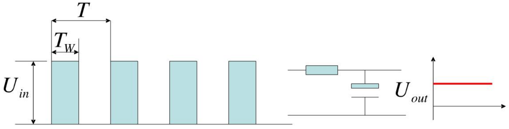
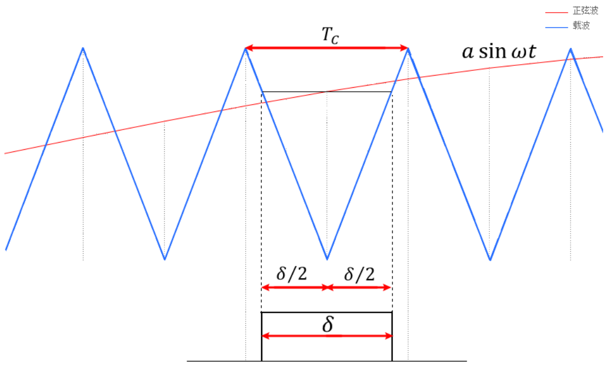

### PWM

PWM（Pulse Width Modeulation）脉宽调制技术（DC-DC）

**占空比**

$$
\delta=\frac{T_W}{T}
$$

**输出有效电压**

$$
U_{out}=\delta U_{in}
$$

### SPWM

SPWM（Sinusoidal Pulse Width Modeulation）正弦脉宽调制技术（DC-AC），从电源

的角度出发，以生成一个可调频调压的正弦波电源

**载波比N**

每个周期内的载波与所含正弦调制波输出的脉冲总数之比，实际就是载波频率$f_t$与调制波的频率$f_s$之比。

$$
N=\frac{f_t}{f_s}
$$

**调制比R**

输出波形电压幅值$V_t$与载波电压$V_s$幅值之比。一般情况下0 < 𝑅 < 1，如果𝑅 > 1，那就是过调制。

$$
R=\frac{V_s}{V_t}
$$

**调制方法**

- 自然采样法：在正弦波和三角波的自然交点时刻控制功率开关器件的通断，SPWM 波形很接近正弦波，解方程复杂。

- 对称规则采样法：过三角波的对称轴与正弦波的交点，做平行 x 轴的直线，该平行线与三角波的两个交点作为开关器件的通断时刻。

$$
\frac{1+\frac{U_S}{U_t}sin(\omega t_D)}{\delta / 2}=\frac{2}{T_C/2}\\
(\omega为正弦波频率,t_D就是载波的采样时刻,\delta/2为脉宽的一半，T_C是一个载波周期)
$$

如果载波频率与调制波的频率比值为N，那么导通时常计算如下：

$$
\delta = T_C(1+asin(\omega t_D)/2(其中\omega t_D=2k\pi/N)
$$

- 不对称规则采样法

每个载波周期采样两次，在三角波的顶点对称轴或者底点对称轴都采样一次，这样所形成的阶梯波与正弦波的逼近程度会大大提高。

### SVPWM

SVPWM(Space Vector Pulse Width Modulation)，将逆变系统和异步电机看作一个整体来考虑，以三相对称正弦波电压供电时三相对称电动机定子理想磁链圆为参考标准，以三相逆变器不同开关模式作适当的切换，从而形成 PWM波，以所形成的实际磁链矢量来追踪其准确磁链圆。

### 参考资料

[彻底吃透SVPWM如此简单 - 知乎 (zhihu.com)](https://zhuanlan.zhihu.com/p/414721065)
