# 基本定时器

## 基础定时器简介

## 基础定时器框图

### 0.总框图

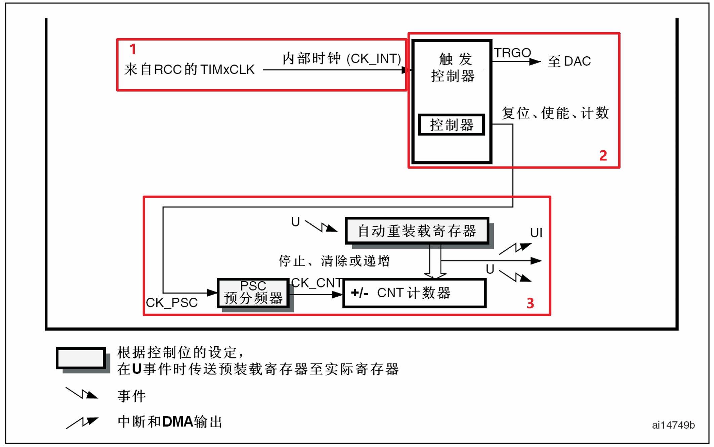

### 1.时钟源

### 2.控制器

### 3.计数器

## 基础定时器寄存器

##### 控制寄存器 - TIMx_CR1

**ARPE**：自动重装载预装载使能 (Auto-reload preload enable)  位6:4

0：TIMx_ARR寄存器没有缓冲

1：TIMx_ARR寄存器具有缓冲

**OPM**：单脉冲模式 (One-pulse mode) 

0：在发生更新事件时，计数器不停止

1：在发生下次更新事件时，计数器停止计数(清除CEN位)。 

**URS**：更新请求源 (Update request source)  该位由软件设置和清除，以选择UEV事件的请求源。

0：如果使能了中断或DMA，以下任一事件可以产生一个更新中断或DMA请求： - 计数器上溢或下溢 - 设置UG位 - 通过从模式控制器产生的更新

1：如果使能了中断或DMA，只有计数器上溢或下溢可以产生更新中断或DMA请求。 

**UDIS**：禁止更新 (Update disable) 

该位由软件设置和清除，以使能或禁止UEV事件的产生。

0：UEV使能。更新事件(UEV)可以由下列事件产生： - 计数器上溢或下溢 - 设置UG位 - 通过从模式控制器产生的更新  产生更新事件后，带缓冲的寄存器被加载为预加载数值。

1：禁止UEV。不产生更新事件(UEV)，影子寄存器保持它的内容(ARR、PSC)。但是如果设置 了UG位或从模式控制器产生了一个硬件复位，则计数器和预分频器将被重新初始化。 

**CEN**：计数器使能 (Counter enable) 

0：关闭计数器

1：使能计数器

注：门控模式只能在软件已经设置了CEN位时有效，而触发模式可以自动地由硬件设置CEN 位。  在单脉冲模式下，当产生更新事件时CEN被自动清除。

##### 控制寄存器2 -  TIMx_CR2

**MMS**：主模式选择 (Master mode selection) 

这些位用于选择在主模式下向从定时器发送的同步信息(TRGO)，有以下几种组合：

000：复位 – 使用TIMx_EGR寄存器的UG位作为触发输出(TRGO)。如果触发输入产生了复位 (从模式控制器配置为复位模式)，则相对于实际的复位信号，TRGO上的信号有一定的延迟。

001：使能 – 计数器使能信号CNT_EN被用作为触发输出(TRGO)。它可用于在同一时刻启动多 个定时器，或控制使能从定时器的时机。计数器使能信号是通过CEN控制位和配置为门控模式 时的触发输入的’逻辑或’产生。  当计数器使能信号是通过触发输入控制时，在TRGO输出上会有一些延迟，除非选择了主/从模 式(见TIMx_SMCR寄存器的MSM位)。

010：更新 – 更新事件被用作为触发输出(TRGO)。例如一个主定时器可以作为从定时器的预分 频器使用。

##### DMA/中断使能寄存器 - TIMx_DIER

**UDE**：更新DMA请求使能 (Update DMA request enable) 

0：禁止更新DMA请求  1：使能更新DMA请求 

**UIE**：更新中断使能 (Update interrupt enable)  

0：禁止更新中断  1：使能更新中断 

##### 状态寄存器 - TIMx_SR

**UIF**：更新中断标志 (Update interrupt flag) 

硬件在更新中断时设置该位，它由软件清除。

0：没有产生更新。

1：产生了更新中断。下述情况下由硬件设置该位： 

- 计数器产生上溢或下溢并且TIMx_CR1中的UDIS=0；
- 如果TIMx_CR1中的URS=0并且UDIS=0，当使用TIMx_EGR寄存器的UG位重新初始化计数器CNT时。

##### 事件产生寄存器 - TIMx_EGR

**UG**：产生更新事件 (Update generation)  

该位由软件设置，由硬件自动清除。  

0：无作用

1：重新初始化定时器的计数器并产生对寄存器的更新。注意：预分频器也被清除(但预分频系数不变)。

##### 计数器 - TIMx_CNT

**CNT**：计数器数值

##### 预分频器 - TIMx_PSC

**PSC[15:0]**：预分频器数值 (Prescaler value)  

计数器的时钟频率CK_CNT等于fCK_PSC/(PSC[15:0]+1)。在每一次更新事件时，PSC的数值被传送到实际的预分频寄存器中。

##### 自动重装载寄存器 - TIMx_ARR

**ARR[15:0]**：自动重装载数值 (Prescaler value) 

ARR的数值将传送到实际的自动重装载寄存器中。如果自动重装载数值为0，则计数器停止。

# 通用定时器

## 通用定时器简介

## 通用定时器框图

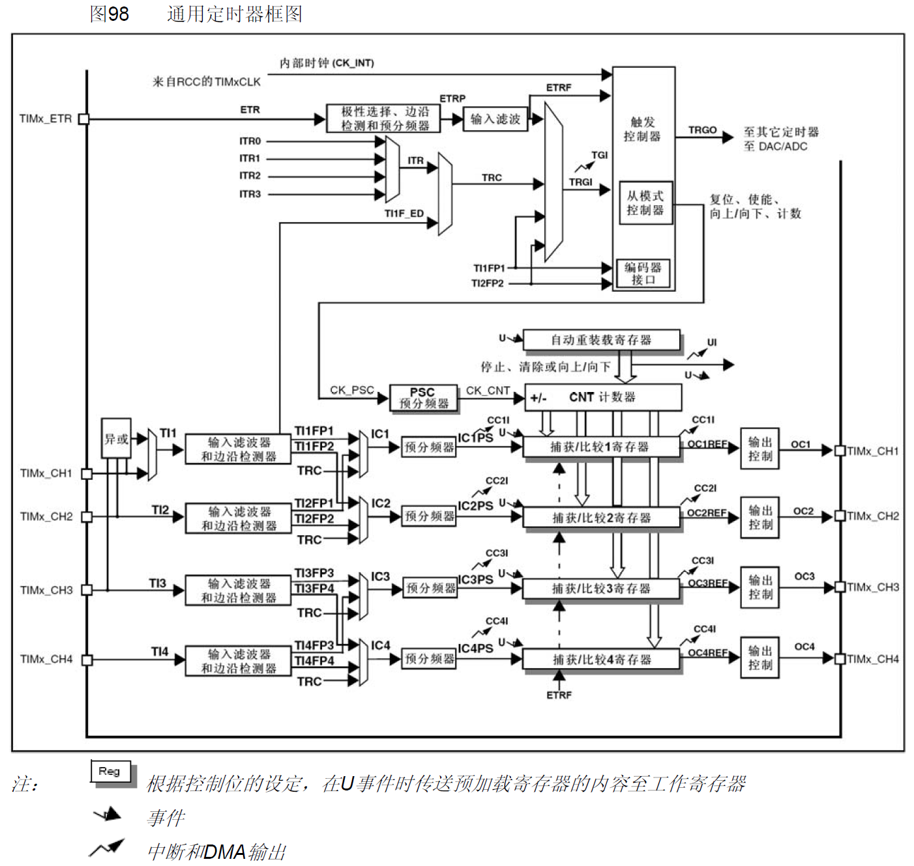

## 通用定时器寄存器

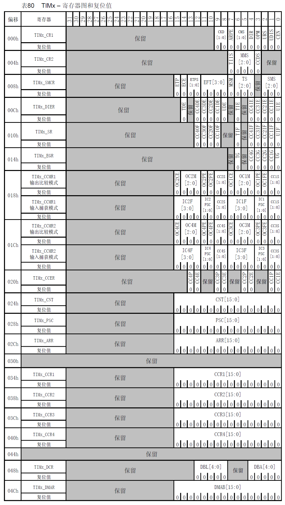

# 高级定时器

## 高级定时器简介

## 高级定时器框图

### 0.总框图

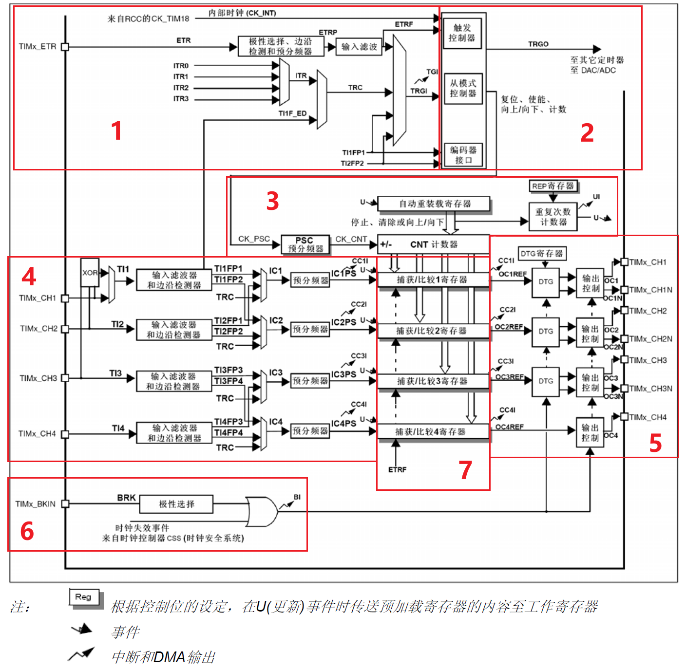

### 1.时钟源

时钟来源有4种：内部时钟源（CK_INT）、外部时钟源TINx（x=1,2,3,4）、外部时钟源ETR、内部触发输入ITR

#### 外部时钟源TINx

4个通道：TI1/2/3/4（TIMx_CH1/2/3/4）。

2个触发源：滤波后的定时器输入1 （TI1FP1）和滤波后的定时器输入2（TI2FP2）

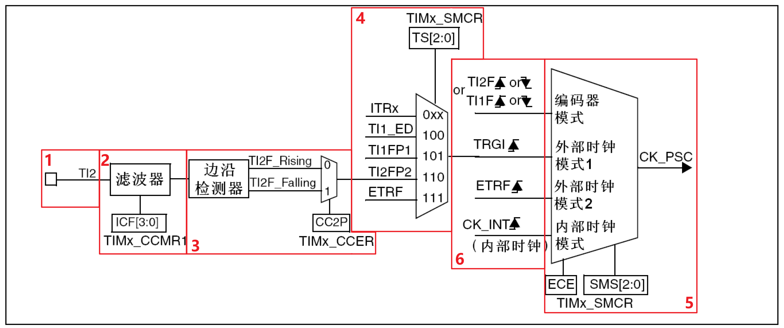

#### 外部时钟源ETR

1个通道：ETR（TIMx_ETR）

1个触发源：ETRP，滤波后连接至ETRF

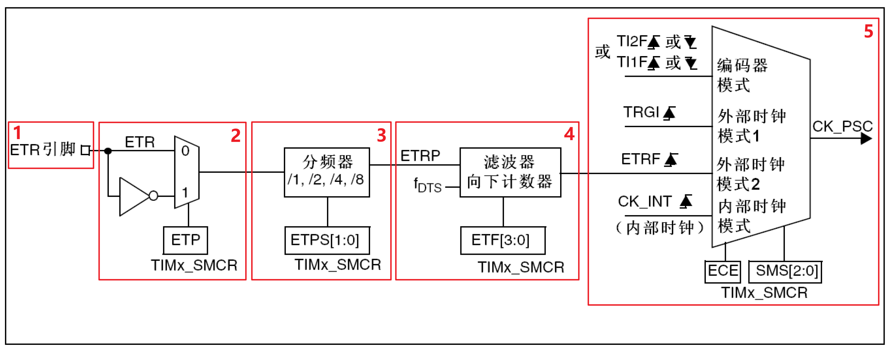

#### 内部输入触发ITR

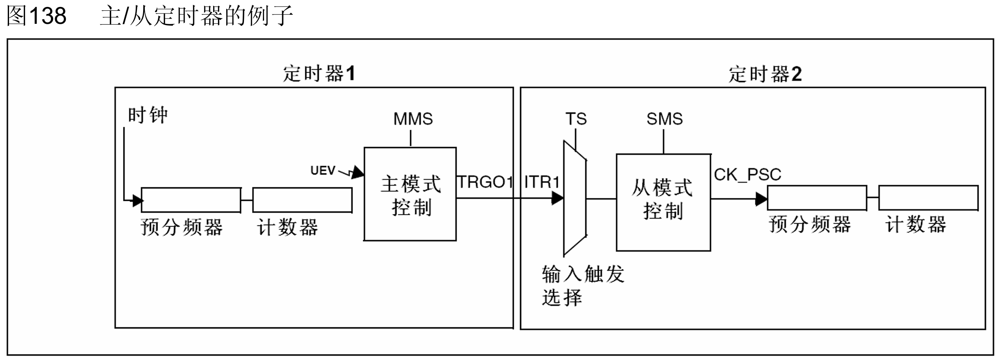

### 2.控制器

触发控制器：针对片内外设输出触发信号，比如为其他定时器提供时钟和触发DAC/ADC转换。

从模式控制器：可以控制计数器复位、启动、递增/递减、计数。

编码器接口：针对编码器计数而设计。

### 3.时基单元

1个16位自动装载计数器

1个 16 位向上、向下、向上/向下计数器

1个16位可编程（可以实时修改）预分频器

1个16位计数器

1个16位重复次数寄存器，高级定时器专属，重复计数器是自动加载的 ，当向上溢出、向下溢出和中央 对其模式下每次上溢或下溢时，重复计数器的值递减。高级控制定时器只能在重复次数达到0的 时候产生更新事件。

### 4/5.输入捕获/输出比较

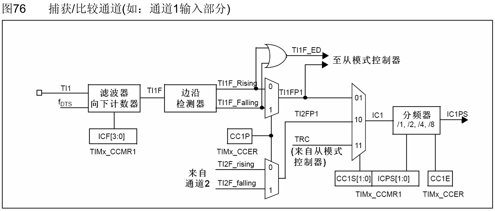

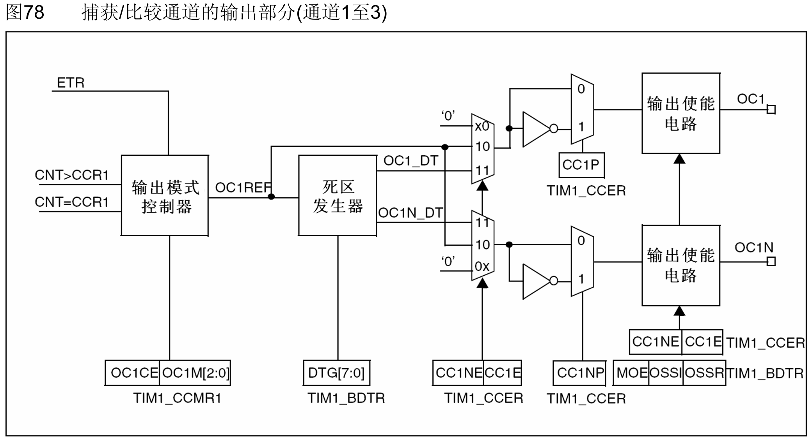

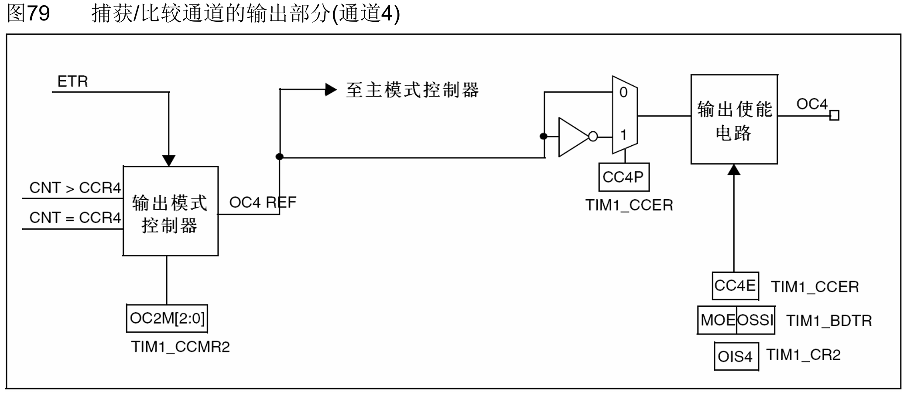

输入捕获模式、PWM输入模式、编码器接口模式。

强制输出模式、输出比较模式、PWM模式、互补输出和死区插入、单脉冲模式、断路功能

### 6.断路功能

断路功能就是电机的刹车功能。刹车源可以说是外部断路输入引脚，也可以是一个时钟失败事件（由复位时钟控制器的时钟安全系统产生）。

## 高级定时器寄存器

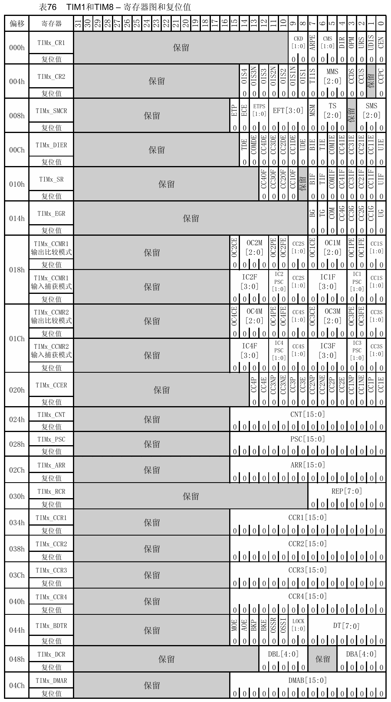

