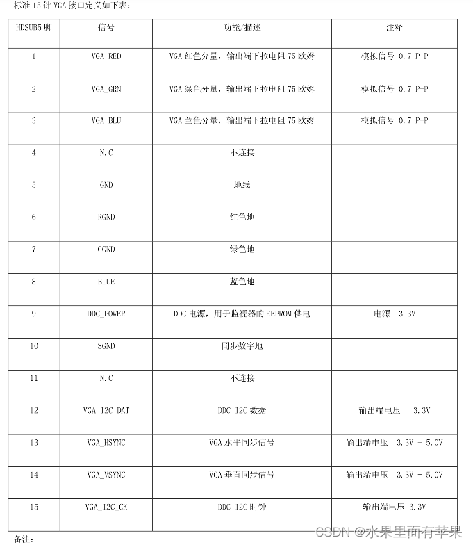

## 简介
本文主要介绍视频领域的行业知识。

## 视频标准组织
#### 1.1 视频标准组织 - VESA
##### 关于 VESA
视频电子标准协会（Video Electronics Standards Association，简称“VESA”），是一家国际非营利组织。  
该组织至今已有超过 300 个企业成员，主要成员包括 AMD，苹果，佳能，戴尔，技嘉，谷歌，惠普，HTC，华为，索尼，日本电气等。
##### VESA 的使命
支持并为 PC、工作站和消费电子行业制定行业范围的接口标准。  
不断发展技术标准开发并发展成为一个国际贸易协会，推动标准倡议、产品实施和市场实施。
##### VESA 重要视频标准
DisplayHDR, 为显示器行业和消费者简化 HDR 规范的标准。  
DisplayPort（DP）：一种数字显示接口标准。

#### 1.2 视频标准组织 - CTA
##### 关于 CTA
消费者技术协会（Consumer Technology Association）是一个贸易组织，代表美国 2200 多家技术公司的标准。  
2015年，该组织名字由 Consumer Electronics Association (CEA) 更改为 Consumer Technology Association (CTA) 。
##### CTA 重要视频标准
CTA EDID 扩展： 在 CEA-861 中引入，最流行的版本为 CEA-861-D（2006年），目前最新版本为 CTA-861-I（2023年）

## 视频接口介绍
### VGA
VGA(Video Graphics Array)即视频图形阵列，具有分辨率高、显示速率快、颜色丰富等优点。VGA接口不但是CRT显示设备的标准接口，同样也是LCD液晶显示设备的标准接口，虽然是一种模拟信号接口，但是由于VGA将视频信号分解为R、G、B三原色和HV行场信号进行传输，所以在传输中的损耗相当小。  

#### 硬件接口
##### 引脚说明

##### 时序说明
VGA显示图像使用扫描的方式，从第一行的第一个像素开始，逐渐填充，第一行第一个、第一行第二个、、、、第二行第一个、第二行第二个、、、、第n行最后一个。  
通过这种方式构成一帧完整的图像，当扫描速度足够快，加之人眼的视觉暂留特性，我们会看到一幅完整的图片，而不是一个个闪烁的像素点。这就是VGA 显示的原理。  

[FPGA 入门 —— VGA，主要介绍传输方式](https://blog.csdn.net/m0_59161987/article/details/130377678?ops_request_misc=%257B%2522request%255Fid%2522%253A%2522172035144316800197083450%2522%252C%2522scm%2522%253A%252220140713.130102334..%2522%257D&request_id=172035144316800197083450&biz_id=0&utm_medium=distribute.pc_search_result.none-task-blog-2~all~top_positive~default-1-130377678-null-null.142^v100^pc_search_result_base7&utm_term=vga%E5%8D%8F%E8%AE%AE&spm=1018.2226.3001.4187)  
[VGA显示图像 详细总结，主要介绍传输方式](https://blog.csdn.net/weixin_44406200/article/details/103823607?ops_request_misc=%257B%2522request%255Fid%2522%253A%2522172036195116800211548166%2522%252C%2522scm%2522%253A%252220140713.130102334.pc%255Fall.%2522%257D&request_id=172036195116800211548166&biz_id=0&utm_medium=distribute.pc_search_result.none-task-blog-2~all~first_rank_ecpm_v1~hot_rank-3-103823607-null-null.142^v100^pc_search_result_base7&utm_term=vga&spm=1018.2226.3001.4187)  
[FPGA学习——VGA显示，初步接触数据传输及FPGA的代码实现](https://blog.csdn.net/weixin_56102526/article/details/124964347?ops_request_misc=%257B%2522request%255Fid%2522%253A%2522172036195116800211548166%2522%252C%2522scm%2522%253A%252220140713.130102334.pc%255Fall.%2522%257D&request_id=172036195116800211548166&biz_id=0&utm_medium=distribute.pc_search_result.none-task-blog-2~all~first_rank_ecpm_v1~hot_rank-13-124964347-null-null.142^v100^pc_search_result_base7&utm_term=vga&spm=1018.2226.3001.4187)
### DVI
DVI（Digital Visual Interface）是一种数字视频接口，有DVI－Analog（DVI-A）、DVI-Digital（DVI-D）和DVI-Integrated（DVI-I）三种类型，其中DVI-A接口只传输模拟信号，实质就是VGA模拟传输接口规格，常用于转接显卡的DVI-I输出到VGA显示器接口，DVI-D（接口是纯数字接口，不兼容模拟信号，DVI-I接口，兼容DVI-I和DVI-D两种插头，兼容数字和模拟信号。它们的接口形状不同，如果接口不匹配就无法插入使用。    
DVI接口又分为Single Link（SL） DVI和Dual Link（DL）DVI，SL DVI传输速率只有DL DVI的一半，为165MHz/s，最大的分辨率只能支持到1920x1200@60，DL DVI可支持到2560x1600@60Hz，也可支持1920x1080@120Hz。     
SL DVI（单通道）最大带载能力为3.7 Gbit/s,DL DVI（双通道）在最大带载能力为

### HDMI
#### 简介
HDMI（High Definition Multimedia Interface，高清多媒体接口）是一种全数字化视频和音频发送接口，可以发送未压缩的音频及视频信号，其物理接口主要有标准HDMI接口、mini HDMI接口和Micro HDMI接口，如图所示：

HDMI可搭配宽带数字内容保护（HDCP），以防止具有著作权的影音内容遭到未经授权的复制。HDMI所具备的额外空间可应用在日后升级的音视频格式中。而因为一个1080p的视频和一个8声道的音频信号需求少于0.5GB/s，因此HDMI还有很大余量。这允许它可以用一个电缆分别连接DVD播放器，接收器和PRR。
#### 硬件接口
[HDMI接口电路设计 哔哩哔哩](https://www.bilibili.com/video/BV1B34y157jG/?spm_id_from=333.1296.top_right_bar_window_history.content.click&vd_source=8628b70b8921792574747e076af0f11a)

##### 引脚说明

##### HDMI识别过程

#### 关键技术
TMDS（Transition Minimized Differential Signaling）差分传输技术
TMDS（Time Minimized Differential Signal） 最小化传输差分信号

LVDS（Low-Voltage Differential Signaling）低电压差分信号

### DP
DP（DisplayPort）是一个由PC及芯片制造商联盟开发，视频电子标准协会（VESA）标准化的数字式视频接口标准。该接口免认证、免授权金，主要用于视频源与显示器等设备的连接，并也支持携带音频、USB和其他形式的数据。DP接口定义了两种接头，全尺寸（Full Size）和迷你DP（Mini），两种接头皆是20针，但迷你接头的宽度大约是全尺寸的一半。  

#### 硬件接口
[DP硬件接口说明](https://blog.csdn.net/she666666/article/details/138341055?spm=1001.2101.3001.6650.5&utm_medium=distribute.pc_relevant.none-task-blog-2%7Edefault%7EYuanLiJiHua%7EPosition-5-138341055-blog-123871957.235%5Ev43%5Epc_blog_bottom_relevance_base8&depth_1-utm_source=distribute.pc_relevant.none-task-blog-2%7Edefault%7EYuanLiJiHua%7EPosition-5-138341055-blog-123871957.235%5Ev43%5Epc_blog_bottom_relevance_base8&utm_relevant_index=8)
##### 引脚说明

## 专业名词介绍

#### Timing（时序）

Video timing 包含两个信号：水平同步Hs（horizontal sync）和垂直同步Vs（vertical sync） 
- Vertical sync --> 用来标识什么时候开始送出一幅新画面
- Horizontal sync --> 用来标识什么时候开始新一行的图像扫描

#### Genlock

#### 色彩空间

#### 隔行i/逐行p

#### 位深&色深

#### 色域

## 眼图
[鼎阳科技 一期带你弄懂示波器眼图逻辑 哔哩哔哩](https://www.bilibili.com/video/BV1Cr4y1f7sm/?spm_id_from=333.1296.top_right_bar_window_history.content.click)