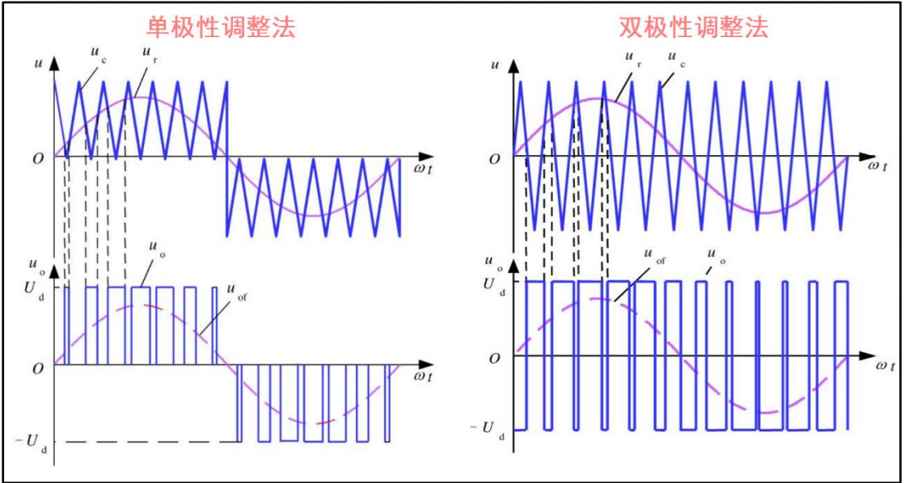
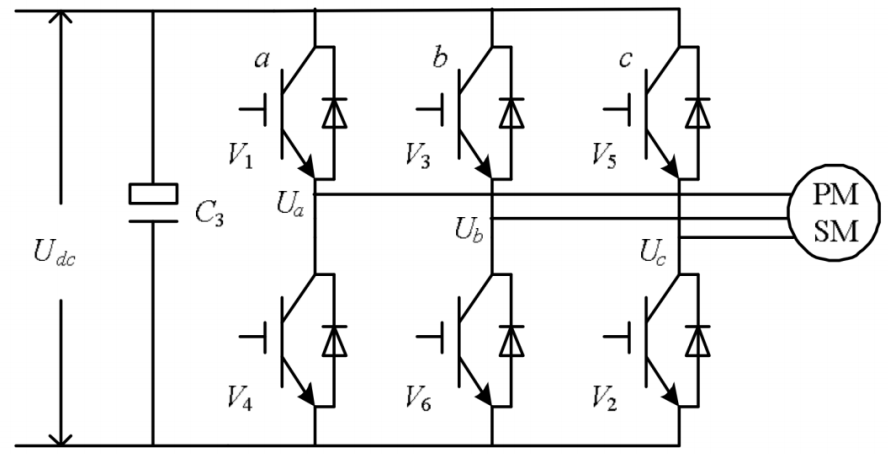
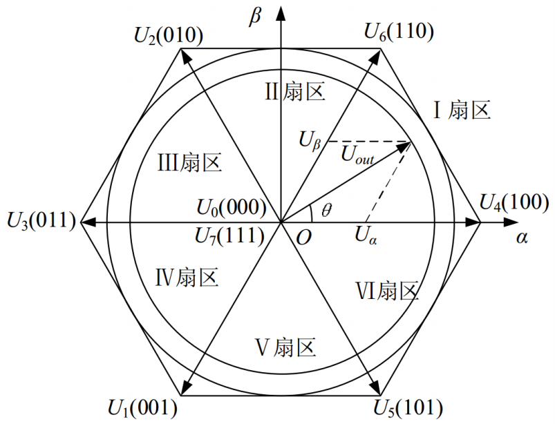

# 待办实现
- [ ] 完善SPWM非对称采样
- [ ] 完善跟踪控制
- [ ] 完善SVPWM

# 调制技术
## 调制原理
根据采样控制理论中的一个重要结论：冲量相等而形状不同的窄脉冲加在具有惯性的环节上时，其效果基本相同。冲量即指窄脉冲的面积。这里所说的效果
基本相同，是指环节的输出响应波形基本相同。即当它们分别加在具有惯性的同
一个环节上时，其输出响应基本相同。如果把各输出波形用傅立叶变换分析，则
其低频段非常接近，仅在高频段略有差异。上述原理可以称之为面积等效原理，
见图 14-4，它是 PWM 控制技术的重要理论基础。

## PWM

PWM（Pulse Width Modeulation）脉宽调制技术（DC-DC）

**占空比**

$$
\delta=\frac{T_W}{T}
$$

**输出有效电压**

$$
U_{out}=\delta U_{in}
$$

## SPWM
SPWM（Sinusoidal Pulse Width Modeulation）正弦脉宽调制技术（DC-AC），从电源的角度出发，以生成一个可调频调压的正弦波电源。

### 原理
SPWM 波形是通过比较正弦波和三角波得到的，***正弦波*** 叫做 ***调制波***，***输出正弦波*** 叫做 ***调制波输出***，***三角波*** 叫做 ***载波***。每一正弦周期内的多个脉冲做自然或规则的宽度调制，使其依次调制出相当于正弦函数值的相位角和面积等效于正弦波的脉冲序列，形成等幅不等宽的正弦化信号输出。调制波的频率决定了输出正弦波的频率，载波的频率决定了输出正弦波的谐波含量，调制波的幅值由输出正弦波的宽度来决定。

**调制极性**  
根据调制波形极性的不同分为单极性 SPWM 和 双极性 SPWM。这两种方式的 SPWM 波形如图所示。 

在单极性 SPWM 中，载波与调制波的比较是单边的，即载波在调制波上方时输出高电平，载波在调制波下方时输出低电平。  
在双极性 SPWM 中，载波与调制波的比较是双边的，即载波在调制波上方时输出低电平，载波在调制波下方时输出高电平。  
单极性SPWM的输出电压谐波含量较低，但开关频率是双极性的两倍，开关损耗较大。而双极性SPWM的开关损耗较小，但输出电压谐波含量较高。两者各有优缺点，实际应用中可根据需要选择。

**载波比 $N$**  
载波比 $N$ 是载波频率 $f_t$ 与 调制波频率 $f_s$ 之比，载波比是决定输出波形质量的一个重要参数，载波比越大，输出波形越接近正弦波，谐波含量越小，但载波频率过高会增加开关损耗，所以在实际应用中要综合考虑。一般情况下，$N$ 远远大于 1，载波比一般在 10~20 之间。  
根据载波和调制波是否同步及载波比的变化情况，PWM 调制方式分为 异步调制 和 同步调制。
$$载波比N=\frac{载波频率f_t}{调制波频率f_s}$$

- 异步调制：$f_t$ 固定不变，$f_s$ 变化时，$N$ 跟随变化。当 $f_s$ 较低时，$N$ 较大，一周期内脉冲数较多，脉冲不对称产生的不利影响都较少。当 $f_s$ 增高时，$N$ 较小，一周期内的脉冲数较少，脉冲不对称的影响就变大。  
- 同步调制：$f_s$ 变化时，$N$ 不变，$f_t$ 跟随变化。为使单相输出端额 SPWM 正负半轴镜像对称，𝑁应取奇数。当 $f_s$ 很低时， $f_t$ 也很低，有调制带来的谐波不易滤除，当 $f_s$ 很高时， $f_t$ 会过高，使开关器件难以承受。
- 分段同步调制：把 $f_s$ 的频率范围内划分为若干个频段，每个频段内保持载波比 $𝑁$ 恒定，不同频段的载波比𝑁不同。在 $f_s$ 较高的频段使用较低的载波比𝑁使载波频率不至于过高，在 $f_s$ 较低的频段采用较高的载波比，是载波频率不至于过低。可在低频输出时采用异步调制方式，高频输出时切换到同步调制方式，这样把两者的有点结合起来，和分段同步方式效果接近。

**幅值调制比 $R$**  
调制比 $R$ 是正弦输出波峰值电压幅值 $V_s$ 与三角载波电压幅值 $V_t$ 之比，调制比是决定输出电压幅值的一个重要参数，调制比越大，输出电压幅值越大，反之亦然。。一般情况下 $0 < R < 1$，如果 $R > 1$，那就是过调制。

$$调制比 R =\frac{正弦输出波峰值电压幅值 V_s}{三角载波电压幅值 V_t}$$

### 实现方法

算法的实现方法有很多种，比如有计算法、调制法、跟踪法等。其中调制法包括自然采样法、规则采样法（对称规则采样法、不对称规则采样法）；跟踪法包括锁相跟踪法、锁频跟踪法等。

常用的就是对称规则采样或者是不对称规则采样。因为这两种方式可以使用微机编程实现，控制电路简单，计算量少，相较其他方法更加灵活。

**计算法**  
根据给出的正弦波的输出频率、幅值和半个周期内的脉冲数，PWM 波形中各脉冲的宽度和时间间隔可以准确的计算出来，按照计算结果控制电路中各个开关器件的通断，就可以得到需要的 SPWM 波形。这种方法称为计算法，可以看出，计算法是很繁琐的，当需要输出的正弦波的频率、幅值或者相位变化时，计算结果都要变化。

**调制法**  
调制法是把正弦波作为调制信号，把接受调制的信号作为载波，通过信号波调制得到所期望的 PWM 波形。通常采用三角波或锯齿波作为载波，其中三角波用的最多，因为三角波上任一点的水平宽度和高度成线性关系且左右对称，当它与任何一个平缓变化的调制信号相交时，如果在交点时刻对开关器件的通断进
行控制，就可以得到宽度正比于信号波幅值的脉冲，这正好符合 PWM 控制的要求。实际应用中可以使用模拟电路构成三角载波和正弦调制波发生电路，用比较器来确定他们的交点，在交点时刻对开关器件进行控制通断，从而生成 SPWM 波形。虽然可以使用模拟电路实现，但是目前应用更多的是通过软件来生成 SPWM波形。

**调制法-自然采样法**  
在正弦波和三角波的**每个自然自然交点时刻切换一次功率开关器件的通断**，SPWM 波形很接近正弦波，解方程复杂。

**调制法-规则采样法**  
- 对称规则采样法：过三角波的对称轴与正弦波的交点，做平行 x 轴的直线，该平行线与三角波的两个交点作为开关器件的通断时刻。因为这两个交点是对称的，所以称为规则采样法。这种方法实际使用一个阶梯波逼近正弦波，由于在每个载波周期当中只采样一次，因此计算得到简化。由于每个载波周期只采样一次，因此形成的阶梯波与正弦波的逼近程序仍存在较大误差。

在底点对称轴对正弦波采样，采样值作为载波交点控制开关器件的通断。三角波的幅值就是 $𝑈_𝑇$ ，正弦波的幅值就是 $𝑈_𝑆$，将正弦波向上平移 1 个单位，使其在时间轴上方，根据相似三角形原理，可得如下关系式：
$$\frac{1+\frac{U_S}{U_T}sin(\omega t_D)}{\delta / 2}=\frac{2}{T_C/2}\\
(\omega为正弦波频率,t_D就是载波的采样时刻,\delta/2为脉宽的一半，T_C是一个载波周期)$$

如果载波频率与调制波的频率比值为N，那么 ***导通时长*** 计算如下：
$$\delta = T_C(1+\frac{U_S}{U_T}sin(\omega t_D)/2\\(其中\omega t_D=\frac{2k\pi}{N},k 为一个正弦波周期内的采样计数值,得到的𝛿就是开关时长。)$$

- 不对称规则采样法：每个载波周期采样两次，在三角波的顶点对称轴或者底点对称轴都采样一次，这样所形成的阶梯波与正弦波的逼近程度会大大提高。这种采样所形成的阶梯波与三角波的交点并不对称，因此称为不对称规则采样。

**跟踪控制**

## SVPWM

SVPWM(Space Vector Pulse Width Modulation)，将逆变系统和异步电机看作一个整体来考虑，以三相对称正弦波电压供电时三相对称电动机定子理想磁链圆为参考标准，以三相逆变器不同开关模式作适当的切换，从而形成 PWM波，以所形成的实际磁链矢量来追踪其准确磁链圆。

### 参考资料

[彻底吃透SVPWM如此简单 - 知乎 (zhihu.com)](https://zhuanlan.zhihu.com/p/414721065)
