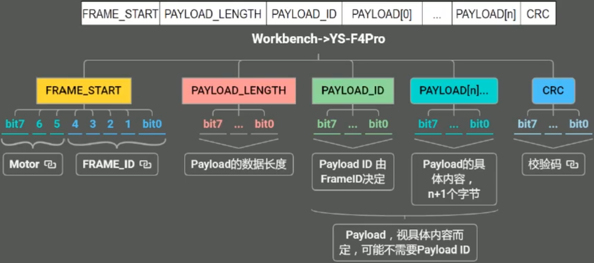

### 通讯协议

FRAME_START:MOTOR bit7-5
| 序号 | 取值 | Description |
| -----|-------|-------------|
| 1 | 000   | 上一次所选的电机        |
| 2 | 001   | Motor1    |
| 3 | 010   | Motor2    |
| 4 | 111   | None    |

FRAME_START:FRAME_ID bit4-0
| 序号 | 宏定义 | 取值 | Description |
| -----|-------|-------|-------------|
| 1 | MC_PROTOCOL_CODE_SET_REG 			| 0x01 | 设置寄存器的值	|
| 1 | MC_PROTOCOL_CODE_GET_REG 			| 0x01 | 获取寄存器的值 |
| 1 | MC_PROTOCOL_CODE_EXECUTE_CMD 		| 0x01 | 主要是执行一些功能指令 |
| 1 | MC_PROTOCOL_CODE_STORE_TOADDR     | 0x01 | 按地址存储数据 |
| 1 | MC_PROTOCOL_CODE_LOAD_FROMADDR    | 0x01 | 按地址读取数据 |
| 1 | MC_PROTOCOL_CODE_GET_BOARD_INFO   | 0x01 | 获取板子的信息 |
| 1 | MC_PROTOCOL_CODE_SET_SPEED_RAMP   | 0x01 | 设置速度 Ramp |
| 1 | MC_PROTOCOL_CODE_GET_REVUP_DATA   | 0x01 | 获取无感模式的开环启动参数 |
| 1 | MC_PROTOCOL_CODE_SET_REVUP_DATA   | 0x01 | 设置无感模式的开环启动参数 |
| 1 | MC_PROTOCOL_CODE_SET_CURRENT_REF  | 0x01 | 设置电流目标值 | 
| 1 | MC_PROTOCOL_CODE_GET_FW_VERSION   | 0x01 | 获取固件库版本号 |
| 1 | MC_PROTOCOL_CODE_SET_TORQUE_RAMP  | 0x01 | 设置扭矩 Ramp |
| 1 | MC_PROTOCOL_CODE_SET_POSITION_CMD | 0x01 | 设置位置模式 |

PAYLOAD_LENGTH

PAYLOAD_ID

PAYLOAD[n]