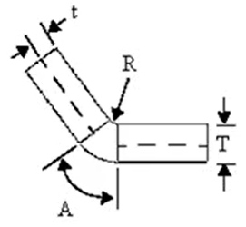

# CAD
## CAD介绍
Computer-Aided Design，计算机辅助设计软件，用于创建二维或三维的几何图形模型，例如 SolidWorks、AutoCAD。

## solidworks

### 介绍
solidworks是目前世界上应用最广泛的三维CAD/CAM/CAE一体化设计软件，集成了机械设计、仿真分析、产品数据管理、技术交流等功能于一体，具有强大的三维建模功能和良好的用户界面，易学易用，深受广大用户的喜爱。

### 学习资源
- [solidworks中文官网](https://www.solidworks.com/zh-hans)
- [solidworks官方文档](https://help.solidworks.com/2024/chinese-simplified/SolidWorks/sldworks/r_welcome_sw_online_help.htm?verRedirect=1)

### 专有名词
**solidworks visualize材质库翻译**
- Automotive 自动的
- Emissives 放射的
- fasbric 织物
- Gems 宝石
- Glass 玻璃
- Leather 皮革
- Liquid 液体
- Mesh 网状物
- Metal 金属
- Metallic Paint金属漆
- Other 其他
- Paint 油漆
- PBR Materials PBR材料
- Plastic 塑料
- Precious Metal 贵金属
- Rubber 橡胶
- SOLIDWORKS Appearances
- Transparent Plastic 透明塑料
- Vivid Metallic Paint 明亮的金属漆
- Wood 木材

### 基础操作

**钣金设计**  
钣金基本概念  
- 基体法兰/薄片  
- 边线法兰/斜接法兰  
- 展开/展平/折叠 

K因子计算如下：  
$$
K_{因子}=\frac{t}{T}
$$

其中T是材料厚度，t是材料中性层厚度。在材料拉伸时，中性层会在0.5的基础上偏移，普通材料K因子一般取0.3-0.35，每种材料的K因子和材料的延展性相关，实操时一般通过实验获得。

带 K-因子的折弯系数使用以下计算公式:

$$
BA=П(R + KT)A/180
$$

其中:
BA=折弯系数
R-内侧折弯半径
K=K-因子，即为t/T
T=材料厚度
t-内表面到中性面的距离
A-折弯角度(经过折弯材料的角度)

### 异常处理
**solidworks装配体有退回无法插入情况的解决**   
[装配体中的一个零部件正处于退回状态无法插入](https://www.bilibili.com/video/av931030027)  
主要参考上面的视频
下载宏并运行：[https://github.com/terryzhangsw/asmrollbackerr](https://github.com/terryzhangsw/asmrollbackerr)粘贴相应装配体路径并修复。

**solidworks工程图转换成autoCAD后字体出错**  
参考文章：[https://zhidao.baidu.com/question/315338638.html](https://zhidao.baidu.com/question/315338638.html)
保存DWG时有个“选项”，点开，字体选择TRUE TYPE，不要选择CAD字体。。。

## NX
NX（原UG）是Siemens公司开发的一款集成CAD/CAM/CAE功能于一体的三维设计软件，广泛应用于机械设计、汽车工业、航空航天等领域，具有强大的建模和仿真功能。

## CITIA
CITIA是达索系统公司开发的一款三维CAD/CAM/CAE一体化设计软件，广泛应用于航空航天、汽车工业等领域，具有强大的建模和仿真功能。

## PTCCreo
Creo（原Pro/ENGINEER）是PTC公司开发的一款三维CAD/CAM/CAE一体化设计软件，广泛应用于机械设计、产品开发等领域，具有强大的建模和仿真功能。

## FreeCAD
FreeCAD是一款开源的三维CAD建模软件，适用于产品设计、机械工程等领域，支持参数化建模和多种文件格式。

## SketchUp
SketchUp是一款易于使用的3D建模软件，广泛应用于建筑设计、室内设计、景观设计等领域，具有直观的操作界面和丰富的模型库。

## Fusion 360
Fusion 360是Autodesk公司开发的一款集成CAD/CAM/CAE功能于一体的云端三维设计软件，广泛应用于产品设计、机械工程等领域，支持协同设计和多种文件格式。

## AutoCAD
AutoCAD是由Autodesk公司开发的一款计算机辅助设计（CAD）软件，广泛应用于建筑设计、机械设计、电子设计等领域，支持二维和三维绘图功能。

## CAXA
CAXA是一款国产CAD软件，主要用于机械设计、建筑设计等领域，具有二维和三维设计功能。

## CADExchangeFree
CADExchangeFree是一款免费的CAD文件转换工具，支持多种CAD文件格式之间的转换，方便用户在不同CAD软件之间进行数据交换。

## Geomagic Design
Geomagic Design是一款专业的3D CAD建模软件，广泛应用于产品设计、机械工程等领域，支持参数化建模和多种文件格式。

## Blender
Blender是一款开源的三维建模、动画制作和渲染软件，广泛应用于影视制作、游戏开发等领域，支持多种插件和脚本扩展。

[Blender3.0入门教程](https://www.bilibili.com/video/BV1LS4y197SC/)

## 3Ds Max
3Ds Max是一款由Autodesk公司开发的三维建模、动画和渲染软件，广泛应用于游戏开发、影视制作等领域，具有强大的建模和动画功能。

## C4D
C4D是一款由Maxon公司开发的三维建模、动画和渲染软件，广泛应用于影视制作、游戏开发等领域，具有强大的建模和动画功能。

## Maya
Maya是一款由Autodesk公司开发的三维建模、动画和渲染软件，广泛应用于影视制作、游戏开发等领域，具有强大的建模和动画功能。

## Unity
Unity是一款由Unity Technologies公司开发的跨平台游戏引擎，广泛应用于游戏开发、虚拟现实、增强现实等领域，具有强大的实时渲染和物理仿真功能。

# CAE

## CAE介绍
(Computer-Aided Engineering)： 计算机辅助工程，用于仿真分析（如应力、流体、热学），例如 ANSYS。

## Adams

## ABAQUS
ABAQUS是一款由Dassault Systèmes公司开发的有限元分析软件，广泛应用于结构力学、热传导、流体力学等领域，具有强大的仿真和分析功能。

## Ansys
Ansys是一款由Ansys公司开发的有限元分析软件，广泛应用于结构力学、热传导、流体力学等领域，具有强大的仿真和分析功能。

# CAM

## CAM介绍
(Computer-Aided Manufacturing)： 计算机辅助制造，用于将CAD模型生成数控机床 (CNC) 的加工代码，例如 Mastercam。

## Magics
Magics是一款专业的3D打印数据准备软件，主要用于对3D模型进行修复、编辑和优化，以提高3D打印的成功率和质量。

### Magics功能介绍
- Magics进行数据准备的流程
- Magics修复工具
- Magics编辑工具
- 添加平台，优化摆放零件
- 支撑编辑
- 打印前的分析
- 自动支撑工具E-stage和金属仿真模块

### 3D打印流程
- 设计想法->CAD文件设计->数据准备->3D打印
- 输入文件：CAD数据、网络数据、扫描数据
- 数据准备降低打印错误率，节省时间，材料和成本
- 数据准备能够帮助你生成水密性的STL文件，并令STL模型符合打印标准，

### 3D打印中常见的挑战
- 从客户除获取正确的设计文件
- 文件格式转换
- STL文件修复
- 保证STL文件水密性
- 保证模型能被打印
- 优化零件摆放角度
- 支撑生成和优化

### Materialise Magics基本使用流程
导入，修复，编辑，打印准备，输出、质量控制

### STL文件产生错误成因
- CAD文件转换至STL文件时产生的错误
- 原设计文件缺陷

### STL文件错误定义
- 反向三角面片：三角面片方向定义错误
- 坏边
    - 缝隙：被缝合
    - 空洞
- 壳体
    - 干扰壳体：有小的三角面片分布在周围在切片时影响打印质量
    - 重叠壳体：两壳体形成重叠，形成过固化
- 重叠三角面片：三角面片之间的距离或者角度少于给定的阈值
- 交叉三角面片：有交叉壳体的时候容易出现
- 零件在编辑之前一定要先修复完成，否则由于编辑可能会造成更多的错误

### 支撑
- 坚固及方便去除
- 支撑类型
    - 面支撑：没有厚度的支撑，打印时仅仅只有有个光斑的厚度
    - 实体支撑
    - 锥支撑
    - 树支撑

## Geomagic Wrap
扫描数据处理和3D模型数据转换应用工具，其强大的功能可以在几分钟内即可完成三维扫描、面片处理、曲面重建、实体建模等工作流程。支持WRP、IGES、X_T,SAT、PRC、STEP等多种主流的文件导出格式。

## SISUMI
SISUMI是一款专业的数控编程软件，主要用于生成数控机床 (CNC) 的加工代码，支持多种数控机床和加工工艺，广泛应用于机械制造等领域。

## Mastercam
Mastercam是一款由CNC Software公司开发的计算机辅助制造 (CAM) 软件，广泛应用于数控机床 (CNC) 编程和加工，支持多种加工工艺和数控机床类型。

## UG CAM
UG CAM是Siemens公司开发的一款计算机辅助制造 (CAM) 软件，集成在NX软件中，广泛应用于数控机床 (CNC) 编程和加工，支持多种加工工艺和数控机床类型。

# LOGO

## studio 2.0
Studio 2.0是由LEGO公司开发的一款数字化乐高积木设计软件，允许用户在虚拟环境中创建和设计乐高模型，并生成相应的零件清单和构建指南。

## PartDesigner
PartDesigner是LEGO公司开发的一款乐高积木零件设计软件，允许用户创建自定义的乐高零件，并将其集成到乐高数字设计项目中。

## Early Access
Early Access是LEGO公司提供的一种预览版软件，允许用户提前体验和测试乐高数字设计软件的最新功能和改进。

## LDD
LDD（Lego Digital Designer）是乐高公司开发的一款数字化乐高积木设计软件，允许用户在虚拟环境中创建和设计乐高模型，并生成相应的零件清单和构建指南。