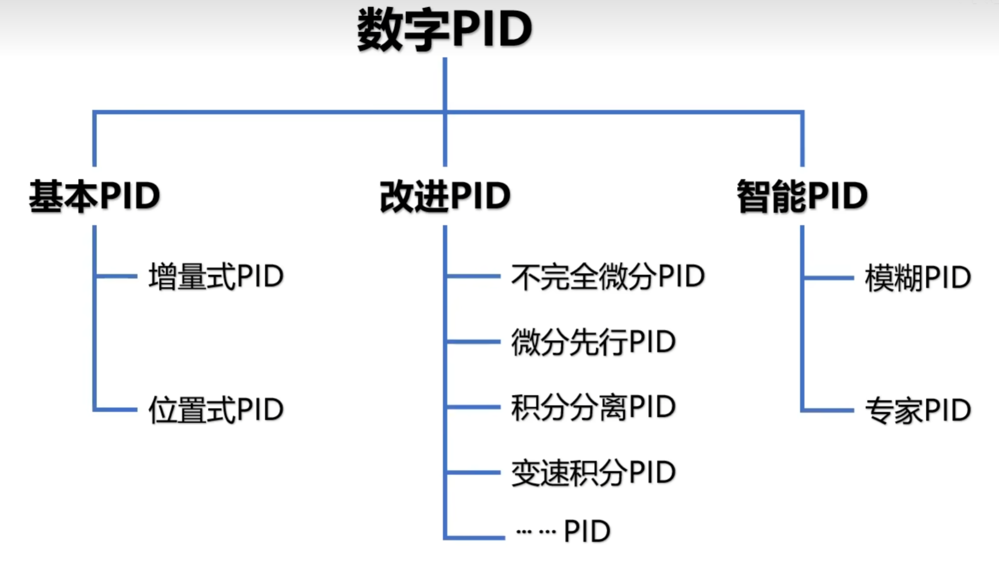
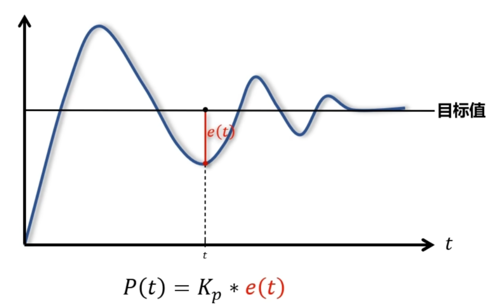
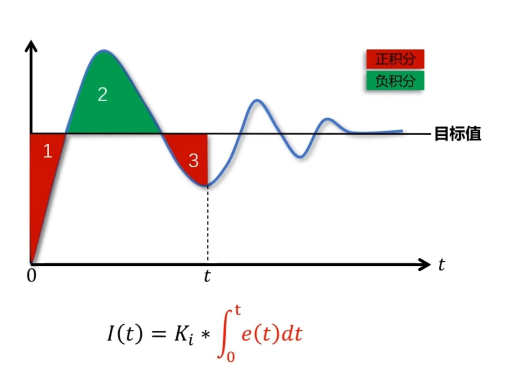
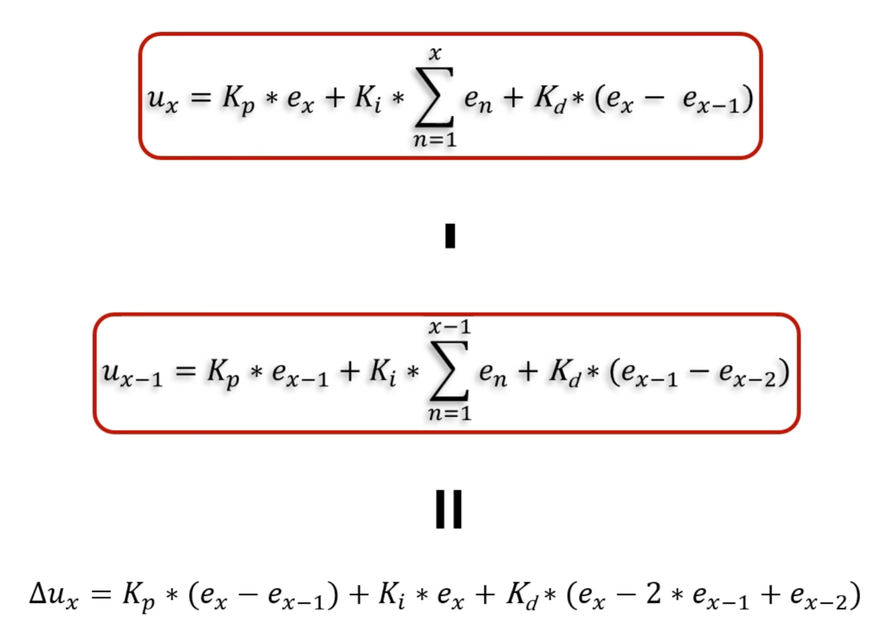

# 算法

## 简介

本文内容包括 数据结构 和 算法，主要介绍面向嵌入式的常用控制算法、滤波算法。例程以C语言为主。

## 数据结构

- [数据结构如何一天速成？](https://www.zhihu.com/question/309285407/answer/1361122057)
- [数据结构c语言版推荐的网课或者书啊](https://www.zhihu.com/question/294218064/answer/1923551509)
- [C语言描述 数据结构和算法](https://www.bilibili.com/video/BV1jW411K7yg)
- [数据结构与算法](https://www.bilibili.com/video/BV1sX4y1G7oM)

## 算法原理

## 自控原理

[自动控制原理基础课-主讲人：高运 东北大学](https://www.bilibili.com/video/BV1hs411678h)

### 卡尔曼

[【官方中字】什么是卡尔曼滤波器 (Kalman Filters) ？(全7P) MATLAB&Simulink](https://www.bilibili.com/video/BV1V5411V72J)

### PID

#### 位置式PID和增量式PID原理介绍

参考链接：[带你推导位置式PID和增量式PID公式](https://www.bilibili.com/video/BV1TP411D7xd/?spm_id_from=333.1007.top_right_bar_window_history.content.click&vd_source=8628b70b8921792574747e076af0f11a)

#### 位置式PID推导

#### 增量式PID推导

#### 位置式PID和增量式PID的应用场景

#### PID整定

参数整定找最佳，从小到大顺序查先是比例后积分，最后再把微分加曲线振荡很频繁，比例度盘要放大

曲线漂浮绕大湾，比例度盘往小扳曲线偏离回复慢，积分时间往下降曲线波动周期长，积分时间再加长曲线振荡频率快，先把微分降下来动差大来波动慢。微分时间应加长理想曲线两个波，前高后低四比一一看二调多分析，调节质量不会低

若要反应增快，增大P减小I
若要反应减慢，减小P增大I
如果比例太大，会引起系统震荡
如果积分太大，会引起系统迟钝

##### PID算法原理

- [023_STM32之PID算法原理及应用 - 陆小果哥哥 - 博客园](https://www.cnblogs.com/luxiaoguogege/p/10230369.html)
- [什么是PID？讲个故事，秒懂！](https://zhuanlan.zhihu.com/p/448979690)
- [【硬核科普】PID算法从理论到实践【1】 小游戏让你秒懂调参技巧](https://www.bilibili.com/video/BV1zM4y157pk)
- [【Arduino 101】五分钟搞懂PID控制算法](https://www.bilibili.com/video/BV1jr4y1P7qK)
- [平衡车原理大揭秘-直立环和速度环是什么？](https://www.bilibili.com/video/BV1K64y1e7kk)
- [怎样才叫真正理解卡尔曼滤波 Kalman Filter？](https://www.zhihu.com/question/47559783/answer/2980976068)
- [跳出课本看LQR控制，从公式到代码!](https://www.bilibili.com/video/BV1Ng4y1V7JQ/)
- [PID算法 - 从入门到实战！](https://www.bilibili.com/video/BV1iP411x71X/)
- [只用PID?加上前馈解决95%的问题](https://www.bilibili.com/video/BV19T411t7du/)
- [系统辨识调PID全流程](https://www.bilibili.com/video/BV1Z8411K7EZ/?spm_id_from=333.999.0.0)  
- [什么是增量式PID【目前最简单最实用的PID教程】第四讲](https://www.bilibili.com/video/BV1FX4y12799/)
- [自动控制原理](http://dec3.jlu.edu.cn/webcourse/t000132/chapter/chapter1/01/01.html)
- [【PID控制】用EXCEL学习PID控制算法](https://www.bilibili.com/video/BV1kS4y1B7Uo)
- [通俗易懂的 PID 控制算法讲解](https://www.bilibili.com/video/BV1et4y1i7Gm)
- [STM32—PID控制在直流电机中的应用](https://blog.csdn.net/qq_43743762/article/details/105827410?spm=1001.2101.3001.6650.1&utm_medium=distribute.pc_relevant.none-task-blog-2%7Edefault%7ESEARCHCACHE%7ERate-1-105827410-blog-104156208.pc_relevant_vip_default&depth_1-utm_source=distribute.pc_relevant.none-task-blog-2%7Edefault%7ESEARCHCACHE%7ERate-1-105827410-blog-104156208.pc_relevant_vip_default&utm_relevant_index=2)
- [自动控制原理](http://dec3.jlu.edu.cn/webcourse/t000132/chapter/chapter1/01/01.html)
- [023_STM32之PID算法原理及应用 - 陆小果哥哥 - 博客园](https://www.cnblogs.com/luxiaoguogege/p/10230369.html)
- [【PID实验】通过一个小车实验，让大家更加直观的了解PID控制算](https://www.bilibili.com/video/BV1uZ4y1Q7tm/)
- [【比PID好用系列教程】快速认识LADRC与LADRC参数整定方法](https://www.bilibili.com/video/BV15T411K7zK/)
- [【闲话PID】通俗读物《由入门到精通吃透PID》书籍推荐](https://www.bilibili.com/video/BV12v4y1D7vM/)
- [这下把pid给演明白了](https://www.bilibili.com/video/BV1Ca411f79B/)
- [机器人控制前言，不要再花时间调参数了，理论结合实践才能出产品](https://www.bilibili.com/video/BV1Me4y1o7Bn/)
- [【从放弃到精通】B站讲的最好的卡尔曼滤波器-目标追踪课程，目标追](https://www.bilibili.com/video/BV12P411V7pc/)
- [必收藏！！卡尔曼滤波器的原理以及在matlab中的实现，卡尔曼入门](https://www.bilibili.com/video/BV1GT411J7ob/)
- [B站讲的最好的卡尔曼滤波器-目标追踪课程，目标追踪](https://www.bilibili.com/video/BV1kN4y137xN/)
- [ADC基本读取方式——滑动均值滤波](https://www.bilibili.com/video/BV1KB4y1p7iN/)
- [学会PID-基于板球平衡系统-初中基础就能听懂的简单讲](https://www.bilibili.com/medialist/play/watchlater/BV1xL4y147ea)

### 滤波算法

[学习单片机AD采样必知的十大滤波算法](https://blog.csdn.net/an520_/article/details/126225923)

1. 限幅滤波
2. 中位值滤波
3. 算数平均滤波
4. 递推平均滤波
5. 滑动平均滤波算法
6. 中位值平均滤波
7. 限幅平均滤波
8. 一阶滞后滤波
9. 加权递推平均滤波
10. 消抖滤波
11. 限幅消抖滤波
12. 低通滤波算法
13. 滑动平均滤波算法
