# 多媒体

## 穿戴

[手搓睡眠监测仪](https://www.bilibili.com/video/BV1bH4y1D71p/)
[夹指式血氧仪算法设计及原理讲解C语言实例开发防疫用品推荐医疗](https://www.bilibili.com/video/BV1Ve4y1j7SP/?spm_id_from=333.999.0.0)  

## Audio

#### AR&VR
[仅需580元！自制VR全身追踪器 slimevr 全中文教程 高精度全身追踪 owotrack_哔哩哔哩_bilibili](https://www.bilibili.com/video/BV1ZR4y1H75i/?spm_id_from=333.337.search-card.all.click&vd_source=8628b70b8921792574747e076af0f11a)
#### 音视频

##### 智能手表
[我用ESP32做了一块智能手表，实用有趣，电路代码都开源了](https://zhuanlan.zhihu.com/p/635083479)
[【DIY手表】stm32的oled环境监测手表（已开源）](https://www.bilibili.com/video/BV1oF411E7kr/)
[自制的STM32手表（成本100元以内）](https://www.bilibili.com/video/BV1W5411f7KQ)

##### 仪器仪表
[自制汽车仪表 全国离线地图 北斗GPS定位](https://www.bilibili.com/video/BV1QM4y1R7Tr/)
[热水器外挂？（ESP32 实时水温）](https://www.bilibili.com/medialist/play/watchlater/BV1JT4y1e7tm)
##### 小电视
[【开源】透明天气小电视 加个黑色底壳](https://www.bilibili.com/video/BV1eM4y1L7wX)
[【造物计划】B站再现"最强"小电视？快来看看up主历时一个月打造](https://www.bilibili.com/video/BV19p4y1Q7yP/)
[ESP32桌面小电视（可改ESP8266）](https://www.bilibili.com/video/BV1hy4y1W7NL)
[入门小电视开源项目-小立牌-由一群DIY爱好者精心打造并完善](https://www.bilibili.com/medialist/play/watchlater/BV17P4y1c7Ju)
[保姆级教程：从0到1带你做稚晖君HoloCubic小电视](https://www.bilibili.com/video/BV11h41147iJ?spm_id_from=333.999.0.0)
##### 自行车码表
[【自制】这可能是你见过最强的DIY自行车码表](https://www.bilibili.com/video/BV1GB4y1K7VV/)

##### 墨水屏
[墨水瓶阅读器透明探索版 - ESP8266 绫波丽 轻音 炮姐 伍六七](https://www.bilibili.com/video/BV135411U7GT/)
[[技术向]开源！四种模式的墨水屏桌面摆件～手把手教你DIY](https://www.bilibili.com/video/BV1RU4y1e7xD/)
##### NFC
[【自制】如何把门禁卡做成你用不起的样子？硬核UP自制带屏幕的NFC名片](https://www.bilibili.com/video/BV1Cf4y1y7KT?from=search&seid=11371919691817380079&spm_id_from=333.337.0.0)

##### 全息投影
[信不信三块屏幕就能欺骗你的眼睛](https://www.bilibili.com/video/BV1BF411t71P/  )
[全息投影人行道，很酷炫](https://www.bilibili.com/video/BV1it4y1X71z/)
[全息旋转屏 升级](https://www.bilibili.com/video/BV17b411x7Cp/)
[看到最后你一定会说卧槽（旋转LED显示屏升级版的裸眼3D显示效果）](https://www.bilibili.com/video/BV1gJ411V7FS)
[一个有意思的LED项目  旋转球面显示屏](https://www.bilibili.com/video/BV1L94y1Z7tj)
##### 盖格计数器
[【ESP8266】你见过带触摸屏的盖革计数器吗？](https://www.bilibili.com/video/BV1Gb4y147K4)

##### 其他显示屏
[无聊的低像素全息显示器](https://www.bilibili.com/video/BV1sA411M7MU)

##### UI框架
[开源！优雅地复刻稚辉君丝滑菜单｜链表结构菜单｜自制MM32核心板【ErBWs】](https://www.bilibili.com/video/BV1pT411y7gc/?spm_id_from=333.999.0.0)  
开源链接：https://github.com/ErBWs/Easy-UIBGM

##### 音频
[这就是降采样的意义 采样率](https://www.bilibili.com/video/BV1rv4y177P7/)
##### 其他

[【竖屏】用香橙派直播推流更省钱](https://www.bilibili.com/video/BV15P411277V/)
[【DIY】一个小小的HMI核心板](https://www.bilibili.com/video/BV1cG4y1X7uE/?spm_id_from=333.999.0.0)  
[我觉得键帽上也应该有屏幕](https://www.bilibili.com/video/BV1pW4y1n7CE/)
[我把工作室的透光墙改造成了游戏机屏幕](https://www.bilibili.com/video/BV1PZ4y1v7Gj/)
[【开源】自制混合现实头显 北极星计划 Project North Star AR MR](https://www.bilibili.com/video/BV1yb4y1j7EG)

#### 待整理

[数字音频基础­­­­­－从PCM说起](https://zhuanlan.zhihu.com/p/212318683)

[音乐研发必备：理解 MIDI 协议与标准 MIDI 文件格式](https://zhuanlan.zhihu.com/p/504184193)
[音视频开发系列-快速掌握音视频开发基础知识（视频录制原理、视频播放原理、视频基础知识、音频基础知识）](https://www.bilibili.com/video/BV15M4y1A7zi/)
[STM32音频应用开发](https://www.bilibili.com/video/BV1Bb411B7YE/)
[【科普】底层原理：音频版 合集](https://www.bilibili.com/video/BV1X54y1n7iW/)
[乐器/音频设备间的连接匹配到底是什么?阻抗匹配又是什么?从物理与电气学原理剖析音频连接的本质|Mic·Up|第四十期](https://www.bilibili.com/video/BV1gs4y197tX/)
[MIDI 1.0信息二进制代码细则表（1995年由MMA修订）](https://blog.csdn.net/serg_/article/details/1766195)
[【科普】“视频”是怎么来的？H.264、码率这些词又是什么意思？](https://www.bilibili.com/video/BV1nt411Q7S6?from=search&seid=9874018969901268869&spm_id_from=333.337.0.0)

[LVGL官方文档](https://docs.lvgl.io/master/index.html)
LVGL史达芬林视频链接：BV1Br4y1B7nG
LVGL正点原子教程链接：BV1CG4y157Px
LVGL韦东山教程链接：BV1Ya411r7K2, 
[花了4天时间学习LVGL，学习笔记分享给你~](https://www.bilibili.com/video/BV14j411M7tM/?spm_id_from=333.999.0.0)  

## Video
## 简介
本文主要介绍视频领域的行业知识。

## 视频标准组织
#### 1.1 视频标准组织 - VESA
##### 关于 VESA
视频电子标准协会（Video Electronics Standards Association，简称“VESA”），是一家国际非营利组织。  
该组织至今已有超过 300 个企业成员，主要成员包括 AMD，苹果，佳能，戴尔，技嘉，谷歌，惠普，HTC，华为，索尼，日本电气等。
##### VESA 的使命
支持并为 PC、工作站和消费电子行业制定行业范围的接口标准。  
不断发展技术标准开发并发展成为一个国际贸易协会，推动标准倡议、产品实施和市场实施。
##### VESA 重要视频标准
DisplayHDR, 为显示器行业和消费者简化 HDR 规范的标准。  
DisplayPort（DP）：一种数字显示接口标准。

#### 1.2 视频标准组织 - CTA
##### 关于 CTA
消费者技术协会（Consumer Technology Association）是一个贸易组织，代表美国 2200 多家技术公司的标准。  
2015年，该组织名字由 Consumer Electronics Association (CEA) 更改为 Consumer Technology Association (CTA) 。
##### CTA 重要视频标准
CTA EDID 扩展： 在 CEA-861 中引入，最流行的版本为 CEA-861-D（2006年），目前最新版本为 CTA-861-I（2023年）

## 视频接口介绍
### VGA
VGA(Video Graphics Array)即视频图形阵列，具有分辨率高、显示速率快、颜色丰富等优点。VGA接口不但是CRT显示设备的标准接口，同样也是LCD液晶显示设备的标准接口，虽然是一种模拟信号接口，但是由于VGA将视频信号分解为R、G、B三原色和HV行场信号进行传输，所以在传输中的损耗相当小。  
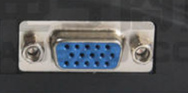
#### 硬件接口
##### 引脚说明
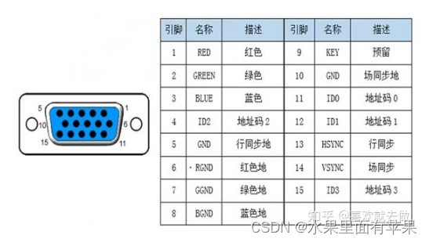
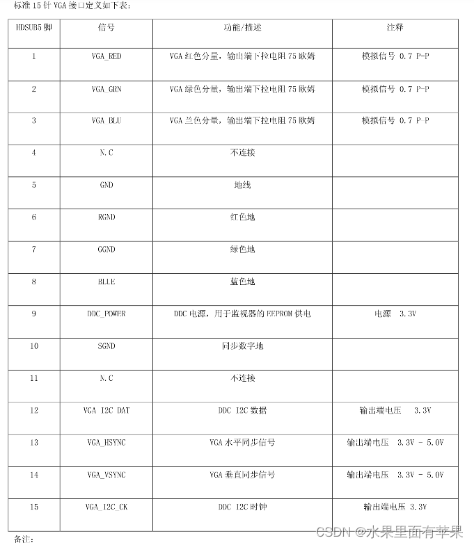
##### 时序说明
VGA显示图像使用扫描的方式，从第一行的第一个像素开始，逐渐填充，第一行第一个、第一行第二个、、、、第二行第一个、第二行第二个、、、、第n行最后一个。  
通过这种方式构成一帧完整的图像，当扫描速度足够快，加之人眼的视觉暂留特性，我们会看到一幅完整的图片，而不是一个个闪烁的像素点。这就是VGA 显示的原理。  
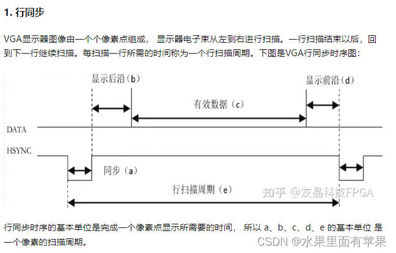
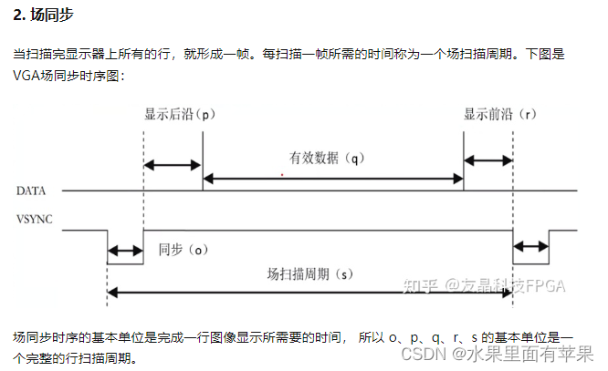
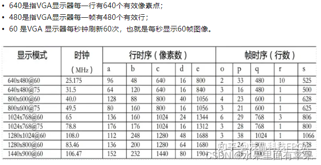

[FPGA 入门 —— VGA，主要介绍传输方式](https://blog.csdn.net/m0_59161987/article/details/130377678?ops_request_misc=%257B%2522request%255Fid%2522%253A%2522172035144316800197083450%2522%252C%2522scm%2522%253A%252220140713.130102334..%2522%257D&request_id=172035144316800197083450&biz_id=0&utm_medium=distribute.pc_search_result.none-task-blog-2~all~top_positive~default-1-130377678-null-null.142^v100^pc_search_result_base7&utm_term=vga%E5%8D%8F%E8%AE%AE&spm=1018.2226.3001.4187)  
[VGA显示图像 详细总结，主要介绍传输方式](https://blog.csdn.net/weixin_44406200/article/details/103823607?ops_request_misc=%257B%2522request%255Fid%2522%253A%2522172036195116800211548166%2522%252C%2522scm%2522%253A%252220140713.130102334.pc%255Fall.%2522%257D&request_id=172036195116800211548166&biz_id=0&utm_medium=distribute.pc_search_result.none-task-blog-2~all~first_rank_ecpm_v1~hot_rank-3-103823607-null-null.142^v100^pc_search_result_base7&utm_term=vga&spm=1018.2226.3001.4187)  
[FPGA学习——VGA显示，初步接触数据传输及FPGA的代码实现](https://blog.csdn.net/weixin_56102526/article/details/124964347?ops_request_misc=%257B%2522request%255Fid%2522%253A%2522172036195116800211548166%2522%252C%2522scm%2522%253A%252220140713.130102334.pc%255Fall.%2522%257D&request_id=172036195116800211548166&biz_id=0&utm_medium=distribute.pc_search_result.none-task-blog-2~all~first_rank_ecpm_v1~hot_rank-13-124964347-null-null.142^v100^pc_search_result_base7&utm_term=vga&spm=1018.2226.3001.4187)
### DVI
DVI（Digital Visual Interface）是一种数字视频接口，有DVI－Analog（DVI-A）、DVI-Digital（DVI-D）和DVI-Integrated（DVI-I）三种类型，其中DVI-A接口只传输模拟信号，实质就是VGA模拟传输接口规格，常用于转接显卡的DVI-I输出到VGA显示器接口，DVI-D（接口是纯数字接口，不兼容模拟信号，DVI-I接口，兼容DVI-I和DVI-D两种插头，兼容数字和模拟信号。它们的接口形状不同，如果接口不匹配就无法插入使用。    
DVI接口又分为Single Link（SL） DVI和Dual Link（DL）DVI，SL DVI传输速率只有DL DVI的一半，为165MHz/s，最大的分辨率只能支持到1920x1200@60，DL DVI可支持到2560x1600@60Hz，也可支持1920x1080@120Hz。     
SL DVI（单通道）最大带载能力为3.7 Gbit/s,DL DVI（双通道）在最大带载能力为
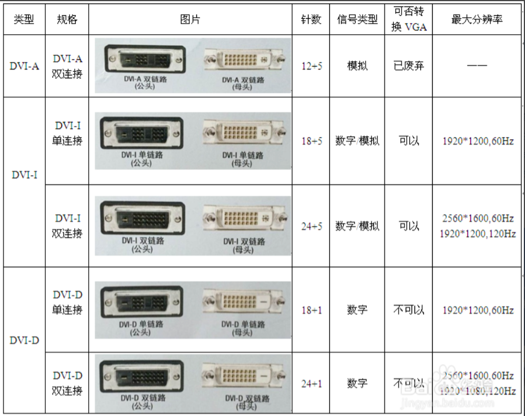
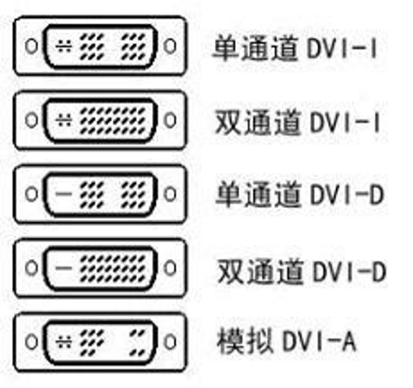

### HDMI
#### 简介
HDMI（High Definition Multimedia Interface，高清多媒体接口）是一种全数字化视频和音频发送接口，可以发送未压缩的音频及视频信号，其物理接口主要有标准HDMI接口、mini HDMI接口和Micro HDMI接口，如图所示：
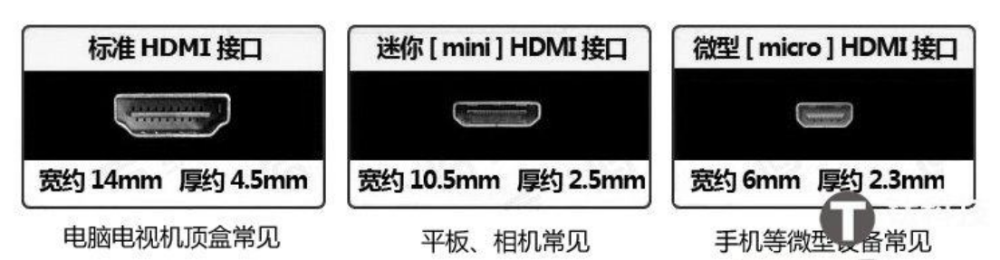

HDMI可搭配宽带数字内容保护（HDCP），以防止具有著作权的影音内容遭到未经授权的复制。HDMI所具备的额外空间可应用在日后升级的音视频格式中。而因为一个1080p的视频和一个8声道的音频信号需求少于0.5GB/s，因此HDMI还有很大余量。这允许它可以用一个电缆分别连接DVD播放器，接收器和PRR。
#### 硬件接口
[HDMI接口电路设计 哔哩哔哩](https://www.bilibili.com/video/BV1B34y157jG/?spm_id_from=333.1296.top_right_bar_window_history.content.click&vd_source=8628b70b8921792574747e076af0f11a)

##### 引脚说明
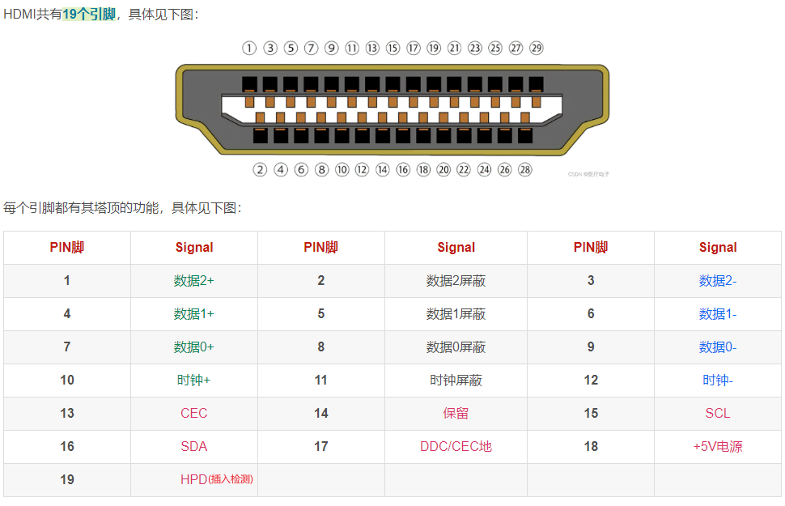
##### HDMI识别过程
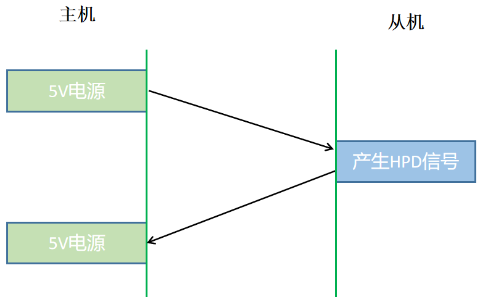

#### 关键技术
TMDS（Transition Minimized Differential Signaling）差分传输技术
TMDS（Time Minimized Differential Signal） 最小化传输差分信号

LVDS（Low-Voltage Differential Signaling）低电压差分信号

### DP
DP（DisplayPort）是一个由PC及芯片制造商联盟开发，视频电子标准协会（VESA）标准化的数字式视频接口标准。该接口免认证、免授权金，主要用于视频源与显示器等设备的连接，并也支持携带音频、USB和其他形式的数据。DP接口定义了两种接头，全尺寸（Full Size）和迷你DP（Mini），两种接头皆是20针，但迷你接头的宽度大约是全尺寸的一半。  
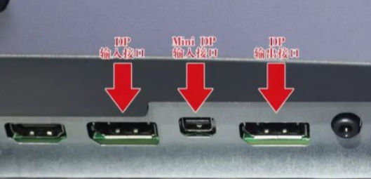
#### 硬件接口
[DP硬件接口说明](https://blog.csdn.net/she666666/article/details/138341055?spm=1001.2101.3001.6650.5&utm_medium=distribute.pc_relevant.none-task-blog-2%7Edefault%7EYuanLiJiHua%7EPosition-5-138341055-blog-123871957.235%5Ev43%5Epc_blog_bottom_relevance_base8&depth_1-utm_source=distribute.pc_relevant.none-task-blog-2%7Edefault%7EYuanLiJiHua%7EPosition-5-138341055-blog-123871957.235%5Ev43%5Epc_blog_bottom_relevance_base8&utm_relevant_index=8)
##### 引脚说明
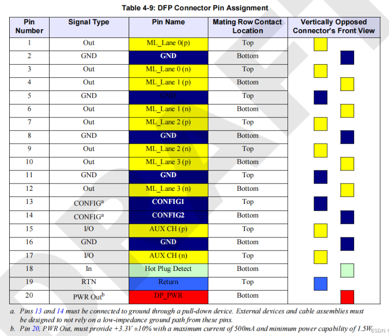
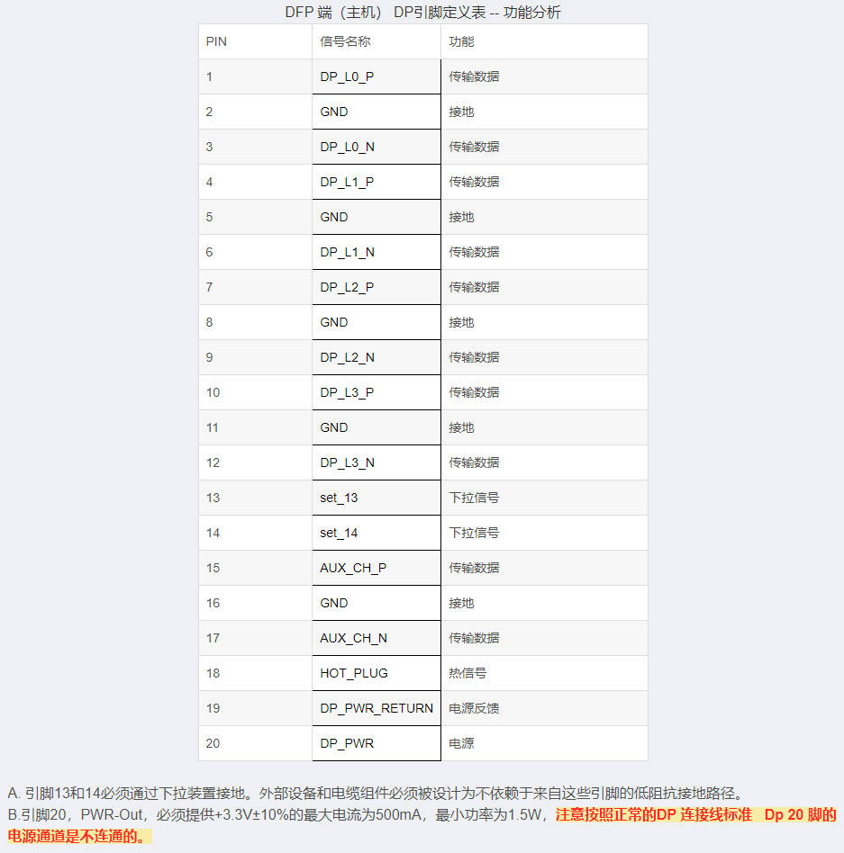

## 专业名词介绍

#### Timing（时序）
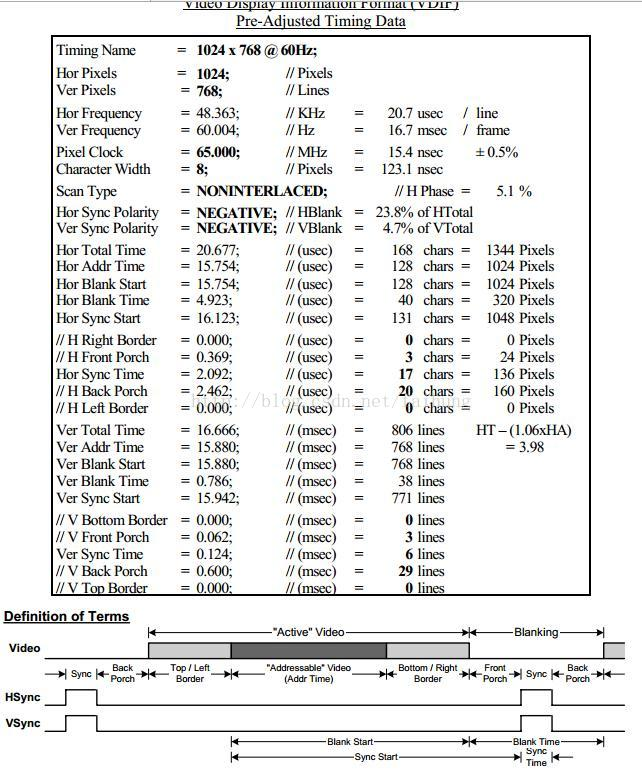

Video timing 包含两个信号：水平同步Hs（horizontal sync）和垂直同步Vs（vertical sync） 
- Vertical sync --> 用来标识什么时候开始送出一幅新画面
- Horizontal sync --> 用来标识什么时候开始新一行的图像扫描

#### Genlock

#### 色彩空间

#### 隔行i/逐行p

#### 位深&色深

#### 色域

## 眼图
[鼎阳科技 一期带你弄懂示波器眼图逻辑 哔哩哔哩](https://www.bilibili.com/video/BV1Cr4y1f7sm/?spm_id_from=333.1296.top_right_bar_window_history.content.click)