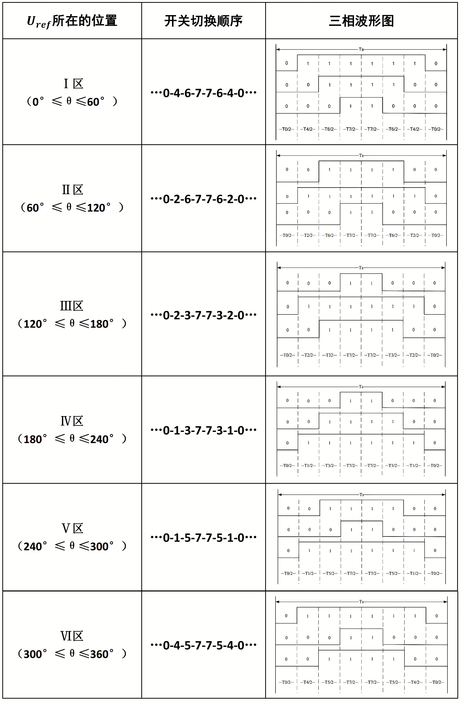

<!-- markdownlint-disable MD033 -->

# 电机控制

## 波形调制

### 调制原理

根据采样控制理论中的一个重要结论：冲量相等而形状不同的窄脉冲加在具有惯性的环节上时，其效果基本相同。冲量即指窄脉冲的面积。这里所说的效果
基本相同，是指环节的输出响应波形基本相同。即当它们分别加在具有惯性的同
一个环节上时，其输出响应基本相同。如果把各输出波形用傅立叶变换分析，则
其低频段非常接近，仅在高频段略有差异。上述原理可以称之为面积等效原理，
见图 14-4，它是 PWM 控制技术的重要理论基础。

### PWM

PWM（Pulse Width Modeulation）脉宽调制技术（DC-DC）

**占空比**
$$\delta=\frac{T_W}{T}$$

**输出有效电压**
$$U_{out}=\delta U_{in}$$

### SPWM

SPWM（Sinusoidal Pulse Width Modeulation）正弦脉宽调制技术（DC-AC），从电源的角度出发，以生成一个可调频调压的正弦波电源。

#### 原理

SPWM 波形是通过比较正弦波和三角波得到的，***正弦波*** 叫做 ***调制波***，***输出正弦波*** 叫做 ***调制波输出***，***三角波*** 叫做 ***载波***。每一正弦周期内的多个脉冲做自然或规则的宽度调制，使其依次调制出相当于正弦函数值的相位角和面积等效于正弦波的脉冲序列，形成等幅不等宽的正弦化信号输出。调制波的频率决定了输出正弦波的频率，载波的频率决定了输出正弦波的谐波含量，调制波的幅值由输出正弦波的宽度来决定。

**调制极性**  
根据调制波形极性的不同分为单极性 SPWM 和 双极性 SPWM。这两种方式的 SPWM 波形如图所示。

在单极性 SPWM 中，载波与调制波的比较是单边的，即载波在调制波上方时输出高电平，载波在调制波下方时输出低电平。  
在双极性 SPWM 中，载波与调制波的比较是双边的，即载波在调制波上方时输出低电平，载波在调制波下方时输出高电平。  
单极性SPWM的输出电压谐波含量较低，但开关频率是双极性的两倍，开关损耗较大。而双极性SPWM的开关损耗较小，但输出电压谐波含量较高。两者各有优缺点，实际应用中可根据需要选择。

**载波比 $N$**  
载波比 $N$ 是载波频率 $f_t$ 与 调制波频率 $f_s$ 之比，载波比是决定输出波形质量的一个重要参数，载波比越大，输出波形越接近正弦波，谐波含量越小，但载波频率过高会增加开关损耗，所以在实际应用中要综合考虑。一般情况下，$N$ 远远大于 1。一般推荐的载波频率范围为 1-20kHz，推荐的载波比一般在 15-21之间。载波比的本质是每个正弦周期内有多少个载波（脉冲）。  
根据载波和调制波是否同步及载波比的变化情况，PWM 调制方式分为 异步调制 和 同步调制。
$$N=\frac{f_t}{f_s}$$
**调制方式**

- 异步调制：$f_t$ 固定不变，$f_s$ 变化时，$N$ 跟随变化。当 $f_s$ 较低时，$N$ 较大，一周期内脉冲数较多，脉冲不对称产生的不利影响都较少。当 $f_s$ 增高时，$N$ 较小，一周期内的脉冲数较少，脉冲不对称的影响就变大。
- 同步调制：$f_s$ 变化时，$N$ 不变，$f_t$ 跟随变化。为使单相输出端额 SPWM 正负半轴镜像对称，𝑁应取奇数。当 $f_s$ 很低时， $f_t$ 也很低，有调制带来的谐波不易滤除，当 $f_s$ 很高时， $f_t$ 会过高，使开关器件难以承受。
- 分段同步调制：把 $f_s$ 的频率范围内划分为若干个频段，每个频段内保持载波比 $𝑁$ 恒定，不同频段的载波比𝑁不同。在 $f_s$ 较高的频段使用较低的载波比𝑁使载波频率不至于过高，在 $f_s$ 较低的频段采用较高的载波比，是载波频率不至于过低。可在低频输出时采用异步调制方式，高频输出时切换到同步调制方式，这样把两者的有点结合起来，和分段同步方式效果接近。

**幅值调制比 $R$**  
调制比 $R$ 是正弦输出波峰值电压幅值 $V_s$ 与三角载波电压幅值 $V_t$ 之比，调制比是决定输出电压幅值的一个重要参数，调制比越大，输出电压幅值越大，反之亦然。。一般情况下 $0 < R < 1$，如果 $R > 1$，那就是过调制。

$$R =\frac{V_s}{V_t}$$

#### 实现方法

算法的实现方法有很多种，比如有计算法、调制法、跟踪法等。其中调制法包括自然采样法、规则采样法（对称规则采样法、不对称规则采样法）；跟踪法包括锁相跟踪法、锁频跟踪法等。

常用的就是对称规则采样或者是不对称规则采样。因为这两种方式可以使用微机编程实现，控制电路简单，计算量少，相较其他方法更加灵活。

- 计算法

根据给出的正弦波的输出频率、幅值和半个周期内的脉冲数，PWM 波形中各脉冲的宽度和时间间隔可以准确的计算出来，按照计算结果控制电路中各个开关器件的通断，就可以得到需要的 SPWM 波形。这种方法称为计算法，可以看出，计算法是很繁琐的，当需要输出的正弦波的频率、幅值或者相位变化时，计算结果都要变化。

- 调制法

调制法是把正弦波作为调制信号，把接受调制的信号作为载波，通过信号波调制得到所期望的 PWM 波形。通常采用三角波或锯齿波作为载波，其中三角波用的最多，因为三角波上任一点的水平宽度和高度成线性关系且左右对称，当它与任何一个平缓变化的调制信号相交时，如果在交点时刻对开关器件的通断进行控制，就可以得到宽度正比于信号波幅值的脉冲，这正好符合 PWM 控制的要求。实际应用中可以使用模拟电路构成三角载波和正弦调制波发生电路，用比较器来确定他们的交点，在交点时刻对开关器件进行控制通断，从而生成 SPWM 波形。虽然可以使用模拟电路实现，但是目前应用更多的是通过软件来生成 SPWM波形。

- 跟踪控制法
将实际的电压或者电流波形作为反馈信号，通过比较输出的实际信号与指令信号之间的差值，决定开关器件的通断，使实际输出跟踪指令信号变化。常用的方法有滞环比较法和三角波比较法。
  
  - 滞环比较法
滞环比较法是将实际输出信号与指令信号进行比较，当实际输出信号低于指令信号时，开关器件导通，当实际输出信号高于指令信号时，开关器件断开，这样实际输出信号就会围绕指令信号上下波动，形成一个近似的正弦波形。滞环比较法的优点是控制简单，响应快，缺点是输出波形的质量较差，谐波含量较高。
  
  - 锁相跟踪法
锁相跟踪法是将实际输出信号与指令信号进行比较，通过调整开关器件的通断时间，使实际输出信号与指令信号的相位保持一致，从而实现跟踪控制。锁相跟踪法的优点是输出波形质量较好，谐波含量较低，缺点是控制复杂，响应较慢。
  
  - 三角波比较法
三角波比较法是将实际输出信号与一个高频三角波进行比较，当实际输出信号高于三角波时，开关器件导通，当实际输出信号低于三角波时，开关器件断开，这样实际输出信号就会围绕指令信号上下波动，形成一个近似的正弦波形。三角波比较法的优点是控制简单，响应快，输出波形质量较好，谐波含量较低。
  
  - 锁频跟踪法
锁频跟踪法是将实际输出信号与指令信号进行比较，通过调整开关器件的通断频率，使实际输出信号的频率与指令信号的频率保持一致，从而实现跟踪控制。锁频跟踪法的优点是输出波形质量较好，谐波含量较低，缺点是控制复杂，响应较慢。

### 自然采样法

在正弦波和三角波的**每个自然自然交点时刻切换一次功率开关器件的通断**，SPWM 波形很接近正弦波，解方程复杂。

#### 规则采样法

使用规则采样的方法实现 SPWM 输出是属于异步调制，调制波形频率改变的时候，载波频率是不变的，当调制频率越高，载波比就越低，正弦波的平滑度就越差。

#### 对称规则采样法

过三角波的对称轴与正弦波的交点，做平行 x 轴的直线，该平行线与三角波的两个交点作为开关器件的通断时刻。因为这两个交点是对称的，所以称为规则采样法。这种方法实际使用一个阶梯波逼近正弦波，由于在每个载波周期当中只采样一次，因此计算得到简化。由于每个载波周期只采样一次，因此形成的阶梯波与正弦波的逼近程序仍存在较大误差。

在底点对称轴对正弦波采样，采样值作为载波交点控制开关器件的通断。三角波的幅值就是 $𝑈_𝑇$，正弦波的幅值就是 $𝑈_𝑆$，将三角波和正弦波向上平移 1 个单位，使其在时间轴上方，根据相似三角形原理，可得如下关系式。

$$\frac{1+asin(\omega t_D)}{\delta / 2}=\frac{2}{T_C/2}$$

其中:  

- 调制比：$a=\frac{U_S}{U_T}$,
- $\omega$ 为正弦波频率,
- $t_D$ 就是载波的采样时刻,
- $\delta/2$ 为脉宽的一半，
- $T_C$ 是一个载波周期。

该式基于双极性调整法，$U_T$是单位电压 1V ，$a$ 是正弦波电压峰值，由于三角波没有负值，所以将三角波和正弦波都向上平移 1 个单位，所以 $1+asin(\omega t_D)$ 是平移后的正弦波在采样时刻的瞬时值，即交点。右边分子 2 是三角波平移后的峰值，左边分母是应输出的脉宽，右边分母是三角波周期。  

如果 $N=\frac{f_t}{f_s}$，那么 ***导通时长*** 计算如下：
$$\delta = \frac{T_C(1+asin(\omega t_D)}{2}$$

其中:

- 调制比：$a=\frac{U_S}{U_T}$, $\omega t_D=\frac{2k\pi}{N}$，
- $k$ 为一个正弦波周期内的采样计数值，得到的 $\delta$ 就是开关时长。

在 $wt_D = \frac{2k\pi}{N}$ 公式中，$N$ 是载波比，即每个正弦波周期内的载波数，$\frac{2\pi}{N}$ 是每个载波周期的时间，$k$ 是采样计数值，$k$ 的范围是 $0 \sim N-1$，所以 $wt_D$ 是每个采样点的正弦波角度值，且 $wt_D$ 的范围是 $0 \sim 2\pi$。

#### 不对称规则采样法

每个载波周期采样两次，在三角波的顶点对称轴或者底点对称轴都采样一次，这样所形成的阶梯波与正弦波的逼近程度会大大提高。这种采样所形成的阶梯波与三角波的交点并不对称，因此称为不对称规则采样。

$$
t_{on} = \begin{cases}
\frac{T_c}{4} \left( 1 + a \sin \frac{k\pi}{N} \right), & (k = 0,2,4,...,2N-2) \\
\frac{T_c}{4} \left( 1 + a \sin \frac{k\pi}{N} \right), & (k = 1,3,5,...,2N-1)
\end{cases}
$$

𝑘为偶数和奇数时的顶点和底点采样。$\delta_1 + \delta_2$ 即为一个完整的开关周期（正弦波脉宽）。

## 电机模型

## 位置获取

### 传感器类型

- 霍尔传感器

霍尔传感器是利用霍尔效应来检测磁场变化的传感器。霍尔效应是指当电流通过导体时，如果导体处于磁场中，导体内会产生一个与电流方向和磁场方向垂直的电压，这个电压称为霍尔电压。霍尔传感器通常由一个霍尔元件和一些辅助电路组成，当霍尔元件处于磁场中时，霍尔电压会随着磁场强度的变化而变化，通过测量霍尔电压的变化，可以检测到磁场的变化，从而实现位置检测。

- 磁编码器

磁编码器是一种利用磁场变化来检测位置的传感器。磁编码器通常由一个磁铁和一个磁敏元件组成，当磁铁旋转时，磁敏元件会检测到磁场的变化，通过测量磁场的变化，可以检测到磁铁的位置，从而实现位置检测。磁编码器可以分为增量式和绝对式两种类型，增量式磁编码器只能检测相对位置，而绝对式磁编码器可以检测绝对位置。

- 光电传感器

光电传感器是利用光电效应来检测位置变化的传感器。光电效应是指当光照射到某些材料上时，会产生电子和空穴，从而产生电流。光电传感器通常由一个光源、一个光敏元件和一些辅助电路组成，当光源发出的光照射到光敏元件上时，光敏元件会产生电流，通过测量电流的变化，可以检测到位置的变化，从而实现位置检测。

- 磁阻传感器

磁阻传感器是利用磁阻效应来检测磁场变化的传感器。磁阻效应是指当导体处于磁场中时，导体的电阻会随着磁场强度的变化而变化。磁阻传感器通常由一个磁阻元件和一些辅助电路组成，当磁阻元件处于磁场中时，电阻会随着磁场强度的变化而变化，通过测量电阻的变化，可以检测到磁场的变化，从而实现位置检测。

- 旋转变压器

旋转变压器是一种电磁感应式传感器，主要用于检测旋转位置和角度。它由一个定子和一个转子组成，定子上有多个线圈，转子上有一个铁芯。当转子旋转时，铁芯会切割定子上的磁力线，从而在定子线圈中产生感应电动势。通过测量感应电动势的变化，可以检测到转子的旋转位置和角度，从而实现位置检测。

### 霍尔传感器

霍尔传感器是利用霍尔效应来检测磁场变化的传感器。霍尔效应是指当电流通过导体时，如果导体处于磁场中，导体内会产生一个与电流方向和磁场方向垂直的电压，这个电压称为霍尔电压。霍尔传感器通常由一个霍尔元件和一些辅助电路组成，当霍尔元件处于磁场中时，霍尔电压会随着磁场强度的变化而变化，通过测量霍尔电压的变化，可以检测到磁场的变化，从而实现位置检测。

- 霍尔传感器原理

- 霍尔传感器电机示意图

- 霍尔传感器安装位置图

- 霍尔传感器旋转信号

### 磁编码器

磁编码器是一种利用磁场变化来检测位置的传感器。磁编码器通常由一个磁铁和一个磁敏元件组成，当磁铁旋转时，磁敏元件会检测到磁场的变化，通过测量磁场的变化，可以检测到磁铁的位置，从而实现位置检测。磁编码器可以分为增量式和绝对式两种类型，增量式磁编码器只能检测相对位置，而绝对式磁编码器可以检测绝对位置。

### 旋转变压器

旋转变压器是一种电磁感应式传感器，主要用于检测旋转位置和角度。它由一个定子和一个转子组成，定子上有多个线圈，转子上有一个铁芯。当转子旋转时，铁芯会切割定子上的磁力线，从而在定子线圈中产生感应电动势。通过测量感应电动势的变化，可以检测到转子的旋转位置和角度，从而实现位置检测。

## BLDC

六步换向线圈导通状态

六步换向正反转控制

六步换向MOS状态

## FOC

### 旋转电流合成

三相对称电流：

$$
\begin{cases}
i_a(t) = I_m*cos(\omega t) \\
i_b(t) = I_m*cos(\omega t - \frac{2\pi}{3}) \\
i_c(t) = I_m*cos(\omega t + \frac{2\pi}{3})
\end{cases}
$$

这里的 $\omega t$ 可以理解为每个线圈的电流矢量相比于初相矢量旋转过的角度，后面的 $x$ 分别表示每个线圈的电流矢量相对于 $0°$ 的初相角。$I_mcos(\omega t +x)$ 是电流矢量在旋转过程中投影到对应轴上的瞬时值。

合成电流矢量：

$$
\begin{aligned}
I_{vr}=&i_a(t)*e^{j0}+i_b(t)*e^{j(\frac{2\pi}{3})}+i_c(t)*e^{j(-\frac{2\pi}{3})}\\
=&\frac{3}{2}*I_m*e^{j(\omega t+\frac{\pi}{2})}
\end{aligned}
$$

由上式可见在空间呈 $\frac{2\pi}{3}$ 分布的三相定子绕组上加载三相对称电流，合成电流 $I_{vr}$ 是一个幅值为 $1.5$ 倍 $I_m$，并以角速度 $\omega$ 旋转的合成电流矢量。后面的 $e^{j(\omega t+\frac{\pi}{2})}$ 表示该合成电流矢量的初相角是 $\frac{\pi}{2}$。

### 坐标变换

#### Clark和反Clark变换

**Clark变换**  
将 $ABC$ 三相静止坐标系 变换到 $\alpha\beta$ 两相静止坐标系。
$$
\begin{bmatrix} f_{\alpha} \\ f_{\beta} \\ f_{0} \end{bmatrix} = \frac{2}{3} \begin{bmatrix} 1 & -\frac{1}{2} & -\frac{1}{2} \\ 0 & \frac{\sqrt{3}}{2} & -\frac{\sqrt{3}}{2} \\ \frac{\sqrt{2}}{2} & \frac{\sqrt{2}}{2} & \frac{\sqrt{2}}{2} \end{bmatrix} \begin{bmatrix} f_{A} \\ f_{B} \\ f_{C} \end{bmatrix}
$$

**反Clark变换**  
将 $\alpha\beta$ 两相静止坐标系 变换到 $ABC$ 三相静止坐标系。

$$
\begin{bmatrix} f_A \\ f_B \\ f_C \end{bmatrix} =
\begin{bmatrix} 1 & 0 & \frac{\sqrt{2}}{2} \\ -\frac{1}{2} & \frac{\sqrt{3}}{2} & \frac{\sqrt{2}}{2} \\ -\frac{1}{2} & -\frac{\sqrt{3}}{2} & \frac{\sqrt{2}}{2} \end{bmatrix} \begin{bmatrix} f_\alpha \\ f_\beta \\ f_0 \end{bmatrix}
$$

这里的Clark变换和反Clark变换是等幅值的变换，系数是 $\frac{2}{3}$ ,变换前后信号的幅值不变。另外，等幅值的Clark变换和反Clark变换中，$f_0$ 分量是多余的，可以忽略。  
而等功率的Clark变换和反Clark变换中，系数是 $\sqrt{\frac{2}{3}}$ ,变换前后信号的功率不变。

#### Park和反Park变换

**Park变换**  
将 $\alpha\beta$ 两相静止坐标系 变换到 $dq$ 两相旋转坐标系。
$$
\left[ \begin{matrix} f_d \\ f_q \end{matrix} \right] = \left[ \begin{matrix} \cos\theta_e & \sin\theta_e \\ -\sin\theta_e & \cos\theta_e \end{matrix} \right] \left[ \begin{matrix} f_\alpha \\ f_\beta \end{matrix} \right]
$$

**反Park变换**  
将 $dq$ 两相旋转坐标系 变换到 $\alpha\beta$ 两相静止坐标系。
$$
\begin{cases}
f_\alpha = f_d \cos \theta_e - f_q \sin \theta_e \\
f_\beta = f_d \sin \theta_e + f_q \cos \theta_e
\end{cases}
$$

### FOC原理

**实现**  

- 将 $dq$ 坐标系的d轴定向到转子永磁体的 $N$ 极，则 $dq$ 坐标系将随转子以角速度 $ω_e$ 旋转。
- 通过测量或观测获取转子永磁体位置 $\theta_e$，基于 $\theta_e$ 的坐标转换可建立 $dq - \alpha\beta - ABC$ 坐标系之间的等价关系。
- 两相旋转定子绕组上加载两相直流电流：

$$
\begin{cases}
i_d(t)=0 \\
i_q(t)=I_{\mathrm{ref}}
\end{cases}
$$

$$
I_v
= i_d(t)\,e^{j0} + i_q(t)\,e^{j\left(\frac{\pi}{2}\right)}
= I_{\mathrm{ref}}\,e^{j\left(\frac{\pi}{2}\right)}
$$

$$
I_{vr}
= I_v\,e^{j\omega_e t}
= I_{\mathrm{ref}}\,e^{j\left(\frac{\pi}{2}\right)} e^{j\omega_e t}
= I_{\mathrm{ref}}\,e^{j\left(\omega_e t + \frac{\pi}{2}\right)}
$$

$𝑰_{𝒗𝒓}$ 是一个幅值 $𝑰_{𝒓𝒆𝒇}$，始终超前 $d$ 轴（转子磁场）$\frac{\pi}{2}$，且以角速度𝜔𝑒旋转的合成电流矢量。

**总结**  

- 基于感知转子位置 $\theta_e$，通过 $I_d = 0, I_q = I_{ref}$ 控制策略，实现了定子磁场 紧紧跟随 转子磁场并时刻超前 $\frac{\pi}{2}$（最大力矩且稳定运行），这就是FOC磁场定向控制。

**一句话**  

- 磁场定向控制实现了转矩角的最佳控制。

### SVPWM

SVPWM(Space Vector Pulse Width Modulation)，将逆变系统和异步电机看作一个整体来考虑，以三相对称正弦波电压供电时三相对称电动机定子理想磁链圆为参考标准，以三相逆变器不同开关模式作适当的切换，从而形成 PWM波，以所形成的实际磁链矢量来追踪其准确磁链圆。

#### 三相逆变电路

当 $S_a S_b S_c = 100$ :

相电压
$$\begin{cases}
U_{AN} = U_{dc}*\frac{Z}{Z+\frac{Z}{2}}=U_{dc}*\frac{Z}{\frac{3}{2}Z}=\frac{2}{3}U_{dc} \\
U_{BN} = -\frac{1}{3}U_{dc} \\
U_{CN} = -\frac{1}{3}U_{dc}
\end{cases}$$

线电压
$$\begin{cases}
U_{AB} = U_{AN}-U_{BN}= \frac{2}{3}U_{dc}+\frac{1}{3}U_{dc}=U_{dc}\\
U_{BC} = U_{BN}-U_{CN}= -\frac{1}{3}U_{dc}+\frac{1}{3}U_{dc}=0\\
U_{CA} = U_{CN}-U_{AN}= -\frac{1}{3}U_{dc}-\frac{2}{3}U_{dc}=-U_{dc}\\
\end{cases}$$

合成矢量
$$\begin{aligned}
U_1=&\frac{2}{3}(U_{AN}*e^{j0}+U_{BN}*e^{j^{(\frac{2\pi}{3})}}+U_{CN}*e^{j^{(-\frac{2\pi}{3})}}) \\
=&\frac{2}{3}\{\frac{2}{3}U_{dc}-\frac{1}{3}U_{dc}*[cos(\frac{2\pi}{3})+jsin(\frac{2\pi}{3})]-\frac{1}{3}U_{dc}*[cos(-\frac{2\pi}{3})+jsin(-\frac{2\pi}{3})]\}\\
=&\frac{2}{3}\{\frac{2}{3}U_{dc}-\frac{1}{3}U_{dc}*[-\frac{1}{2}+j(\frac{3}{2})]-\frac{1}{3}U_{dc}*[-\frac{1}{2}+j(-\frac{3}{2})]\}\\
=&\frac{2}{3}(\frac{2}{3}U_{dc}+\frac{1}{3}U_{dc})\\
=&\frac{2}{3}U_{dc}
\end{aligned}
$$

电压矢量

平面扇区划分

#### 六边形磁场

##### 电压空间矢量和磁链的关系

$$\psi_{vr}=\psi_m*e^{j\omega t}$$

单向线圈电压 $U_{vr}=R_s*I_{vr}+\frac{d\psi_{vr}}{dt}$，由于 $R_s$ 很小，可以忽略不计，所以 $U_{vr}=\frac{d\psi_{vr}}{dt}$，则有：$U_{vr}\approx\frac{d\psi_{vr}}{dt}$。因此得到：
$$\Delta \psi_{vr} \approx U_{vr}*\Delta t$$

##### 六边形磁场的由来

- 将 $U_1 \sim U_6$ 按 $\Delta t$ 间隔时间依次加载到绕组，产生 6 个磁链增量 $(\Delta \psi_1 \sim \Delta \psi_6)$，幅值相等、相位依次相差 $\frac{\pi}{6}$ ，首尾连接形成正六边形合成磁链。
- 虽然正六边形磁场不是我们期望的圆形磁场，在旋转过程中，磁链矢量的幅值不恒定！

##### 合成近似圆形磁场

单个电压空间矢量作用时间太长了，导致磁链矢量幅值变化过大，无法近似圆形磁场，只能形成六边形磁场。将每个电压空间矢量作用时间缩短，通过多个电压空间矢量的叠加，更高频施加作用，形成近似圆形磁场。

- 磁链增量等效
  - $V_{ref} * T_s = U_1 * T_1 + U_2 * T_2; \quad T_s: PWM\text{周期}$

  - 基于磁链增量等效，用两个相邻基础电压空间矢量合成更多的矢量 $V_{ref}$ ，从而近似构建圆形旋转磁场。

注意:

- $𝑉_{ref}$ 是一个期望的、旋转的合成电压矢量。
- $𝑇_s$（作用时间）时间越短（频率越高），磁场越来越圆。

##### 电压空间矢量作用时间计算

基于合成矢量 $𝑉_{ref}$ 计算作用时间，期望合成的电压空间矢量 $𝑉_{ref}$ 用幅值、相位表示如图所示。

$$\begin{cases}
L1 = V_{ref} * T_s * \sin(\frac{\pi}{3} - \theta)\\
|U1| = \frac{2}{3} U_{dc}\\
|U1| * T1 = \frac{L1}{\sin(\frac{\pi}{3})} = \frac{L1}{\frac{\sqrt{3}}{2}} \xrightarrow[\text{整理}]{} T1= \frac{L1}{\frac{\sqrt{3}}{2}} * \frac{1}{|U1|} \xrightarrow[\text{代入} U1, L1]{} T1 = \frac{V_{ref} * T_s * \sin(\frac{\pi}{3} - \theta)}{\frac{\sqrt{3}}{2}} * \frac{1}{\frac{2}{3} U_{dc}} = \frac{\sqrt{3} * V_{ref} * T_s * \sin(\frac{\pi}{3} - \theta)}{U_{dc}}
\end{cases}$$

$$\begin{cases}
L2 = V_{ref} * T_s * \sin\theta\\
|U2| = \frac{2}{3} U_{dc}\\
\|U2| * T2 = \frac{L2}{\sin(\frac{\pi}{3})} = \frac{L2}{\frac{\sqrt{3}}{2}} \xrightarrow[\text{整理}]{} T2= \frac{L2}{\frac{\sqrt{3}}{2}} \cdot \frac{1}{|U2|}  \xrightarrow[\text{代入} U2, L2]{} T2 = \frac{V_{ref} * T_s * \sin\theta}{\frac{\sqrt{3}}{2}} * \frac{1}{\frac{2}{3} U_{dc}} = \frac{\sqrt{3} * V_{ref} * T_s * \sin\theta}{U_{dc}}
\end{cases}$$

基于 $\alpha \beta$ 坐标系计算作用时间，期望合成的电压空间矢量 $V_{ref}$ 用 $U_\alpha$、$U_\beta$ 表示:

$$
\begin{cases}U_\alpha*T_s=\left|V_{ref}\right|*cos\theta*T_s=|U1|*T1+|U2|*T2*\cos(\frac\pi3)\\U_\beta*T_s=\left|V_{ref}\right|*sin\theta*T_S=|U2|*T2*\sin(\frac\pi3)\\|U1|=|U2|=\frac23U_{dc}\end{cases}
$$

$$
U_\beta*T_s=\frac23U_{dc}*T2*\frac{\sqrt3}2=\frac{\sqrt3}3*U_{dc}*T2\to T2=\frac{\sqrt3*U_{\beta}*T_s}{U_{dc}}
$$

$$
\begin{aligned}&U_{\alpha}*T_{s}=\frac{2}{3}U_{dc}*T1+\frac{2}{3}U_{dc}*\frac{\sqrt{3}*U_{\beta}*T_{s}}{U_{dc}}*\frac{1}{2}=\frac{2}{3}U_{dc}*T1+\frac{\sqrt{3}*U_{\beta}*T_{s}}{3}\to\boldsymbol{T}\mathbf{1}=\frac{U_{\alpha}*T_{s}-\frac{\sqrt{3}*U_{\beta}*T_{s}}{3}}{\frac{2}{3}U_{dc}}\\&=\frac{3*U_{\alpha}*T_{s}-\sqrt{3}*U_{\beta}*T_{s}}{3}*\frac{3}{2U_{dc}}=\frac{3*U_{\alpha}*T_{s}-\sqrt{3}*U_{\beta}*T_{s}}{2U_{dc}}=\frac{\sqrt{3}T_{s}}{U_{dc}}(\frac{\sqrt{3}}{2U_{dc}}-\frac{1}{2}U_{\beta})\end{aligned}
$$

##### 内切圆、正六边形边界

##### 合成矢量幅值范围

##### PWM发波

**三相电压理想波形**

**8种组合下的空间电压矢量**

**电压空间矢量图**

## V/f控制

针对异步电机，为了保证电机磁通和出力不变（转矩不变） ，电机改变频率时，需维持电压V 和频率F 的比率近似不变，所以这种方式称为恒压频比（$V/f$）控制。$V/f$ 控制－控制简单,通用性强,经济性好,用于速度精度要求不十分严格或负载变动较小的场合。从本质上讲，$V/f$ 控制实际上控制的是三相交流电的电压大小和频率大小，然而交流电有三要素，就是除了电压大小和频率之外，还存在相位。$V/f$ 控制没有对电压的相位进行控制，这就导致在瞬态变化过程中， 例如突加负载的时候， 电机转速受冲击会变慢， 但是电机供电频率也就是同步速还是保持不变， 这样异步电机会产生瞬时失步， 从而引起转矩和转速振荡， 经过一段时间后在一个更大转差下保持平衡。这个瞬时过程中没有对相位进行控制， 所以恢复过程较慢，而且电机转速会随负载变化，这就是所谓 $V/f$ 控制精度不高和响应较慢的原因。

## I/f控制

## 无传感器控制

无传感器控制是指在电机控制中不使用任何传感器来获取电机的位置信息，而是通过估算或计算来实现控制的一种方法。无传感器控制的优点是可以降低系统成本和复杂性，但缺点是对电机参数的要求较高，且在某些情况下可能无法实现精确控制。

### 反电动势法

反电动势法是利用电机在运行过程中产生的反电动势来估算电机位置的一种方法。反电动势是指当电机转子旋转时，定子绕组中会产生一个与转子速度成正比的电压，这个电压称为反电动势。通过测量反电动势的变化，可以估算出电机的位置，从而实现控制。

### 滑模观测器

滑模观测器是一种基于滑模控制理论的状态观测器，主要用于估算电机的状态变量，如位置、速度和电流等。滑模观测器通过设计一个滑模面，使系统状态在该面上滑动，从而实现对系统状态的估算。滑模观测器具有较强的鲁棒性和抗干扰能力，适用于无传感器控制中的状态估算。

### 扩展卡尔曼滤波器

扩展卡尔曼滤波器（Extended Kalman Filter, EKF）是一种非线性状态估计方法，主要用于估算电机的状态变量，如位置、速度和电流等。EKF通过对系统的非线性模型进行线性化处理，结合测量数据和系统动态方程，实现对系统状态的估算。EKF具有较高的估算精度和适应性，适用于无传感器控制中的状态估算。

## 参考资料

[彻底吃透SVPWM如此简单 - 知乎 (zhihu.com)](https://zhuanlan.zhihu.com/p/414721065)
