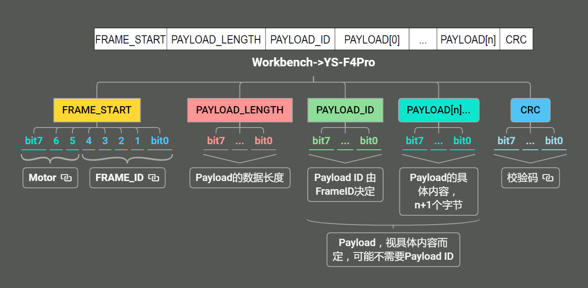
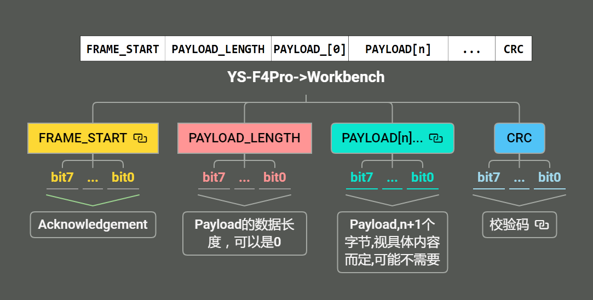

# MC_SDK

## 通讯协议

### 物理层

### 通讯协议帧（请求：主->从）

#### 请求帧格式

#### FRAME_START（请求）

**MOTOR**（bit7-5）：标识这一帧的控制对象是哪个电机

| 取值 | 描述 |
|-------|-------------|
| 000   | 上一次所选的电机 |
| 001   | Motor1    |
| 010   | Motor2    |
| 111   | None    |

**FRAME_ID** （bit4-0）：标识这一帧的作用

| FRAME_ID | 名称 | Description |
|------|-------|-------------|
| 0x01 | MC_PROTOCOL_CODE_SET_REG          | 设置寄存器的值 |
| 0x02 | MC_PROTOCOL_CODE_GET_REG          | 获取寄存器的值 |
| 0x03 | MC_PROTOCOL_CODE_EXECUTE_CMD      | 控制功能指令 |
| 0x04 | MC_PROTOCOL_CODE_STORE_TOADDR     | 按地址存储数据 |
| 0x05 | MC_PROTOCOL_CODE_LOAD_FROMADDR    | 按地址读取数据 |
| 0x06 | MC_PROTOCOL_CODE_GET_BOARD_INFO   | 获取板子的信息 |
| 0x07 | MC_PROTOCOL_CODE_SET_SPEED_RAMP   | 设置速度 Ramp |
| 0x08 | MC_PROTOCOL_CODE_GET_REVUP_DATA   | 获取无感模式的开环启动参数 |
| 0x09 | MC_PROTOCOL_CODE_SET_REVUP_DATA   | 设置无感模式的开环启动参数 |
| 0x0A | MC_PROTOCOL_CODE_SET_CURRENT_REF  | 设置电流目标值 |
| 0x0B | MC_PROTOCOL_CODE_GET_MP_INFO      | 设置电流目标值 |
| 0x0C | MC_PROTOCOL_CODE_GET_FW_VERSION   | 获取固件库版本号 |
| 0x0D | MC_PROTOCOL_CODE_SET_TORQUE_RAMP  | 设置扭矩 Ramp |
| 0x12 | MC_PROTOCOL_CODE_SET_POSITION_CMD | 设置位置模式 |

#### PAYLOAD_LENGTH（请求）

Payload Length 是 Payload 关键数据段长度

#### PAYLOAD（请求）

PAYLOAD_ID：当 FRAME_ID 不同时 PAYLOAD_ID 代表不同含义。

当 FRAME_ID 是 MC_PROTOCOL_CODE_SET_REG(设置寄存器的值) 或 MC_PROTOCOL_CODE_GET_REG(获取寄存器的值) 时，PAYLOAD_ID 就是寄存器ID，PAYLOAD[n]就是要写的值，读无PAYLOAD[n]。具体的寄存器列表如下：

| 寄存器ID | 寄存器名称 | 作用 |
|:-------:|-----------|------|
| 0x00 | MC_PROTOCOL_REG_TARGET_MOTOR | 目标电机选择 |
| 0x01 | MC_PROTOCOL_REG_FLAGS | 标志位 |
| 0x02 | MC_PROTOCOL_REG_STATUS | 系统状态 |
| 0x03 | MC_PROTOCOL_REG_CONTROL_MODE | 控制模式 |
| 0x04 | MC_PROTOCOL_REG_SPEED_REF | 速度参考值 |
| 0x05 | MC_PROTOCOL_REG_SPEED_KP | 速度环比例增益 |
| 0x06 | MC_PROTOCOL_REG_SPEED_KI | 速度环积分增益 |
| 0x07 | MC_PROTOCOL_REG_SPEED_KD | 速度环微分增益 |
| 0x08 | MC_PROTOCOL_REG_TORQUE_REF | 转矩参考值 |
| 0x09 | MC_PROTOCOL_REG_TORQUE_KP | 转矩环比例增益 |
| 0x0A | MC_PROTOCOL_REG_TORQUE_KI | 转矩环积分增益 |
| 0x0B | MC_PROTOCOL_REG_TORQUE_KD | 转矩环微分增益 |
| 0x0C | MC_PROTOCOL_REG_FLUX_REF | 磁链参考值 |
| 0x0D | MC_PROTOCOL_REG_FLUX_KP | 磁链环比例增益 |
| 0x0E | MC_PROTOCOL_REG_FLUX_KI | 磁链环积分增益 |
| 0x0F | MC_PROTOCOL_REG_FLUX_KD | 磁链环微分增益 |
| 0x10 | MC_PROTOCOL_REG_OBSERVER_C1 | 观测器参数C1 |
| 0x11 | MC_PROTOCOL_REG_OBSERVER_C2 | 观测器参数C2 |
| 0x12 | MC_PROTOCOL_REG_OBSERVER_CR_C1 | 电流重构观测器参数C1 |
| 0x13 | MC_PROTOCOL_REG_OBSERVER_CR_C2 | 电流重构观测器参数C2 |
| 0x14 | MC_PROTOCOL_REG_PLL_KI | PLL积分增益 |
| 0x15 | MC_PROTOCOL_REG_PLL_KP | PLL比例增益 |
| 0x16 | MC_PROTOCOL_REG_FLUXWK_KP | 磁链弱化比例增益 |
| 0x17 | MC_PROTOCOL_REG_FLUXWK_KI | 磁链弱化积分增益 |
| 0x18 | MC_PROTOCOL_REG_FLUXWK_BUS | 磁链弱化总线电压 |
| 0x19 | MC_PROTOCOL_REG_BUS_VOLTAGE | 总线电压 |
| 0x1A | MC_PROTOCOL_REG_HEATS_TEMP | 散热器温度 |
| 0x1B | MC_PROTOCOL_REG_MOTOR_POWER | 电机功率 |
| 0x1C | MC_PROTOCOL_REG_DAC_OUT1 | DAC输出1 |
| 0x1D | MC_PROTOCOL_REG_DAC_OUT2 | DAC输出2 |
| 0x1E | MC_PROTOCOL_REG_SPEED_MEAS | 测量速度 |
| 0x1F | MC_PROTOCOL_REG_TORQUE_MEAS | 测量转矩 |
| 0x20 | MC_PROTOCOL_REG_FLUX_MEAS | 测量磁链 |
| 0x21 | MC_PROTOCOL_REG_FLUXWK_BUS_MEAS | 测量磁链弱化总线电压 |
| 0x22 | MC_PROTOCOL_REG_RUC_STAGE_NBR | RUC阶段编号 |
| 0x23 | MC_PROTOCOL_REG_I_A | A相电流 |
| 0x24 | MC_PROTOCOL_REG_I_B | B相电流 |
| 0x25 | MC_PROTOCOL_REG_I_ALPHA | α轴电流 |
| 0x26 | MC_PROTOCOL_REG_I_BETA | β轴电流 |
| 0x27 | MC_PROTOCOL_REG_I_Q | Q轴电流 |
| 0x28 | MC_PROTOCOL_REG_I_D | D轴电流 |
| 0x29 | MC_PROTOCOL_REG_I_Q_REF | Q轴电流参考值 |
| 0x2A | MC_PROTOCOL_REG_I_D_REF | D轴电流参考值 |
| 0x2B | MC_PROTOCOL_REG_V_Q | Q轴电压 |
| 0x2C | MC_PROTOCOL_REG_V_D | D轴电压 |
| 0x2D | MC_PROTOCOL_REG_V_ALPHA | α轴电压 |
| 0x2E | MC_PROTOCOL_REG_V_BETA | β轴电压 |
| 0x2F | MC_PROTOCOL_REG_MEAS_EL_ANGLE | 测量电角度 |
| 0x30 | MC_PROTOCOL_REG_MEAS_ROT_SPEED | 测量转速 |
| 0x31 | MC_PROTOCOL_REG_OBS_EL_ANGLE | 观测器电角度 |
| 0x32 | MC_PROTOCOL_REG_OBS_ROT_SPEED | 观测器转速 |
| 0x33 | MC_PROTOCOL_REG_OBS_I_ALPHA | 观测器α轴电流 |
| 0x34 | MC_PROTOCOL_REG_OBS_I_BETA | 观测器β轴电流 |
| 0x35 | MC_PROTOCOL_REG_OBS_BEMF_ALPHA | 观测器α轴反电动势 |
| 0x36 | MC_PROTOCOL_REG_OBS_BEMF_BETA | 观测器β轴反电动势 |
| 0x37 | MC_PROTOCOL_REG_OBS_CR_EL_ANGLE | 电流重构观测器电角度 |
| 0x38 | MC_PROTOCOL_REG_OBS_CR_ROT_SPEED | 电流重构观测器转速 |
| 0x39 | MC_PROTOCOL_REG_OBS_CR_I_ALPHA | 电流重构观测器α轴电流 |
| 0x3A | MC_PROTOCOL_REG_OBS_CR_I_BETA | 电流重构观测器β轴电流 |
| 0x3B | MC_PROTOCOL_REG_OBS_CR_BEMF_ALPHA | 电流重构观测器α轴反电动势 |
| 0x3C | MC_PROTOCOL_REG_OBS_CR_BEMF_BETA | 电流重构观测器β轴反电动势 |
| 0x3D | MC_PROTOCOL_REG_DAC_USER1 | 用户DAC输出1 |
| 0x3E | MC_PROTOCOL_REG_DAC_USER2 | 用户DAC输出2 |
| 0x3F | MC_PROTOCOL_REG_MAX_APP_SPEED | 最大应用速度 |
| 0x40 | MC_PROTOCOL_REG_MIN_APP_SPEED | 最小应用速度 |
| 0x41 | MC_PROTOCOL_REG_IQ_SPEEDMODE | 速度模式下的Q轴电流 |
| 0x42 | MC_PROTOCOL_REG_EST_BEMF_LEVEL | 估计反电动势水平 |
| 0x43 | MC_PROTOCOL_REG_OBS_BEMF_LEVEL | 观测器反电动势水平 |
| 0x44 | MC_PROTOCOL_REG_EST_CR_BEMF_LEVEL | 估计电流重构反电动势水平 |
| 0x45 | MC_PROTOCOL_REG_OBS_CR_BEMF_LEVEL | 观测器电流重构反电动势水平 |
| 0x46 | MC_PROTOCOL_REG_FF_1Q | Q轴前馈1 |
| 0x47 | MC_PROTOCOL_REG_FF_1D | D轴前馈1 |
| 0x48 | MC_PROTOCOL_REG_FF_2 | 前馈2 |
| 0x49 | MC_PROTOCOL_REG_FF_VQ | Q轴电压前馈 |
| 0x4A | MC_PROTOCOL_REG_FF_VD | D轴电压前馈 |
| 0x4B | MC_PROTOCOL_REG_FF_VQ_PIOUT | Q轴电压前馈PI输出 |
| 0x4C | MC_PROTOCOL_REG_FF_VD_PIOUT | D轴电压前馈PI输出 |
| 0x4D | MC_PROTOCOL_REG_PFC_STATUS | PFC状态 |
| 0x4E | MC_PROTOCOL_REG_PFC_FAULTS | PFC故障 |
| 0x4F | MC_PROTOCOL_REG_PFC_DCBUS_REF | PFC直流母线参考电压 |
| 0x50 | MC_PROTOCOL_REG_PFC_DCBUS_MEAS | PFC直流母线测量电压 |
| 0x51 | MC_PROTOCOL_REG_PFC_ACBUS_FREQ | PFC交流母线频率 |
| 0x52 | MC_PROTOCOL_REG_PFC_ACBUS_RMS | PFC交流母线RMS电压 |
| 0x53 | MC_PROTOCOL_REG_PFC_I_KP | PFC电流环比例增益 |
| 0x54 | MC_PROTOCOL_REG_PFC_I_KI | PFC电流环积分增益 |
| 0x55 | MC_PROTOCOL_REG_PFC_I_KD | PFC电流环微分增益 |
| 0x56 | MC_PROTOCOL_REG_PFC_V_KP | PFC电压环比例增益 |
| 0x57 | MC_PROTOCOL_REG_PFC_V_KI | PFC电压环积分增益 |
| 0x58 | MC_PROTOCOL_REG_PFC_V_KD | PFC电压环微分增益 |
| 0x59 | MC_PROTOCOL_REG_PFC_STARTUP_DURATION | PFC启动持续时间 |
| 0x5A | MC_PROTOCOL_REG_PFC_ENABLED | PFC使能 |
| 0x5B | MC_PROTOCOL_REG_RAMP_FINAL_SPEED | 斜坡最终速度 |
| 0x5C | MC_PROTOCOL_REG_RAMP_DURATION | 斜坡持续时间 |
| 0x5D | MC_PROTOCOL_REG_HFI_EL_ANGLE | HFI电角度 |
| 0x5E | MC_PROTOCOL_REG_HFI_ROT_SPEED | HFI转速 |
| 0x5F | MC_PROTOCOL_REG_HFI_CURRENT | HFI电流 |
| 0x60 | MC_PROTOCOL_REG_HFI_INIT_ANG_PLL | HFI初始角度PLL |
| 0x61 | MC_PROTOCOL_REG_HFI_INIT_ANG_SAT_DIFF | HFI初始角度饱和差异 |
| 0x62 | MC_PROTOCOL_REG_HFI_PI_PLL_KP | HFI PLL比例增益 |
| 0x63 | MC_PROTOCOL_REG_HFI_PI_PLL_KI | HFI PLL积分增益 |
| 0x64 | MC_PROTOCOL_REG_HFI_PI_TRACK_KP | HFI跟踪比例增益 |
| 0x65 | MC_PROTOCOL_REG_HFI_PI_TRACK_KI | HFI跟踪积分增益 |
| 0x66 | MC_PROTOCOL_REG_SC_CHECK | 系统配置检查 |
| 0x67 | MC_PROTOCOL_REG_SC_STATE | 系统配置状态 |
| 0x68 | MC_PROTOCOL_REG_SC_RS | 定子电阻 |
| 0x69 | MC_PROTOCOL_REG_SC_LS | 定子电感 |
| 0x6A | MC_PROTOCOL_REG_SC_KE | 反电动势常数 |
| 0x6B | MC_PROTOCOL_REG_SC_VBUS | 系统配置总线电压 |
| 0x6C | MC_PROTOCOL_REG_SC_MEAS_NOMINALSPEED | 测量额定速度 |
| 0x6D | MC_PROTOCOL_REG_SC_STEPS | 系统配置步骤 |
| 0x6E | MC_PROTOCOL_REG_SPEED_KP_DIV | 速度环比例增益除数 |
| 0x6F | MC_PROTOCOL_REG_SPEED_KI_DIV | 速度环积分增益除数 |
| 0x70 | MC_PROTOCOL_REG_UID | 唯一标识符 |
| 0x71 | MC_PROTOCOL_REG_HWTYPE | 硬件类型 |
| 0x72 | MC_PROTOCOL_REG_CTRBDID | 控制板ID |
| 0x73 | MC_PROTOCOL_REG_PWBDID | 功率板ID |
| 0x74 | MC_PROTOCOL_REG_SC_PP | 极对数 |
| 0x75 | MC_PROTOCOL_REG_SC_CURRENT | 系统配置电流 |
| 0x76 | MC_PROTOCOL_REG_SC_SPDBANDWIDTH | 速度环带宽 |
| 0x77 | MC_PROTOCOL_REG_SC_LDLQRATIO | Ld/Lq比率 |
| 0x78 | MC_PROTOCOL_REG_SC_NOMINAL_SPEED | 额定速度 |
| 0x79 | MC_PROTOCOL_REG_SC_CURRBANDWIDTH | 电流环带宽 |
| 0x7A | MC_PROTOCOL_REG_SC_J | 转动惯量 |
| 0x7B | MC_PROTOCOL_REG_SC_F | 摩擦系数 |
| 0x7C | MC_PROTOCOL_REG_SC_MAX_CURRENT | 最大电流 |
| 0x7D | MC_PROTOCOL_REG_SC_STARTUP_SPEED | 启动速度 |
| 0x7E | MC_PROTOCOL_REG_SC_STARTUP_ACC | 启动加速度 |
| 0x7F | MC_PROTOCOL_REG_SC_PWM_FREQUENCY | PWM频率 |
| 0x80 | MC_PROTOCOL_REG_SC_FOC_REP_RATE | FOC重复率 |
| 0x81 | MC_PROTOCOL_REG_PWBDID2 | 功率板ID2 |
| 0x82 | MC_PROTOCOL_REG_SC_COMPLETED | 系统配置完成标志 |
| 0x83 | MC_PROTOCOL_REG_CURRENT_POSITION | 当前位置 |
| 0x84 | MC_PROTOCOL_REG_TARGET_POSITION | 目标位置 |
| 0x85 | MC_PROTOCOL_REG_MOVE_DURATION | 移动持续时间 |
| 0x86 | MC_PROTOCOL_REG_POSITION_KP | 位置环比例增益 |
| 0x87 | MC_PROTOCOL_REG_POSITION_KI | 位置环积分增益 |
| 0x88 | MC_PROTOCOL_REG_POSITION_KD | 位置环微分增益 |

当 FRAME_ID 是 MC_PROTOCOL_CODE_EXECUTE_CMD(控制功能指令) 时，PAYLOAD_ID 就是 控制功能指令ID，无PAYLOAD[n]。具体的控制功能指令列表如下：

| 控制功能 | 控制功能ID | 作用 |
|---------|:------------:|:------:|
| MC_PROTOCOL_CMD_START_MOTOR | 0x01 | 启动电机 |
| MC_PROTOCOL_CMD_STOP_MOTOR | 0x02 | 停止电机 |
| MC_PROTOCOL_CMD_STOP_RAMP | 0x03 | 停止斜坡 |
| MC_PROTOCOL_CMD_RESET | 0x04 | 系统复位 |
| MC_PROTOCOL_CMD_PING | 0x05 | 通信检测 |
| MC_PROTOCOL_CMD_START_STOP | 0x06 | 启动/停止切换 |
| MC_PROTOCOL_CMD_FAULT_ACK | 0x07 | 故障确认 |
| MC_PROTOCOL_CMD_ENCODER_ALIGN | 0x08 | 编码器对齐 |
| MC_PROTOCOL_CMD_IQDREF_CLEAR | 0x09 | 清除IQ/D轴参考值 |
| MC_PROTOCOL_CMD_PFC_ENABLE | 0x0A | 使能PFC |
| MC_PROTOCOL_CMD_PFC_DISABLE | 0x0B | 禁用PFC |
| MC_PROTOCOL_CMD_PFC_FAULT_ACK | 0x0C | PFC故障确认 |
| MC_PROTOCOL_CMD_SC_START | 0x0D | 启动系统配置 |
| MC_PROTOCOL_CMD_SC_STOP | 0x0E | 停止系统配置 |

PAYLOAD[n]

#### CRC（请求）

虽然名字叫 CRC，但实际实现上，并不是 CRC校验算法，而是将除 MOTOR和CRC 之外全部数据累加起来（uint16），然后将得到的16位数据的高字节和低字节再累加，得到就是8位的 CRC校验码。

### 通讯协议帧（应答：从->主）

从机每接收到一帧数据都会返回应答帧。

#### 应答帧格式

#### FRAME_START（应答）

| 取值 | 描述 | 含义 |
|------|-------------| --- |
| 0xF0 | Data Acknowledgment | 数据帧正确响应返回相应的数据 |
| 0xFF | Error Acknoeledgement | 数据帧错误响应返回错误码 |

#### PAYLOAD（应答）

应答帧无 PAYLOAD_ID，Payload[n] 根据发送帧的 FRAME_ID 返回不同内容，如果FRAME_ID 是 MC_PROTOCOL_CODE_GET_REG（），Payload[n] 返回相应的寄存器数据；如果是MC_PROTOCOL_CODE_EXECUTE_CMD（控制功能指令），控制成功则无Payload[n]，控制失败时Payload[n]为错误码。错误码包含了通信错误和控制指令错误等信息。具体的错误码信息如下：

| 错误值 | 错误名称 | 含义 |
|--------|----------|------|
| 0x00 | ERROR_NONE | 无错误 |
| 0x01 | ERROR_BAD_FRAME_ID | 错误的帧ID，固件无法识别该帧ID |
| 0x02 | ERROR_CODE_SET_READ_ONLY | 写入只读寄存器，主机试图写入只读寄存器 |
| 0x03 | ERROR_CODE_GET_WRITE_ONLY | 读取不允许，该值不能被读取 |
| 0x04 | ERROR_CODE_NO_TARGET_DRIVE | 错误的目标驱动器，固件不支持目标电机 |
| 0x05 | ERROR_CODE_WRONG_SET | 设置值超出范围，帧中使用的值超出固件预期范围 |
| 0x06 | ERROR_CODE_CMD_ID | 未使用 |
| 0x07 | ERROR_CODE_WRONG_CMD | 错误的命令ID，固件无法识别该命令ID |
| 0x08 | ERROR_CODE_OVERRUN | 过载错误，传输速度太快，帧接收不正确 |
| 0x09 | ERROR_CODE_TIMEOUT | 超时错误，接收到的帧损坏或固件无法识别 |
| 0x0A | ERROR_CODE_BAD_CRC | CRC校验错误，计算的CRC与接收的CRC字节不匹配 |
| 0x0B | ERROR_BAD_MOTOR_SELECTED | 错误的目标驱动器，固件不支持目标电机 |
| 0x0C | ERROR_MP_NOT_ENABLED | 电机分析器未启用 |

#### CRC（应答）

和请求CRC相同。
