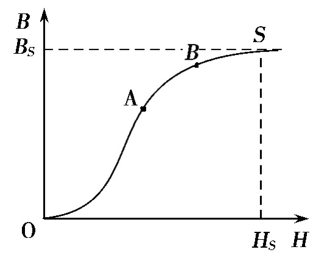
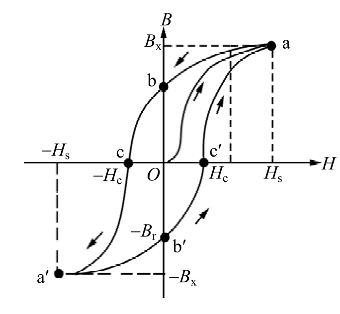
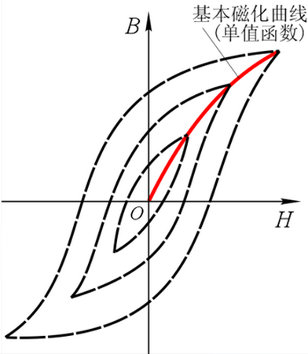
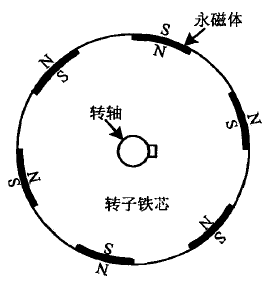
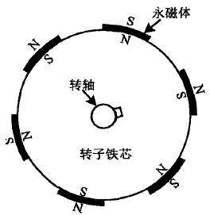

# 永磁同步电机及其驱动技术

## P 预备知识

### 电机学分析方法
>电机的运行有两个过程,即**稳态运行**和**暂态运行**。严格地讲，电机内部的理论属于“**电磁场**”问题。但是电磁场的理论分析和计算比较复杂，习惯上采用比较简便的方法,那就是把“**场**”的问题转换成“**路**”(即**电路**和**磁路**)的问题。电机学的经典分析方法是把电路和磁路又简化为单一电路问题，即归算后的**等效电路**、**方程式**和**相量图**的分析。
>
>对交流电机而言，等效电路、方程式和相量图是一致的，知道了其中之一，可以推导出另外两个。电机的方程式包括**电势平衡**、**转矩平衡**、**功率平衡**、**磁势平衡**等方程式，这既是电机学研究电机的一种必要方法,又是学习各种电机的重点内容。
### 基本物理量

>* **[磁感应强度($B$)](https://zh.wikipedia.org/wiki/%E7%A3%81%E6%84%9F%E5%BA%94%E5%BC%BA%E5%BA%A6)**
>**定义** &nbsp; 在电磁学中，**磁感应强度**等于一根长$l$，电流大小为$I$的导体，在一个磁场中所受的力$F$大小，与$I*l$的乘积之比值，其中电流必须与磁场线垂直：$$B=\frac{F}{I \cdot l}$$单位为特斯拉（T）
>
>* **[磁通量($\phi_B$)](https://zh.wikipedia.org/wiki/%E7%A3%81%E9%80%9A%E9%87%8F)**
>**定义** &nbsp;通过某给定曲面的磁场（亦称为磁通量密度）的大小的度量: $$\phi_B = BS$$单位为韦伯(Wb)
>
>* **[磁场强度($H$)](https://zh.wikipedia.org/wiki/%E7%A3%81%E5%A0%B4)**
>**定义** &nbsp; 和磁感应强度（B场）不同的是，磁场强度（H场）最初的来源是电流的磁效应，在国际单位制里，H场的单位为安培／米。H场更侧重于“**源**”，B场更侧重于“**效果**”。$$H=B/\mu $$ $\mu $ 为[磁导率](https://zh.wikipedia.org/wiki/%E7%A3%81%E5%AF%BC%E7%8E%87)。B、H的详细区别见[链接1](https://zhuanlan.zhihu.com/p/57868125) [链接2](https://zhuanlan.zhihu.com/p/463305267)。

### 磁路的基本定律
>* **[电磁感应定律](https://zh.wikipedia.org/wiki/%E7%94%B5%E7%A3%81%E6%84%9F%E5%BA%94)** 电磁感应是指放在变化磁通量中的导体，会产生电动势。此电动势称为**感应电动势**或**感生电动势**，若将此导体闭合成一回路，则该电动势会驱使电子流动，形成感应电流（感生电流）。**电势公式**：$$\mathcal E=Blv（动生电动势）$$ $$\mathcal E=-N\frac{d\phi}{dt}（感生电动势）$$ 对于闭合回路的含时电流 $ i(t) $ 所产生的含时磁通量 $ \Phi (i) $，会促使闭合回路本身出现感应电动势$ \mathcal E $(自感)，则有：$$\mathcal E=-N\frac{d\phi}{dt}=-N\frac{d\phi}{di} \cdot \frac{di}{dt}$$其中，$N$是闭合回路的卷绕匝数。设[电感$L$](https://zh.wikipedia.org/wiki/%E7%94%B5%E6%84%9F)为 $L=-N\frac{d\phi}{di} $，则感应电动势与含时电流之间的关系为(电感的来源)：$$\mathcal E=-L\frac{di}{dt}$$
>
>* **[安培环路定律](https://zh.wikipedia.org/wiki/%E5%AE%89%E5%9F%B9%E7%8E%AF%E8%B7%AF%E5%AE%9A%E5%BE%8B)** 沿着任何一条闭合回路$l$,磁场强度 $H$ 的线积分等于该闭合回路所包围的电流代数和,这就是**安培环路定律**或**全电流定律**。若用公式表示,即为: $$ \oint_{l}^{} H\cdot l=\sum i $$ 
>对于一个$N$匝线圈，则有： $$\begin{align*}
NI = HL \Longrightarrow H=NI/L 
\\ B=\mu H \Longrightarrow B=\mu \cdot NI/L
\\\phi_B =BS\Longrightarrow \phi_B= S\cdot \mu \cdot NI/L
\end{align*} $$
>其中，$NI$被称为 **[磁通势](https://zh.wikipedia.org/wiki/%E7%A3%81%E9%80%9A%E5%8A%BF)** (磁动势)，SI单位是安培，与电流的单位相同。
>令 $ F=NI $，$ R_m=F/\phi_B $，则 $ R_m = F/\phi_B =\frac{1}{\mu}\cdot\frac{L}{S}$，$ R_m $被称为 **[磁阻](https://zh.wikipedia.org/wiki/%E7%A3%81%E9%98%BB)**。(注意：此处$L$不是螺线管长度)
>
>* **[磁路的欧姆定律](https://zh.wikipedia.org/wiki/%E7%A3%81%E8%B7%AF)** 磁阻是一个与电路中的电阻类似的概念。电流总是沿着电阻最小的路径前进；**磁通量总是沿着磁阻最小的路径前进**。磁阻与电阻一样，都是一个标量。$$ R_m=\frac{F}{\phi_B} $$
>
>* **[磁路的基尔霍夫第一定律（KCL）](https://www.dgxue.com/zhongji/dgdzjc/ciludianlu/4556.html)** 穿出或进入任一闭合区域的总磁通量恒等于零，即: $$ \sum \phi =0 $$
>
>* **[磁路的基尔霍夫第二定律（KVL）](https://www.dgxue.com/zhongji/dgdzjc/ciludianlu/4556.html)** 磁路的任一闭合回路中的磁压降$Hl$的代数和等于该回路的磁动势的代数和，即：即: $$ \sum NI= \sum HL= \sum \phi_B R_m $$

### 铁磁物质

>**基本概念**
>
>根据物质在磁场中表现出的磁性,物质可分为三类：
>
>* **顺磁物质**：磁导率$\mu>\mu_0$([真空磁导率](https://zhuanlan.zhihu.com/p/465688176))，如：空气、铝
>
>* **逆磁物质**：磁导率$\mu<\mu_0$，如：氢、铜
>
>* **铁磁物质**：磁导率$\mu>>\mu_0$，如：铁钴镍
>
>**[磁化](https://zh.wikipedia.org/wiki/%E7%A3%81%E5%8C%96%E5%BC%B7%E5%BA%A6)** ：将铁、钻、镍等铁磁物质放入磁场后，磁场将显著增强，铁磁物质呈现很强的磁性。这种现象称为铁磁物质的**磁化**
>
>**[磁畴](https://baike.baidu.com/item/%E7%A3%81%E7%95%B4/5458479?fr=aladdin)** ：铁磁物质之所以磁场很强，是因为在铁磁物质内部存在着许多很小的天然磁化区,叫做**磁畴**。在没有外磁场时，这些磁畴的排列杂乱无章，磁效应相互抵消，对外不呈现磁性。而当有外磁场后，磁畴将翻转且方向渐趋一致，形成一个附加磁场，与外磁场迭加，使磁场大大增强。
>
>**铁磁物质的磁化曲线**
>
>* **原始磁化曲线** 将一块尚未磁化的**铁磁物质**进行磁化，在磁场强度$H$由零开始逐渐增大时，磁感应强度也随着逐渐增加，这种$B=f(H)$曲线就称为**原始磁化曲线**，其形状下图左图所示。在 OA 段，$B$值增加较快，这是因为随着$H$的增加，有越来越多的**磁畴**趋向于外磁场的方向，使磁场增强；在 AB 段随着$H$的继续增加，可以转向的磁畴越来越少，故$B$值增加变慢，这段曲线称为磁化曲线的**膝部**。B点以后已经很少有磁畴可以转向，因此$B$值增加非常缓慢，称为磁化曲线的**饱和段**。
>
>* **[磁滞回线](https://zh.wikipedia.org/wiki/%E7%A3%81%E6%BB%9E%E7%8E%B0%E8%B1%A1)** 当铁磁物质在$-H$到$+H$之间反复进行磁化后，最后得到对称原点的封闭曲线$B=f(F)$曲线如下图中图所示。磁化过程中，$B$的变化总是落后于$H$的变化，这种现象称为**磁滞**。$B-H$闭合曲线称为**磁滞回线**。从该曲线可以看出，当$H$下降到零时，$B$并不到零而等于$B_r$，这是因为外磁场虽然消失，但磁畴还不能恢复原来状态，还保留一定的**剩磁**。去掉剩磁所必须加的反方向磁势 H($Oc$段或$Of$段)，称为**矫顽力**。按照磁滞回线形状的不同，铁磁材料可分为**软磁材料**和**硬磁材料**两大类，磁滞回线窄、剩磁和矫顽力小的材料称为软磁材料如<u>铸铁、铸钢、硅钢片</u>等。软磁材料的磁导率较高，多用以制造电机的铁心。磁滞回线宽、剩磁及矫顽力大的材料称为硬磁材料，如<u>铝镍钴铁的合金或稀土合金</u>等。因硬磁材料的剩磁大，故常用来制造永磁电机的主磁极。
>
>* **基本磁化曲线** 选择不同的磁场强度$H$进行反复磁化，可以得到一系列大小不同的磁滞回线，如下图有图所示。将各磁滞回线的顶点连接起来，所得到的一条曲线，称为**基本磁化曲线**。工程上采用的都是基本磁化曲线。
>
>|初始磁化曲线|磁滞回线 |基本磁化曲线|
>|  ----  |  ----  |  ----  | 
>|    |   |    |
>
>根据磁化曲线特性可以解释[电机铁心磁饱和](https://zh.wikipedia.org/wiki/%E7%A3%81%E9%A5%B1%E5%92%8C)的现象，那么进入饱和区后是否意味着$B=\mu H $失效呢？不是的，磁导率是一个与材料性质、温度、频率、磁场强度等因素相关的变量，不是一个常数。**在非线性介质中，磁导率取决于磁场的强度，随着磁场的增大，磁导率会逐渐减小，直到达到饱和状态**。但是，即使在饱和状态下，磁导率也不会变为零，而是一个很小的值，称为**饱和磁导率**。

### 功率损耗
>交流铁心线圈的功率损耗包括**铜损**和**铁损**两部分。
>
>* **铜损**：它是电流流过线圈电阻r的损耗$P_{Cu}$ $$ P_{Cu}=I^2R $$
>
>* **铁损**：铁损包括**磁滞损耗**和**涡流损耗**两种。
>
>>**磁滞损耗**：在外磁场作用下，铁磁物质内部磁畴将翻转，使磁畴的方向趋于外磁场。若外加的磁场是交变的，磁畴彼此间不停地摩擦、消耗能量而引起损耗，这种损耗称为**磁滞损耗**。实验证明，单位体积磁滞损耗的大小与磁滞回线所包围的面积成正比，所以，为减少磁滞损耗，应选用磁滞回线狭小的软磁材料做铁心。磁滞损耗$p_{cz}$为：$$p_{cz} = K_hfB_{m}^{n}V $$ 公式中：
>> * $Kh$——磁滞损失系数，与材料有关，可查相关手册；
>> * $f$——频率，$Hz$；
>> * $Bm$——磁感应强度，$T$；
>> * $V$——铁心体积，$m^3$
>> * $n$——与$Bm$值有关的指数。
>> $$ n=\begin{cases}
 1.6(0.1T<Bm<1.0T)\\
2(0.1T>Bm,Bm>1.0T)
\end{cases}$$
>>
>> **涡流损耗**：交变磁通穿过铁心内部，在铁心内部垂直磁通的横断面上产生感应电动势，铁心本身又是导电的，该电动势在铁心的横断面上形成的电流，称为**涡流**。涡流流过铁心，铁心本身的电阻便会产生热损耗，为减小涡流损耗，所以采用片状磁性材料叠成铁心，片间彼此绝缘，使涡流在薄片的横断面内流动，由于涡流路径增长，电阻增大，电流变小，因而损耗减小。另外，在铁磁材料中加入少量的硅，可使其电阻率显著增加。铁心材料常采用硅钢片。涡流损耗$p_{wl}$为：$$p_{wl} = K_ef^2B_{m}^{2}V $$ 公式中：
>> * $Ke$——与铁心导电系数及片厚有关的系数；
>> * $f、Bm、V$与前面介绍的相同。
>>
>>铁心的损耗，工程上往往用实验方法测出，而用公式计算会很麻烦。

### 永磁材料的磁性能
>永磁材料的磁性能用剩磁$B_r$矫顽力$H_c$和 [最大磁能积$(BH)max$](https://baike.baidu.com/item/%E6%9C%80%E5%A4%A7%E7%A3%81%E8%83%BD%E7%A7%AF/9695319?fr=aladdin) 三项指标来表征。一般说来，指标值愈大，磁性能愈好，但使用时还要考虑其工作温度、稳定性、价格等因素。

---

## 1 电机基础数学模型
### 力矩公式
>两个磁场相互的吸引，就能产生力矩。电机力矩的通俗公式就是：$$ T_e = |\psi _r||\psi _s|\sin \theta  $$ 其中，$\psi _r$是定子磁场的磁通幅值，$\psi _s$转子磁场的磁通幅值，$\theta$定子磁场和转子磁场的夹角。

### 永磁同步电机四大基础方程（以旋转dq坐标系为参考）
>**磁链方程** 
>$$\psi_d = L_di_d + \psi_r$$ 
>$$\psi_q = L_qi_q $$ 
>解释：d轴磁链等于永磁体磁链$\psi_r$ 加上d轴电流乘以d轴电感得到的磁链；q轴磁链等于q轴电流乘以q轴电感得到的的磁链。
>
>**电压方程** 
>$$U_d = R_si_d + d\psi_d/dt - \omega_e \psi_q$$ 
>$$U_q = R_si_q + d\psi_q/dt + \omega_e \psi_d$$
>解释：给电机输入电压$u$，产生电流$i$，电阻上有压降$Ri$，变化的电场产生磁场，该磁场同时产生电压 $d\psi/dt$, 电机旋转起来后同时还有反电动势也就是$\omega \psi$（d轴的动生电动势是由q轴磁链产生的，同理q轴的动生电动势也是如此）。详细推导过程见[这里](https://zhuanlan.zhihu.com/p/629906056)。进一步，将磁链方程代入到电压方程可以得到：
>$$U_d = R_si_d + L_d \cdot di_d/dt- \omega_e L_qi_q$$ 
>$$U_q = R_si_q + L_q \cdot di_q/dt+ \omega_e L_di_d +\omega_e \psi_r$$ 
>解释: 新的电压方程可以解释为电压作用到三部分：（1）电阻上压降（2）电感上的压降（3）反电动势；其中反电动势占据了电压的主要部分；当转速较高时，可以忽略电阻上的压降；稳态运行时，dq轴电流变化很小，可以忽略电感上的压降，那么合成的电压就可以写成：$$U_s=\sqrt{(-\omega_eL_qi_q)^2+(\omega_eL_di_d+\omega_e\psi_r)^2} $$ 
>写成叉乘的简化形式就是：$$U_s=\omega_e \cdot \psi $$ 从这个方程中，也可以进一步看出：给电机输入电压$U_s$后产生电流$i$ 
，电流$i$作为中间媒介，产生磁链$\psi$，磁链$\psi$又与角速度$\omega$耦合出电机反电动势，作为电压方程中的主要成分。
>
>**转矩方程** 
>$$T_e=\frac{3}{2}P[i_di_q(L_d-L_q)+\psi_ri_q]$$
>对于SPM：$$T_e=\frac{3}{2}P\psi_ri_q$$
>
>**运动方程** 
>$$T_e-T_L=J\frac{d\omega_r}{dt}+R_\Omega \omega_r$$
>运动方程，实际上就是牛顿第二定律的在旋转物体的上的表现形式。$T_e$是电磁转矩，$T_L$是负载转矩，$J$是转动惯量，$\omega_r$是电机机械角速度, $R_\Omega$是电机的阻尼系数。
>
>电磁转矩$T_e$和负载转矩$T_L$之间的差值，推动物体产生旋转，旋转的结果以角加速度$\frac{d\omega_r}{dt}$的形式表现出来。电磁转矩$T_e$大于负载转矩$T_L$时，电机处于加速状态；电磁转矩$T_e$小于负载转矩$T_L$时，电机处于减速状态；电磁转矩$T_e$等于负载转矩$T_L$时，电机处于匀速状态。
>
>转动惯量$J$的大小对电机的启动过程有一定影响，启动过程存在速度差，那么这一项$\frac{d\omega_r}{dt}$就不为0，需要施加更多的电磁转矩$T_e$才能克服负载转矩$T_L$；一旦电机稳定运行后，$\frac{d\omega_r}{dt}$这一项基本为0，那么转动惯量对电机的影响就很小了。

### I-PMSM 和 S-PMSM
>|I-PMSM|S-PMSM|
>|  ----  |  ----  | 
>|    |    | 
>|  内置式（凸极电机）  |  表贴式（隐极电机）  | 
>|  $L_q> L_d$  | $L_q\approx L_d$  | 
>|  内置式转子结构可以充分利用转子磁路不对称所产生的磁阻转矩，提高电机的功率密度，控制上采用MTPA弱磁控制比较多  | 表贴式永磁同步电动机永磁体的用量较小，磁链谐波分量较少，更容易产生正弦波磁动势。控制上采用 id=0 矢量控制比较多 | 

---

## Z 参考链接
1. [同步电机的电磁基础_哔哩哔哩_bilibili](https://www.bilibili.com/video/BV14G4y1V7dt)
2. [磁路与铁心线圈电路_电工学网](https://www.dgxue.com/zhongji/dgdzjc/ciludianlu/index.html)
3. [电机学（第三版）阎治安.]()
4. [从数学层面理解永磁同步电机运行](https://zhuanlan.zhihu.com/p/564066303)
5. [异步电机建模与控制02讲:正确认识电感L](https://www.bilibili.com/video/BV13V41177Ta)
6. [坐标变换与永磁同步电机的数学模型](https://blog.csdn.net/weixin_45084692/article/details/90300703)
7. [永磁同步电机的分类](https://zhuanlan.zhihu.com/p/299522151)
8. [电机（二）——永磁同步电机概述](https://zhuanlan.zhihu.com/p/272511217)
9. [如何快速理解永磁同步电机？](https://zhuanlan.zhihu.com/p/45757542)

永磁同步电机是如何四象限运行(主要提问发电工况)? - 深入浅出说电机的回答 - 知乎
https://www.zhihu.com/question/459794187/answer/3247847554