# 直流永磁同步电机驱动器硬件设计指南

## 重要器件选型

### MOSFET

**重要指标**  

- **漏源电压$V_{DS}$** ：漏-源未发生雪崩击穿前所能施加的最大电压，应至少比电源电压高20％。在某些情况下，尤其是在电流大、扭矩步长大、电源控制不良的系统中，所需裕量可能需要高达电源电压的两倍。

- **栅源电压$V_{GS}$** ：$V_{GS}$额定电压是栅源两极间可以施加的最大电压。设定该额定电压的主要目的是防止电压过高导致的栅氧化层损伤。实际栅氧化层可承受的电压远高于额定电压，但是会随制造工艺的不同而改变，因此保持VGS在额定电压以内可以保证应用的可靠性。
  - **阈值电压$V_{GS(th)}、V_{GS(off)}$**：$V_{GS(th)}$是指加的栅源电压能使漏极开始有电流，或关断MOSFET时电流消失时的电压，

- **连续漏电流$I_{D}$**：芯片在最大额定结温TJ(max)下，管表面温度在25℃或者更高温度下，可允许的最大连续直流电流。该参数为结与管壳之间额定热阻$R_{θJC}$和管壳温度的函数。$I_{D}$中并不包含开关损耗，并且实际使用时保持管表面温度在25℃（Tcase）也很难。因此，硬开关应用中实际开关电流通常小于$I_{D}$额定值 $T_C = 25℃$的一半，通常在1/3～1/4。补充，如果采用热阻$R_{θJA}$的话可以估算出特定温度下的$I_{D}$电流，这个值更有现实意义。

- **脉冲漏极电流 $I_{DM}$**：该参数反映了器件可以处理的脉冲电流的高低，脉冲电流要远高于连续的直流电流。考虑到热效应对于$I_{DM}$的限制，温度的升高依赖于脉冲宽度，脉冲间的时间间隔，散热状况，RDS(on)以及脉冲电流的波形和幅度。单纯满足脉冲电流不超出$I_{DM}$上限并不能保证结温不超过最大允许值。可以参考热性能与机械性能中关于瞬时热阻的讨论，来估计脉冲电流下结温的情况。补充，在某些情况下，整个芯片上最“薄弱的连接”不是芯片，而是封装引线。

- **最大沟道功耗 $P_D$**：容许沟道总功耗标定了器件可以消散的最大功耗，可以表示为最大结温和管壳温度为25℃时热阻的函数。

- **结到环境热阻 $R_{θJA}$**：定义：$R_{θJA}=(TJ-TA)/ P$
  - $TJ$：结点温度，℃
  - $TA$：环境空气温度，℃（补充： $TC$：外壳表面温度，℃）
  - $P$：器件功耗，W

示例：如果$TJ$ = 80℃，$TA$ = 25℃，并且$P$= 1.0W，则：

$$R_{θJA}=(80℃-25℃)/ 1.0W = 55℃/ W$$

- **结到板热阻$R_{θJB}$**：计算同上。

- **结到壳热阻$R_{θJC}$**：计算同上。

- **导通电阻$R_{DS(on)}$**：$R_{DS(on)}$ 是指在特定的漏电流（通常为 $I_{D}$ 电流的一半）、栅源电压和25℃的情况下测得的漏-源电阻。 $R_{DS(on)}$ 随温度升高逐渐增大
 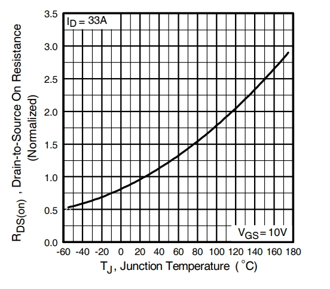

- **安全工作区域SOA**：SOA（Safe Operation Area）安全工作区是由一系列（电压，电流）坐标点形成的二维区域，MOS开关器件正常工作时的电压和电流都不会超过该区域。简单的讲，只要MOS器件工作在SOA区域内就是安全的，超过这个区域就存在危险。功率MOS管的安全工作区包含了4个参数：最大单次脉冲电流$I_{Dmax}$，最大耐压$V_{DSmax}$，最大允许功耗$P_{max}$和极限时间$t$。
 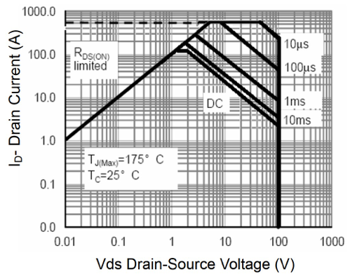

- **输入电容$C_{iss}$**：$C_{iss} = C_{gs} +C_{gd}$
- **输出电容$C_{oss}$**：$C_{oss} = C_{ds} +C_{gd}$
- **反向传输电容$C_{rss}$**：$C_{rss} = C_{gd}$
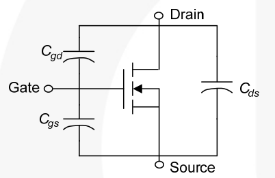
- **栅电荷$Q_{gs}、Q_{gd}、Q_{g}$**：栅极电荷用于度量导通和关断MOSFET所需的电荷量。$Q_{gs}$从0电荷开始到第一个拐点处，$Q_{gd}$是从第一个拐点到第二个拐点之间部分（也叫做“米勒”电荷），$Q_{g}$是从0点到VGS等于一个特定的驱动电压的部分。$Q_{g}$较低的MOSFET更易于驱动。与具有较高(QG)的MOSFET相比，它可以以较低的栅极驱动电流进行更快的切换。
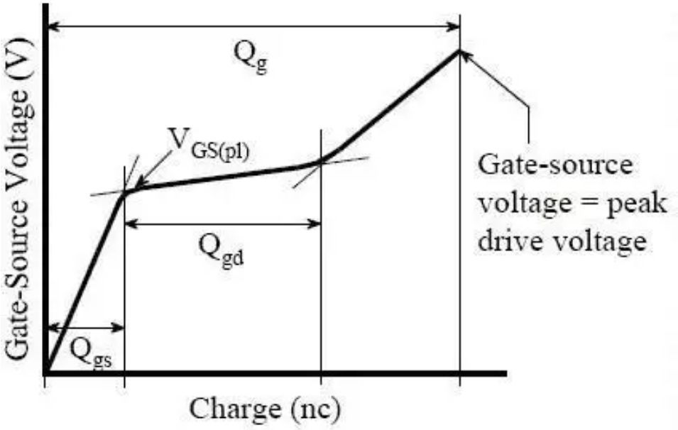

- **导通延时时间$t_{d(on)}$**：导通延时时间是从当栅源电压上升到10%栅驱动电压时到漏电流升到规定电流的10%时所经历的时间。

- **关断延时时间$t_{d(off)}$**：关断延时时间是从当栅源电压下降到90%栅驱动电压时到漏电流降至规定电流的90%时所经历的时间。这显示电流传输到负载之前所经历的延迟。

- **上升时间$t_{r}$**：上升时间是漏极电流从10%上升到90%所经历的时间。

- **下降时间$t_{f}$**：下降时间是漏极电流从90%下降到10%所经历的时间

- **本体二极管导通电流$I_{S}$**：该电流比较大，一般和$I_{D}$电流差不多。

- **本体二极管其他参数略**

**工作过程**  

|MOS管特性曲线|MOS管导通曲线 |MOS管导通曲线（简化版） |
|  ----  |  ----  |   ----  |
|  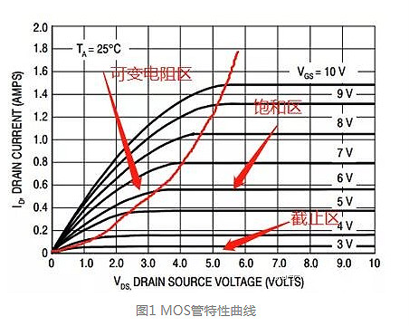  | 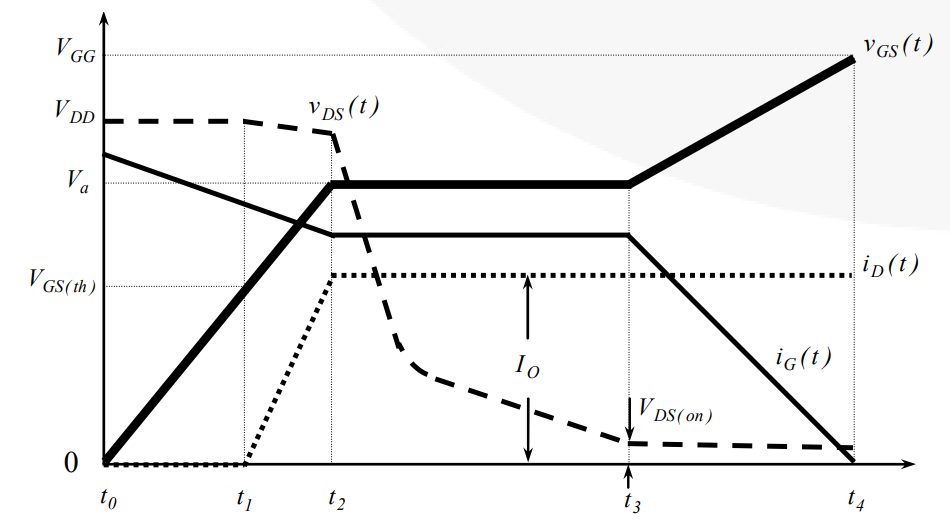  | 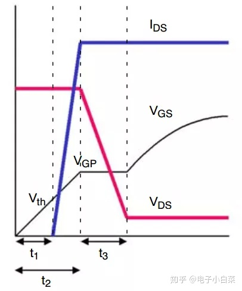    |

- t0~t1：$V_{gs}$小于阈值电压$V_{GS(th)}$时，MOS管处于截止区关断，漏极电流$I_{D}$=0，漏源极电压差$V_{ds}$为输入电压$V_{DD}$。
- t1~t2：随着$V_{gs}$从阈值电压$V_{GS(th)}$逐渐增大至米勒平台电压$V_{a}$，电流$I_{D}$从0开始逐渐增大至最大值，MOS管开始导通，并进入恒流区（饱和区）。此时$V_{ds}$仍旧维持不变，但是实际电路中可能会由于各种杂散寄生电感等因素的影响，也会产生一部分压降损失，导致实际的$V_{ds}$会略微下降。
- t2~t3：当$I_{D}$逐渐增大至最大值（由电路参数决定）时，MOS管开始进入 **[米勒平台](https://www.zhihu.com/question/366228706/answer/2348285181)**，由于电流$I_{D}$已经达到最大值保持不变，所以$Vgs=Id/gfs$亦保持不变，即从公式角度也可以解释米勒平台。
- t3~t4：MOS管进入可变电阻区，米勒平台结束，$V_{gs}$电压在栅极电荷的驱动下继续升高至最大值，$V_{ds}$则电压下降至最低值$R_{DS(on)}*I_{D}$。MOS管导通曲线的简化版如右图所示，MOS管关断时的分析过程相反。

**损耗计算**  

MOS管损耗主要有**开关损耗**（开通损耗和关断损耗，关注参数$C_{rss}$）、**栅极驱动损耗**（关注参数$Q_{g}$）和**导通损耗**(关注参数$R_{DS(on)}$)等。

- **开关损耗** ：MOS管开关损耗产生的本质原因是由于MOS开通和关断并不是瞬间完成，**电压和电流存在重叠区**。主要发生在上图t1~t3区域。计算公式：

$$P_{sw}=\frac{W}{T}=W\cdot F=K\cdot V_{DS}\cdot I_{D}\cdot (t_{r}+t_{f})\cdot f$$

将MOS管导通曲线看成是近似线性，折算成面积功率，系数$K$就是0.5。

- **导通损耗** ：理想的开关，我们将其等效为电阻为0的导线。但是在实际使用过程中，MOS开通后，是存在一定阻值的，这个阻值会随着$V_{gs}$电压的变化而变化，当MOS完全开通时，电阻才基本等效为一定固定的电阻（$R_{DS(on)}）$。因此，产生导通损耗的本质原因是**实际使用的MOS管不能等效为电阻为0的器件**。计算公式：

$$P_{c}=I^2R=I^2_{D}\cdot R_{DS(on)} $$

- **驱动损耗** ：从上可以看出，在t1点之前，也就是电流从0上开始上升的前，这一部分MOS还没开通，既不存在开关损耗，也不存在导通损耗，但是由于这部分时间，驱动芯片在对MOS的栅极充电，这也是损耗的一种形式，并归为MOS的损耗，即驱动损耗。计算公式：

$$P_{d}=U\cdot (I\cdot T)\cdot F=U\cdot Q\cdot F=V_{GS}\cdot Q_{g}\cdot f $$
在驱动MOSFET开启的过程中，此阶段损耗很小，一般忽略不计。

**芯片厂家推荐**  

  英飞凌 TI 华润微 士兰微 新洁能 华羿微（待补充）

**参考链接**  

1. [OMSEMI.MOSFET Basic[BE/OL].(2022.8)[2024.1.21]](https://www.onsemi.com/pub/collateral/an-9010.pdf)
2. [TI.MOSFET和IGBT栅极驱动器电路的基本原理[BE/OL].(2017.3)[2024.1.21]](https://www.ti.com.cn/cn/lit/ml/zhca770/zhca770.pdf)
3. [MPS.用于电机驱动的MOSFET驱动器[BE/OL].()[2024.1.21]](https://www.monolithicpower.cn/cn/using-mosfet-drivers-for-motor-drives)
4. [知乎.矜辰所致.全面认识MOS管，一篇文章就够了[BE/OL].(2022.6.9)[2024.1.21]](https://zhuanlan.zhihu.com/p/526321267)
5. [知乎.Engineer Kang.IGBT的栅极驱动电压Vge上的米勒平台时如何产生的？[BE/OL].(2022.10.17)[2024.1.21]](https://www.zhihu.com/question/366228706/answer/2348285181)
6. [知乎.电子小白菜.MOSFET管的导通过程和损耗分析[BE/OL].(2020.3.12)[2024.1.21]](https://zhuanlan.zhihu.com/p/109126351)
7. [CSDN.探索硬件之路.简易版MOSFET损耗计算[BE/OL].(2021.12.5)[2024.1.21]](https://blog.csdn.net/qq_24118431/article/details/121727597)
8. [知乎.硬件工程师炼成之路.MOS管电流方向能反吗？体二极管能过多大电流？[BE/OL].(2021.8.17)[2024.1.21]](https://zhuanlan.zhihu.com/p/400807099)
9. [CSND.1119597068.热阻参数介绍[BE/OL].(2021.1.25)[2024.1.21]](https://blog.csdn.net/qq_31687191/article/details/122678701)
10. [知乎.半导体行业观察.国产MOSFET，实力几何？[BE/OL].(2021.9.8)[2024.1.23]](https://zhuanlan.zhihu.com/p/408326164)
11. [电子发烧友.GReq_mcu168.MOS管为什么会冒烟烧毁？MOS烧管的案例2分享[BE/OL].(2024.4.12)[2024.5.28]](https://www.elecfans.com/analog/202404122684092.html)

---

### MOS栅极驱动

驱动芯片简单而言就是把单片机产生的PWM波形进行放大输入到MOS管的栅极G，从而达到开通关断MOS管的目的。

**重要指标**  

- **高侧悬浮电压$V_{B}$、高侧参考电压$V_{S}$** ：$V_{B}-V_{S}$的值就是栅极开通电压。

- **灌电流能力$I_{O-}$、拉电流能力$I_{O+}$** ：驱动芯片最重要的参数，直接表征了驱动芯片的驱动能力，拉灌电流的能力直接决定了驱动芯片能否给MOS提供足够的电子使其开通，如果这个参数与MOS管不匹配，则会出现MOS不能完全开通的情况。从等效层面上讲，MOS管的各极之间都存在寄生电容，MOS开通的过程就是对极间电容充电的过程，**所谓灌电流就是将电流灌进栅极驱动器(吸收电路)使得MOS关闭，拉电流就是将电荷从栅极驱动器抽出(释放电流)使得MOS关断，拉灌电流的力度决定了MOS开通的程度**。对驱动芯片进行选型时， 需要格外注意将**驱动芯片拉灌电流能力值与MOS管的参数相匹配**，如果不匹配将会出现俗称为“带不动”的情况。MOS驱动所需拉灌电流计算公式：$$I = C_{iss} \frac{\Delta V}{\Delta t}$$其中，$I$是拉灌电流，$C_{iss}$是MOS管的输入电容，$ΔV$是给栅源极充电的电压，$Δt$是所需的导通速度。另一种计算方法是根据MOS管的$Q_G$和驱动频率$f_{DRV}$：$$I = \frac{Q}{t}=Q_G \cdot f_{DRV}$$ 其中，$Q_G$是包括米勒效应在内**栅极充电总电量**(Total Gate Charge)，$f_{DRV}$是驱动频率（注意：$f_{DRV}$根据MOS的$t_f$ 、$t_r$ 、$t_{d(on)}$、$t_{d(off)}$计算，非PWM频率）。使用栅极电荷计算更准确一些，但是实际效果还是要在示波器上进行测量确认

- **开延时$t_{on}$、关延时$t_{off}$、上升时间$t_{r}$、下降时间$t_{f}$**：与MOS的参数类似，介绍略。

- **延迟匹配**：栅极驱动器延迟匹配是指两个或多个栅极驱动器通道之间的内部传播延迟的匹配准确度。传播延迟是指信号从输入端到输出端的传输时间。如果延迟匹配数值越小，说明两个通道的输出信号越同步，栅极驱动器的性能越好。延迟匹配对于双通道栅极驱动器或并联栅极驱动器尤其重要，因为它们需要同时控制两个或多个功率开关器件。延迟匹配可以减少死区时间，提高效率，降低开关损耗和噪声。

**芯片厂家推荐**  

TI 屹晶微 数明（待补充）

**参考链接**  

1. [TI.了解峰值源电流和灌电流 (Rev. A)[BE/OL].(2018.6)[2024.1.23]](https://www.ti.com/cn/lit/ab/zhca986a/zhca986a.pdf)
2. [Power Integrations.IGBT以及MOSFET的驱动参数的计算方法[BE/OL].(2010.1.25)[2024.1.23]](https://www.powerint.cn/sites/default/files/documents/AN-1001_CN.pdf)
3. [21ic.Mos管驱动电流计算方法？[BE/OL].(2014.7.20)[2024.1.23]](https://bbs.21ic.com/icview-771632-1-1.html)
4. [TI.知道你的栅极驱动器：延迟匹配-电源管理在线培训- 德州仪器（TI）官方视频课程培训[BE/OL].(2017.7.21)[2024.2.24]](https://edu.21ic.com/video/2229)
5. [电子发烧友论坛.栅极驱动器的负电压和延迟匹配[BE/OL].(2019.4.15)[2024.2.24]](https://bbs.elecfans.com/jishu_1757990_1_1.html)

---

### 母线电容

在电机控制器中，电池包的直流电作为输入电源，需要通过直流母线与电机控制器连接，该方式叫DC-LINK或者直流支撑，其中的电容我们称之为母线电容或者支撑电容或者DC-Link电容。由于电机控制器从电池包得到有效值或者峰值很高的脉冲电流的同时，会在直流支撑上产生很高的脉冲电压使得电机控制器难以承受，所以需要选择母线电容来连接。

**功能**  

- 平滑母线电压，使电机控制器的母线电压在MOS/IGBT开关的时仍比较平滑；
- 降低电机控制器MOS/IGBT端到动力电池端线路的电感参数，削弱母线的尖峰电压；
- 吸收电机控制器母线端的高脉冲电流；
- 防止母线端电压的过充和瞬时电压对电机控制器的影响。

**重要指标**  

- **材质** ：优先考虑**薄膜电容（固态电容）**。
- **额定电压** ：建议取母线电压的1.5~2.0倍。
- **电容容量** ：取值范围： $$ \begin{cases}
C_{max}=P/ ( 4\cdot f\cdot U\cdot U\cdot 2.5 \text {  \% }  )  \\
C_{min}=P/ ( 8\cdot f\cdot U\cdot U\cdot 2.5 \text {  \% }  )
\end{cases} $$
其中：$P$为最大功率，$f$为开关频率，$U$为母线电压。一些国外汽车厂商(特斯拉)采用的薄膜电容，容量取值相对激进，可能会低于$C_{min}$，详细分析见参考链接。

**参考链接**  

1. [知乎.王晓伟.电机控制器母线电容的选型以及详细分析[BE/OL].(2019.10.16)[2024.1.23]](https://zhuanlan.zhihu.com/p/87062675)
2. [知乎.旋转的世界.逆变器直流母线电容如何计算？[BE/OL].(2022.3.27)[2024.2.29]](https://www.zhihu.com/question/416620962/answer/2409727951)

---

### 采样电阻

---

## 电路功能模块设计

### MOS驱动

**单管电路**  

- 因为驱动线路走线会有寄生电感，而寄生电感和MOS管的结电容会组成一个LC振荡电路。如果直接把驱动芯片的输出端接到MOS管栅极的话，在PWM波的上升下降沿会产生很大的震荡，导致MOS管急剧发热甚至爆炸，一般的解决方法是在栅极串联一个电阻，降低LC振荡电路的Q值，使震荡迅速衰减掉。**如果该电阻阻值过小，则无法抑制震荡，阻值过大，则会拉长上升下降时间**。具体的计算过程参考本小节的链接3。
- 因为MOS管栅极高输入阻抗的特性，一点点静电或者干扰都可能导致MOS管误导通，所以建议在MOS管G S之间并联一个10K的电阻以降低输入阻抗。
- 如果担心附近功率线路上的干扰耦合过来产生瞬间高压击穿MOS管的话，**可以在GS之间再并联一个TVS瞬态抑制二极管**。TVS可以认为是一个反应速度很快的稳压管，其瞬间可以承受的功率高达几百至上千瓦，可以用来吸收瞬间的干扰脉冲。
- MOS管驱动线路的环路面积要尽可能小，否则可能会引入外来的电磁干扰。驱动芯片的旁路电容要尽量靠近驱动芯片的VCC和GND引脚，否则走线的电感会很大程度上影响芯片的瞬间输出电流。
- 在MOS管下半桥关闭后，因为电机是个感性负载，电流不能突变，电流回路会通过MOS管的体二极管释放，因为MOS管的体二极管开通速度略慢，为了保护下半桥MOS，会在S D之间再并联一个快开通二极管，用来加速开通。
- 功率mos在高速开关时，可能会导致输出电压产生**过调/欠调和高频振铃**，尖峰电压会使MOSFET进入雪崩击穿而损坏，为了抑制尖峰电压，会在MOS的S D之间放置**RCD吸收电路**，R、C值的计算过程参考本节链接8，RC值过大会增加发热量，过小则抑制能力不足，该处的取值往往更依赖经验值和实际测量。

**常见的MOS管驱动异常波形**  

|| |
|  ----  |  ----  |
| 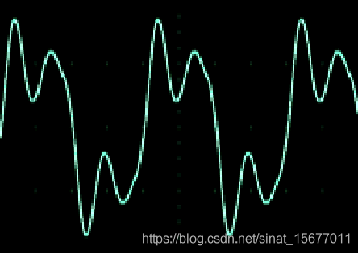 |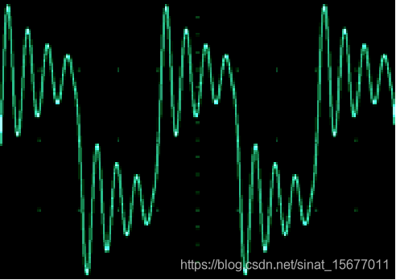 | 
|如果出现了这样圆不溜秋的波形，有很大一部分时间管子都工作在线性区，损耗极其巨大。一般这种情况是布线太长电感太大，栅极电阻都救不了你，只能重新画板子。|高频振铃严重的毁容方波。在上升沿下降沿震荡严重，这种情况管子一般瞬间死掉，跟上一个情况差不多，进线性区，原因也类似，主要是布线的问题，上升下降沿极其缓慢，这是因为阻抗不匹配导致的，芯片驱动能力太差或者栅极电阻太大，需要换大电流的驱动芯片，栅极电阻往小调调就OK了。 |
| 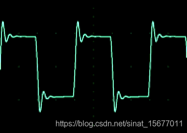 |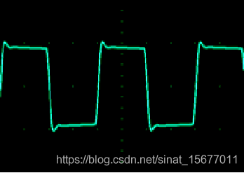 | 
|大众脸型，人见人爱的方波。高低电平分明，电平这时候可以叫电平了，因为它平，边沿陡峭，开关速度快，损耗很小，略有震荡，是可以接受的，管子进不了线性区，强迫症的话可以适当调大栅极电阻。| 方方正正，无振铃无尖峰无线性损耗的三无波形，这就是最完美的波形了。|

**多管并联**  

在设计大功率驱动器时，经常会采用多管并联的方案。多管并联比使用大单管能降低**导通损耗**，并能使MOS发热在PCB上更加均衡，从而降低散热方案的设计难度，但并联的 MOS 不可能有完全一致的参数，所以对驱动电路的设计以及 MOS 的一致性存在较大的挑战。并联存在的最大问题便是**均流**，如果并联 MOS 有一个承担了过大电流，极有可能造成的 MOS 的失效。

从第一节关于对MOS管工作流程的分析可知，在电机驱动器中，MOS管主要有开启、导通、关断三个工作状态，开启、关断阶段产生的损耗被称为**开关损耗**，在导通阶段产生的损耗被称为**导通损耗**。

在导通阶段，因为 MOS **导通电阻**是正温度系数，当 MOS 的结温 $T_j$ 逐渐上升，其 $R_{DS(on)}$逐渐增大，那么并联中电流大的 MOS 的导通电阻增大，让电流自动流向导通电阻小的 MOSFET，进而实现了自动均流。所以导通阶段的均流问题不需要特性关注。

在开启、关断阶段，如果$V_{GS}$电平变化不同步，或者不同MOS管的开启电压$V_{GS(th)}$不一致，会导致**开关损耗**更多的承担在先开启、后关断、导通电压低的MOS管上。导致这个情况的原因有如下几个因素：

- **绑定线寄生电感的影响**：MOS生产时，内部绑定线的组装，以及 PCB 走线，共同组成了源极的寄生电感。该电感的不同会影响损耗的构成比例。
- **外部栅极电阻 $R_G$误差**：$R_G$误差会导致开关的不同步，电阻越大，开通损耗越大。对关断损耗和导通损耗影响不大。
- **$V_{GS(th)}$不一致**：不同的门槛电压，对导通损耗无影响，对关断损耗影响不大，但是对开通损耗造成了巨大的差异。假设并联 MOS 的 $V_{GS(th)}$差异只有 0.4 V，那么损耗的差异小很多。
- **LAYOUT 布局影响**：LAYOUT走线不均衡，会导致产生较大的线路寄生电感，对开关损耗造成了较大的差异，同时瞬态的不均流，给MOSFET造成了较大的负载，存在失效的风险。

对并联影响最大的因素是$V_{GS(th)}$ 和 LAYOUT 布局走线，详细分析见本节的参考链接。

**建议**  

1. 针对 $V_{GS(th)}$的差异，建议选用同一批次的 MOSFET，包括绑定线寄生电感的差异，也可以通过这种措施来规避。批次一致性的管控能力也是对品质一项重要的评估指标。
2. 针对驱动电阻的误差，一般来说选用高精度的贴片电阻即可，不会对​损耗和开关波形造成明显差异。
3. 针对 LAYOUT 布局，建议均衡走线，保证阻抗一致，同时 MOSFET 的外部驱动电阻，并联时建议分成两部分，一部分共用，另外一部分串联到每个并联的MOSFET 。

**参考链接**  

1. [MPS.电机驱动PCB布局指南—上篇[BE/OL].()[2024.1.21]](https://www.monolithicpower.cn/motor-driver-pcb-layout-guidelines-part-1)
2. [微信公众号.巧学模电数电单片机.功率MOS管驱动设计与PCB layout注意事项[BE/OL].(2021.8.4)[2024.1.21]](https://mp.weixin.qq.com/s/IXAuFafHQ7pFjg5YhnVgmg)
3. [TI.适用于栅极驱动器的外部栅极电阻器设计指南[BE/OL].(2020.3)[2024.2.11]](https://www.ti.com.cn/cn/lit/ab/zhca985a/zhca985a.pdf)
4. [英飞凌.Paralleling power MOSFETs in high currentapplications[BE/OL].(2021.5.14)[2024.2.6]](https://www.infineon.com/dgdl/Infineon-PowerMOSFET_Paralleling_power_MOSFET_in_high_current_applications-ApplicationNotes-v01_00-EN.pdf?fileId=5546d462758f5bd101759ca434f111c1&da=t)
5. [英飞凌.Paralleling MOSFETs in high-current LV driveapplications[BE/OL].(2018.4.16)[2024.2.6]](https://www.infineon.com/dgdl/Infineon-ApplicationNote_MOSFET_Paralleling_MOSFETs_in_high-current_LV_drive_applications-ApplicationNotes-v01_00-EN.pdf?fileId=5546d46262b31d2e0162f284b7583d1b&da=t)
6. [知乎.转子磁场定向.如何设计大功率 BLDC 控制器[BE/OL].(2023.3.17)[2024.2.6]](https://zhuanlan.zhihu.com/p/612887510)
7. [知乎.转子磁场定向.MOSFET 并联关键参数[BE/OL].(2023.3.20)[2024.2.6]](https://zhuanlan.zhihu.com/p/612883776)
8. [CIRRUS.RC Snubber for Class-D Audio Amplifiers[BE/OL].(2018.5.18)[2024.3.20]](https://statics.cirrus.com/pubs/appNote/AN0454REV1.pdf)
9. [知乎.英飞凌.请问题MOS管漏源间并电容电阻做什么用的？[BE/OL].(2023.3.6)[2024.3.20]](https://www.zhihu.com/question/324213758/answer/2923442516)

---
### 电流采样

**采样选取点**  

电机控制中电流采样根据采样位置不同分为：**高端采样(相线采样)**和**低端采样**，低端采样又有单、双、三电阻采样三种方式。

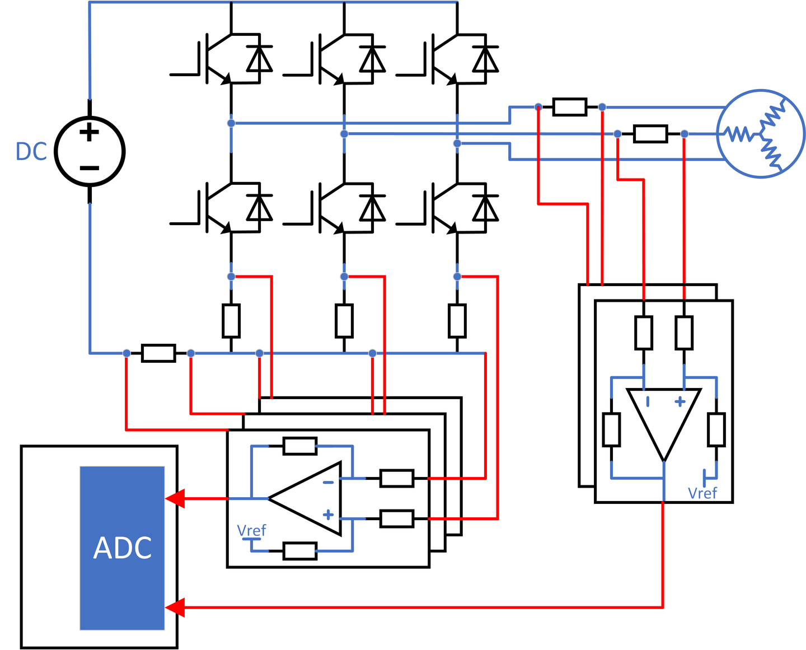

- **高端采样**：可以直接获取相线电流，MOS开关对电流的影响比较小，但运放需要承担母线电压，运放的抗共模电压指标需要大于等于母线电压，成本较高。
- **低端采样**：分为单、双、三电阻采样，易受公共地噪声影响。而且只能在下半桥打开的时候进行采样，对采样点时机有要求，增加了一些软件设计难度。

**四种方式波形对比**  

|| |
|  ----  |  ----  |
|  高端采样    |   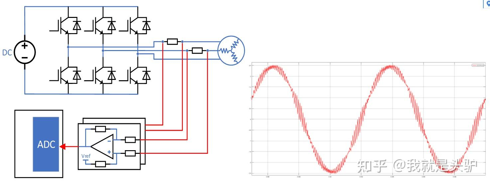  |
|  单电阻采样  |   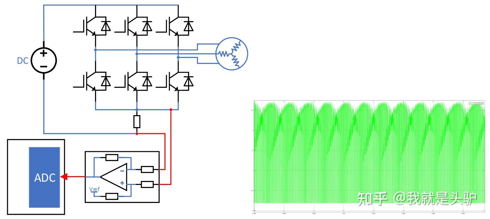  |
|  双电阻采样  |   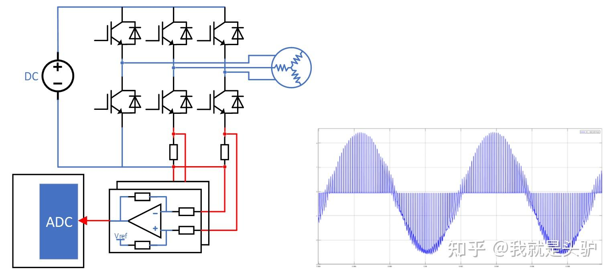  | 
|  三电阻采样  |   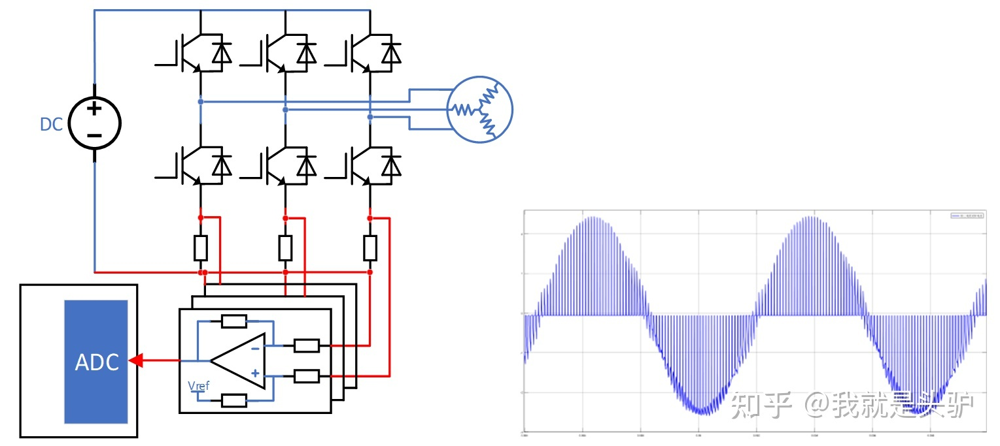  | 
|  各点电流采样波形  |   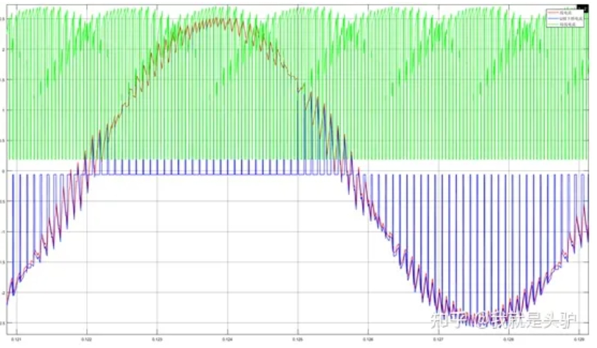  | 

**采样方案**  

在采样电路实现方案上，主要有以下两种：

- **采样电阻+运放放大器（或电流感应放大器）**：基于电路欧姆定律。一般小电流采样没有什么问题。大电流时，为了降低发热，会采用多个等值电阻并联的方式。**如果运放是自己用分立元件搭的，记得要做电压偏置**。
- **电流传感器**：基于电流霍尔效应，电路不需要采样电阻，集成度更高。但超过50A的电流传感器价格不菲。

本小节的所有内容都取自本节参考链接1，原文分析更加细致，建议直接点击链接阅读原文。

**参考链接**  

1. [知乎.我就是头驴.BLDC/PMSM电机驱动中的电流采样[BE/OL].(2022.6.13)[2024.2.12]](https://zhuanlan.zhihu.com/p/527881572)
2. [知乎.司棣文.三电阻采样方案中的分扇区采样原理[BE/OL].(2020.3.27)[2024.2.15]](https://zhuanlan.zhihu.com/p/118052105)
3. [知乎.54工程师.一文读懂运放共模抑制比（下）[BE/OL].(2022.2.20)[2024.2.15]](https://zhuanlan.zhihu.com/p/469953186)
4. [博客园.越泽.FOC中的电流采样 [BE/OL].(2017.7.2)[2024.7.25]](https://www.cnblogs.com/yueze/p/7107697.html)

---

### 电源缓启动

电子系统在使用的过程中，电源端子难免会进行**热插拔**操作，热插拔一般对电子系统有两方面影响：

1. 热插拔时，连接器的机械触点在接触瞬间会出现弹跳，引起电源振荡。
2. 热插拔时，由于系统大容量储能电容的充电效应，系统中会出现很大的冲击电流（如果电源是锂电池直连，该冲击电流甚至可能会触发锂电池BMS的过流保护）。

由于以上原因，特别是瞬时大电流产生打火现象，会引起电磁干扰，并对接插件造成腐蚀。因此需要“缓慢”上电。所以缓启动电路两个主要的作用：

1. 防抖动延时上电。
2. 控制输入电流的上升斜率和幅值。

缓启动电路常见的方法有：串接电感、串接电阻、串接NTC电阻等。但因为发热大、占用空间大等原因，这三种方式均不适合大电流场合。使用MOS管进行大电流缓启动电路设计是一种比较理想的方式，下图是一个基于NMOS的-48V电源缓启动电路图：

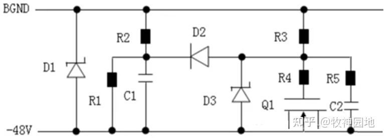

**主要元器件作用说明**  

1. D1（TVS管）：一般用于电源电路的浪涌防护，防止MOS管导通前输入电压过大损坏后级电路；
2. D2（肖特基二极管）：隔离防抖动延时电路与上电斜率控制电路（防止受C1的影响）；
3. D3（稳压二极管）：保证VGS电压的稳定并保护MOS管Q1的栅-源极不被高压击穿；
4. R2/R1和C1：R1为C1提供快速放电通道；R1/R2分压值大于D3的稳压值；
5. R3和C2：控制电源电压上升斜率；
6. R4和R5：防止MOS管自激振荡。

**工作过程**  

见参考链接2

**参考链接**  

1. [CSDN.剑侠蜀山.基于MOS缓启动电路笔记[BE/OL].(2019.12.4)[2024.3.11]](https://blog.csdn.net/qq_42682826/article/details/103395591)
2. [知乎.牧神园地.半导体器件基础09：MOS管应用-缓启动[BE/OL].(2023.3.24)[2024.3.12]](https://zhuanlan.zhihu.com/p/670340377)
3. [摩托罗拉.C.S.Mitter.AN1542 Active Inrush Current Limiting Using Mosfets[BE/OL].(1995.5)[2024.3.11]](https://docslib.org/doc/3083433/an1542-active-inrush-current-limiting-using-mosfets)

实例讲解MOS管电源开关电路的软启动_pmos管上电瞬间导通-CSDN博客  https://blog.csdn.net/U_YAO/article/details/130649801

### 位置/速度传感器

**重要指标**  

### 相线反电动势获取

**重要指标**  

### NTC温度保护

**重要指标**  

### 母线电压采集

**重要指标**  

### 通信接口

**重要指标**  

### 刹车？

**重要指标**  

以下链接还未整理：

TIDA-00364 参考设计 | TI.com  https://www.ti.com/tool/TIDA-00364

3 相永磁同步电机的无传感器磁场定向控制  https://www.ti.com.cn/cn/lit/an/zhca555/zhca555.pdf

详解：分立元件搭建的自举升压电路 上桥N管驱动_哔哩哔哩_bilibili  https://www.bilibili.com/video/BV1st4y1g7mh

[PCB硬件制作]防ESD神器，TVS从概念到选用_esd和tvs-CSDN博客  https://blog.csdn.net/YaoJinTao2003/article/details/128367694

https://e2echina.ti.com/support/power-management/f/power-management-forum/219131/faq-ti-100

https://www.ti.com.cn/cn/lit/an/zhcadx2/zhcadx2.pdf?ts=1735731808204&ref_url=https%253A%252F%252Fwww.bing.com%252F

https://www.eet-china.com/mp/a252645.html

https://e2echina.ti.com/support/motor-drivers/f/motor-drivers-forum/216738/faq-rc

强烈推荐:

大功率电机驱动器应用的系统设计注意事项  https://www.ti.com.cn/cn/lit/an/zhcab45/zhcab45.pdf

电机驱动器电路板布局的最佳实践 (Rev. B)  https://www.ti.com.cn/cn/lit/an/zhcaae6b/zhcaae6b.pdf

电控入门之四（电机FOC，如何动能回收） - 知乎  https://zhuanlan.zhihu.com/p/271678646

BLDC刹车制动控制_bldc 刹车控制-CSDN博客  https://blog.csdn.net/sinat_22081411/article/details/126384065

BLDC MOTOR BRAKING TECHNIQUES (Part-1)  https://thesixtech.com/blogs/thesix-blog/bldc-motor-braking-techniques-part-1

REGENERATIVE BRAKING (Part-2)  https://thesixtech.com/blogs/thesix-blog/regenerative-braking-part-2

Plugging Braking Method (Part-3)  https://thesixtech.com/blogs/thesix-blog/plugging-part-3

PCB Layout热设计指导  https://rohmfs-rohm-com-cn.oss-cn-shanghai.aliyuncs.com/cn/products/databook/applinote/common/pcb_layout_thermal_design_guide_an-c.pdf

https://zhuanlan.zhihu.com/p/21288221

https://www.cnblogs.com/Jeanco/p/16580835.html

https://www.ti.com.cn/cn/lit/an/zhcaag9b/zhcaag9b.pdf

http://www.chipanalog.com/web/bocupload/2024/08/19/an028_ca-is2062a%20%E8%B6%85%E5%B0%8F%E5%9E%8B%E3%80%81%E9%9B%86%E6%88%90%E9%9A%94%E7%A6%BBdc-dc%E7%9A%84%E9%9A%94%E7%A6%BBcan%E8%BE%90%E5%B0%84%E6%8A%91%E5%88%B6%E5%8F%82%E8%80%83%E8%AE%BE%E8%AE%A1%20%281%29.pdf

http://www.chipanalog.com/web/bocupload/2023/04/12/%E9%9A%94%E7%A6%BB%E7%94%B5%E6%BA%90%E7%9A%84%E8%BE%90%E5%B0%84%E6%8A%91%E5%88%B6%E8%AE%BE%E8%AE%A1%E5%8F%82%E8%80%83.pdf

https://www.cnblogs.com/lifei-chan/p/9380594.html

https://bbs.21ic.com/icview-3297012-1-1.html

https://zhuanlan.zhihu.com/p/163715393

https://blog.csdn.net/huangbinvip/article/details/128197500

https://www.digikey.cn/zh/articles/why-usb-type-c-circuit-protection-is-vital

https://www.wpgdadatong.com.cn/blog/detail/47267

https://blog.csdn.net/abc1234z0/article/details/101159325

https://ww1.microchip.com/downloads/cn/AppNotes/01160b_cn.pdf

https://blog.csdn.net/WG_IECAS/article/details/130543073
https://blog.csdn.net/gonylibechen1/article/details/138560978

