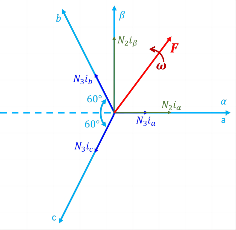
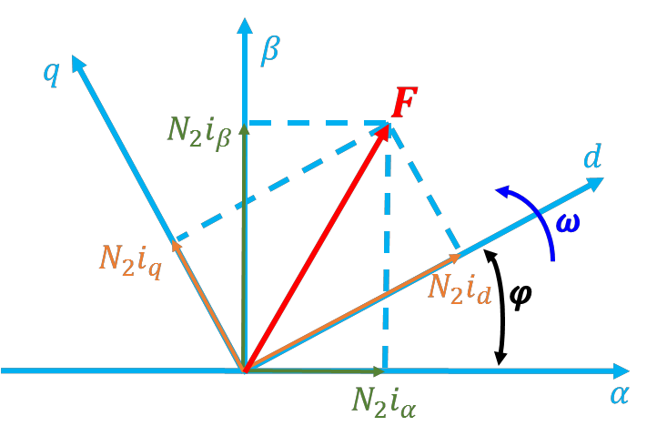
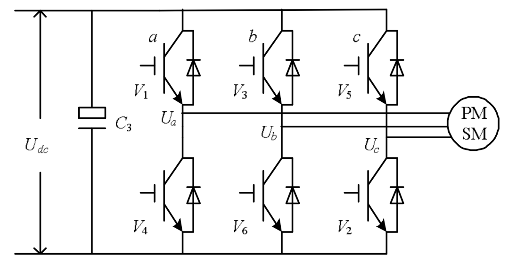
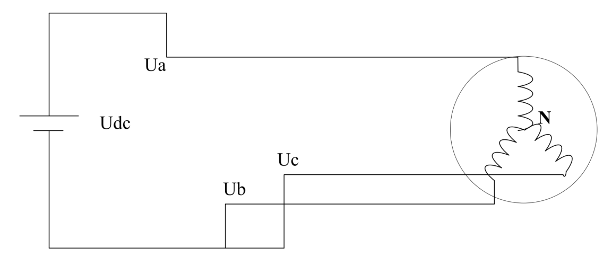
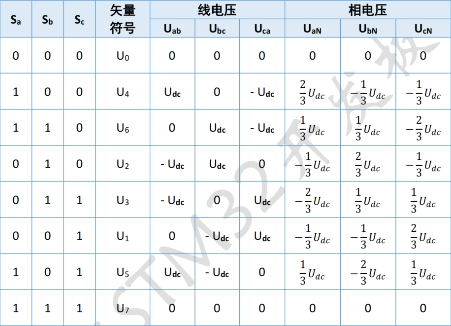
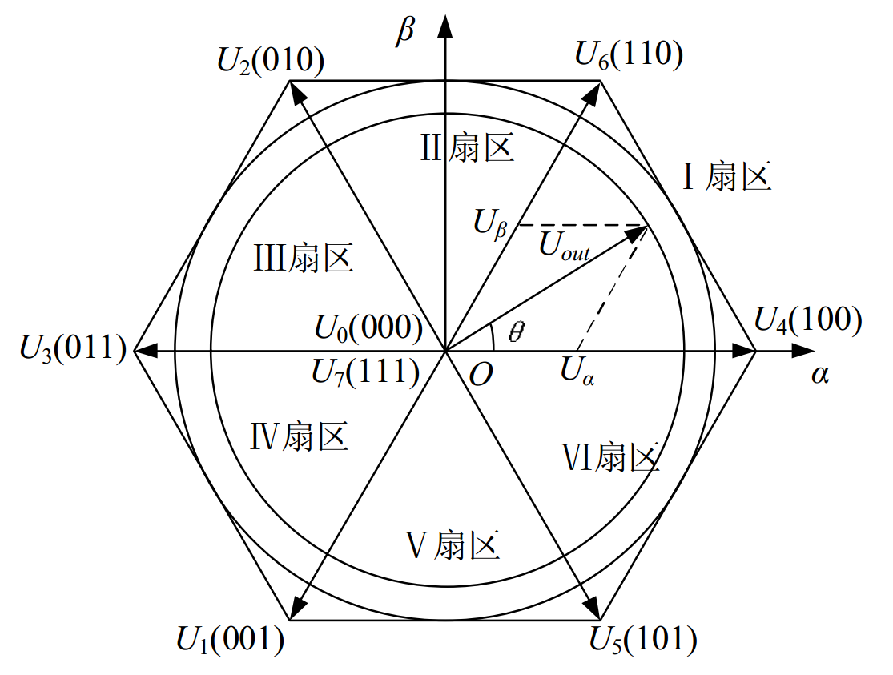
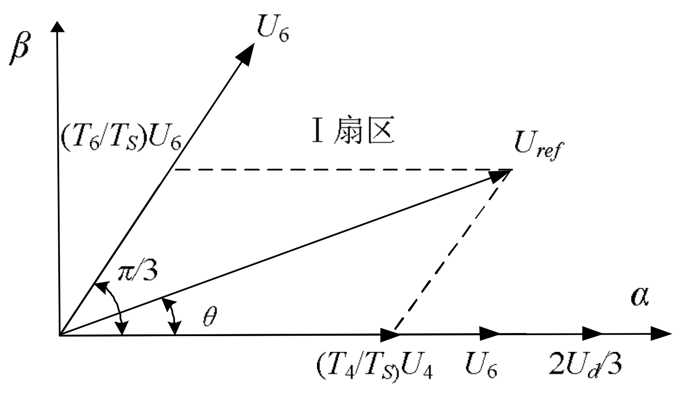
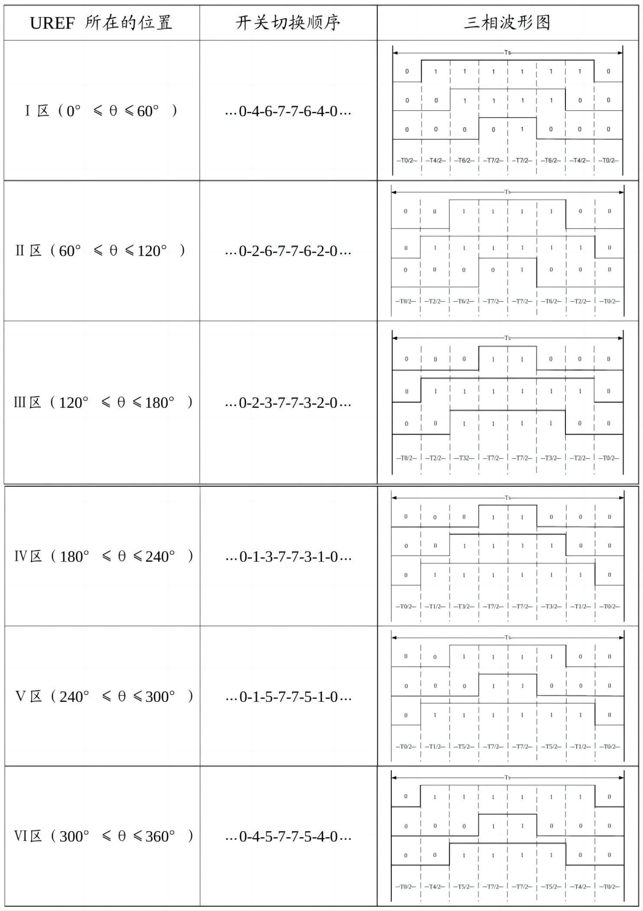
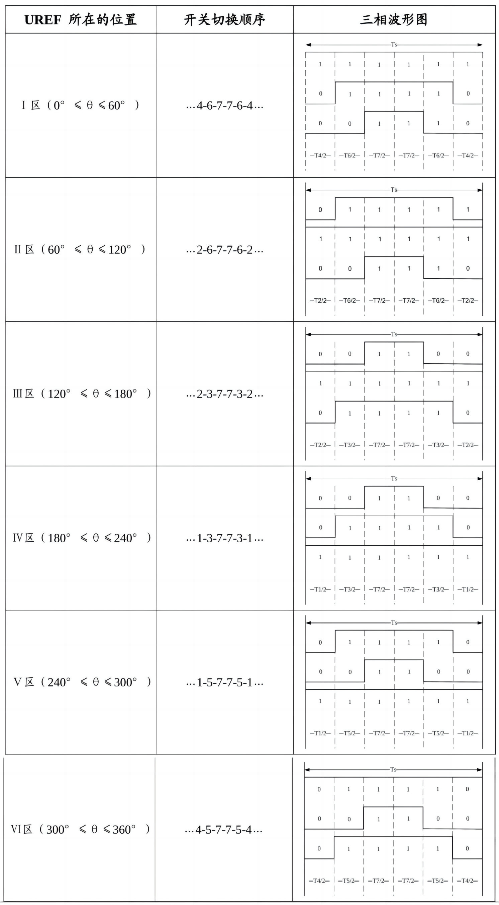
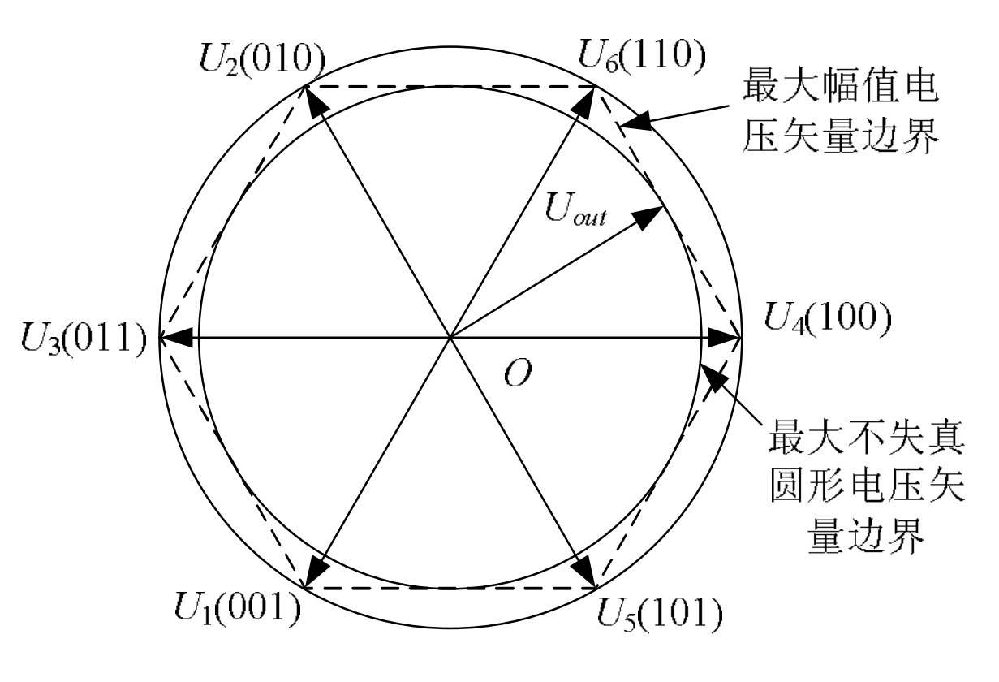

# 电机FOC软件设计

## 1 公式推导
### 1.1 FOC
#### Clarke变换
**设定**：三相绕组坐标系 abc 与两相绕组坐标系 αβ 的矢量坐标系如下图所示，A 相绕组轴线与 α 轴重合，β轴与α轴相互垂直，三相绕组坐标系 abc 与两相绕组坐标系 αβ 都是静止坐标，分别对应的交流电流为𝑖𝑎，𝑖𝑏，𝑖𝑐和𝑖𝛼，𝑖𝛽。设三相绕组每相有效匝数为$𝑁_3$，两相绕组每相有效匝数为$𝑁_2$，各相磁动势为有效匝数与电流的乘积，其空间矢量均位于有关相的坐标轴上。由于交流磁动势的大小随时间在变化着，图中磁动势矢量的长度也是随时变化的。

 

**公式推导**：设磁动势波形是正弦分布的，当三相总磁动势与两相磁动势相等时，两套绕组瞬间磁动势在α、β轴上的投影都应相等，则有：
$$\begin{cases}
N_2i_\alpha = N_3i_a -N_3i_b\cos 60^\circ -N_3i_c\cos 60^\circ =N_3\left ( i_a-\frac{1}{2}i_b -\frac{1}{2}i_c  \right )
\\ N_2i_\beta = N_3i_b\sin 60^\circ -N_3i_c\sin 60^\circ =\frac{\sqrt{3} }{2}N_3 \left (i_b-i_c  \right )
\end{cases} \text{（公式1-1）}$$

写成矩阵形式，为：
$$\begin{bmatrix}
 i_\alpha \\
i_\beta 
\end{bmatrix}=\frac{N_3}{N_2} \begin{bmatrix}
 1 & -\frac{1}{2}  &-\frac{1}{2} \\
 0 & \frac{\sqrt{3} }{2} &-\frac{\sqrt{3} }{2}
\end{bmatrix}\begin{bmatrix}
i_a \\ i_b
 \\ i_c
\end{bmatrix} \text{（公式1-2）} $$

若考虑变换前后幅值相等（等幅变换），则匝数比应为：
$$\frac{N_3}{N_2} = \frac{2}{3} \text{（公式1-3）}$$

又因为3相定子电流𝑖𝑎，𝑖𝑏，𝑖𝑐有如下关系(基尔霍夫电流定律)：
$$i_a+i_b+i_c=0 \text{（公式1-4）}$$

将**公式1-3**、**公式1-4**代入**公式1-2**，得到Clarke变换的最终形式：

$$\begin{bmatrix}
 i_\alpha \\
i_\beta 
\end{bmatrix}=\begin{bmatrix}
 1 & 0\\
 \frac{1}{\sqrt{3} }  & \frac{2}{\sqrt{3} }
\end{bmatrix}\begin{bmatrix}
 i_a\\
i_b
\end{bmatrix} \text{（公式1-5）}$$

**关于等幅变换和等功率变换**有如下几点说明：

1. 在使用等幅变换或等功率变换，程序计算电机功率的公式是不一样的，等幅变换需要乘以系数 $\frac{3}{2}$

$$\begin{cases}
 P_{\text{等功率变换}}=V_q\times I_q+V_d\times I_d\\
 P_{\text{等幅变换}}=\frac{3}{2}\times(V_q\times I_q+V_d\times I_d)
\end{cases}$$

1. 实际FOC设计中一般采用等幅变换，因为在svpwm设计中假如采用等功率变换，得到的矢量$U_t$为相电压峰值的1.5倍，将会超出空间矢量的圆圈，产生过调制。具体分析可参考以下链接：
2. [知乎.胡说.SVPWM调制中的6个非零基础电压矢量的幅值到底是Udc还是2/3Udc ?[BE/OL].(2023.1.17)[2024.1.31]](https://zhuanlan.zhihu.com/p/56529497)
3. [知乎.Panda.关于矢量控制clarke变化2/3和sqrt（2/3）的理解[BE/OL].(2020.3.13)[2024.1.31]](https://zhuanlan.zhihu.com/p/112704657)
4. [CSDN.w_乐天.Clark变换及比例系数2/3推导过程[BE/OL].(2019.5.7)[2024.1.31]](https://blog.csdn.net/daidi1989/article/details/89926324)

#### Park变换
**设定**：下图绘出了αβ和dq坐标系的磁动势矢量，绕组每相有效匝数均为$𝑁_2$，磁动势矢量位于相关的坐标轴上。两相交流电流𝑖𝛼、𝑖𝛽和两个直流电流𝑖d、𝑖q产生同样的以角速度ω旋转的合成磁动势F。由于各绕组匝数都相等，可以消去磁动势中的匝数，直接用电流表示，即F可以直接标成𝑖𝑠。

由图可见，𝑖𝛼、𝑖𝛽和𝑖d、𝑖q之间存在以下关系：
$$\begin{cases}
i_d =i_\alpha \cos \varphi +i_\beta \sin \varphi \\
i_q =-i_\alpha \sin \varphi +i_\beta \cos \varphi 
\end{cases}\text{（公式1-6）}$$
写成矩阵形式为：
$$\begin{bmatrix}
 i_d\\
i_q
\end{bmatrix}=\begin{bmatrix}
 \cos \varphi  & \sin \varphi \\
  -\sin \varphi &\cos \varphi 
\end{bmatrix} \begin{bmatrix}
 i_\alpha \\
i_\beta 
\end{bmatrix} \text{（公式1-7）}$$

#### RevPark变换
RevPark变换是Park变换的逆变换：
$$\begin{bmatrix}
 i_\alpha\\
i_\beta
\end{bmatrix}=\begin{bmatrix}
 \cos \varphi  & -\sin \varphi \\
  \sin \varphi &\cos \varphi 
\end{bmatrix} \begin{bmatrix}
 i_d\\
i_q
\end{bmatrix} \text{（公式1-8）}$$

### 1.2 SVPWM
#### 基本原理
SVPWM 的理论基础是**平均值等效原理**，即在一个开关周期内通过对基本电压矢量加以组合，使其平均值与给定电压矢量相等。在某个时刻，电压矢量旋转到某个区域中，可由组成这个区域的两个相邻的非零矢量和零矢量在时间上的不同组合来得到。两个矢量的作用时间在一个采样周期内分多次施加，从而控制各个电压矢量的作用时间，使电压空间矢量接近按圆轨迹旋转，通过逆变器的不同开关状态所产生的实际磁通去逼近理想**磁通圆**，并由两者的比较结果来决定逆变器的开关状态，从而形成 PWM 波形。逆变电路如图示。

设直流母线侧电压为 $U_{dc}$，逆变器输出的三相相电压为$𝑈_𝐴、𝑈_𝐵、𝑈_𝐶$，其分别加在空间上互差 120° 的三相平面静止坐标系上，可以定义三个电压空间矢量$𝒖_𝐴、𝒖_𝐵、𝒖_𝐶$，它们的方向始终在各相的轴线上，而大小则随时间按正弦规律做变化，时间相位互差 120°。假设$𝑈_𝑚$为相电压波峰值，$f$ 为电源频率, $θ = ωt = 2πft$，则有：
$$
\begin{cases}
U_{A}(t)=U_{m} \cos (\theta) \\
U_{B}(t)=U_{m} \cos (\theta-2 \pi / 3) \\
U_{C}(t)=U_{m} \cos (\theta+2 \pi / 3)
\end{cases} \text{（公式1-9）}
$$
其中， $\theta=2 \pi f t$，则三相电压空间矢量相加的合成空间矢量 $U{(t)}$就可以表示为：

$$
U(t)=U_{A}(t)+U_{B}(t) e^{j 2 \pi / 3}+U_{C}(t) e^{j 4 \pi / 3}=\frac{3}{2} U_{m} e^{j \theta} \text{（公式1-10）}
$$

可见$𝒖_𝑆(𝑡)$是一个旋转的空间矢量，它的幅值为相电压峰值的 1.5 倍（$𝑈_𝑚$为相电压峰值），且以角频率$ω = 2πf$按逆时针方向匀速旋转的空间矢量，而空间矢
量$𝒖_𝑆(𝑡)$在三相坐标轴（a，b，c）上的投影就是对称的三相正弦量。由于逆变器三相桥臂共有 6 个开关管，为了研究各相上下桥臂不同开关组合时逆变器输出的空间电压矢量，特定义开关函数$𝑆𝑥( x = a、b、c)$为：

$$
s_{x}=\begin{cases}
1 \text { 上桥臂导通 } \\
0 \text { 下桥臂导通 }
\end{cases}\text { \text{（公式1-11）} }
$$

(Sa、Sb、Sc)的全部可能组合共有八个，包括 6 个非零矢量 U1(001)、U2(010)、U3(011)、U4(100)、U5(101)、U6(110)、和两个零矢量 U0(000)、U7(111)，下面以其
中一种开关组合为例分析，假设 Sx ( x= a、b、c)= (100)， 此时如图：

由图可以列出电压关系式：
$$
\begin{cases}
U_{a b}=U_{d c}, U_{b c}=0, U_{c a}=-U_{d c} \\
U_{a N}-U_{b N}=U_{d c}, U_{a N}-U_{c N}=U_{d c} \\
U_{a N}+U_{b N}+U_{c N}=0
\end{cases}
$$

求解上述方程可得: $U_{a N}=2 U_{d} / 3 、 U_{b N}=-U_{d} / 3 、 U_{c N}=-U_{d} / 3$ 。同理可计算出其它各种组合下的空间电压矢量，如下表：

下图为八个基本电压空间矢量的大小和位置。

其中非零矢量的幅值相同（在𝛂𝛃两轴坐标系下,模长为$ \frac{2}{3} U_{dc} $；如果是在三相静止坐标系下，模长为 $U_{dc}$），相邻的矢量间隔 60°，而两个零矢量幅值为零，位于中心。**在每一个扇区，选择相邻的两个电压矢量以及零矢量，按照伏秒平衡的原则来合成每个扇区内的任意电压矢量**，即：

$$
\int_{0}^{T} U_{r e f} d t=\int_{0}^{T_{x}} U_{x} d t+\int_{T_{x}}^{T_{x}+T_{y}} U_{y} d t+\int_{T_{x}+T_{y}}^{T} U_{0}^{*} d t
$$

或者等效成：

$$
U_{r e f} * T=U_{x} * T_{x}+U_{y} * T_{y}+U_{0} * T_{0}
$$

其中，$ U_{ref} $ 为期望电压矢量；T 为采样周期；Tx、Ty、T0分别为对应两个非零电压矢量 Ux、Uy 和零电压矢量 U0 在一个采样周期的作用时间；其中 U0 包括了 U0 和 U7 两个零矢量。上式意义是，矢量 $ U_{ref} $ 在 T 时间内所产生的积分效果值和 Ux、Uy、U0 分别在时间 Tx、Ty、T0内产生的积分效果相加总和值相同。（**由于在𝑻𝐬时间内认为$ U_{ref} $ 的角度是不变的，所以通过计算时间𝑻𝐱、𝑻𝐲、𝑻𝟎这种方式实现的 SVPWM 是一种规则采样**）。

由于三相正弦波电压在电压空间向量中合成一个等效的旋转电压，其旋转速度是输入电源角频率，等效旋转电压的轨迹将是圆形。所以要产生三相正弦波电压，可以利用以上电压向量合成的技术，在电压空间向量上，将设定的电压向量由 U4(100)位置开始，每一次增加一个小增量，每一个小增量设定电压向量可以用该区中相邻的两个基本非零向量与零电压向量予以合成，如此所得到的设定电压向量就等效于一个在电压空间向量平面上平滑旋转的电压空间向量，从而达到电压空间向量脉宽调制的目的。

#### 法则推导
三相电压给定所合成的电压向量旋转角速度为 $\omega=2 \pi f$，旋转一周所需的时间为  $T=1 / f$ ；若载波频率是 $f_{s}$，则频率比为$R=f_{S} / f$ 。这样将电压旋转平面等切割成 R 个小增量，亦即设定电压向量每次增量的角度是 ：

$$
d \theta=\frac{2\pi }{R} =\frac{2\pi f }{f_s} =\frac{2\pi T_S }{T} 
$$

现在，假设欲合成的电压向量$ U_{ref} $在第Ⅰ区中一个增量的位置，如下图所示，

欲用 U4、U6、U0 及 U7合成，用平均值等效可得：

$$
U_{r e f} * T_{S}=U_{4} * T_{4}+U_{6} * T_{6}
$$

在两相静止参考坐标系(α,β)中，令 $U_{ref}$ 和 U4 间的夹角是 $θ$，由向量分解可得：

$$
\begin{cases}\left|U_{r e f}\right| \cos \theta=\frac{T_{4}}{T_{s}}\left|U_{4}\right|+\frac{T_{6}}{T_{s}}\left|U_{6}\right| \cos \frac{\pi}{3} & \alpha \text { 轴 }
\\ \left|U_{r e f}\right| \sin \theta=\frac{T_{6}}{T_{s}}\left|U_{6}\right| \sin \frac{\pi}{3} & \beta \text { 轴 }\end{cases} \text{（公式1-12）}
$$

因为$ \left|U_4\right|=\left|U_6\right|=2 U_{dc} /3 $，所以可以得到各矢量的状态保持时间为：

$$
\begin{cases}
T_{4}=m T_{S} \sin \left(\frac{\pi}{3}-\theta\right)
\\ T_{6}=m T_{S} \sin \theta
\end{cases}
$$

式中 $m$ 为 SVPWM 调制系数，$m=\sqrt{3}\left|U_{r e f}\right| / U_{d c}$。(调制比=调制波基波峰值/载波基波峰值)

而零电压向量所分配的时间为：

$$
T_7=T_0=(T_s-T_4-T_6) / 2 \text { （七段式） }
$$

或

$$
T_7=T_s-T_4-T_6 \text { （五段式） }
$$

得到以 $U_{4} 、 U_{6} 、 U_{7}$ 及 $U_{0}$ 合成的 $U_{ref}$ 的时间后，接下来就是如何产生实际的脉宽调制波形。在 SVPWM 调制方案中，零矢量的选择是最具灵活性的，适当选择零矢量，可最大限度地减少开关次数，尽可能避免在负载电流较大的时刻的开关动作，最大限度地减少开关损耗。

一个开关周期中空间矢量按分时方式发生作用，在时间上构成一个空间矢量的序列，空间矢量的序列组织方式有多种，按照空间矢量的对称性分类，可分为两相开关换流与三相开关换流。下面对常用的序列做分别介绍。

**7段式SVPWM**

我们以减少开关次数为目标，将基本矢量作用顺序的分配原则选定为：在每次开关状态转换时，只改变其中一相的开关状态，并且对零矢量在时间上进行了平均分配，**以使产生的 PWM 对称，从而有效地降低 PWM 的谐波分量**。当 U4(100)切换至 U0(000)时，只需改变 A 相上下一对切换开关，若由 U4(100)切换至 U7(111)则需改变 B、C 相上下两对切换开关，增加了一倍的切换损失。因此要改变电压向量 U4(100)、U2(010)、U1(001)的大小，需配合零电压向量 U0(000)，而要改变U6(110)、U3(011)、U5(100)，需配合零电压向量 U7(111)。这样通过在不同区间内安排不同的开关切换顺序，就可以获得对称的输出波形，其它各扇区的开关切换顺序如表格所示。

以第Ⅰ扇区为例，其所产生的三相波调制波形在时间 TS 时段中如表中图所示，图中电压向量出现的先后顺序为 U0、U4、U6、U7、U6、U4、U0，各电压向量的三相波形则与中的开关表示符号相对应.再下一个 TS 时段，$U_{ref}$ 的角度增加一个 $d \theta$，利用式可以重新计算新的 T0、T4、T6 及 T7值，得到新的合成三相类似所示的三相波形；这样每一个载波周期TS就会合成一个新的矢量，随着θ的逐渐增大，$U_{ref}$将依序进入第Ⅰ、Ⅱ、Ⅲ、Ⅳ、Ⅴ、Ⅵ区。在电压向量旋转一周期后，就会产生 R 个合成矢量。

**5段式SVPWM**

对 7 段而言，发波对称，谐波含量较小，但是每个开关周期有 6 次开关切换，为了进一步减少开关次数，采用每相开关在每个扇区状态维持不变的序列安排，使得每个开关周期只有 4 次开关切换。具体序列安排见表格。

关于7段式SVPWM和5段式SVPWM更详细的分析见以下链接：
1. [西门子技术论坛.空间电压矢量调制 SVPWM 技术[BE/OL].(2014)[2024.2.1]](https://www.ad.siemens.com.cn/club/bbs/upload/635297877834649352.pdf)
2. [知乎.司棣文.另类解析 | SVPWM的两种发波方式是怎么来的[BE/OL].(2021.9.17)[2024.2.1]](https://zhuanlan.zhihu.com/p/115067276)
3. [知乎.小英屋里.为什么五段式SVPWM比七段式SVPWM谐波大？[BE/OL].(2022.11.22)[2024.2.1]](https://www.zhihu.com/question/67446870/answer/2770240011)
4. [CSDN.michaelf.SVPWM分析、各个扇区详细计算以及Matlab仿真[BE/OL].(2022.1.23)[2024.2.1]](https://blog.csdn.net/michaelf/article/details/94013805)

#### 控制算法

通过以上 SVPWM 的法则推导分析可知要实现 SVPWM 信号的实时调制，**首先需要知道参考电压矢量 $U_{ref}$ 所在的区间位置，然后利用所在扇区的相邻两电压矢量和适当的零矢量来合成参考电压矢量**。图 14-10 图 14-9 是在静止坐标系(𝛼, 𝛽)中描述的电压空间矢量图，电压矢量调制的控制指令是矢量控制系统给出的矢量信号 $U_{ref}$ 它以某一角频率ω在空间逆时针旋转，当旋转到矢量图的某个60°扇区中时，系统计算该区间所需的基本电压空间矢量，并以此矢量所对应的状态去驱动功率开关元件动作。当控制矢量在空间旋转 360°后，逆变器就能输出一个周期的正弦波电压

##### 合成矢量$U_{ref}$所处扇区 N 的判断

空间矢量调制的第一步是判断由𝑈𝛼和𝑈𝛽所决定的空间电压矢量所处的扇区。假定合成的电压矢量落在第Ⅰ扇区，可知其等价条件如下：

$$
0<arc\tan(\frac{U_\beta }{U_\alpha } )<60^\circ
$$

以上等价条件再结合矢量图几何关系分析，可以判断出合成电压矢量$U_{ref}$落在第 X 扇区的充分必要条件，得出表格

|扇区|落在此扇区的充要条件 |
|  ----  |  ----  |
|Ⅰ | $U_\alpha > 0,U_\beta > 0 \text{且} U_\beta /U_\alpha < \sqrt{3} $ |
|Ⅱ | $U_\alpha > 0, \text{且} U_\beta /U_\alpha > \sqrt{3}$|
|Ⅲ |$U_\alpha < 0,U_\beta > 0 \text{且} -U_\beta /U_\alpha < \sqrt{3} $|
|Ⅳ |$U_\alpha < 0,U_\beta < 0 \text{且} U_\beta /U_\alpha < \sqrt{3} $|
|Ⅴ |$ U_\beta < 0, \text{且} -U_\beta /U_\alpha > \sqrt{3} $|
|Ⅵ | $U_\alpha > 0,U_\beta < 0 \text{且} -U_\beta /U_\alpha < \sqrt{3} $|

若进一步分析以上的条件，有可看出参考电压矢量$U_{ref}$所在的扇区完全由 $U_\beta ,\sqrt{3} U_\alpha -U_\beta ,-\sqrt{3} U_\alpha -U_\beta$ 三式决定，因此令：

$$
\begin{cases}
U_1 = U_\beta 
\\ U_2 = \frac{\sqrt{3} U_\alpha}{2}  -\frac{U_\beta}{2}  
\\ U_3 = -\frac{\sqrt{3} U_\alpha}{2}  -\frac{U_\beta}{2}  
\end{cases}
$$

再定义，若𝑈1>0，则 A=1，否则 A=0；若𝑈2>0，则 B=1，否则 B=0；若𝑈3>0，则 C=1，否则 C=0。可以看出 A，B，C 之间共有八种组合，但由判断扇区的公式可知 A，B，C 不会同时为 1 或同时为 0，所以实际的组合是六种，A，B，C 组合取不同的值对应着不同的扇区，并且是一一对应的，因此完全可以由 A，B，C 的组合判断所在的扇区。为区别六种状态，令

$$
N=4\times C+2\times B+A
$$

则可以通过下表计算参考电压矢量 $U_{ref}$ 所在的扇区。

|N|3 |1|5|4|6|2|
|  ----  |  ----  |----  |----  |----  |----  |----  |
|  扇区号  |  Ⅰ | Ⅱ | Ⅲ | Ⅳ | Ⅴ | Ⅵ  |

采用上述方法，只需经过简单的加减及逻辑运算即可确定所在的扇区，对于提高系统的响应速度和进行仿真都是很有意义的。

##### 基本矢量作用时间计算与三相 PWM 波形的合成
在传统 SVPWM 算法如公式 14-11 中用到了空间角度及三角函数，使得直接计算基本电压矢量作用时间变得十分困难。实际上，只要充分利用𝑈𝛼和𝑈𝛽就可以使计算大为简化。以 $U_{ref}$ 处在第Ⅰ扇区时进行分析，根据**公式1-12**有：

$$
\begin{bmatrix}
 U_\alpha \\
U_\beta
\end{bmatrix}T_S = U_{ref}\begin{bmatrix}
\cos \theta  \\
\sin \theta
\end{bmatrix}T_S = \frac{2}{3} U_{dc}\left ( \begin{bmatrix}
 1\\
0
\end{bmatrix} T_4 + \begin{bmatrix}
 \cos \frac{\pi }{3} \\
\sin \frac{\pi }{3}
\end{bmatrix}T_6\right )
$$

经过整理后得出：

$$
\begin{cases}
U_\alpha T_s = \frac{2}{3}U_{dc}\left ( T_4 +\frac{1}{2}T_6  \right )   \\
U_\beta  T_s = \frac{2}{3}U_{dc}\left ( \frac{\sqrt{3} }{2}T_6  \right )
\end{cases}
$$

$$
\begin{cases}
T_4=\frac{3U_\alpha T_S}{2U_{dc}}-\frac{1}{2} T_6 = \frac{3U_\alpha T_S}{2U_{dc}} - \frac{\sqrt{3}U_\beta T_S }{2U_{dc}}=\frac{\sqrt{3}T_S }{U_{dc}}U_2=KU_2 \\
T_6=\frac{\sqrt{3}U_\beta T_S }{U_{dc}}=\frac{\sqrt{3} T_S }{U_{dc}}U_1=KU_1\\
T_7=T_0=(T_s-T_4-T_6) / 2 \text { （七段式） } \\
T_7=T_s-T_4-T_6 \text { （五段式） }
\end{cases}
$$

同理可求得$U_{ref}$在其它扇区中各矢量的作用时间，结果如表所示（以 7 段为例），表中两个非零矢量作用时间的比例系数为$𝑲 =\frac{\sqrt{3}T_S }{U_{dc}}$
。由此可根据公式 14-14中的𝑈1、𝑈2、𝑈3判断合成矢量所在扇区，然后查表得出两非零矢量的作用时间，最后得出三相 PWM 波占空比，表 2-4 可以使 SVPWM 算法编程简易实现。

|扇区|各扇区基本空间矢量的作用时间 |
|  ----  |  ----  |
|Ⅰ | $\begin{cases} T_4=\frac{\sqrt{3}T_S }{U_{dc}}\left ( \frac{\sqrt{3}U_\alpha }{2} -\frac{U_\beta }{2}   \right ) =KU_2 \\ T_6=\frac{\sqrt{3}U_\beta T_S }{U_{dc}}=KU_1\\ T_7=T_0=(T_s-T_4-T_6) / 2  \end{cases}$|
|Ⅱ | $\begin{cases} T_6=\frac{\sqrt{3}T_S }{U_{dc}}\left ( \frac{\sqrt{3}U_\alpha }{2} +\frac{U_\beta }{2}   \right ) =-KU_3 \\ T_2=\frac{\sqrt{3}T_S }{U_{dc}}\left ( \frac{\sqrt{3}U_\alpha }{2} -\frac{U_\beta }{2}   \right ) =-KU_2 \\ T_7=T_0=(T_s-T_6-T_2) / 2  \end{cases}$|
|Ⅲ |$\begin{cases} T_2=\frac{\sqrt{3}U_\beta T_S }{U_{dc}}=KU_1 \\ T_3=\frac{\sqrt{3}T_S }{U_{dc}}\left ( -\frac{\sqrt{3}U_\alpha }{2} -\frac{U_\beta }{2}   \right ) =KU_3 \\ T_7=T_0=(T_s-T_2-T_3) / 2  \end{cases}$|
|Ⅳ |$\begin{cases} T_3=\frac{\sqrt{3}T_S }{U_{dc}}\left ( -\frac{\sqrt{3}U_\alpha }{2} +\frac{U_\beta }{2}   \right ) =-KU_2 \\ T_1=-\frac{\sqrt{3}U_\beta T_S }{U_{dc}}=-KU_1\\ T_7=T_0=(T_s-T_3-T_1) / 2  \end{cases}$|
|Ⅴ | $\begin{cases} T_1=\frac{\sqrt{3}T_S }{U_{dc}}\left ( -\frac{\sqrt{3}U_\alpha }{2} -\frac{U_\beta }{2}   \right ) =KU_3 \\ T_5=\frac{\sqrt{3}T_S }{U_{dc}}\left ( \frac{\sqrt{3}U_\alpha }{2} -\frac{U_\beta }{2}   \right ) =KU_2 \\ T_7=T_0=(T_s-T_1-T_5) / 2  \end{cases}$|
|Ⅵ | $\begin{cases} T_5=-\frac{\sqrt{3}U_\beta T_S }{U_{dc}}=-KU_1 \\ T_4=\frac{\sqrt{3}T_S }{U_{dc}}\left ( \frac{\sqrt{3}U_\alpha }{2} +\frac{U_\beta }{2}   \right ) =-KU_3 \\ T_7=T_0=(T_s-T_5-T_4) / 2  \end{cases}$|

由公式 14-15 可知，当两个零电压矢量作用时间为 0 时，一个 PWM 周期内非零电压矢量的作用时间最长，此时的合成空间电压矢量幅值最大，由下图可知其幅值最大不会超过图中所示的正六边形边界。而当合成矢量落在该边界之外时，将发生过调制，逆变器输出电压波形将发生失真。

在 SVPWM 调制模式下，逆变器能够输出的最大不失真圆形旋转电压矢量为上图所示虚线正六边形的内切圆，其幅值为：$\frac{\sqrt{3} }{2} \times \frac{2}{3} U_{dc}=\frac{\sqrt{3} }{3} U_{dc}$，即逆变器输出的不失真最大正弦相电压幅值为$\frac{\sqrt{3} }{3} U_{dc}$，而若采用三相 SPWM 调制，逆变器能输出的不失真最大正弦相电压幅值为 $\frac{U_{dc}}{2}$。显然 SVPWM 调制模式下对直流侧电压利用率更高，它们的直流利用率之比为 $\frac{\sqrt{3} }{3}U_{dc}/ \frac{U_{dc}}{2} =1.1547$，即 SVPWM 法比 SPWM 法的直流电压利用率提高了 15.47%。

如图 14-11 当合成电压矢量端点落在正六边形与外接圆之间时，已发生过调制，输出电压将发生失真，必须采取过调制处理，这里采用一种比例缩小算法。定义每个扇区中先发生的矢量用为 $𝑇_{𝑁𝑥}$，后发生的矢量为 $𝑇_{𝑁𝑦}$ 。当 $𝑇_𝑥 + 𝑇_𝑦 ≤ 𝑇_𝑠$ 时，矢量端点在正六边形之内，不发生过调制；当 $𝑇_𝑥 + 𝑇_𝑦 > 𝑇_𝑠$ 时，矢量端点超出正六边形，发生过调制。输出的波形会出现严重的失真，需采取以下措施：

设将电压矢量轨迹端点拉回至正六边形内切圆内时两非零矢量作用时间分别为 $T^\prime _x,T^\prime _y$，则有比例关系：

$$
\frac{T^\prime _x}{T_x} = \frac{T^\prime _y}{T_y}
$$

因此可用下式求得 $T^\prime _x,T^\prime _y,T_0,T_7$:

$$
\begin{cases}
T^\prime _x = \frac{T_xT_s}{T_x + T_y} \\
T^\prime _y = \frac{T_yT_s}{T_x + T_y} \\
T_0 =T_7 =0
\end{cases}
$$

按照上述过程，就能得到每个扇区相邻两电压空间矢量和零电压矢量的作用时间。

当$U_{ref}$所在扇区和对应有效电压矢量的作用时间确定后，再根据 PWM 调制原理，计算出每一相对应定时器比较器的值，其运算关系如下：

$$
\begin{cases}
t_{aon}= \frac{T_s -T_x -T_y}{4}  \\
t_{bon}= \frac{t_{aon} +T_x}{2}  \\
t_{con}= \frac{t_{aon} +T_y}{2}
\end{cases}
$$

上式中𝑡𝑎𝑜𝑛、𝑡𝑏𝑜𝑛和𝑡𝑐𝑜𝑛分别是相应的定时器比较器的值，而不同扇区定时器比较器的值分配见表格 14-7：
|扇区|Ⅰ |Ⅱ|Ⅲ|Ⅳ|Ⅴ|Ⅵ|
|  ----  |  ----  |  ----  |  ----  |  ----  |  ----  |  ----  |
|N|3 |1|5|4|6|2|
|N|$T_{aon}$ |$T_{bon}$|$T_{con}$|$T_{con}$|$T_{bon}$|$T_{aon}$|
|N|$T_{bon}$ |$T_{aon}$|$T_{aon}$|$T_{bon}$|$T_{con}$|$T_{con}$|
|N|$T_{con}$ |$T_{con}$|$T_{bon}$|$T_{aon}$|$T_{aon}$|$T_{bon}$|

其中，𝑇𝑎、𝑇𝑏和𝑇𝑐分别对应三相比较器的值，将这三个值写入相应的定时器比较寄存器就完成了整个 SVPWM 算法

### 1.3 PID

1. [CSND.hducollins.永磁同步电机(PMSM)的FOC闭环控制详解[BE/OL].(2018.2.8)[2024.8.16]](https://blog.csdn.net/hducollins/article/details/79260176)
2. [CSND.烦恼归林.电机控制杂谈——位置环到底该用什么调节器？[BE/OL].(2024.7.9)[2024.8.16]](https://blog.csdn.net/m0_46903653/article/details/140290973)
3. [ST.MC SDK 5.x 中增加位置环[BE/OL].(2020.3.21)[2024.8.16]](https://shequ.stmicroelectronics.cn/thread-624156-1-1.html)
4. 腾福林，胡育文，刘洋，储剑波.位置/电流两环结构位置伺服系统的跟随性能[J].电工技术学报.2009, 24(10): 40-46
https://www.cnblogs.com/ren-jiong/p/15136615.html
https://zhuanlan.zhihu.com/p/135396298
https://zhuanlan.zhihu.com/p/146373628
https://www.zhihu.com/question/29230624/answer/45084377
https://blog.csdn.net/sy243772901/article/details/82221672 重要

https://blog.csdn.net/weixin_44149976/article/details/133129051
https://zhuanlan.zhihu.com/p/26684551

https://blog.csdn.net/daidi1989/article/details/90078665

## 2 Simulink模型

## 1 标幺值系统

## 2 功率计算
12V系统BLDC电机在不同坐标系下的功率计算方法  https://mp.weixin.qq.com/s/-BSK4i1tmljAVbdvNCkd8g

1. [硬石电机控制专题指导手册[BE/OL].(2020.6.2)[2024.1.31]]()

母线电压补偿
https://zhuanlan.zhihu.com/p/495852697

电机控制中的数学模型标幺化计算 - 知乎  https://zhuanlan.zhihu.com/p/469634745