# 主流开源电机驱动方案盘点

## 1.[ODrive](https://odriverobotics.com/)

### 简介

ODrive是一个开源的直流无刷电机控制系统，它可以实现高性能的电机控制，适用于机器人、无人机、电动滑板等应用。作者是[Oskar Weigl](https://twitter.com/OskarWeigl)，是一位瑞士的软件工程师，他在2016年开始了ODrive的开发，目的是为了让高性能的电机控制更加便宜和易用。

### 发展

* ODrive v1: 2016年发布，支持12V-24V电压，10A电流，增量式编码器，I2C通信
* ODrive v2: 2016年发布，支持12V-48V电压，20A电流，增量式编码器，USB通信
* ODrive v3: 2017年发布，支持8V-56V电压，30A电流，增量式编码器，霍尔传感器，USB通信
* ODrive v3.5: 2018年发布，支持8V-56V电压，45A电流，增量式编码器，霍尔传感器，USB通信
* [ODrive v3.6](https://github.com/odriverobotics/ODrive): 2019年发布，支持8V-56V电压，60A电流，增量式编码器，霍尔传感器，绝对值编码器，USB通信
* ODrive Pro(该版本固件没有开源): 2021年发布，支持15V-58V电压，80A电流，绝对值编码器，RS485通信

### 主要版本介绍

#### ODrive v3.6

|  功能  | 参数(来源于[官网](https://odriverobotics.com/shop/odrive-v36)) | 补充说明 |
|  ----  |   ----  |  ----  |
| 电源电压 | 12V ~ 56V |  |
| 峰值电流 | 每个电机的峰值电流为 120A |  |
| 持续电流 | 可达60A | 取决于散热条件：[详细信息](https://discourse.odriverobotics.com/t/odrive-mosfet-temperature-rise-measurements-using-the-onboard-thermistor/972/5) |
| 控制模式 | 位置、速度和电流控制模式 |  |
| 参数辨识 | 电感、电阻 |  |
| 通信支持 | USB(4000 float/s)、UART、CAN、PWM |  |
| 码盘支持 | 增量式编码器、霍尔传感器、绝对值编码器 |  |

硬件方案([github](https://github.com/odriverobotics/ODriveHardware))

|  MCU  | MOS | MOS驱动 | 电流采样 | 电源 | PCB |
|  ----  |   ----  |  ----  |  ----  |  ----  |  ----  |
|  STM32F405RGT6 | [NTMFS5C628NLT](https://atta.szlcsc.com/upload/public/pdf/source/20180112/C145537_15157255457011261296.PDF?Expires=4070880000&OSSAccessKeyId=LTAIJDIkh7KmGS1H&Signature=8kUkxRdq%2BUGdAMDqSPgSqtBOhPs%3D&response-content-disposition=attachment%3Bfilename%3DC145537_N%25E6%25B2%259F%25E9%2581%259360V%25E5%258D%2595N%25E6%25B2%259F%25E9%2581%2593%25EF%25BC%258C%25E5%258A%259F%25E7%258E%2587MOSFET%25EF%25BC%258C60V%25EF%25BC%258C150A%25EF%25BC%258C2.4M%25CE%25A9_2018-01-12.PDF) (48V版本，双路并联)、NTMFS4935NT1G(24V版本) | drv8301 | 0.5mΩ 1% 3W采样电阻，双电阻采样|-|4层|

|外观|尺寸|
|  ----  |  ----  |
|  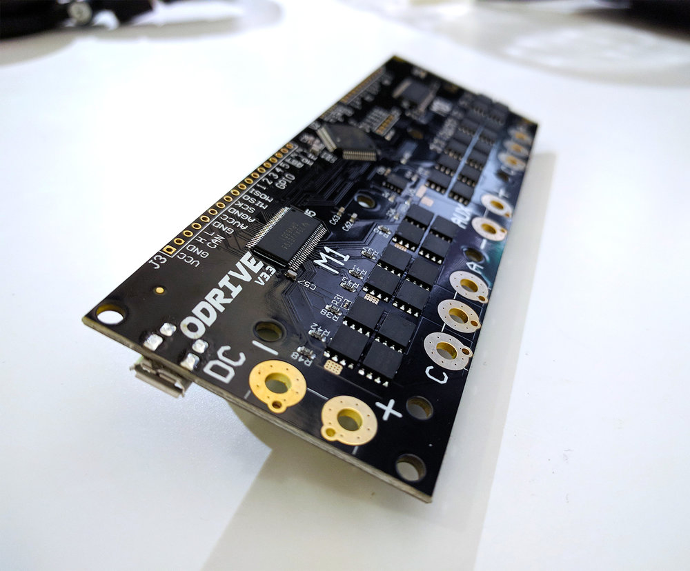  |   |
|  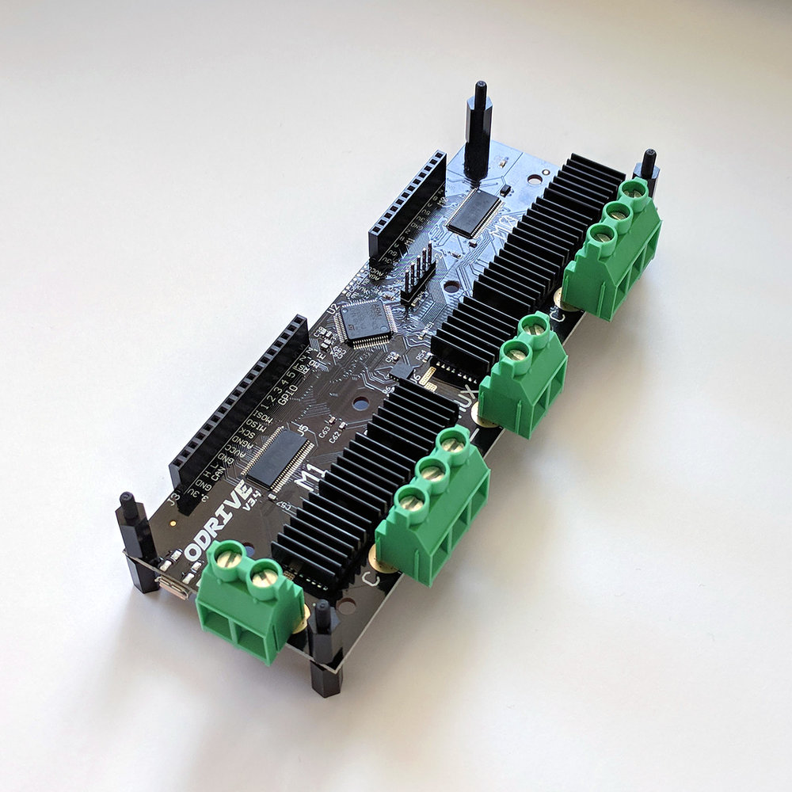  |                                     |

#### ODrivePro

|  功能  | 参数(来源官方帮助[文档](https://docs.odriverobotics.com/v/latest/getting-started.html)） | 补充说明 |
|  ----  |   ----  |  ----  |
| 电源电压 | 15V ~ 58V |  |
| 峰值电流 | 峰值电流为 120A |  |
| 持续电流 | 20A 无冷却、80A 主动散热、120A 峰值(最多3S) | |
| 控制模式 | 位置、速度、电流、轨迹控制 |  |
| 通信支持 | USB、UART、CAN-FD、PWM、模拟输入 | 关于CAN-FD，最新的固件(0.6.6_2023.4.12)还未支持 |
| 码盘支持 | 增量式编码器、霍尔传感器、绝对值编码器、无感模式 |  |
| 其他 | 支持能量制动回收 |官网只提了一句，没有找到更详细的说明|

|外观| |
|  ----  |  ----  | 
|  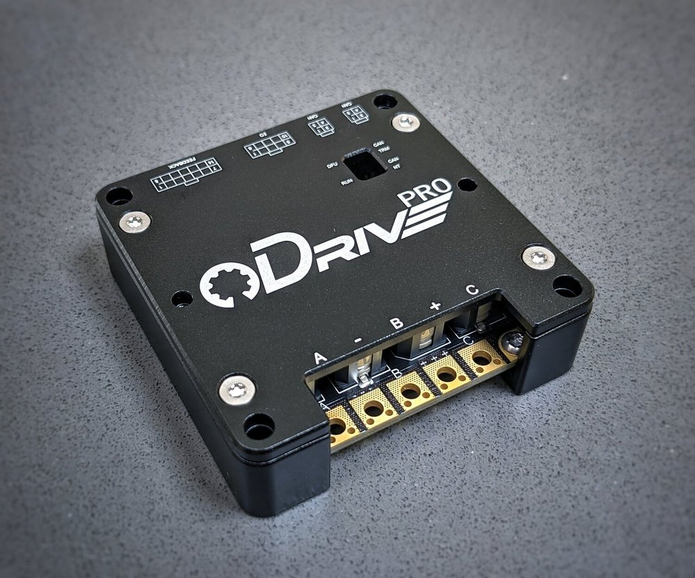  |  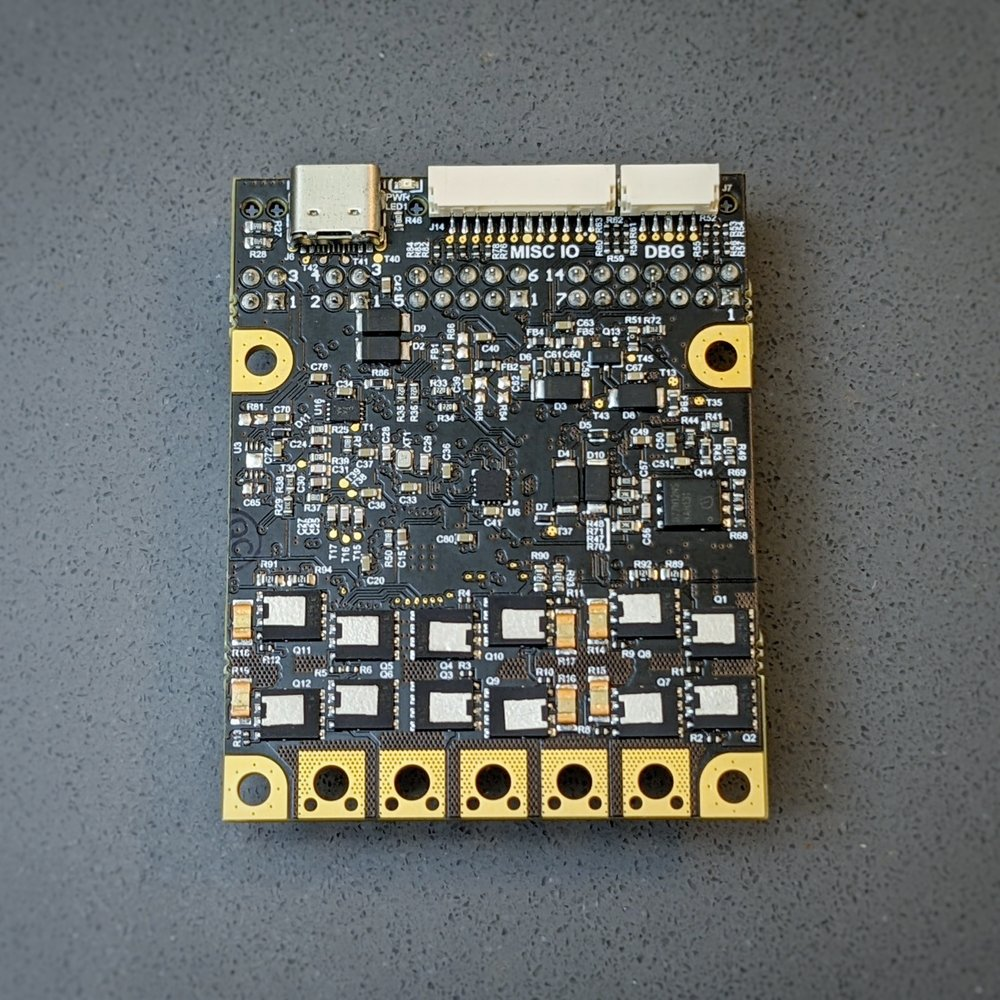 | 
|  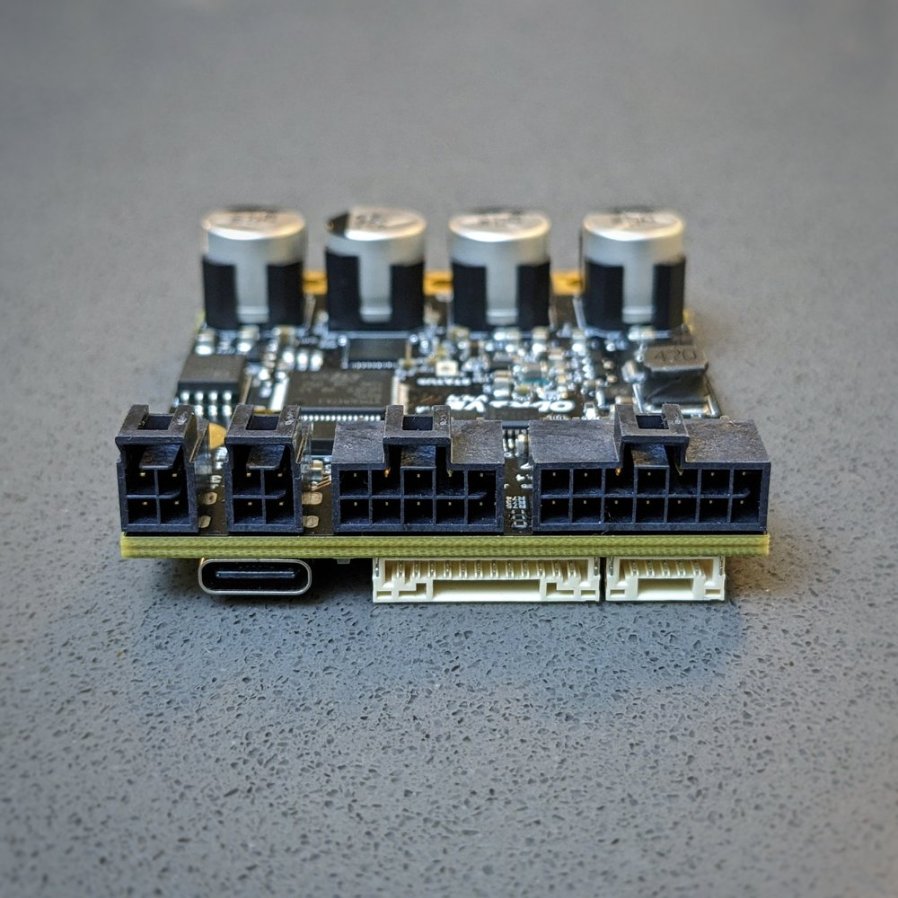  |  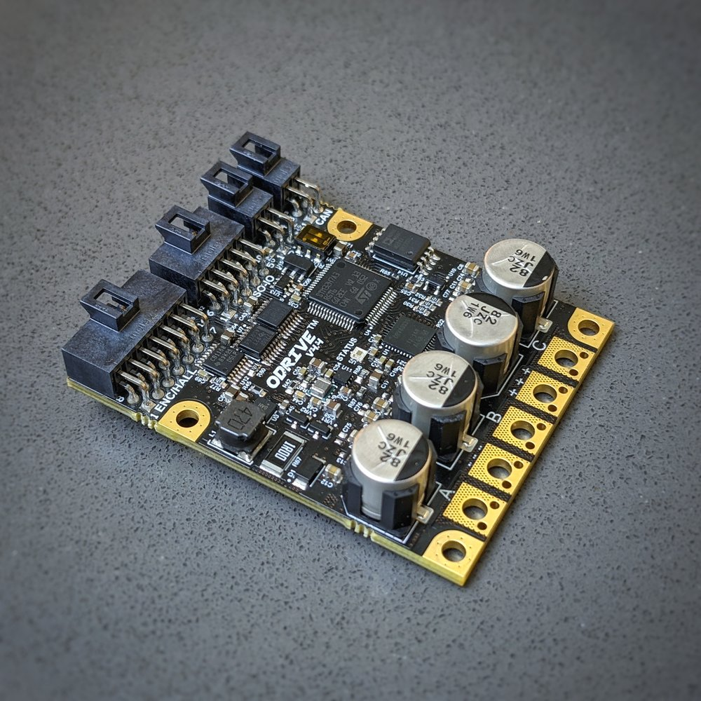 |

### 知名应用

&emsp;&emsp;目前看到的使用ODrive的项目主要集中在：电动滑板车、四足机器人、平衡车、电动自行车等方向。如日本仿生机器人、斯坦福Doggo机器狗，还有稚晖君的[驱动器](https://www.bilibili.com/video/BV11V41127pq)也基于ODrive。

---
## 2.[SimpleFOC](https://www.simplefoc.com/)

### 简介

SimpleFOC是一种基于Arduino的FOC算法库，可以用于无刷直流电机和步进电机的控制。SimpleFOC的目标是提供一种简单易用，高性能，低成本的电机控制方案，让用户可以快速地实现电机的速度控制、位置控制和力矩控制。作者是[Antun Skuric](https://askuric.github.io/)，是一位法国的电气工程师。

### 发展

* 2019年4月，SimpleFOC项目开始，最初只支持无刷直流电机的控制。
* 2019年8月，v1.0.0，支持Arduino Uno和Arduino Nano等开发板。
* 2019年11月，v1.5.0，增加了对步进电机的控制支持，以及对Arduino Due和Teensy等开发板的支持。
* 2020年3月，v1.6.0，增加了对霍尔传感器和绝对编码器的支持，以及对STM32等开发板的支持。
* 2020年7月，v2.0.0，增加了对多轴电机控制的支持，以及对ESP32等开发板的支持。
* 2020年12月，v2.1.0，增加了对电流控制模式和力矩控制模式的支持，以及对Arduino MKR等开发板的支持。
* 2021年4月，v2.2.0，增加了对电机参数自动识别和调试功能的支持，以及对Arduino Nano 33 BLE等开发板的支持。
* 2023年4月，v2.3.0，增加了对更多电机和处理器的支持，以及优化了一些[细节](https://docs.simplefoc.com/docs_chinese/)

### 一些硬件版本

|型号|功率 |实物||
|  ----  |  ----  |  ----  | ----  |
|  SimpleFOCMini  |  <3A |   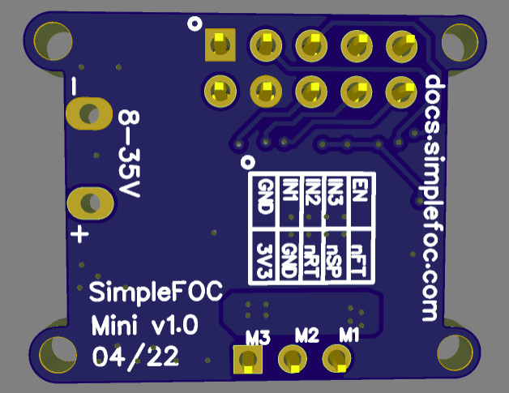  | 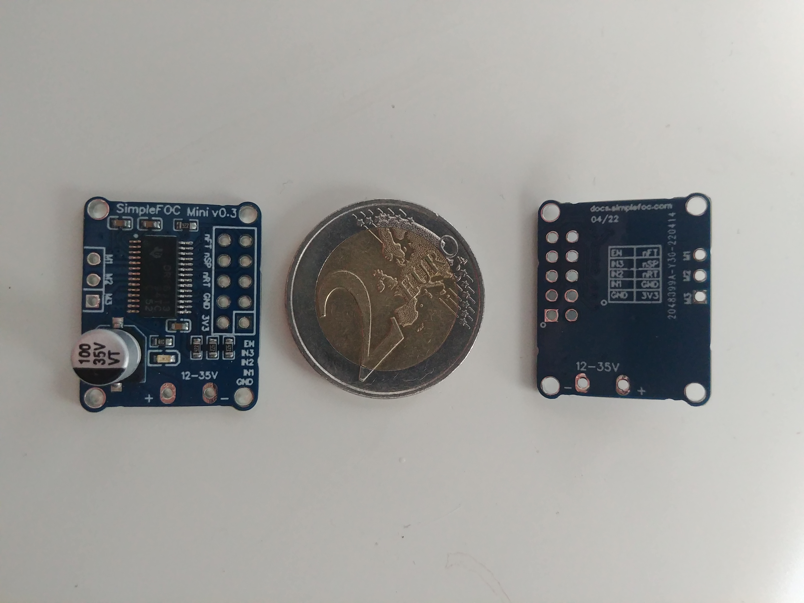  |
|  SimpleFOCShield|  <5A |   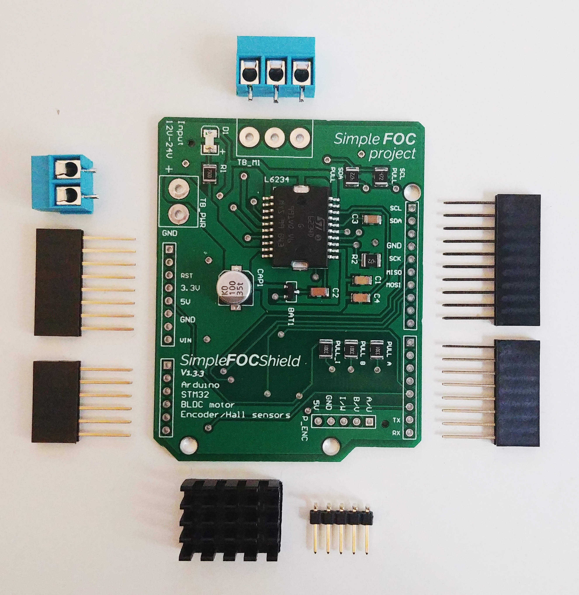  | 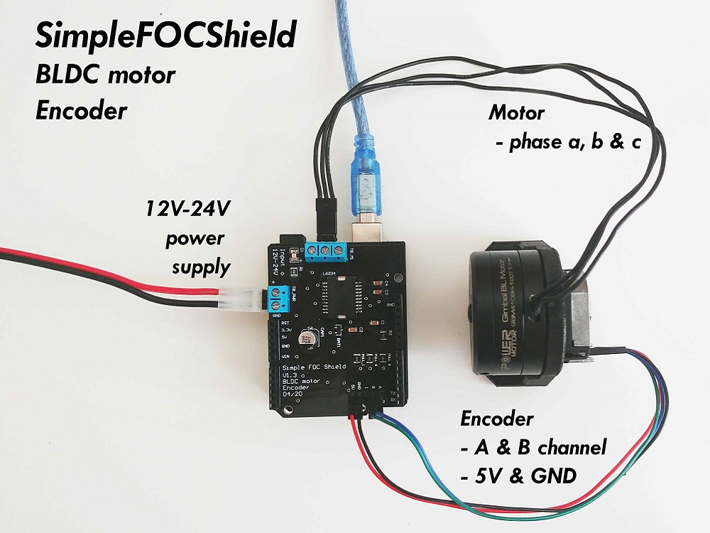  |
|  SimpleFOCPowerShield  |  <30A |   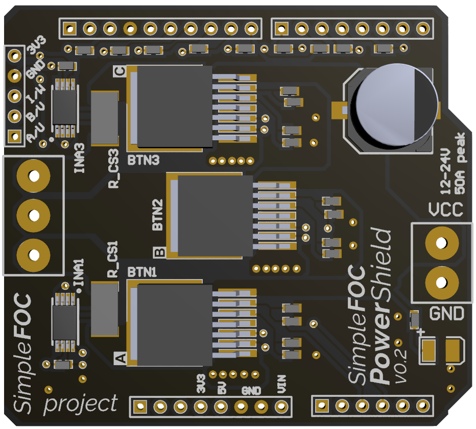  |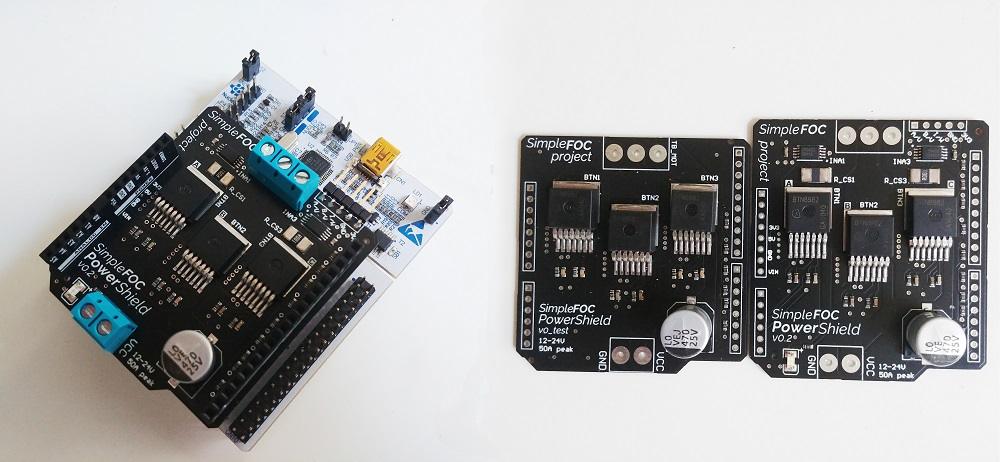  |

SimpleFOCPowerShield硬件方案([github](https://github.com/simplefoc/Arduino-SimpleFOC-PowerShield))
|  MCU  | MOS | MOS驱动 | 电流采样 | 电源 | PCB |
|  ----  |   ----  |  ----  |  ----  |  ----  |  ----  |
|  无 | [BTN8982](https://atta.szlcsc.com/upload/public/pdf/source/20220204/C2653440_702986052287C1B0960238BAE5FC3054.pdf)  | BTN8982 | 1mΩ 双电阻采样|无|2层|

---
## 3.[VESC（本杰明电调）](https://vesc-project.com)

### 简介

VESC 是一个开源的无刷电机驱动器，是由瑞典的工程师[本杰明·维德尔（Benjamin Vedder）](http://vedder.se/)开发的，最初应用于电动滑板，但是由于其出色的性能，也渐渐在其他领域得到了应用(电动助力自行车， 山地车，电动滑板，越野滑板，越野scooter ，平衡车，独轮车，航模飞机，)。

### 发展

* 2014年，本杰明发布了VESC 4.0的硬件设计和固件源码，这是第一个公开的版本。
* 2015年，本杰明发布了VESC 4.10和4.11的硬件设计，增加了一些新的功能和改进。
* 2016年，本杰明发布了VESC 4.12的硬件设计，这是目前最流行的版本之一。
* 2017年，本杰明发布了VESC 6.0的硬件设计和固件源码，这是一个全新的版本，提高了性能和可靠性(开始支持FOC)。
* 2018年，本杰明发布了VESC Tool软件，这是一个用于配置和控制VESC的图形界面程序。
* 2019年，本杰明发布了VESC HD60和HD75的硬件设计，这是一些高功率的版本，适用于更大的电机和负载。
* 2020年，本杰明发布了VESC 75/300的硬件设计，这是一个超高功率的版本，可以驱动300A的电流。
* 2021年，本杰明发布了VESC FW5.3的固件源码，这是目前最新的固件版本。

### 主要版本介绍

#### VESC 75/300

|  功能  | 参数(来源于[官网](https://trampaboards.com/vesc-75v-300a-black-anodised-non-conductive-cnc-housing--the-most-powerful-vedder-electronic-speed-controller-ever-p-26284.html)) | 补充说明 |
|  ----  |   ----  |  ----  |
| 电源电压 | 14V ~ 67V,电压尖峰不得超过 75V |  |
| 峰值电流 | 450A |  |
| 持续电流 | 可达300A | 取决于散热条件|
| 通信支持 | USB、CAN、UART、PPM、模拟、NRF Nyko Kama Nunchuck |  |
| 码盘支持 | ABI、HALL、AS5047、SIN-COS RMB29（在 COMM 端口上） |  |
| 其他 | 带IMU |  |

硬件方案([官网](https://vesc-project.com/node/311))

|  MCU  | MOS | MOS驱动 | 电流采样 | 电源 | PCB |
|  ----  |   ----  |  ----  |  ----  |  ----  |  ----  |
|  STM32F405RGT6 | [IRF7759](https://atta.szlcsc.com/upload/public/pdf/source/20200513/C533296_51CD726AEEA63EC1F9FFF5B2FD4FA5BA.pdf) 3路并联 |  [UCC2721](https://www.ti.com/cn/lit/ds/symlink/ucc27211.pdf?ts=1682588025815&ref_url=https%253A%252F%252Fso.szlcsc.com%252Fglobal.html%253Fk%253DUCC2721%2526hot-key%253DMSP430F149IPMR) | 0.5mΩ 三电阻采样（三电阻并联，相电流采样）|-|只提供原理图支持，不提高layout|

|外观|
|  ----  |
|  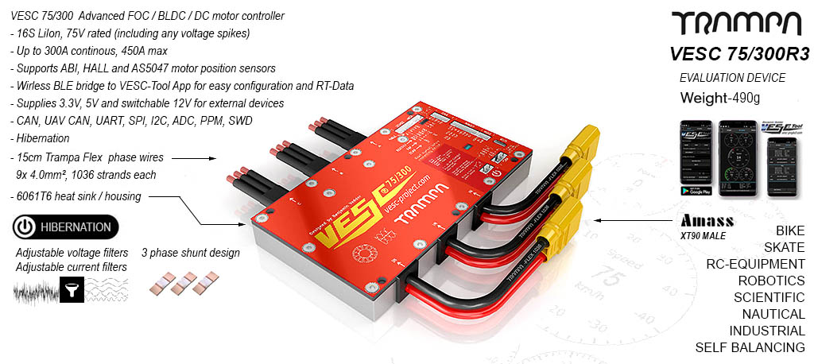  | 

---
## 4.[MJBOTS](https://mjbots.com/)

### 简介

&emsp;&emsp;MJBOTS项目是一个开源的机器人系统，它提供了高性能的机器人部件和平台，让用户可以自由地定制和修改。MJBOTS项目的目标是推动机器人技术的发展和普及。创始人是[Josh Pieper](https://jpieper.com/)，是一位资深的机器人工程师。曾经在Boston Dynamics工作过，参与了BigDog和Spot等知名的四足机器人的开发。于2019年离开谷歌，开始了MJBOTS项目。B站上有一个搬运YouTube的视频，叫做与[四足机器人大佬面对面mjbots with Josh Pieper](https://www.bilibili.com/video/BV1uq4y1J7Q9/)

&emsp;&emsp;moteus是MJBOTS项目的一个子项目，它是一种无刷伺服电机驱动器，可以用于机器人的关节驱动。moteus的设计包括了固件和电路板，它可以实现高性能、高效率、高精度的电机控制。moteus的代码和资料都是开源的，可以在[GitHub](https://github.com/mjbots/moteus)上找到。
### 发展

* 从2019年开始，截止目前github上最近的一次提交记录是20230323，共用27个[Releases](https://github.com/mjbots/moteus/releases)。硬件上，[moteus r4.11](https://mjbots.com/products/moteus-r4-11)和[moteus-n1](https://mjbots.com/products/moteus-n1)是目前最主要的两个版本。

### 主要版本介绍

#### moteus r4.11

|  功能  | 参数| 补充说明 |
|  ----  |   ----  |  ----  |
| 电源电压 | 10V ~ 44V |  |
| 峰值电流 | 峰值相电流 100A | 峰值功率500W |
| 通信支持 | CAN-FD |  |
| 码盘支持 | 磁编码盘|  |

硬件方案
|  MCU  | MOS | MOS驱动 | 电流采样 | 电源 | PCB |
|  ----  |   ----  |  ----  |  ----  |  ----  |  ----  |
|  STM32G474CEU6 | TPH2R506 | drv8353FS |-|-|-|

|外观||
|  ----  |  ----  | 
|  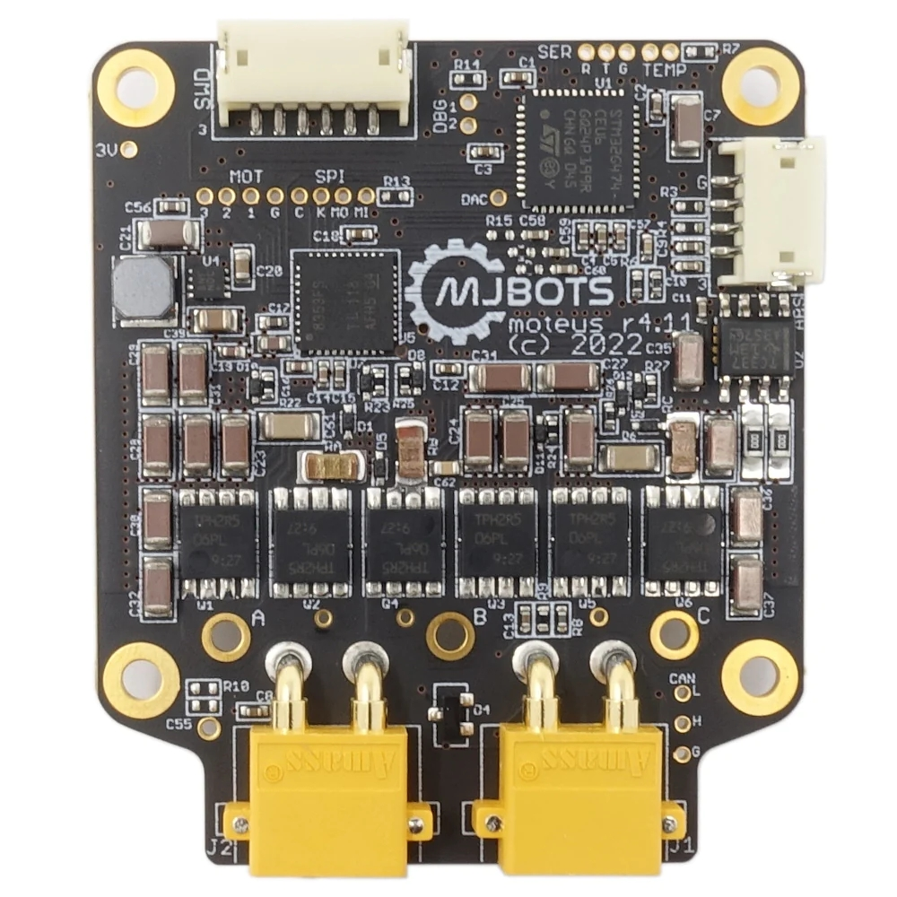  |  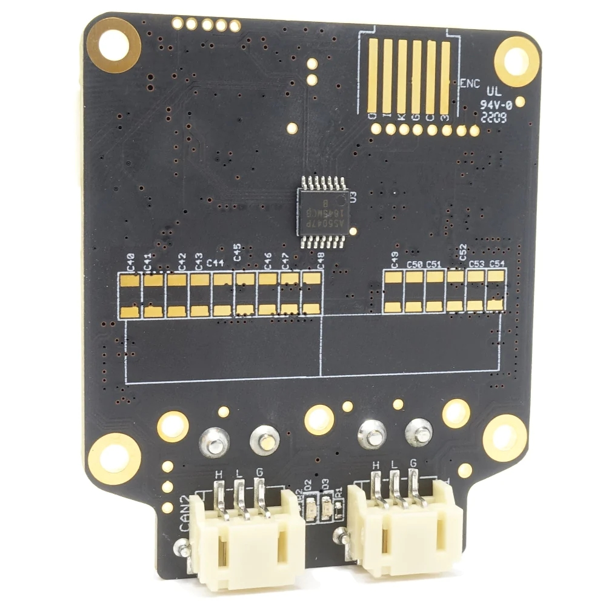 |

#### moteus n1

|  功能  | 参数| 补充说明 |
|  ----  |   ----  |  ----  |
| 电源电压 | 10V ~ 54V |  |
| 峰值电流 | 峰值相电流 100A | 峰值功率1200W |
| 通信支持 | CAN-FD、SPI、UART、422 |  |
| 码盘支持 | 磁编码盘、正交、霍尔|  |

硬件方案
|  MCU  | MOS | MOS驱动 | 电流采样 | 电源 | PCB |
|  ----  |   ----  |  ----  |  ----  |  ----  |  ----  |
|  STM32G474CEU6 | - | drv8353FS |-|-|-|

|外观||
|  ----  |  ----  | 
|  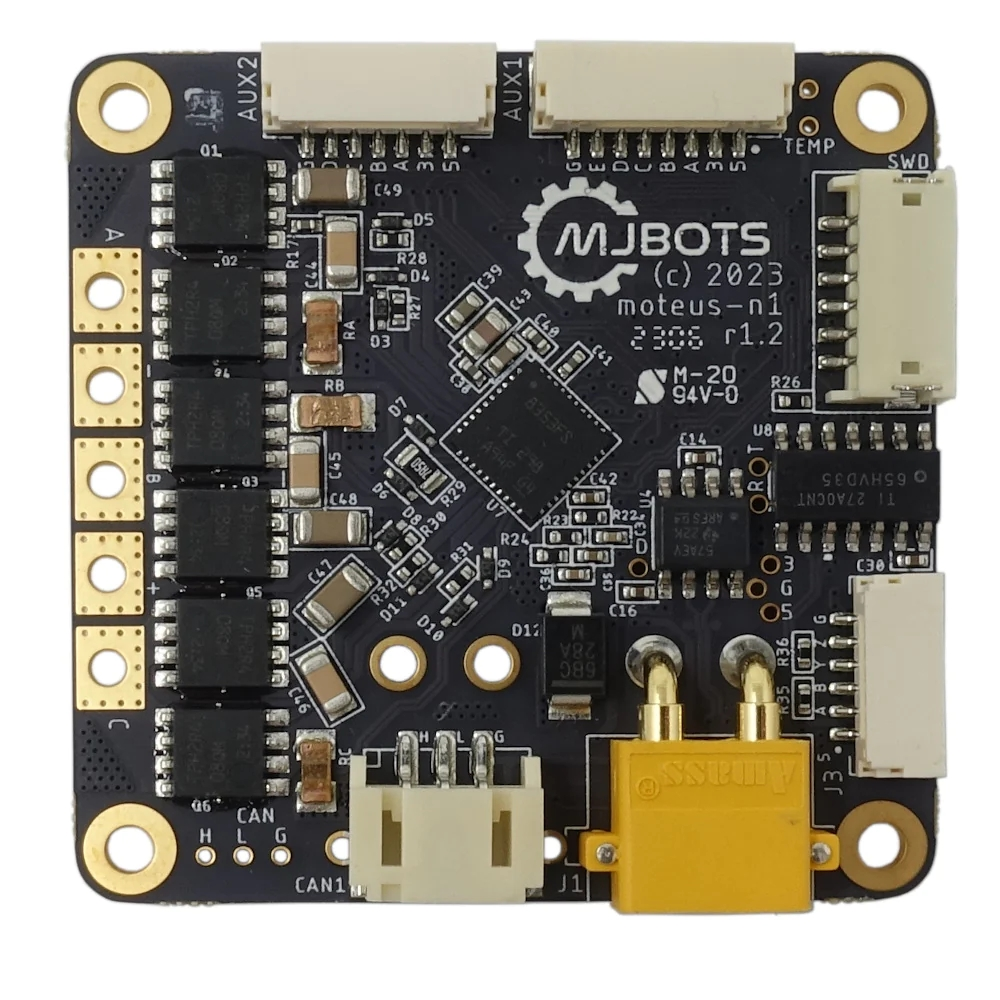  |  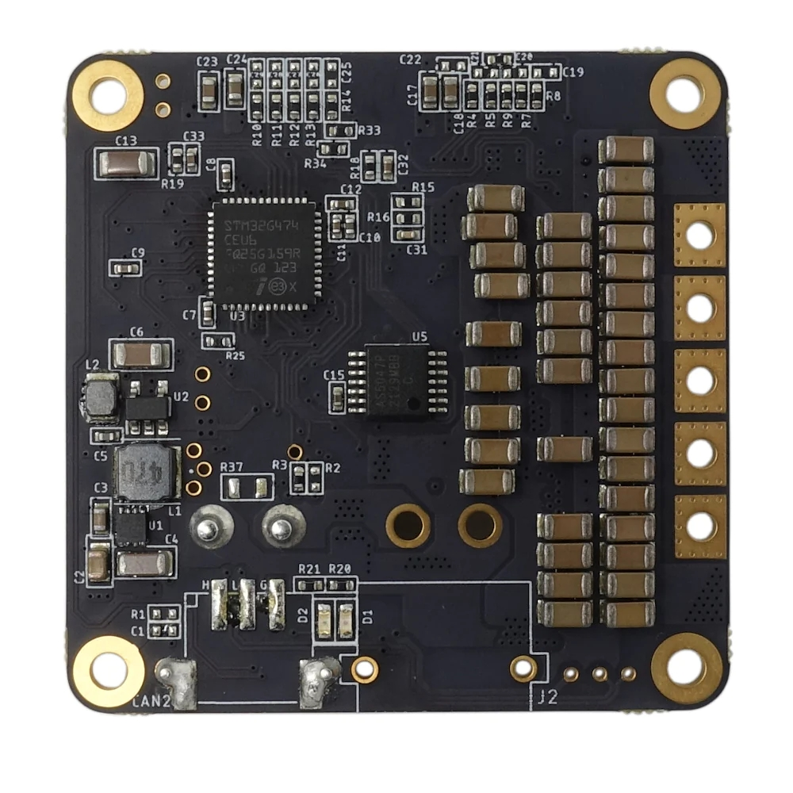 | 

### 应用项目

[robot dog](https://www.youtube.com/watch?v=ePdGshbKR-Q)

---

## 5.[MIT猎豹](https://biomimetics.mit.edu/)

### 简介

&emsp;&emsp;MIT猎豹项目是一个由MIT生物机器人实验室（Biomimetic Robotics Lab）发起和领导的研究四足机器人的项目。该项目的目标是开发能够在复杂的环境中灵活地运动的机器人，模仿真实的猎豹的速度和敏捷性。该项目已经开发了多种型号的猎豹机器人，如Cheetah 1，Cheetah 2，Cheetah 3和Mini Cheetah2。这些机器人能够实现跑步，跳跃，翻滚，后退和转弯等动作2。其中，Cheetah Mini是世界上第一款能够后空翻的四足机器人。该项目还利用了强化学习的技术，让机器人能够从模拟器和实际经验中学习如何行走。MIT猎豹项目是一个具有创新性和前瞻性的机器人研究项目，为未来的机器人应用提供了新的可能性。

&emsp;&emsp;lab 成员 Benjamin Katz 在他的[硕士论文](https://dspace.mit.edu/handle/1721.1/118671)中开源了 MIT Cheetah Mini 电机驱动器, 连接12个电机与机载电脑的中心板(SPIne)的代码和硬件：
* [电机控制器硬件](https://github.com/bgkatz/3phase_integrated)
* [电机控制器固件](https://os.mbed.com/users/benkatz/code/Hobbyking_Cheetah_Compact_DRV8323/)
* [SPIne硬件](https://github.com/bgkatz/SPIne)
* [SPIne固件](https://os.mbed.com/users/benkatz/code/SPIne/)

### 电机控制硬件参数

|  功能  | 参数| 补充说明 |
|  ----  |   ----  |  ----  |
| 电源电压 | 24V | 峰值<40V |
| 峰值电流 | 峰值相电流 40A |  |
| 通信支持 | CAN |  |
| 码盘支持 | 磁编码盘 AS5047P|  |

硬件方案
|  MCU  | MOS | MOS驱动 | 电流采样 | 电源 | PCB |
|  ----  |   ----  |  ----  |  ----  |  ----  |  ----  |
|  STM32F446 | - | DRV8302 |-|1mΩ，两相|-|

|电机本体及PCB(图片来源于论文)|
|  ----  | 
|  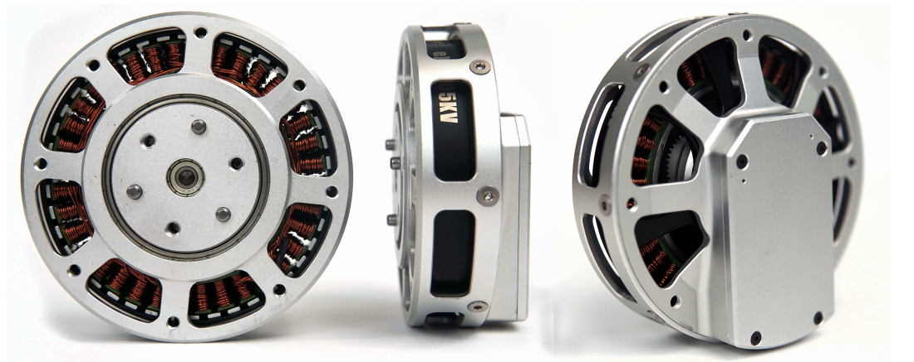  | 
|  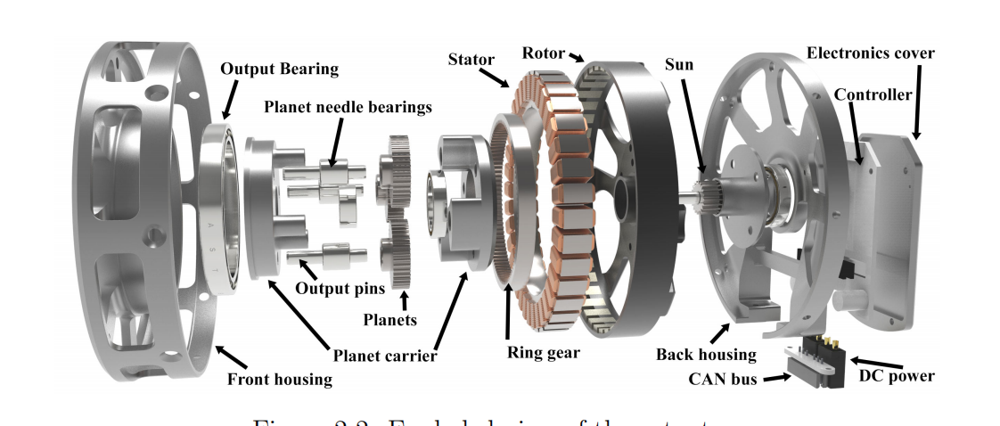  | 
|  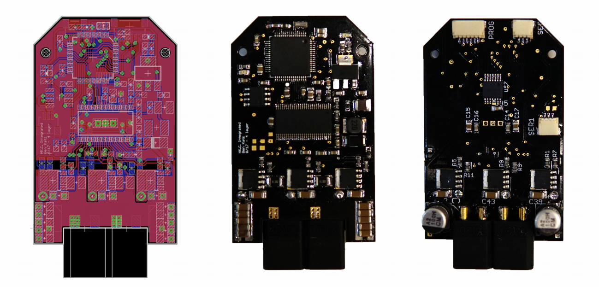  | 

### 应用项目
&emsp;&emsp;[小米铁蛋](https://m.thepaper.cn/baijiahao_14380095)

---
## 6.[ST开源电机库](https://www.st.com/zh/embedded-software/x-cube-mcsdk.html)
### 简介
&emsp;&emsp;ST开源电机库是意法半导体（STMicroelectronics）提供的一基于STM32微控制器的无刷电机控制方案。
### 发展

ST电机库发展路线图可参考下图，图片来源于ST官方的培训文档，时间截止2018年

* 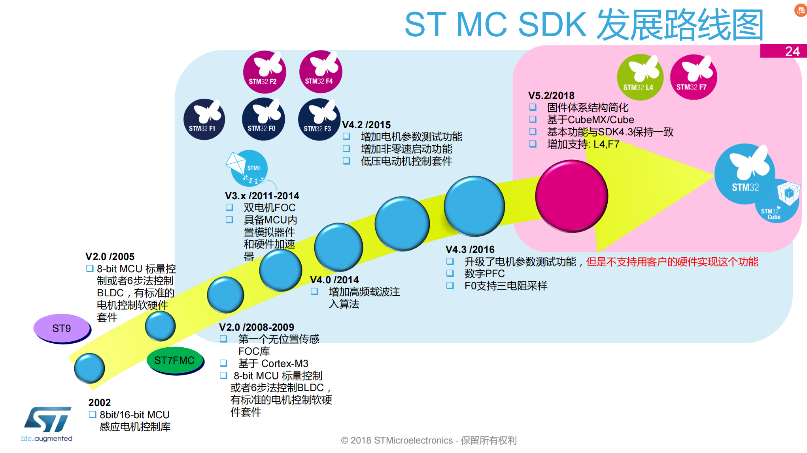 
* ST电机库5.4，发布于2021年，(这个是我目前最熟悉的版本)
* ST电机库6.0，发布于2021年7月，代码以及控制台软件完全重构，目前支持的器件还不多。
---
## 5.综合对比（待补充）

|        |  ODrive | SimpleFOC |  VESC  |  MJBOTS | MIT猎豹  |  ST开源库 | 
|  ----  |   ----  |  ----     |  ----  |  ----   |  ----   |   ----   |   
|  电机类型支持  |   ----  |  ----     |  ----  |  ----   |   ----   |   ----   |  
|  控制模式支持  |   ----  |  ----     |  ----  |  ----   |    ----   |   ----   | 
|  通信协议支持  |   ----  |  ----     |  ----  |  ----   |    ----   |   ----   | 
|  位置传感器支持  |   ----  |  ----     |  ----  |  ----   |    ----   |   ----   | 
|  保护功能  |   ----  |  ----     |  ----  |  ----   |    ----   |   ----   | 
|  调试功能  |   ----  |  ----     |  ----  |  ----   |    ----   |   ----   | 
|  图形界面  |   ----  |  ----     |  ----  |  ----   |    ----   |   ----   | 
|  算法支持  |   ----  |  ----     |  ----  |  ----   |    ----   |   ----   | 

