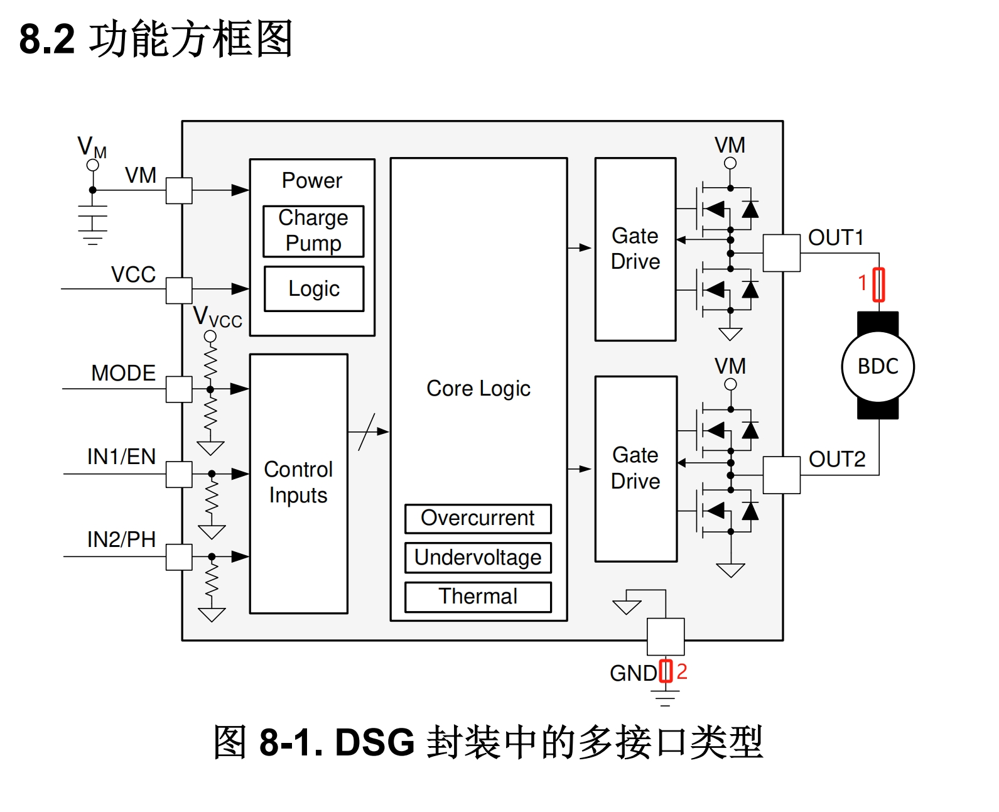
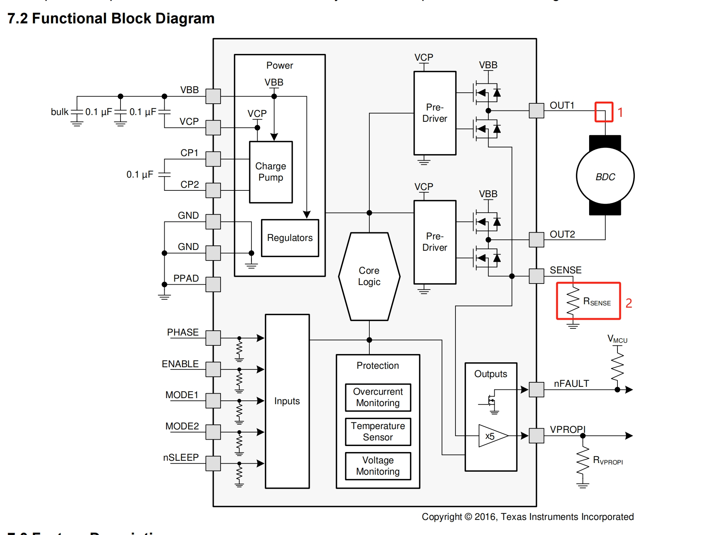

# 直流有刷电机驱动器硬件设计方案

## 重要器件选型

### 1. MCU
>从芯片定位和功能上来讲，将来我们做电机驱动器，主控MCU优先选择**STM32G4**系列，G4定位是电机控制，芯片内集成了很多电机控制专用外设(例如：比较器、运放等)，可以给我们省下一些外围物料。封装从QFN32 ~ QFN128，BGA64 ~ BGA121都有，筛选的空间很大。
>
>另一方面，因为目前这个项目时间要求比较紧张，代码开发时间可能只有20个工作日，而我们过去在**STM32F407**上的电机代码积累比较充分（电机状态机、三环控制框架、所有的安全保护、底层外设配置等，这些通用功能可以不加修改的直接拿过来用），如果用G4，底层代码需要重新适配、移植，移植成功后也需要再次进行功能验证。评估可能会增加5~7天的工作量。
>
>在我们这个项目上，因为PCB尺寸要求控制在20*60mm内，STM32F407没有小封装(最小的是QFN100)，可能不太合适。
>
>同系列的**STM32F405**封装可选范围较大，经手册对比，相对F407，只少了FSMC、Ethernet、DCMI这三个和电机控制无关的外设，其他功能完全一致。
>
>最后确定了使用**STM32F405RGT6**这颗料，主频168M，封装是LQFN64，价格20左右。（查了下我们库存还有2片）

### 2. MOS及MOS驱动
>因为TI的电机驱动芯片比较全，所以先筛选了下TI的片子，选出了以下几款比较合适的(以下器件均将MOS驱动和MOS集成在了一起)。
>|  型号  | 电压范围| 最大电流 | 内阻 | 热阻$R_{\theta JA}$ | 封装 |其他 |
>|  ----  |   ----  |  ----  |  ----  |  ----  | ----  |---- |
>|  DRV8212  | 1.65~11V  |  4A    |  280mΩ  |  77.9℃/W  | DFN-8(2x2)  |其他 |
>|  DRV8220  |  4.5~18V  |  1.76A |  1000mΩ |  94.7℃/W  | DFN-8(2x2)  |其他 |
>|  DRV8801  | 8~38V     |  2.8A  |  850mΩ  |  46.1℃/W  | QFN-16-EP(4x4) |H桥的地线单独引出，集成了一个固定5倍的运放  |
>
>我们有一些因素需要考虑：
>
>1. 电压：收到的资料里面，客户提供了两款电机的手册，其中额定电压分别是 12V 和 24V , DRV8212驱动24V电机可能不合适，DRV8220驱动24V也有点勉强。
>2. 电流：筛选出来的这三款都可以满足项目需求。
>3. 发热：根据客户需求(额定 500mA，峰值 1000mA。电机正常运行电流一般为200ma)，大概计算了了下温升(不加散热片)，如下表：
>>|  型号  | 200mA| 500mA | 1A |
>>|  ----  |   ----  |  ----  |  ----  |
>>|  DRV8212  |   0.87℃  |  5.45℃  |  21.81℃  |
>>|  DRV8220  |   3.78℃  |  23.67℃  |  94.70℃  |
>>|  DRV8801  |   1.56℃  |  9.79℃  |  39.18℃  |
>>
>>DRV8220的封装大，相对热阻小一些。
>4. 电流采样：第三节单独讨论。
>
>以上因素目前还不能完全确定，需要开评审会讨论，所以MOS型号暂未确定。国内可能有有一些能同时满足宽电压、低内阻的芯片，后续会在下面的表格做补充
>|  型号  | 电压范围| 最大电流 | 内阻 | 热阻$R_{\theta JA}$ | 封装 |其他 |
>|  ----  |   ----  |  ----  |  ----  |  ----  | ----  |---- |
>|  ----  |   ----  |  ----  |  ----  |  ----  | ----  |---- |

### 3. 电流采样
>电机控制中电流采样根据采样位置不同分为：**高端采样**和**低端采样**
>* **高端采样** ：直接采样桥臂输出电流，使用方便简单高效。但由于该位置采样所选器件需要承受母线电压，在电源非隔离条件下，运放的**共模电压**需要大于等于母线电压（多数选母线电压的2倍）。
>
>* **低端采样** ：在下管电流输出端进行采样，虽然没有共模电压的问题，但容易受接地噪音和MOS开关的干扰。
>
>涉及到具体芯片，分析如下：
>>下图是DRV8212和DRV8220的功能框图，由于没有将H桥的接地端单独引出，所以电流采样只能在**点1**完成，也就是只能**高端采样**。（点2采到的电流是整个芯片的电流，等于电机电流+芯片除H桥外的其他电流）
>> 
>>
>>下图是DRV8801功能框图，H桥的接地端单独引出，所以低端高端都可以进行采样。
>> 
>
>**补充**：即使采用低端采样，ADC电路设计时，也要考虑电流的双向流动(电机在运转时，驱动板突然断电的情况下，线圈电流需要通过MOS管的体二极管释放掉，会从地线拉电流)。ADC的0点输入电压建议抬升至$V_{ref}/2$

### 4. 电源
>电源要求12~24V输入，输出：12V、5V、3.3V型号待定。
>
>电源需要等MOS驱动型号确定后再选择，因为MOS可能是直连电源输入，也可能接的是DCDC降压后的电源。

### 5. 4路独立ADC
>要求采样范围0-5V，采样分辨率不低于14bit，采样频率不低于 5KHz(每路)，采样芯片重复精度要控制在±2LSB以内。
>
>这块我不擅长，没有用过高精度的ADC，需要公司其他同事协助设计。

### 6. CAN收发器
>CAN芯片查了下公司库存，有4种料，数量不多，且封装都是SOP8，略有点大。
>
>在嘉立创上找到了以下一些芯片可以作为备选(没有找带隔离的)，功能差不多，都能满足需求，就看哪些采购渠道更顺畅些。
>>|  型号  | 供电电压| 速率 |封装 | 厂家 |
>>|  ----  |   ----  |  ---- |----  |  ----  |
>>|  MAX3051     |   3.3V      | 1M          | SOT-23-8  |  ADI |
>>|  TCAN33x系列  |   3.3V      |1M          | SOT-23-8  |  TI |
>>|  TCAN1044V   |   1.7~5.5V  | 8M (CAN-FD) | SOT-23-8  |  TI  |
>>|  SIT3051TK   |   3.3V     | 1M           | DFN-8  |  SIT(芯力特)  |

### 7. 码盘接口、指示灯、ntc温度检测、拨码开关
>常规电路，略。
>

## 电路设计
>评审会后补充。